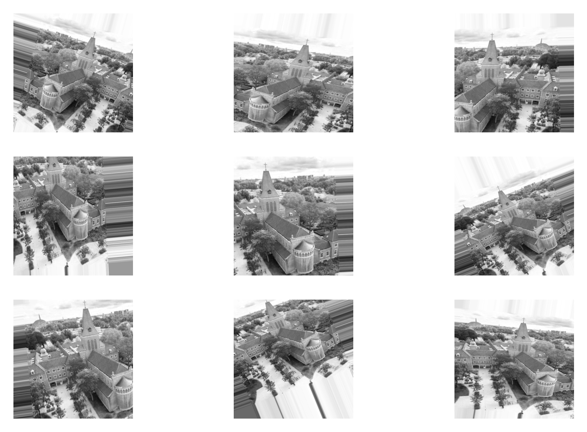

# Week 4, Day 4: Working with small datasets

As you know, more data - if adequately collected - increases the performance of machine learning models. There is no clear definition of a small dataset because it depends on the problem, dataset, and model. But roughly speaking, an image dataset with less than 10,000 images can be considered small. Large datasets contain millions of images. Small datasets are ubiquitous in the real world. Therefore it is vital to learn how to work with small datasets. 

The best way to handle small datasets is to avoid working with small datasets. Instead, try to collect more data whenever you can. I once worked with a client who had around 100 images. I accepted the project but requested more data whenever possible. At the end of the project, we had more than 2000 images. It is still not much but way better than what we started with.

## 1) Collecting more data

You can always ask your client to provide more data; they might have it or collect it. Moreover, you can use many online resources to collect data. Always avoid violating copyright terms.

- [ ] Downloading images from [online search](https://www.youtube.com/watch?v=OQydrlSzxnE).
- [ ] Google has a [dataset search](https://datasetsearch.research.google.com/) engine.
- [ ] There are journals such as [scientific data](https://www.nature.com/sdata/).
- [ ] There are platforms such as [zenodo](https://zenodo.org/).

## 2) Data augmentation

Data augmentation is a technique used to artificially increase the size of a dataset by generating modified versions of existing data. It is often used in machine learning when the original dataset is small to prevent overfitting and improve the model's generalization.

There are many ways to augment data, depending on the type of data and the task at hand. Some common techniques for image data include:

- Flipping the image horizontally or vertically
- Rotating the image by a certain degree
- Cropping the image to a different aspect ratio
- Adding noise or blur to the image

For text data, common augmentation techniques include:

- Synonym replacement: replacing a word with a synonym
- Random insertion: inserting a random word or phrase
- Random swap: swapping two adjacent words or phrases

Data augmentation can be a very effective way to increase the size and diversity of a dataset. Still, it is important not to introduce unrealistic or biased examples. It is also important to ensure that the augmented data represents the real-world data the model will be used on.

### 2.1) Keras example

Let's create an `ImageDataGenerator` in Keras with the following augmentations: rotation, shift, horizontal flip (mirror image), and zoom.

```
from keras.preprocessing.image import ImageDataGenerator

datagen = ImageDataGenerator(rotation_range=30,
                             width_shift_range=0.2,
                             height_shift_range=0.2,
                             horizontal_flip=True,
                             zoom_range=0.2)
```

And apply it to the BUas campus image you have seen on Monday.

```
f, ax = plt.subplots(3, 3, dpi=300)

counter = 0
for batch in datagen.flow(image, batch_size=1):
    i = int((counter-counter%3)/3)
    j = counter%3
    
    ax[i, j].imshow(batch[0], cmap='gray')
    ax[i, j].axis('off')
    
    counter += 1
    if counter==9:break
```



As you can see, we created nine new images from a single image. Of course, these images are similar to the source image; therefore, the benefit cannot be as good as collecting data. But this method is still beneficial.

Note that you can also use the Keras preprocessing layers for data augmentation.

```
data_augmentation = tf.keras.Sequential([
  layers.RandomFlip("horizontal_and_vertical"),
  layers.RandomRotation(0.2),
])
```


## 3) Transfer learning

In 2013, Matthew Zeiler and Rob Fergus published an influential paper titled [Visualizing and Understanding Convolutional Networks](https://arxiv.org/abs/1311.2901). They introduced a novel visualization technique that gives insight into the function of intermediate feature layers and the operation of the classifier. The first layers learn simple features (e.g., edges), whereas the last layers learn complex features (e.g., faces) related to the task. Since almost all objects share features such as edges, color, and shape, we can take a neural network trained on a large dataset and adjust it for our problem. This is called transfer learning. It is particularly useful when the second task has a small amount of training data, as it allows the model to learn from the knowledge gained on the first task and transfer it to the second task.

Transfer learning has proven successful in various applications, including image classification, natural language processing, and speech recognition. For example, a model trained on a large dataset of images of animals can be fine-tuned to classify a small dataset of plants with a high level of accuracy.

There are two main approaches to transfer learning: feature-based transfer and fine-tuning. In feature-based transfer, the lower layers of the model are used to extract features from the input data, while the upper layers are re-trained on the new task using these features. In fine-tuning, the entire model is re-trained on the new task, with the weights from the original model serving as initial weights.

Overall, transfer learning is a powerful tool for improving the performance of machine learning models in a wide range of applications.


## 4) Assignment

From the book [Deep Learning with Python](https://www.manning.com/books/deep-learning-with-python-second-edition):
- [ ] Chapter 8: Introduction to deep learning for computer vision
  - [ ] Study Section 8.3: Leveraging a pretrained model

This section explains how to use transfer learning in Keras.

## 5) Quiz

Please complete the following quiz:

[W4D4 Quiz - Data Augmentation](https://forms.office.com/e/wqP3dMaqkq)

## DataLab Prep

- [ ] [W4D4 Quiz - Data Augmentation](https://forms.office.com/e/wqP3dMaqkq)


