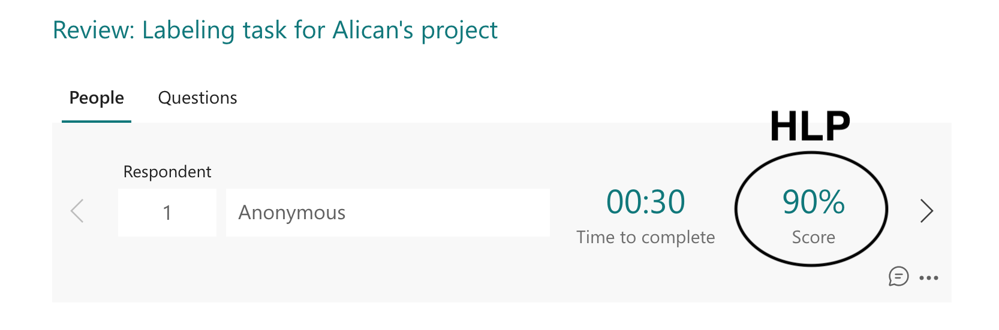

# Week 5, Day 2: The Machine Learning Project Lifecycle 2

Today you will continue the online course from where you left off. Here is the workflow again, today will be about the modeling part.

**Figure 1:** The ML project lifecycle from [DeepLearning.AI](https://www.deeplearning.ai/)

## 1) Selecting and training a model [Online course]

From the course [Introduction to Machine Learning in Production](https://youtube.com/playlist?list=PLkDaE6sCZn6GMoA0wbpJLi3t34Gd8l0aK), watch the videos from number 9 to 13.

## 2) Quiz

Please complete the following quiz.

[W5D2 Quiz - Selecting and Training a Model](https://forms.office.com/e/CNWZsMWrEV)

## 3) Error analysis and performance auditing [Online course]

From the course [Introduction to Machine Learning in Production](https://youtube.com/playlist?list=PLkDaE6sCZn6GMoA0wbpJLi3t34Gd8l0aK), watch the videos from number 14 to 17.

## 4) Data iteration [Online course]

From the course [Introduction to Machine Learning in Production](https://youtube.com/playlist?list=PLkDaE6sCZn6GMoA0wbpJLi3t34Gd8l0aK), watch the videos from number 18 to 24.

## 5) Quiz

Please complete the following quiz.

[W5D2 Quiz - Modeling challenges](https://forms.office.com/e/hQkD1AtvVQ)

## 6) Human Level Performance (HLP)

Tomorrow in the DataLab, you will calculate the HLP for your project. Today prepare a form where each question is an image, and answers are class labels. Tomorrow, you will ask 3 of your peers to answer the questions. You will also answer the forms prepared by 3 of your peers.

- Use Microsoft Forms
- Click on the button **New Quiz**
- Give a proper title
- Add a form description, explaining your project briefly (number of classes, names of the classes, multi-class vs multi-label etc.)
- Add new questions of the type **Choice**
- Add a question such as **Guess the class?** and add an image to the question
- This is the image respondents will label
- If you have N classes, add N options in the form corresponding to each class
- Select the correct option(s), so that when you collect the answers HLP will be calculated automatically.
- Select **Required**
- If you have a multi-class problem, do not select **Multiple answers**
- If you have a multi-label problem, select **Multiple answers**
- Repeat this such that you have 10 images per each class.

Here is an example:
[Labeling task for Alican's project](https://forms.office.com/e/j3xX6yz388)

To see the performance of your peers, click **Review answers** under the **Responses** tab:

## 7) DataLab Prep

- [ ] [W5D1 Quiz - The ML project lifecycle](https://forms.office.com/e/uqnxkGS9i2)
- [ ] [W5D2 Quiz - Selecting and Training a Model](https://forms.office.com/e/CNWZsMWrEV)
- [ ] [W5D2 Quiz - Modeling challenges](https://forms.office.com/e/hQkD1AtvVQ)
