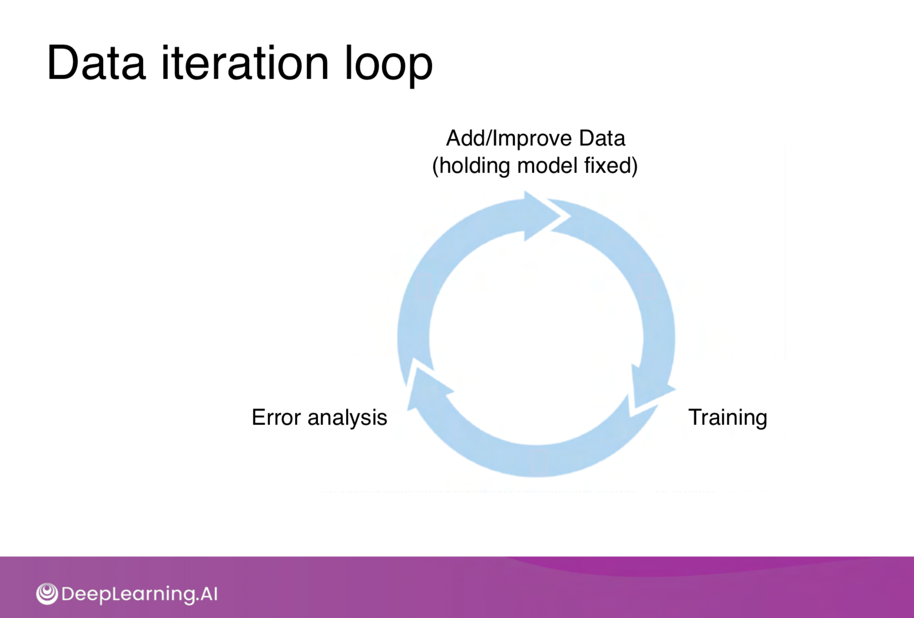

# Week 5, Day 3, DataLab: The Machine Learning Project Lifecycle

You have learned a lot about ML project lifecycle. Now it is time to put what you have learned into practice.

## 1) Baselines

In the video number 12 of the course you learned about baselines. It is your turn to create some baselines for your project.

### 1.1 Random guess

First of all calculate the random guess accuracy. Let's say you have a binary classification problem. Assuming that the classes are balanced, random guess accuracy would be 50%. In other words, if I flip a coin to predict the classes, I will achieve 50% accuracy. This will be the lower bound for your model's performance.

In general if you have n classes, random guess accuracy is 100/n, assuming we have a balanced dataset.

### 1.2 Human level performance

Calculate human level performance by asking your peers to predict the classes of 10 images per each class you have in your problem.

Use the Microsoft Form you created yesterday, and ask 3 peers to label. Label 3 or more of your peers as well.

### 1.3 Other baselines

Use MLP as a baseline as well

## 2) Data iteration loop

You have seen the data iteration loop multiple times in the course. Now apply this concept for your creative brief.

First look at all the model errors. Do you see any patterns? Instead of looking at all the errors, look at worst 20 errors. What do I mean by the worst errors? Calculate the loss for each prediction and sort them by loss. Highest loss is your worst prediction. Look for patterns again.

These patterns could be anything and problem specific. You have to use your own judgement to discover them. But here are some examples:
- There are 6 errors for class A and in 5 of the errors the object is occluded.
- Class A is an kitchen object (e.g. kettle), in all of the errors the object is pictured outside of the kitchen (e.g. living room).
etc.

Depending on your discovery add more data. Continuing the examples from above
- Add more occluded objects
- Add more pictures of kettles in non-kitchen places
etc.

Iterate a few times and assess the performance to see if you observe an improvement. Note down all the experiments.
