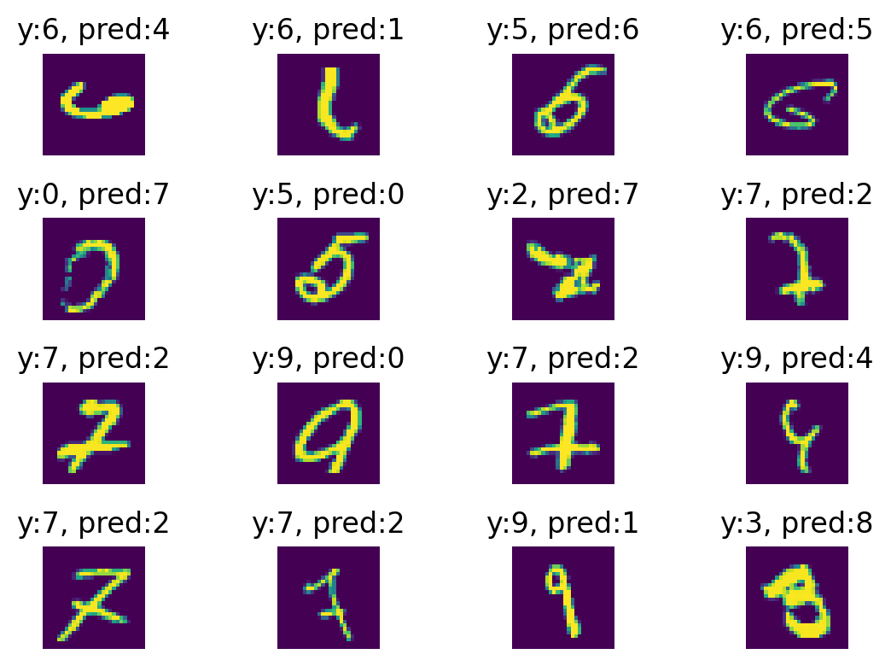

# Week 5, Day 3, DataLab: The Machine Learning Project Lifecycle

You have learned a lot about ML project lifecycle. Now it is time to put what you have learned into practice. You will continue working on the `Creative-Brief-CNN.ipynb` notebook. As you know, the notebook contains the following sections:

1. The Dataset
2. Baselines
3. Preprocessing
4. CNN architecture
5. CNN training
6. Model performance
7. Error analysis

and you have worked on sections 1, 3, 4, 5, and 6. Today you will add sections 2 and 7 to the workflow.

## 1) Baselines (Section 2)

In the video number 12 of the course you learned about baselines. It is your turn to create some baselines for your project.

### 1.1 Random guess

First of all calculate the random guess accuracy. Let's say you have a binary classification problem. Assuming that the classes are balanced, random guess accuracy would be 50%. In other words, if I flip a coin to predict the classes, I will achieve 50% accuracy. This will be the lower bound for your model's performance.

In general if you have n classes, random guess accuracy is 100/n, assuming we have a balanced dataset.

### 1.2 Human level performance

Calculate human level performance by asking your peers to predict the classes of 10 images per each class you have in your problem. Use the Microsoft Form you created yesterday, and ask 3 peers to label. Label 3 or more of your peers as well.

Note: In the example form there were two classes, frying vs microwaving. This is common knowledge so people can answer the questions without any training. If you have a harder problem, do a short training session for your peers so that they have an idea about the classes. For example you can show 2 images per class as examples. Make sure that the images you show (training set) and the images in the form (test set) are different.

### 1.3 Other baselines

Use the accuracy of the MLP you created in week 2 as another baseline.

## 2) Data iteration loop

You have seen the data iteration loop multiple times in the course. Now apply this concept for your creative brief.

First look at all the model errors (Section 7). Do you see any patterns? Instead of looking at all the errors, look at worst 16 errors. What do I mean by the worst errors? Calculate the loss for each prediction and sort them by loss. Highest loss is your worst prediction. Look for patterns again.

These patterns could be anything and problem specific. You have to use your own judgement to discover them. Let's take a look at the section 7 of the [example notebook](https://github.com/BredaUniversityADSAI/2022-23-Y1-BlockC/blob/main/DataLabs/W4%20and%205/Creative-Brief-CNN-Example.ipynb):

- in 5 images out of 16, the digit 7 is confused to be a 2.

Iteration step after error analysis

- I will add more images of digit 7 that might look like a 2.
- Train again

Iterate a few times and assess the performance to see if you observe an improvement. Note down all the experiments.
