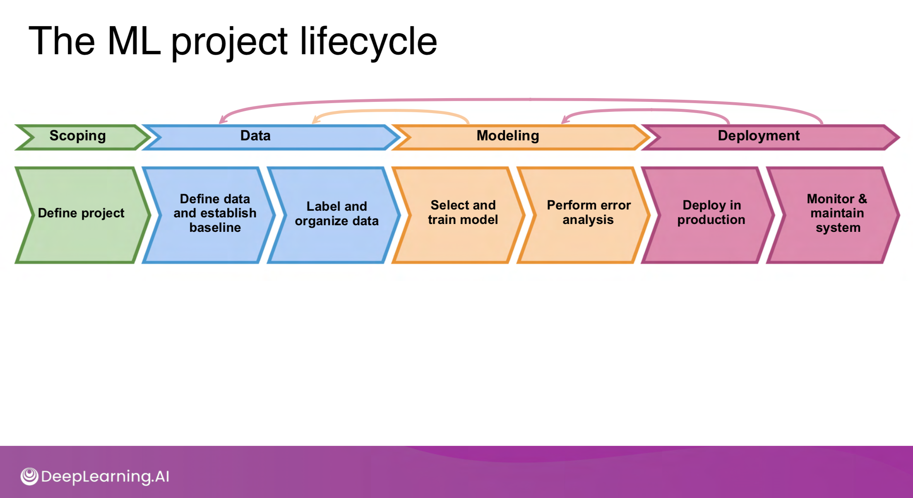

# Week 5, Day 5, DataLab: The Machine Learning Project Lifecycle

This week you have learned the machine learning project lifecycle in detail. As you know, you need to prepare a PowerPoint presentation of your project proposal. In this DataLab, let's apply what you have learned to this presentation.

**Figure 1:** The ML project lifecycle from [DeepLearning.AI](https://www.deeplearning.ai/)

In the Project Proposal Template you will see the following slides:

- The dataset
- Baselines
- Preprocessing
- CNN architecture
- CNN training
- Model performance
- Error analysis

As you have realized, these correspond one-to-one to the steps in the `Creative-Brief-CNN.ipynb`. Start filling in the slides accordingly. Explain the final version of your model. After these slides, there is one more slide with the title:

- Iteration

Explain the iterations you made in this slide. For example:

- The first CNN I trained had an accuracy of 60% due to the small training set size. I used transfer learning to improve the performance to 90%.
- In the error analysis I realized the model was making errors on ABC. Therefore I have added more examples of ABC and the performance increased by X%.

We won't cover deployment in this block. But if you deployed, of course, you can add a deployment slide.
