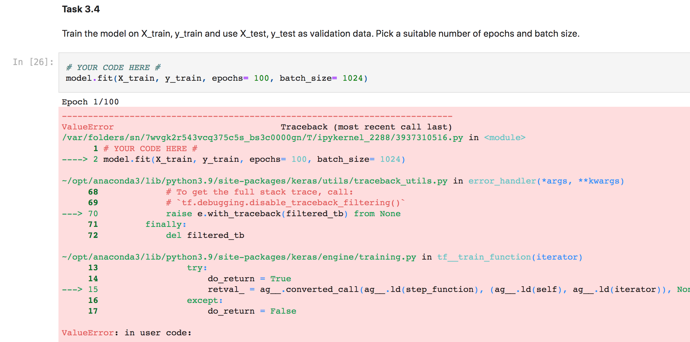
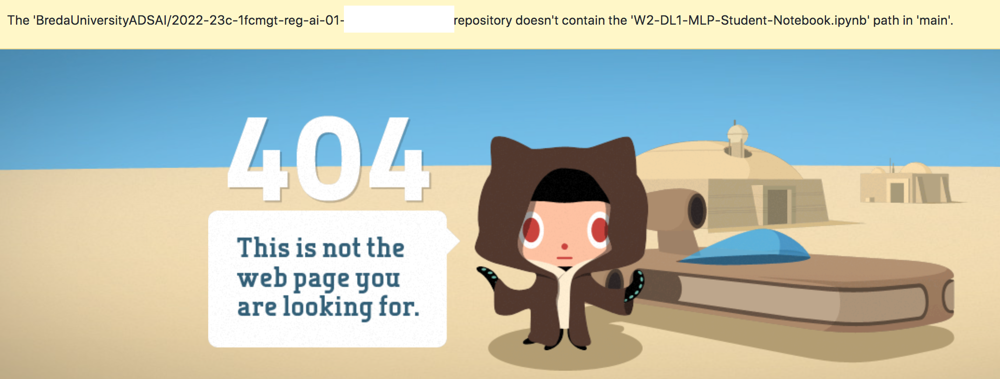
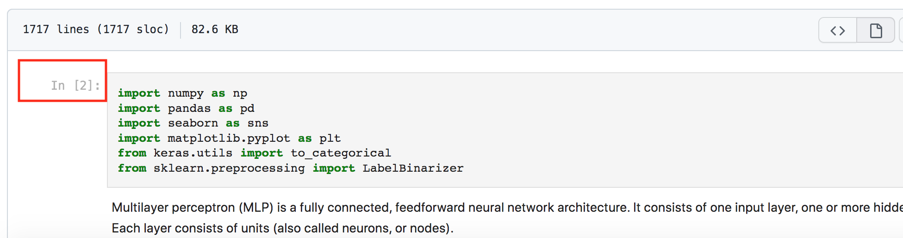
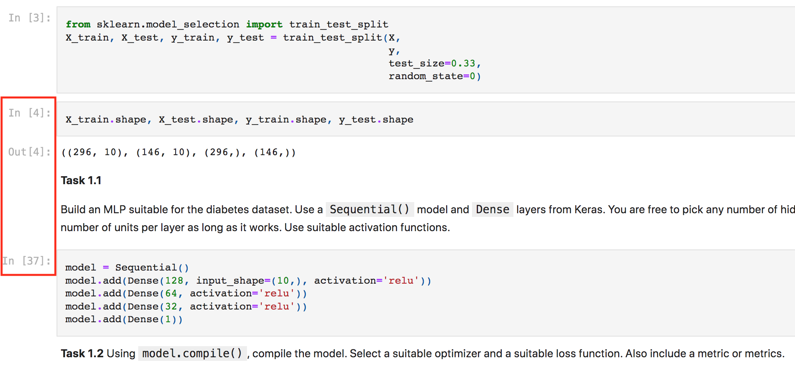
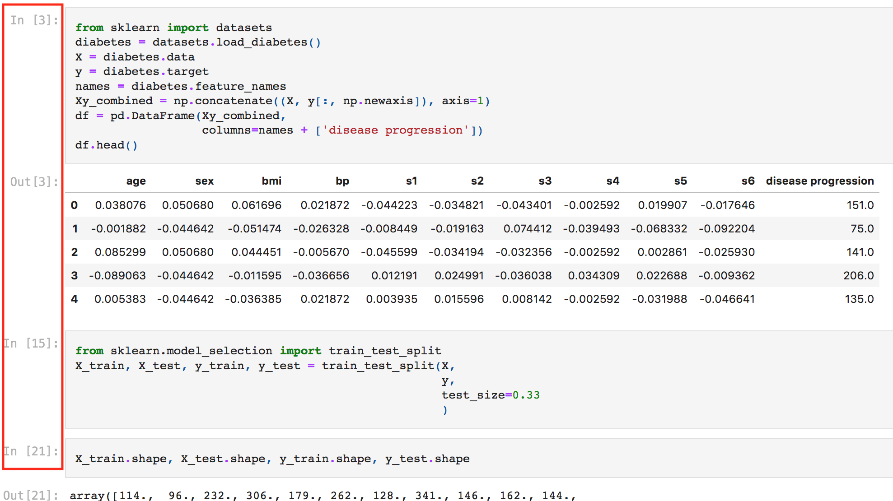

# Deep Learning Requirements

On this page, you will find a summary of requirements related to the deep learning module of Block C (Year 1). Good luck!

## Tools

It would be best if you had the following installed to complete the deliverables:

- [ ] Python
- [ ] Jupyter Notebook
- [ ] NumPy
- [ ] Pandas
- [ ] Matplotlib
- [ ] Scikit-learn
- [ ] TensorFlow

You used all of these tools in the previous blocks except TensorFlow. Here are the [installation instructions for TensorFlow](https://www.tensorflow.org/install).

## Datasets

On Week 1 Day 3 DataLab, you selected a subset of the Imsitu dataset ([Use-case 3](https://adsai.buas.nl/Study%20Content/Responsible%20and%20Explainable%20AI/UseCases.html#use-case-3-create-a-subset-of-images-from-the-original-dataset)). This dataset will be your creative brief dataset. You will learn Deep Learning concepts on [toy datasets](https://scikit-learn.org/stable/datasets/toy_dataset.html) and apply what you learned to your creative brief dataset. Developing deep learning models are highly iterative. Therefore you can change your creative brief dataset.

## Books and Courses

The following books and courses are spread out through the project timeline as self-study assignments. Studying them is essential for completing your deliverables satisfactorily.

- Deep Learning with Python, François Chollet, 2nd edition [[Book]](https://www.manning.com/books/deep-learning-with-python-second-edition)
  - Chapters 1-8 (W2-5)

- Neural Networks and Deep Learning, Michael Nielsen [[Book]](http://neuralnetworksanddeeplearning.com/)
  - Chapter 1 (W3)

- Introduction to Deep Learning with Keras [[DataCamp]](https://app.datacamp.com/learn/courses/introduction-to-deep-learning-with-keras)
  - Chapters 1-3 (W2)

- Image processing with Keras in Python [[DataCamp]](https://app.datacamp.com/learn/courses/image-processing-with-keras-in-python)
  - Chapters 1-4 (W4)

- Introduction Machine Learning in Production, Andrew Ng [[Youtube]](https://www.youtube.com/playlist?list=PLkDaE6sCZn6GMoA0wbpJLi3t34Gd8l0aK)
  - Videos 1-40 (W5)

- Neural Networks, Grant Sanderson [[3B1B]](https://www.3blue1brown.com/topics/neural-networks)
  - Chapters 1-3 (W3)

## Code repo

All jupyter notebooks you will use are in the repo [2022-23-Y1-BlockC](https://github.com/BredaUniversityADSAI/2022-23-Y1-BlockC).

## Deliverables

In this block, you will study deep learning for 4 weeks (Weeks 2-3-4-5). Here is the relationship between the weeks and the deliverables.
- Week 2: Multilayer perceptrons with Keras.
  - DataLab 1: `W2-DL1-MLP-Student-Notebook.ipynb`
  - DataLab 2: `W2-DL2-MLP-Student-Notebook.ipynb`
- Week 3: Multilayer perceptrons without Keras.
  - DataLabs 1&2: `W3-DL-MLP-from-scratch.ipynb`
- Week 4: Convolutional neural networks with Keras.
  - DataLabs 1&2: `Creative-Brief-CNN.ipynb`
- Week 5: The machine learning project lifecycle.
  - DataLab 1: `Creative-Brief-CNN.ipynb`
  - DataLab 2: Proof-of-concept slides of the Project Proposal presentation

In total, you are expected to deliver 4 jupyter notebooks. Additionally, you are expected to describe the final version of the proof-of-concept CNN model in the Project Proposal presentation.

## Grading conditions

Your notebooks should satisfy the following in order to be graded:

1. Make sure that the notebooks are under the folder **Deliverables** in your personal Github repo.
2. Make sure that before delivering the notebooks, **Restart & Run all**.
3. Make sure that your submissions are **error-free**.
4. Make sure that the notebook **link works**.

Take a look at this [exercise](https://github.com/BredaUniversityADSAI/2022-23-Y1-BlockC/blob/main/Self-Study/W3/Gradient_descent_exercises.ipynb)-[solution](https://github.com/BredaUniversityADSAI/2022-23-Y1-BlockC/blob/main/Self-Study/W3/Gradient_descent_solutions.ipynb) pair. Your deliverables should look like the solution notebook.

<mark>Example notebooks that won't be graded:</mark>

Example 1

Example 2

Example 3

Example 4

Example 5

## ILO mapping

You can find the ILO mapping of the deliverables below:

- ILO 4.1 Poor: The student is able to implement a multilayer perceptron architecture using Keras for regression and classification. → `W2-DL1-MLP-Student-Notebook.ipynb`
- ILO 4.1 Insufficient: The student is able to plot learning curves and apply early stopping for multilayer perceptrons. And meeting all criteria in poor. → `W2-DL2-MLP-Student-Notebook.ipynb`
- ILO 4.1 Sufficient: The student is able to design and implement a convolution neural network using Keras for image classification. The student demonstrates the ability do modelling on small datasets. And meeting all criteria in insufficient. → `Creative-Brief-CNN.ipynb` & Project Proposal presentation
- ILO 4.1 Good: The student is able identify and describe each step in the machine learning project lifecycle. The student understands the iterative nature of the lifecycle by demonstrating the results of at least two iterations with proper reasoning. And meeting all criteria in sufficient. →  `Creative-Brief-CNN.ipynb` & Project Proposal presentation
- ILO 4.1 Excellent: The student demonstrates mastery of neural network building blocks (architecture, loss function, learning algorithm) by implementing a multilayer perceptron with Python and NumPy, without relying on machine learning libraries (e.g., Keras). And meeting all criteria in good. → `W3-DL-MLP-from-scratch.ipynb`

