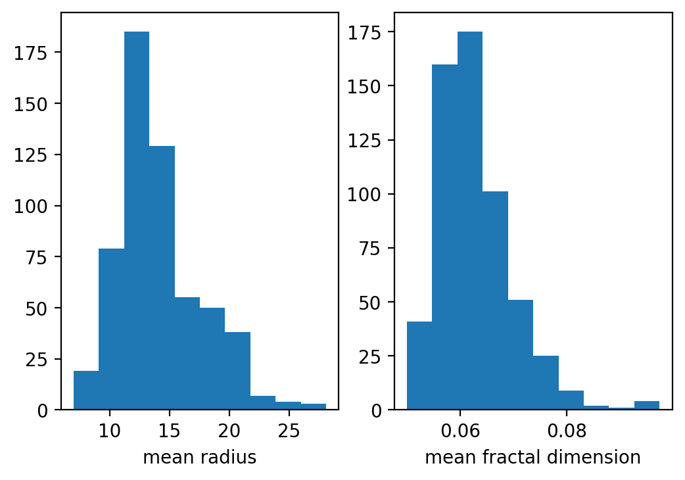
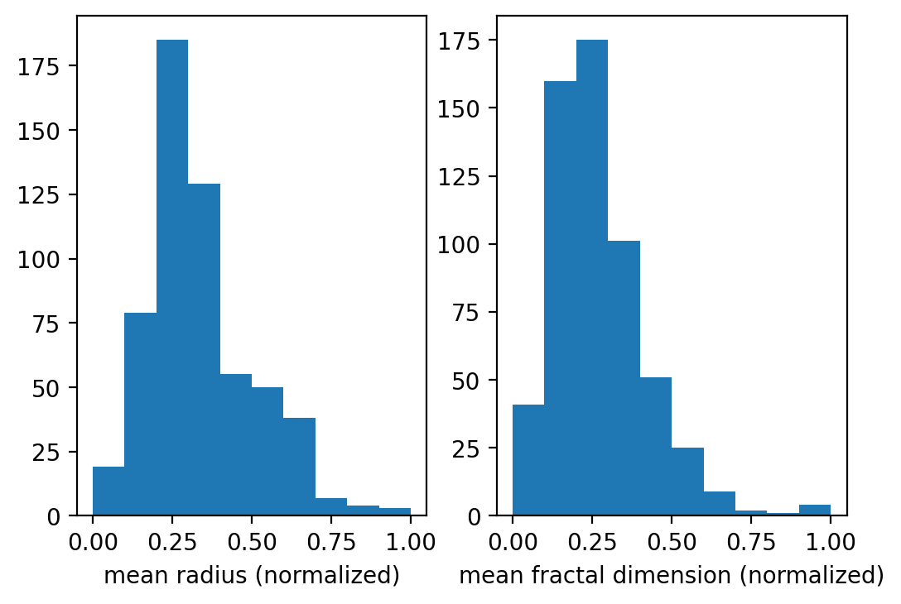
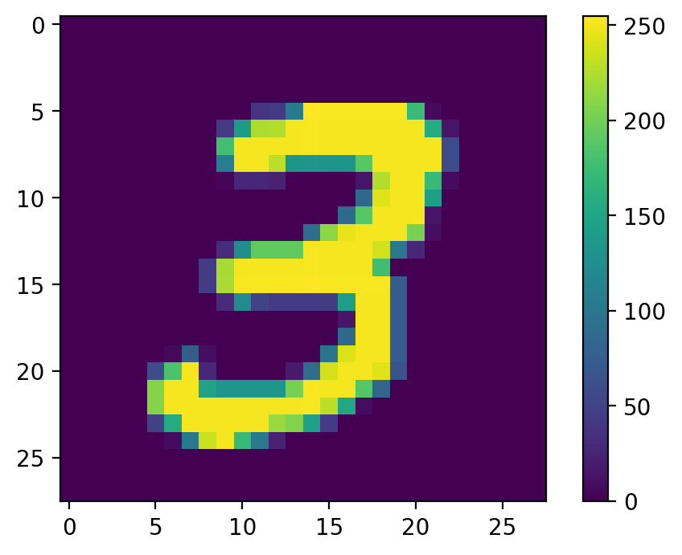
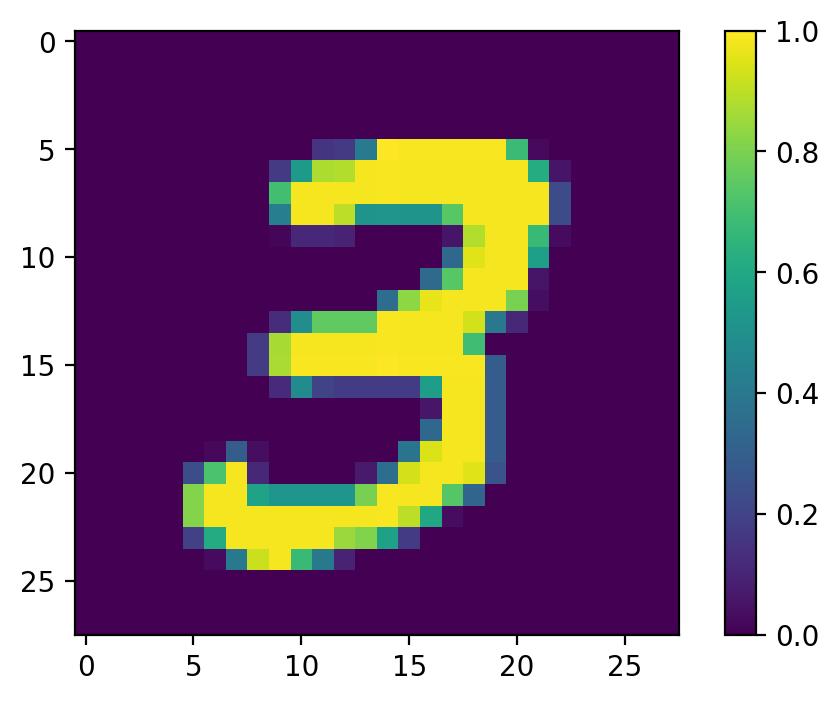
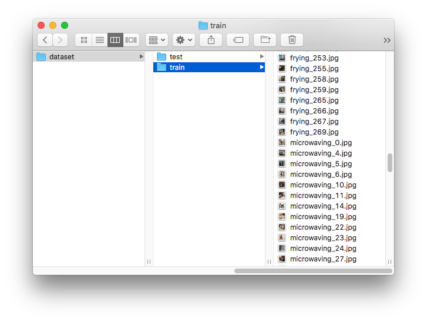

# Week 2, Day 3 (DataLab): Multilayer Perceptrons

It's time to put what you have learned into practice! In this DataLab you will develop Multilayer Perceptrons using Keras for different datasets. The DataLab is structured as a notebook file. You will see this format frequently in this Deep Learning module. First read the material in this page. Then, to start the DataLab, open the file `W2-DL1-MLP-Student-Notebook.ipynb` and continue there.

## Learning objectives

At the end of this DataLab, you will be able to build MLPs using Keras for the following problem types:

- [ ] Regression
- [ ] Binary classification
- [ ] Multi-class classification
- [ ] Multi-label classification

[](https://github.com/BredaUniversityADSAI/2022-23-Y1-BlockC/blob/main/DataLabs/W2-DL1/W2-DL1-MLP-Student-Notebook.ipynb)

## Normalization

For some machine learning algorithms, normalizing input data can improve model performance. Normalization means transforming features to be on a similar scale. Let's see an example. You will use the [breast cancer dataset](https://scikit-learn.org/stable/datasets/toy_dataset.html#breast-cancer-dataset) in this DataLab for training a binary classification MLP. The dataset contains 30 features. Let's take a look at the histogram of two features:



You will notice that the values of the feature `mean radius` varies around 0-30 whereas `mean fractal dimension` lies between 0-0.1.

By using the following formula, we can scale both features to be in between 0-1.

<math>
x<sub>normalized</sub> = (x - x<sub>min</sub>)/(x<sub>max</sub>-x<sub>min</sub>)
</math>

where x is the feature value we would like to normalize, x<sub>min</sub> is the smallest value of the feature and x<sub>max</sub> is the largest value of the feature.

The feature `mean radius` is the first column of the data matrix `X`. Therefore we can use the above equation in Python as follows:

```python
normalized_feature_1 = (X[:, 0]-np.min(X[:, 0]))/(np.max(X[:, 0])-np.min(X[:, 0]))
```

if we repeat that for the `mean fractal dimension` column this is what we get:


saving minimum and maximum values is important if you want to transform new data, or calculating the raw value of a normalized feature.

What if you would like to normalize an image? 

As you know pixel values lie between 0-255. Check the image of an hand written digit below with the colorbar.



since we know maximum value of a pixel can be 255 and the minimum value can be 0, we can divide the image array by 255 and obtain the normalized image.



As you can imagine, since this is a very common operation, it is implemented in ML/DL libraries such as [scikit-learn](https://scikit-learn.org/stable/modules/generated/sklearn.preprocessing.Normalizer.html#sklearn.preprocessing.Normalizer). Keras even provides a `Layer` for [normalization](https://keras.io/api/layers/normalization_layers/). Knowing this much is enough for you in this block. To learn about other normalization methods, [click here](https://developers.google.com/machine-learning/data-prep/transform/normalization).

## From image folders to X and y

As you will see in the notebook, some datasets are already provided by ML/DL libraries. Getting them into X and y is as simple as writing a single line of code:

`X, y = load_my_dataset()`

what if you have your images in folders and labels are in image names?

Consider the following folder structure for a binary image classification problem with classes frying and microwaving:


Here is the code that would create the training set (`X_train`, `y_train`) from the folder structure above:

```python
# Creating list of X and y
X_train = []
y_train = []

# Iterate the folder with glob
for fpath in glob.glob('dataset/train/*.jpg'):
    # Opening images with OpenCV
    # Alternatives: PIL, Matplotlib
    im = cv2.imread(fpath, 0)
    
    # If the filename contains frying
    # label = 1
    # otherwise it must be microwaving so label = 0
    if 'frying' in fpath:
        label = 1
    else:
        label = 0
    
    # Put image array to X
    # Put label to y
    X_train.append(im)
    y_train.append(label)
        

# Convert the list of arrays
# Into a numpy array
X_train = np.array(X_train)
y_train = np.array(y_train)
```

If you check array shapes you will see `X_train` shape is `(233, 256, 256)` and `y_train` shape is `(233,)`. This means we have 233 images of the shape 256x256 pixels. Images are grayscale, for RGB images, shape would have been `(233, 256, 256, 3)`.

