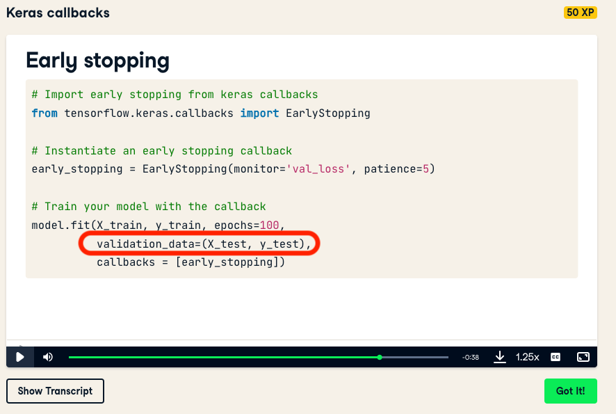

# Week 2, Day 4: Improving Model Performance

The ability to create a neural network is essential. But the ability to evaluate and improve model performance is even more so. Today and tomorrow, you will learn and apply the basics of model evaluation.

## Learning objectives

After today you should be able to:

- [ ] Compare Keras and TensorFlow
- [ ] Summarize the "Anatomy of a Neural Network" as explained in Section 3.6 from the book [Deep Learning with Python](https://www.manning.com/books/deep-learning-with-python)
- [ ] Interpret learning curves

## 1) Model evaluation

In order to improve model performance, you need to evaluate it first. You have seen how to use `model.evaluate()` to evaluate your models. But there are many metrics you can use to evaluate a model. Watch the following video to learn about the common metrics that are used to evaluate machine learning models.

<iframe width="896" height="504" src="https://www.youtube-nocookie.com/embed/LbX4X71-TFI" title="YouTube video player" frameborder="0" allow="accelerometer; autoplay; clipboard-write; encrypted-media; gyroscope; picture-in-picture" allowfullscreen></iframe>
Video 1: How to evaluate ML models | Evaluation metrics for machine learning

Try implementing a few metrics (e.g. accuracy, RMSE) yourself in Python/NumPy to test your understanding. But in practice you can use the metrics implemented in ML/DL libraries.

Metrics for Keras: [https://keras.io/api/metrics/](https://keras.io/api/metrics/)

Metrics for scikit-learn: [https://scikit-learn.org/stable/modules/model_evaluation.html](https://scikit-learn.org/stable/modules/model_evaluation.html)

## 2) Training, validation and test sets

In Block B, you learned about why and how we split our dataset into training/validation/test sets. Yesterday you were building your first models where a simple train/test split is enough. But when you start improving your models, the best practice is to use a training/validation/test split.

In the DataCamp course Introduction to Deep Learning with Keras, this is overlooked and a train/test split is used:


In the DataLab tomorrow, you are expected to use a training/validation/test split. This is properly covered in the book Deep Learning with Python, please check section _5.2.1 Training, validation and test sets_. Note that Chapter 5 of the book is an assignment for Week 3 - Monday.

You have two options to create and use a train/validation/test split in Keras. Say you have the following dataset:
```python
print(X.shape, y.shape)
```
>(100, 2) (100,)

And you would like to create 80%/10%/10% split.

**Option 1: Use sklearn's `train_test_split` once and use the `validation_split` parameter when you call the `fit()` method from Keras.**

```python
from sklearn.model_selection import train_test_split
X_train, X_test, y_train, y_test = train_test_split(X,
                                                    y,
                                                    test_size=1/10,
                                                    random_state=0)
                                                    
print(X_train.shape, X_test.shape)
```
>(90, 2) (10, 2)

```python
model.fit(X_train, y_train, validation_split=1/9)
```

From the [Keras documentation](https://keras.io/api/models/model_training_apis/)
>validation_split: Float between 0 and 1. Fraction of the training data to be used as validation data. The model will set apart this fraction of the training data, will not train on it, and will evaluate the loss and any model metrics on this data at the end of each epoch. [...]

**Option 2: Use sklearn's `train_test_split` twice and use the `validation_data` parameter when you call the `fit()` method from Keras.**

```python
from sklearn.model_selection import train_test_split
X_train, X_test, y_train, y_test = train_test_split(X,
                                                    y,
                                                    test_size=1/10,
                                                    random_state=0)
                                                    
print(X_train.shape, X_test.shape)
```
>(90, 2) (10, 2)

```python
X_train, X_val, y_train, y_val = train_test_split(X_train,
                                                  y_train,
                                                  test_size=1/9,
                                                  random_state=0)
                                                  
print(X_train.shape, X_val.shape, X_test.shape)
```
>(80, 2) (10, 2) (10, 2)

```python
model.fit(X_train, y_train, validation_data=(X_val, y_val))
```

From the [Keras documentation](https://keras.io/api/models/model_training_apis/)
>validation_data: Data on which to evaluate the loss and any model metrics at the end of each epoch. The model will not be trained on this data. [...]

**A note on cross validation:** In Block B, you also learned about cross validation. When developing neural networks, you will see that training a model on CPU can take a lot of time. Therefore it is not compulsory to use cross validation, in this block.

## 3) Assignments

From the book [Deep Learning with Python](https://www.manning.com/books/deep-learning-with-python-second-edition)
- [ ] Read Chapter 3: Introduction to Keras and TensorFlow

From the course [Introduction to Deep Learning with Keras](https://app.datacamp.com/learn/courses/introduction-to-deep-learning-with-keras)
- [ ] Complete Chapter 3: Improving Your Model Performance

## DataLab Prep
- [ ] Chapter 3 of the course [Introduction to Deep Learning with Keras](https://app.datacamp.com/learn/courses/introduction-to-deep-learning-with-keras)
