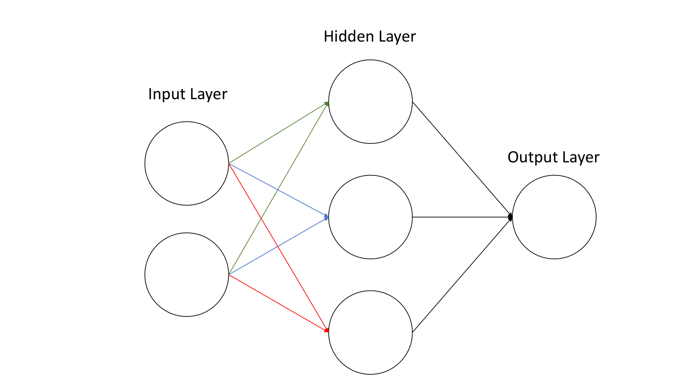

# Week 3, Day 1: Week 2 Review

This week you will develop the multilayer perceptron seen below from scratch!

As each week builds on top of each other, it is essential to start each week by reviewing previous week's material.

## 1) Last week's review and this week's summary at 10:00.

We will meet online to review the material so far and summarize what is next.

## 2) Assignments for today

Go over the code and reading assignments from last week. If you missing tasks from the DataLabs, work on those.

From the book [Deep Learning with Python](https://www.manning.com/books/deep-learning-with-python)
- [ ] Read Chapter 4: Getting started with neural networks: classification and regression
