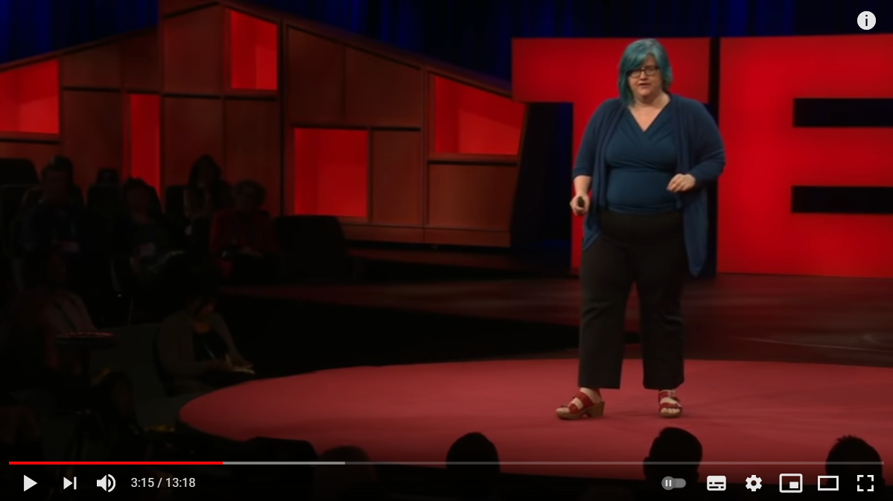

## __AI for Business (1): Introduction into application of AI in businesses & Risks and benefits of AI__
\
\

### 1. Introduction

***

### 2. Introduction into application of AI in businesses
\
_2a_ Watch the TEDx talk "Artificial Intelligence and the Future of Business" by Hans-Christian Boos.

***

### 3. Risks and benefits of AI
\
__3a__ Read sub-chapters 1.4 and 1.5 of AIMA (p.81-92).

__3b__ Find three newspaper articles on a risk associated with a sub-field of AI (i.e. computer vision, natural language processing, and robotics). Summarize the articles with a maximum of 200 words.

__3c__ Watch the TEDx talk 'The era of blind faith in big data must end' by Cathy O'Neill.

*Video 1. TEDx talk 'The era of blind faith in big data must end' by Cathy O'Neill*

__3c__ In the video she makes the following statement: 'Algorithms are opinions embedded in code'. What do you think she means with this statement, and what are the possible implications that could arise from it? Explain your answer.

__3d__ Provide an risk, benefit, and accompanying AI sub-field per organization listed in the table:

| A. Organization | B. AI sub-field | C. Benefit | D. Risk |
| ----------- | ----------- | ----------- | ----------- |
| 1. Insurance company      
| 2. University   
| 3. Municipality
| 4. Police
| 5. Food retailer
| 5. Car manufacturer

***

## __Literature__
