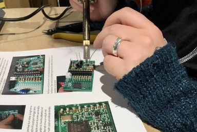

## __DataLab (1): Debates: Companies that implement the GDPR law have a competitive advantage.__
\

### 1. Introduction

At the first part of DataLab 1 you will participate in the debate: Companies that implement the GDPR law have a competitive advantage. During the second part of the day, you will have the chance to build a weather station. At the end of the day, from 17:00 to 17:30, we will have a moment to reflect on DataLab 1 and ask questions during the Q&A.

***

### 2. Q&A and Standup

__2a__ Ask questions regarding the independent study material.

__2b__ Answer the following questions:

1. What did you do yesterday?

2. What will you do today?

3. Are there any impediments in your way?

***

### 3. Debate

During the DataLab you will be divided into the groups to prepare for the debate. Together with your groupmates you will develop for and against arguments and plan how to deliver your arguments for the topic of the debate.
The groups for the debate will be selected randomly and will  present their prepared for and against arguments: one group will present their “for” arguments and another their “against” arguments. The rest of the students at the end will vote to choose who is the winner of the debate.

__The schedule of the debate:__

09:30 – 11:00 – preparation for the debate

11:00 – 12:00 - debate

***

### 4. Workshop: Building a weather station

During the workshop, you will have the opportunity to build a weather station that measures temperature and humidity. For more information, see the website of [Meet je Stad](https://meetjestad.net/).

__The schedule of the workshop:__

13:00-17:00 - Instruction & building of the weather station

Instructor: Rene van der Weert

*Figure 1. Soldering the weather station.*

After you finish building the weather station, try to develop a plan for how you, as a team, can effectively distribute the weather stations across the neighbourhood of Brabantpark. The objective is to find inhabitants willing to take care of a weather station. As a result, there needs to be some kind of 'loan for use' agreement between BUAS and the person volunteering to take care of a weather station. You can find a template of a Dutch 'loan to use' agreement, [here](../../Study%20Content/Digital%20Transformation/loanforuseagreement_template.docx).

__Tips:__

- Determine your target group (i.e. inhabitants of Brabantpark) (Resource: [Demographics of Brabantpark](https://breda.incijfers.nl/dashboard/buurt--en-wijkdata)).
- Develop an effective communication strategy for your target group (Resource: [Communicating Across Cultures](https://www.linkedin.com/learning/communicating-across-cultures-2/the-skill-of-communicating-across-cultures?autoplay=true&u=36359204)).
- Set up a 'Loan for use' agreement for your target group (Resource: [Duidelijke juridische taal](https://directduidelijk.gebruikercentraal.nl/terugkijken-webinars/duidelijke-juridische-taal/)).
- Develop, and plan an event where you distribute the weather stations to your target group.

***

### 5. Reflection and Q&A (17:00-17:30)

__5a__ Fill in your work/learning log.

__5b__ Ask question(s) related to the independent study material.

__5c__ Choose, and provide an answer to at least of the following questions:

1. What surprised you today, and why?
2. What is the most important thing you learned today? Why do you think so?
3. What do you want to learn more about, and why?
4. When were you the most creative, and why do you think that is?
5. What made you curious today? How does learning feel different when you are curious?
6. When were you at your best today, and why?
7. (Assuming we were studying the same thing and you could decide and have access to anything), where would you start tomorrow? Why?
8. What can/should you do with what you know?
