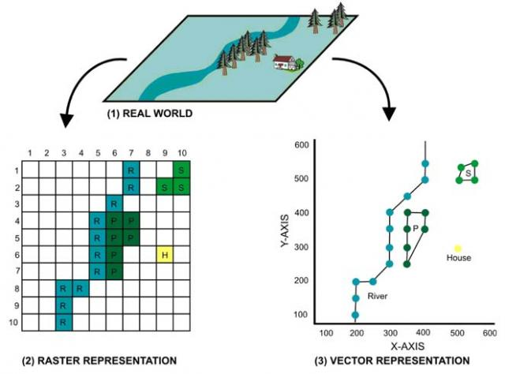
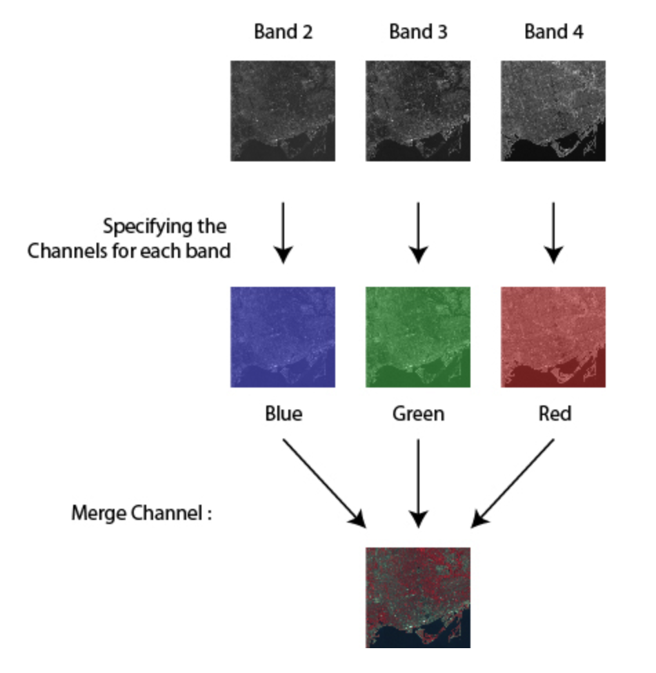
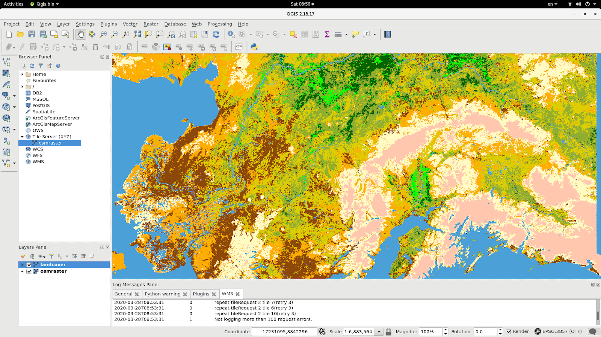

# Geospatial analytics (optional)

This module will help you acquire knowledge of geospatial analytics by guiding you towards online resources. In addition, it will give you tips on how you can apply your newly gained knowledge of geospatial analytics to the creative brief.

## Learning objectives

After this module, you will be able to:

- [ ] Acquire knowledge of geospatial analytics by consulting online resources
- [ ] Apply knowledge of geospatial analytics to the creative brief

## Introduction to geospatial data & analytics

For the creative brief, you will work with geospatial data, which can be defined as '...time-based data that is related to a specific location on the Earth's surface. It can provide insights into relationships between variables and reveal patterns and trends' ([Source](https://www.ibm.com/topics/geospatial-data)). For example, the weather station you will build in Week 2, will collect, and subsequently transmit data from a particular location to a database.

__What is geospatial analytics?__

> Geospatial analytics is used to add timing and location to traditional types of data and to build data visualizations. These visualizations can include maps, graphs, statistics and cartograms that show historical changes and current shifts. This additional context allows for a more complete picture of events. Insights that might be overlooked in a massive spreadsheet are revealed in easy-to-recognize visual patterns and images. This can make predictions faster, easier and more accurate ([Source](https://www.ibm.com/topics/geospatial-data)).

### Geographical representation: raster vs. vector

There are two main types of geospatial data: vector and raster. As regards the creative brief, you will encounter both data representations. For example, the Klimaateffectatlas contains data in GeoPackage (i.e., vector) and TIFF (i.e., raster) format.

> Vector data comprises of individual points stored as coordinate pairs that indicate a physical location in the world. These points can be joined, in a particular order, to form lines or joined into closed areas to form polygons ([Source](https://spatialvision.com.au/blog-raster-and-vector-data-in-gis/))

> Raster data provides a representation of the world as a surface divided up into a regular grid array, or cells, where each of these cells has an associated value ([Source](https://spatialvision.com.au/blog-raster-and-vector-data-in-gis/)).

*Figure 1. Raster vs. vector data.*

Raster data can have a single band, where each cell/pixel has a single value, or they can have multiple bands, as is typically the case for satellite images:

*Figure 1. Raster vs. vector data.*

Most Python and R packages only support vector data (e.g., geopandas). One way to use raster data is by transforming it into a vector representation. We advise you to use QGIS instead of Python/R when using large data files. For a tutorial, see the article below:

- [8.1. Lesson: Raster to Vector Conversion](https://docs.qgis.org/3.22/en/docs/training_manual/complete_analysis/raster_to_vector.html)

Note: when transforming your geographical data representation from raster to vector in QGIS, make sure to output your new data file as either an ESRI Shapefile or GeoJSON. A GeoPackage takes considerably more time to build in QGIS.

### Coordinate Reference Systems (CRS)

Coordinate Reference Systems (CRS) are systems that '... uniquely reference spatial information in space as a set of coordinates (x, y, z) and/or latitude and longitude and height, based on a geodetic horizontal and vertical datum' ([Source](https://inspire.ec.europa.eu/theme/rs)).

__How to select a correct CRS for your data?__

When choosing a CRS, you should be mindful of two things:

 1. The scale and extent of your data

 If your data is on a local level (such as a city or district), use a local projection/coordinate system. For example, in the Netherlands, we commonly use the projected coordinate system EPSG:28992, also known as Rijksdriehoeksstelsel ([Source](https://www.kadaster.nl/zakelijk/registraties/basisregistraties/rijksdriehoeksmeting/rijksdriehoeksstelsel)). For more information on measuring units, scope, etc., see the website [EPSG.io](https://epsg.io/28992)

 

 *Figure 2. Rijksdriehoeksstelsel.*

 2. The type of analysis

If you are performing any spatial calculations (e.g., distance), your data should be in a projected coordinate system and not a geographic coordinate system ([Source](https://gis.stackexchange.com/questions/58021/how-can-i-find-an-appropriate-coordinate-reference-system)).

## Geographical data sources

You can access the data sources for the creative brief through the following links:

- [The Green Index](ADD LINK) (Municipality of Breda)
- [Klimaateffectatlas](https://www.klimaateffectatlas.nl) (Klimaateffectatlas)
- [Weather station](https://meetjestad.net/) (Meet je Stad)
- [Cadastral boundaries](ADD LINK) (CBS/SN)
- [Statistics per 100x100 grid](ADD LINK) (CBS/SN)

Other useful (third party) data sources:

- [Open datasets Kadaster](https://www.kadaster.nl/zakelijk/datasets/open-datasets) (Kadaster)
- [Dataregister Rijkswaterstaat](https://maps.rijkswaterstaat.nl/dataregister/srv/dut/catalog.search#/home) (Rijkswaterstaat)
- [Nationaal Dataportaal Wegverkeer](https://www.ndw.nu/) (NDW)

## Blended learning

There are many online resources available on the topic of geospatial analysis. Please, check the following resources:

__Python:__

- [Automating GIS-processes 2021](https://autogis-site.readthedocs.io/en/latest/index.html#)
- [Working with Geospatial Data in Python](https://app.datacamp.com/learn/courses/working-with-geospatial-data-in-python)
- [Visualizing Geospatial Data in Python
](https://app.datacamp.com/learn/courses/visualizing-geospatial-data-in-python)

__R:__

- [Spatial Analysis with sf and raster in R](https://app.datacamp.com/learn/courses/spatial-analysis-with-sf-and-raster-in-r)
- [Visualizing Geospatial Data in R](https://app.datacamp.com/learn/courses/visualizing-geospatial-data-in-r)
- [Interactive Maps with leaflet in R](https://app.datacamp.com/learn/courses/interactive-maps-with-leaflet-in-r)
- [An Introduction to Spatial Data Analysis and
Visualisation in R](https://www.spatialanalysisonline.com/An%20Introduction%20to%20Spatial%20Data%20Analysis%20in%20R.pdf)
- [Introduction to Geospatial Raster and Vector Data with R](https://datacarpentry.org/r-raster-vector-geospatial/)
- [Geocomputation with R](https://bookdown.org/robinlovelace/geocompr/)

__QGIS:__

*Figure 3. QGIS interface.*

- [Learning QGIS](https://www.linkedin.com/learning/learning-qgis-2/exploring-the-powerful-world-of-qgis?autoplay=true&u=36359204)
- [QGIS Training Manual](https://docs.qgis.org/3.22/en/docs/training_manual/index.html)

__Theory:__

- [Geometric Aspects of Mapping](https://kartoweb.itc.nl/geometrics/index.html)
