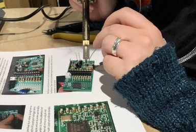

## Workshop: Building a weather station

During the workshop, you will have the opportunity to build a weather station that measures temperature, and humidity (Three will also have a fine dust particle sensor). For more information, see the website of [Meet je Stad](https://meetjestad.net/).

__The schedule of the workshop:__

09:00-13:00 - Instruction & building of the weather station

Instructors: Rene van der Weert, Leo Remijn, and Henk van Bezooijen.

*Figure 1. Soldering the weather station.*

After you finish building the weather station, try to develop a plan for how you, as a team, can effectively distribute the weather stations across the neighbourhood of Brabantpark. The objective is to find inhabitants willing to take care of a weather station. As a result, there needs to be some kind of 'loan for use' agreement between BUAS and the person volunteering to take care of a weather station. You can find a template of a Dutch 'loan to use' agreement, [here](../../Study%20Content/Digital%20Transformation/loanforuseagreement_template.docx).

__Tips:__

- Determine your target group (i.e. inhabitants of Brabantpark) (Resource: [Demographics of Brabantpark](https://breda.incijfers.nl/dashboard/buurt--en-wijkdata)).
- Develop an effective communication strategy for your target group (Resource: [Communicating Across Cultures](https://www.linkedin.com/learning/communicating-across-cultures-2/the-skill-of-communicating-across-cultures?autoplay=true&u=36359204)).
- Set up a 'Loan for use' agreement for your target group (Resource: [Duidelijke juridische taal](https://directduidelijk.gebruikercentraal.nl/terugkijken-webinars/duidelijke-juridische-taal/)).
- Develop, and plan an event where you distribute the weather stations to your target group.

***
