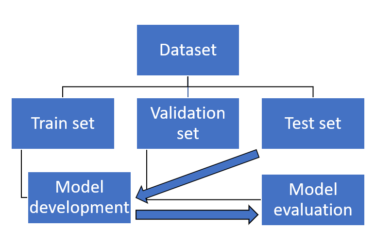

# Classifications Algorithms

We start with a workshop on classification where we compare it to our familiar regression algorithms! Then we look into a specific classification technique called K-Nearest Neighbors. Furthermore, you will be introduced to the variance-bias trade-off, which is an important concept in data science.

## 0) Learning Objectives:
0. understand the concept of Classification;
1. apply K-K-Nearest Neighbors Classification in Python using scikit-learn;
2. define the bias-variance trade-off;
3. identify, and describe the phenomena of underfitting and overfitting.

Table of contents:
1. Workshop: 6 hours
2. The bias-variance trade-off (mandatory): 1 hour
3. The bias-variance trade-off (optional): 0.5 hours

## Questions or issues?
If you have any questions or issues regarding the course material, please first ask your peers or ask us in the Q&A in Datalab!

Tip: Note down any important questions you might have!
 

Good luck!

## 1) Workshop
Now, we're familiar with regression algorithms it's time to cover the next fundamental technique; classification, by doing a workshop. Open the [Basics of Machine Learning course](https://www.codecademy.com/learn/machine-learning) on Codecademy and complete the modules: **Classification Vs Regression** and **Classification: K-Nearest Neighbors**, specifically:
- Article: Regression vs. Classification
- Lesson: Distance Formula
- Article: Normalization
- Article: Training Set vs Validation Set vs Test Set
- Lesson: K-Nearest Neighbors
- Quiz: K-Nearest Neighbors
- Project: Breast Cancer Classifier

## 2) The bias-variance trade-off

In today's Codecademy course material, you have learned how to split your dataset into a training, validation, and test set (i.e. holdout method). This is an essential part of the machine learning pipeline called model evaluation.

When you evaluate a predictive model, its error can be decomposed into two main subcomponents: bias and variance. Understanding these two types of error can help you to reduce the chance of overfitting or underfitting, thus improving your model's overall performance (Fortmann, 2012).

*Figure 1. The machine learning pipeline (with a focus on model development and evaluation).*

The bias-variance trade-off allows data scientists to understand why a model behaves a certain way, and allows them to apply corrective actions. In general, the bias-variance trade-off proceeds as follows: increasing bias decreases variance, and increasing variance decreases bias. The trick is to find a balance between the two error types.

__3a__ Read Fortmann's essay on the bias-variance trade-off. You can find the material, [here](http://scott.fortmann-roe.com/docs/BiasVariance.html).

__3b__ List, and describe the four different cases representing combinations of both high and low bias and variance (See Figure 1. in Fortmann's essay).

__3c__ Watch the video Machine Learning Fundamentals: Bias and Variance by StatQuest with Josh Starmer.

<iframe width="560" height="315" src="https://www.youtube.com/embed/EuBBz3bI-aA" title="YouTube video player" frameborder="0" allow="accelerometer; autoplay; clipboard-write; encrypted-media; gyroscope; picture-in-picture" allowfullscreen></iframe>

*Video 1. Machine Learning Fundamentals: Bias and Variance by StatQuest with Josh Starmer*

__The following exercises are optional.__ They are included in the independent study material to help you understand the variance-bias trade-off.

__3d__ The prediction error of a model is composed of three elements. List the three elements. Write your answer down.

__3e__ In the article Fortmann presents a KNN analysis of voter party registration to explain the bias-variance trade-off. 1) What are the features? 2) What is the response (i.e. y-variable)? 3) Is this a regression or classification task? Elaborate on your answers.

__3f__ Select a small value of K, and click the button 'Generate New Training Data' several times. Does the graph depict: 1) low variance or high variance? 2) low bias or high bias? Explain your answers.

__3g__ Does a large value for K cause a) overfitting or b) underfitting? Explain your answer.

*Figure 2. A case of overfitting...*

Tip: Want to learn more on the topic of model evaluation, see Raschka's <a href="https://arxiv.org/pdf/1811.12808.pdf">Model Evaluation, Model Selection, and Algorithm
Selection in Machine Learning</a> guide.
 

# Next up!
Coming Datalab we will reflect on classification algorithms again and give you an opportunity to ask any questions you might have.

Then we will apply our newly learned techniques on the Yelp dataset again by performing a logistic regression! Subsequently, we will perform a logistic regression on our Oosterhout dataset; in line with our research problem!

## Resources
- [Codecademy](https://www.codecademy.com/learn/machine-learning)
