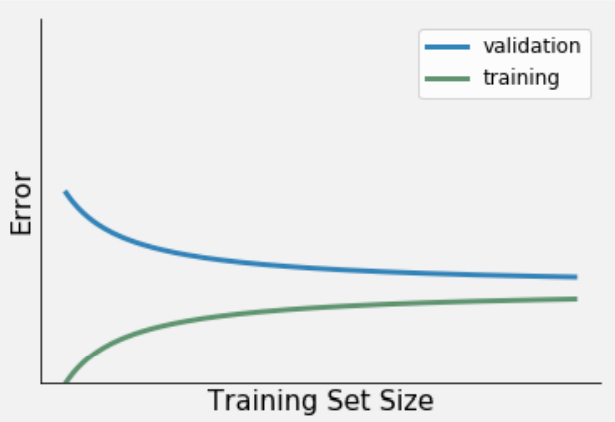
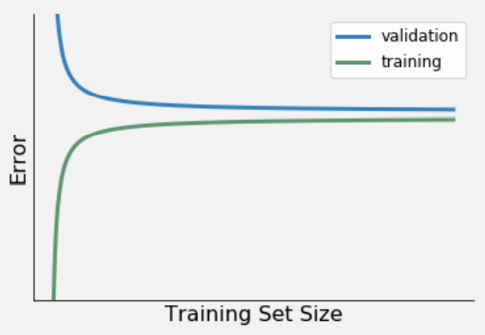
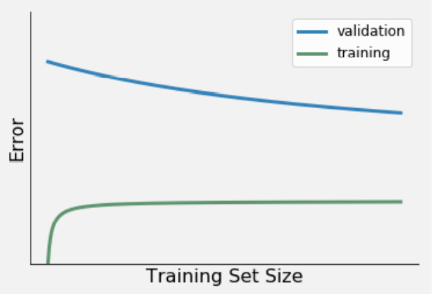

# Datalab 00: Regression Algorithms

We start with the Yelp Regression mini-project from Codecademy to put the knowledge and skills we gained yesterday to the test. Then we apply our knowlegde and skills to the research challenge/question we set ourselves for the creative brief. It's all quite straightforward really!

## Learning Objectives:
1. Create an appropriate multiple regression model for a given research question.

Table of contents:
1. Mini-Project: Yelp Regression: 4 hours
2. Oosterhout Dataset: Multiple Regression: 3 hours

## Questions or issues?
If you have any questions or issues regarding the course material, please first ask your peers or ask us in the in-class discussion at 16:00!

Good luck!

## 0) Yelp Regression Project
Now, we're introduced to multiple linear regression; it's time to apply these fundamentals by doing a workshop. Open the [Basics of Machine Learning course](https://www.codecademy.com/learn/machine-learning) on Codecademy and complete the first module: **Yelp Regression Project**.

## 1) Oosterhout Dataset: Multiple Regression
### Document your code
Write your argumentation down in a in-line comments; and for every line of code: write an in-line comment explaining what the line of code does exactly. Figure 1. below is a good demonstration of documented code.
<figure>
    
    <figcaption>Figure 1.</figcaption>
</figure>
 

1. Create a python script in Jupyter Notebook called MultipleRegressionOosterhout. Load in the youthcare dataset you created in Business Intelligence. Then save your file to your GitHub repository.
2. Open your research design and formulate a multiple regression analysis based on your research question (or when not answerable using multiple regression: related to your research question). Start by listing the variables which you think could predict the outcome variable you're interested in and motivate why you think they might predict your outcome variable
3. Create your fully fitted model (so the model containing all variables you wrote down in step 2) under the python code you just wrote.
4. Test, re-fit and validate your model. Create a new model on a new line for every re-fit. Keep track of any predictor variables you exclude from the full model when re-fitting. Motivate why you are excluding; or including new variables using in-line comments.
5. Continue till 16:00, or stop when you feel you can no longer improve the model.

## 2) Oosterhout Dataset: The learning curve (optional)

A learning curve, shows you how the error (i.e. difference between predicted and true response value for a given observation) of an ML model changes as the size of the training set increases or decreases. In doing so, it provides you with valuable information about how biased and/or varied your data is, and how your model copes with these two error types. For more information on the bias-variance trade-off, see Fortmann´s article (Week 1, Unsupervised and unsupervised learning GitHub page).

The following questions will give you some guidance, while you are training and/or evaluation your ML model:

__2a__ Try to connect three learning curve variations (presented in Figure 1-3) to the relevant description. For example, Learning curve 1 = Low bias & low variance, Learning curve 2 = High bias & low variance etc. Being able to identify these three learning curve variations, will help you in selecting, and subsequently evaluating you ML model (e.g. multiple linear regression).

*Figure 1. Learning curve 1.*

*Figure 2. Learning curve 2.*

*Figure 3. Learning curve 3.*

__learning curve variations:__

Low bias & low variance. Characteristics:

- Relatively small error
- Small difference between the error from the train and validation set.

Low bias & high variance. Characteristics:

- Relatively small training error.
- Large difference between the error from the train and validation set.
- Downward trend in validation error indicates that the model's performance will improve with the increase of data.

High bias & low variance. Characteristics:

- Relatively large training error.
- Small difference between the error from the train and validation set.
- Train and validation error diverges rapidly.

__2b__ The training error provides information on the performance of your ML model in terms of a) variance or b) bias. Explain your answer.

__2c__ The difference between the train set error and validation set provides information on the performance of your ML model in terms of a) variance or b) bias. Explain your answer.

__2d__ visit the website of [scikit-learn](https://scikit-learn.org/stable/auto_examples/model_selection/plot_learning_curve.html#sphx-glr-auto-examples-model-selection-plot-learning-curve-py) for an Jupyter notebook on plotting learning curves.

Tip: For more information on the application of learning curves, see Dataquest's <a href="https://www.dataquest.io/blog/learning-curves-machine-learning/"> Tutorial: Learning Curves for Machine Learning in Python </a>.

## 3) In-Class discussion
At 16:00, there's a meeting you're encouraged to take part in to ask questions and to discuss our progress and reflect on today activities.

Next week, we will cover classification algorithms!

## Resources
- [Codecademy](https://www.codecademy.com/learn/machine-learning)
