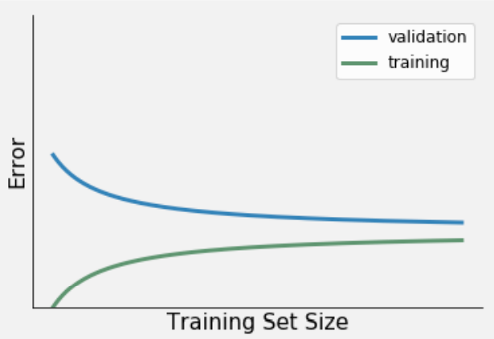
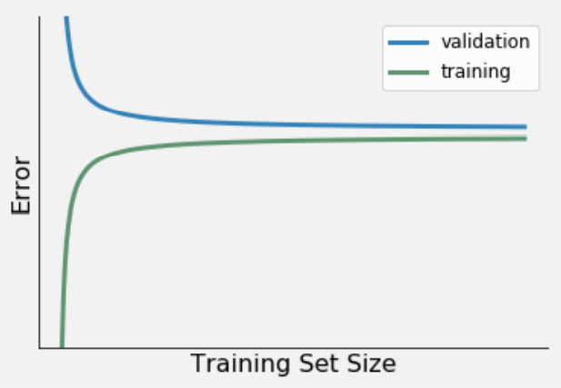
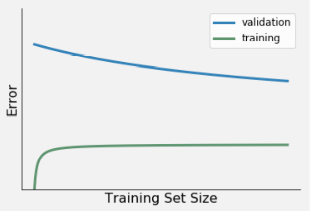

# Datalab 01: Classification Algorithms

We start with a Q&A and reflection on classification algorithms. Then, we will apply our newly learned techniques on the Yelp dataset again by performing a logistic regression! Subsequently, we will perform a logistic regression on our Oosterhout dataset; in line with our research problem! As an extra you are offered some extra material to get familiar with a technique called learning curves. Lastly, you will be introduced to an important pre-processing step - i.e. data encoding.

## 0) Learning Objectives:
1. Formulate, apply and create a logistic regression analyses to real-world data.
2. Implement, visualize, and evaluate a learning curve of a model trained on the youth care dataset (optional)
3. Apply one-hot encoding to the youth care dataset (optional)

Table of contents:
0. Stand-up: 0.5 hours
1. Q&A: 0.5 hours
2. Titanic Regression Project: 3 hours
3. Oosterhout Dataset: Classification Analysis: 3 hours
4. Additional material (optional): 2 hours
   4.1. The learning curve
   4.2. Data encoding: One-hot encoding
5. Day-reflection

## Questions or issues?
If you have any questions or issues regarding the course material after the Q&A, please first ask your peers or ask us if you can't figure it out together!

Good luck!

## 0) Stand-up
We start by hosting a stand-up. Form groups of ~ 5 and run on-another through the following points:
- What progress have you made up since last datalab?
- What progress do you anticipate to make today?
- What impediments are you facing or expecting?
- With what could you use help or support?

**Open your worklog and plan your day informed by the stand-up and today's schedule**

## 1) Q & A
We start by briefly reflecting on what we learned about classification algoritms, overfitting and the bias-variance trade-off. Do you have any questions? Now is the time to ask them!

## 2) Titanic Regression Project
Now, we're introduced to classification algorithms it's time ground down these fundamentals by doing a workshop. Open the [Basics of Machine Learning course](https://www.codecademy.com/learn/machine-learning) on Codecademy and complete the first module: **Logistic Regression**, specifically:
- Lesson: Logistic Regression
- Quiz: Logistic Regression
- Project: Predict Titanic Survival

## 3) Oosterhout Dataset: Classification
### Document your code
Write your argumentation down in a in-line comments; and for every line of code: write an in-line comment explaining what the line of code does exactly. Figure 1. below is a good demonstration of documented code.
<figure>
    
    <figcaption>Figure 1.</figcaption>
</figure>
 
The [example script](https://github.com/BredaUniversityADSAI/ADS-AI/tree/main/docs/Study%20Content/DataScience/assets/DS2_Example) I provided in Data Science 1 is also a good example of how to document your code; albeit that one was done in R.

0. Open your python file (MachineLearning_OosterhoutModels_...) used for the final delivery of your model. If you didn't fill in the assignment template yet, [download it here](https://github.com/BredaUniversityADSAI/ADS-AI/blob/3a73817f6ad0d65d0f97fa33cb867dce004df50c/docs/Study%20Content/Introduction%20to%20Machine%20Learning/Assets/MachineLearning_TemplateScript_FirstName_LastName_StudentNumber.ipynb.ipynb) and fill it in accordingly: use the **User Guide**.
1. Load in the youthcare dataset you created in Business Intelligence if you haven't done so already. Load in any other data you might need. Then save your file to your GitHub repository.
2. Open your research design and use in-line comments to  formulate a logistic regression; or classification, analysis based on your research question (or when not answerable using this type of analysis: perform an analysis related to your research question). Start by listing the variables which you think could predict the outcome variable you're interested in and motivate why you think they might predict your outcome variable.
3. Create your fully fitted model (so the model containing all variables you wrote down in step 2) under the python code you just wrote.
4. Test, re-fit and validate your model. Create a new model on a new line for every re-fit. Keep track of any predictor variables you exclude from the full model when re-fitting. Motivate why you are excluding; or including new variables using in-line comments.
5. Continue till 16:00, or stop when you feel you can no longer improve the model. Then save your file to your GitHub repository.

## 4) Additional material (optional)

### 4.1 The learning curve

A learning curve shows you how the error (i.e. difference between predicted and true response value for a given observation) of an ML model changes as the size of the training set increases or decreases. In doing so, it provides you with valuable information about how biased and/or varied your data is, and how your model copes with these two error types. For more information on the bias-variance trade-off, see Fortmann´s article.

The following questions will give you some guidance, while you are training and/or evaluating your ML model:

__2a__ Try to connect three learning curve variations (presented in Figure 1-3) to the relevant description. For example, Learning curve 1 = Low bias & low variance, Learning curve 2 = High bias & low variance etc. Being able to identify these three learning curve variations, will help you in selecting, and subsequently evaluating your ML model (e.g. logistic regression).

*Figure 1. Learning curve 1.*

*Figure 2. Learning curve 2.*

*Figure 3. Learning curve 3.*

__Learning curve variations:__

Low bias & low variance. Characteristics:

- A relatively small error
- A small difference between the error from the train and validation set.

Low bias & high variance. Characteristics:

- A relatively small training error.
- A large difference between the error from the train and validation set.
- A downward trend in validation error indicates that the model's performance will improve with the increase of data.

High bias & low variance. Characteristics:

- A relatively large training error.
- A small difference between the error from the train and validation set.
- The train and validation error diverges rapidly.

__2b__ The training error provides information on the performance of your ML model in terms of a) variance or b) bias. Explain your answer.

__2c__ The difference between the train set error and validation set provides information on the performance of your ML model in terms of a) variance or b) bias. Explain your answer.

__2d__ visit the website of [scikit-learn](https://scikit-learn.org/stable/auto_examples/model_selection/plot_learning_curve.html#sphx-glr-auto-examples-model-selection-plot-learning-curve-py) for a Jupyter notebook on plotting learning curves.

Tip: For more information on the application of learning curves, see Dataquest's <a href="https://www.dataquest.io/blog/learning-curves-machine-learning/"> Tutorial: Learning Curves for Machine Learning in Python</a>.

### 4.2 Data encoding: On-hot encoding

When you are working with a binary classifier (e.g. perceptron, logistic regression, SVM etc.) your outcome variable (i.e. y-variable) needs to be binary too! In other words, it should be comprised of only one or two possible values. For example, Pass/Fail, Profit/Loss, Cat/Dog, 0/1 etc.

If you have an outcome variable that is not binary, but you want to use a binary classifier, you can recode your categorical variable. The Python libraries scikit-learn and pandas provide  various data encoding functions.

A popular data encoding technique is one-hot encoding. It represents data in a sparse, - i.e. 'machine-readable' way. Terr and Howard (2018-2019), define the technique as follows:  

> One-hot encoding yields what people call dummy variables, boolean variables derived from a categorical variable where exactly one of the dummy variables is true for a given record. There is a new column for every categorical level. Missing category values yield 0 in each dummy variable (Parr and Howard, 2018-2019).

To illustrate the idea behind one-hot encoding they provide a simple example. See chapter 8.3 One-hot encoding Hydraulics_Flow of the book The Mechanics of Machine Learning (Terr and Howard, 2018-2019), which you can find, [here](https://mlbook.explained.ai/bulldozer-feateng.html).

When applying one-hot encoding to your dataset, you have to be aware of its drawbacks. Included, but not limited to:

- One-hot encoding makes your dataset prone to what data professionals call 'The curse of dimensionality'. This data encoding technique greatly increases the dimensions of your dataset (i.e. the number of variables), making your analysis both memory and computationally expensive. In addition, one-hot encoding can complicate a regression task by increasing the chance of multicollinearity. This phenomenon occurs when a feature can be linearly predicted from the other features in the multiple linear regression model.
-  One-hot encoding cannot be applied to ordinal data. This specific type of data need a dense, - i.e. 'human-readable', representation, such as a regular pandas dataframe. By creating 'dummy' variables out of the ordinal variable you will eliminate its intrinsic hierarchy.

Data decoding techniques are not limited to outcome variables, the features, i.e. the predictors of your model, can also benefit from this kind of engineering:

> Creating a good model is more about feature engineering than it is about choosing the right model; well, assuming your go-to model is a good one like Random Forest. Feature engineering means improving, acquiring, and even synthesizing features that are strong predictors of your model's target variable. Synthesizing features means deriving new features from existing features or injecting features from other data sources. For example, we could synthesize the name of an apartment's New York City neighborhood from it's latitude and longitude. It doesn't matter how sophisticated our model is if we don't give it something useful to chew on. If there is no relationship to discover, because the features are not predictive, no machine learning model is going to give accurate predictions (Terr and Howard, 2018-2019).

Finally, there are even algorithms (e.g. perceptron) that only accept binary and/or continuous features as input. Then you have no choice, but to recode your categorical predictors.

__Documentation (Python):__

scikit-learn:
- [OneHotEncoder()](https://scikit-learn.org/stable/modules/preprocessing.html#preprocessing-categorical-features)
- [LabelBinarizer()](https://scikit-learn.org/stable/modules/generated/sklearn.preprocessing.LabelBinarizer.html)

pandas:

- [get_dummies()](https://pandas.pydata.org/pandas-docs/stable/reference/api/pandas.get_dummies.html)

## 5) Day-reflection
At 16:30, there's a meeting you're encouraged to take part in to ask questions and to discuss our progress and reflect on today's activities.

## Up Next
Next week, we will start climbing in some Decision Trees.

<figure>
    
    <figcaption>Climbing trees involves making numerous decision, next week we'll cover how you make such decision mathematically. </figcaption>
</figure>
 

## Resources
- [Codecademy](https://www.codecademy.com/learn/machine-learning)
- [The Mechanics of Machine Learning](https://mlbook.explained.ai/)
