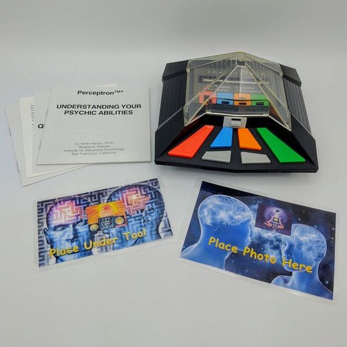

# Datalab 04: Perceptron

In today's DataLab session you are going to apply the perceptron algorithm to the youth care dataset.

*Figure 1. Another perceptron...*

I found another example of a 'perceptron' online. Apparently, this version is helps you to discover, and explore your 'psychic abilities', interesting to say the least :crystal_ball:.

## 0) Learning Objectives:

1. Apply appropriate preprocessing techniques to the youth care dataset
2. Train, and evaluate the perceptron on the youth care dataset

Table of contents:
1. ...: Y hours
2. Oosterhout Dataset: Classification Analysis: Z hours

## Questions or issues?
If you have any questions or issues regarding the course material, please first ask your peers or ask us in the in-class discussion at 16:00!

Good luck!

## 2) Yelp Regression Project
Now, we're introduced to TOPIC it's time ground down these fundamental by doing a workshop. Open the [Basics of Machine Learning course](https://www.codecademy.com/learn/machine-learning) on Codecademy and complete the first module: **Logistic Regression**.

## 3) Oosterhout Dataset: Classification
1. Create a python script called ClassificationOosterhout and save it to your GitHub repository.
2. Implement the perceptron algorithm. You can either choose to use the Python code from Codecademy, which implements the original perceptron by Rosenblatt or you can use the scikit-learn function ([linear_model.Perceptron()](https://scikit-learn.org/stable/modules/generated/sklearn.linear_model.Perceptron.html)), which implements a more modern version of the perceptron (see Additional material section!).   

## 4) Additional material (optional)

The perceptron has many different implementations, also referred to as architectures. Today, we will focus on one element of the perceptron architecture, the threshold or activation function.

## 4.1 Activation functions

As you may have read, one of the main elements of the perceptron algorithm is the activation function. There are three types of activation functions: non-differentiable, subdifferentiable, and differentiable:

__1. Non-differentiable (Gradient descent :x:):__
- Heaviside, or unit step

The original perceptron developed by Rosenblatt use this particular activation/threshold function. This variation of the perceptron only accepts binary (i.e. 0 or 1) input variables, and its activation function is non-differentiable. Meaning, gradient descent will not help to optimize the performance of the model because the gradients are (except when x = 0) always zero.

| Function | Plot | Equation | Derivative |
|----|:---:|:---:|:---:|
| Heaviside/Unit Step |  |  |  |

Note: It is completely normal if you do not fully understand the material presented in this section. In Block C, you will learn more about neural networks, activation functions, derivatives backpropagation, gradient descent etc. For now it is important that you understand that building a successful model often involves multiple preprocessing steps (e.g. data encoding, scaling, handling missing values etc.).

__2. Subdifferentiable (Gradient descent :heavy_check_mark:):__
- Rectified Linear Units (ReLU)

This is one of the most popular activation functions used in the field of deep learning. In this case, the gradient is only zero when x < 0. In other words, this algorithm can be optimized via gradient descent. This variation of the perceptron accepts both binary (i.e. 0 or 1) and continuous (i.e. between 0 and 1) input variables. As a result, it is a good practice to scale your continuous features.

| Function | Plot | Equation | Derivative |
|----|:---:|:---:|:---:|
|Rectified Linear Units, ReLU |  |  |  |

__3. Differentiable (Gradient descent :heavy_check_mark:):__
- Sigmoid

| Function | Plot | Equation | Derivative |
|----|:---:|:---:|:---:|
| Sigmoid |  |  |  |

Looks familiar? This is one of the most well known activation functions. It is also used in logistic regression. The gradient is 0 when x = 0 or x = 1. This variation of the perceptron, also knows as the sigmoid neuron, accepts both binary (i.e. 0 or 1) and continuous (i.e. between 0 and 1) input variables. As a result, it is a good practice to scale your continuous features.

Want to learn more about the sigmoid neuron, see the book chapter [1.3: Sigmoid neurons](https://eng.libretexts.org/Bookshelves/Computer_Science/Applied_Programming/Book%3A_Neural_Networks_and_Deep_Learning_(Nielsen)/01%3A_Using_neural_nets_to_recognize_handwritten_digits/1.03%3A_Sigmoid_neurons#:~:text=Just%20like%20a%20perceptron%2C%20the%20sigmoid%20neuron%20has,input%2C%20w1%2C%20w2%2C%20%E2%80%A6%2Cand%20an%20overall%20bias%2C%20bb.) by Nielson (December 1, 2020).

Interested in exploring how gradient descent and backpropagation work, make sure to check the example by Mikael Laine:

<iframe width="560" height="315" src="https://www.youtube.com/embed/8d6jf7s6_Qs" title="YouTube video player" frameborder="0" allow="accelerometer; autoplay; clipboard-write; encrypted-media; gyroscope; picture-in-picture" allowfullscreen></iframe>

*Video 1. Neural Network Backpropagation Basics For Dummies by Mikael Laine.*

## 4.2 Feature scaling

Feature scaling is a technique to standardize your predictors within a fixed range. scikit-learn defines it as follows:

>Standardization involves rescaling the features such that they have the properties of a standard normal distribution with a mean of zero and a standard deviation of one ('The Importance of', n.d.).

For an explanation how feature scaling works, see scikit-learn's article [Importance of Feature Scaling](https://scikit-learn.org/stable/auto_examples/preprocessing/plot_scaling_importance.html) (n.d.).  

__Documentation (Python):__

scikit-learn:

- [StandardScaler()](https://scikit-learn.org/stable/modules/generated/sklearn.preprocessing.StandardScaler.html#sklearn.preprocessing.StandardScaler)

## 5) In-Class discussion
At 16:00, there's a meeting you're encouraged to take part in to ask questions and to discuss our progress and reflect on today activities.

Next week, we will start diving into Topic.

## Resources
- [Codecademy](https://www.codecademy.com/learn/machine-learning)
