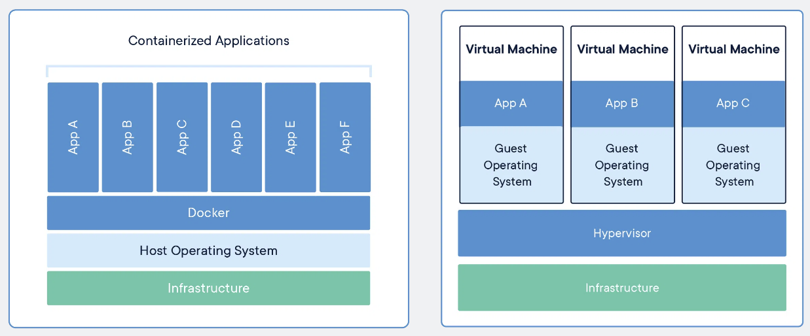

# Introduction to Containerization for Data Science and AI 📚🧪💻

This module forms a part of the larger MLOps curriculum designed for data science and AI students. It provides a fundamental understanding of containerization 📦, an essential concept in the field of MLOps (Machine Learning Operations). This course will explore the principles of containerization and how it enables more efficient, scalable, and reliable systems 🔒, which are crucial for successful machine learning models in production. The focus will be on understanding containerization and deploying a Python-based Machine Learning application using Docker.

By the end of this one-day course, students will be able to:

- [ ] Understand the core concepts of containerization and its advantages.
- [ ] Use Docker to create and manage containers.
- [ ] Containerize and deploy a Python-based Machine Learning application using Docker.

---

## 1. Understanding Virtualization 💻

Before we delve into the world of containerization, it's important to understand the concept of virtualization, as both technologies aim to provide isolated and reproducible environments for applications.

Virtualization is a technology that allows you to create multiple simulated environments or dedicated resources from a single, physical hardware system. At its core, virtualization is about abstracting the hardware to allow a single machine to run multiple operating systems simultaneously.

### Types of Virtualization

1. **Hardware or Platform Virtualization**: This is the most common type of virtualization. It involves installing a hypervisor on top of the host's operating system. The hypervisor directly interacts with the physical server's CPU, memory, and other resources. It serves as a platform for virtual machines (VMs), each with its own operating system and installed applications.

2. **Operating System Virtualization or Containerization**: This form involves virtualizing the operating system so that you can run multiple instances (containers) on a single host. Each container shares the host's operating system but runs in isolation from the others. Containerization offers a lightweight alternative to full machine virtualization.

### Virtual Machines vs Containers 🏠🏢

Understanding the difference between virtual machines and containers is key to understanding why containers have gained so much popularity.

- **Virtual Machines** 🏠: Each VM includes a full copy of an operating system, the application, necessary binaries, and libraries - taking up tens of GBs. VMs can also be slow to boot. They are also tied to the infrastructure they run on, making them less portable. Think of VMs as houses. Each house (VM) is fully self-contained with its own infrastructure such as plumbing and electrical (OS and individual system resources). Just as houses don't share these resources with each other, each VM runs its own operating system independently, requiring a full stack from the OS up to the application code to run. This can lead to a lot of redundancy and wasted resources, much like having a whole house just for one person.

- **Containers** 🏢: Containers include the application and all of its dependencies but share the kernel with other containers. They run as an isolated process in userspace on the host operating system. They are not tied to any specific infrastructure – they run on any computer, on any infrastructure, and in any cloud. Containers are more like apartments in an apartment building. The building (the host system) itself provides the infrastructure (OS, network, storage), and each apartment (container) includes just the rooms (application and its dependencies) required for the person (the specific service or application the container is running). Since all apartments in the building share the same infrastructure, you can fit many more apartments onto the same amount of land compared to individual houses. Each apartment is self-contained and fully functional, but much smaller than a house. This makes them lightweight and portable.

<div style="text-align:center">

</div>

Containers offer several advantages over virtual machines:

- **Efficiency**: Containers are incredibly lightweight because they leverage and share the host kernel.
- **Speed**: Containers start almost instantly. They are created, started, and stopped in a matter of seconds.
- **Portability**: A containerized application can run anywhere without worrying about the underlying infrastructure.
- **Scalability**: Containers can be scaled up and down quickly to match the demands of the application.

---

## 2. Understanding Containerization 📦

## What is a container? 📦

A container is a lightweight, standalone, executable software package that includes everything needed to run a piece of software, including the code, runtime, system tools, libraries, and settings. Containers help to isolate applications from the underlying system, ensuring that they run consistently across different computing environments.

<div style="text-align:center">

</div>

## Why use containers? 🤔

Containers offer several benefits for data science and AI applications:

1. **Consistency**: Containers ensure that applications run consistently across different environments, reducing the "it works on my machine" problem.
2. **Isolation**: Containers help isolate applications from the underlying system, providing better security and reducing potential conflicts between dependencies.
3. **Portability**: Containers make it easy to share and deploy applications across various platforms, simplifying the deployment process.
4. **Scalability**: Containers can be easily scaled up or down, making them a perfect fit for resource-intensive tasks like machine learning.
5. **Easier collaboration**: Containers help streamline collaboration between team members, as everyone can work with the same environment and dependencies.

## Containerization for ML 🧪

Containerization is particularly beneficial for machine learning applications, as it addresses several challenges faced by data scientists and AI practitioners:

1. **Dependency management**: Containerization simplifies the management of complex dependencies, ensuring that machine learning models work as expected across different environments.
2. **Reproducibility**: Containers help maintain reproducibility in ML workflows by capturing the entire environment, including data, code, and libraries.
3. **Version control**: Containers allow for easy versioning of models and their environments, making it simple to roll back to a previous version if needed.
4. **Deployment**: Containers make it easy to deploy machine learning models to production environments, streamlining the process and reducing potential errors.

<div style="text-align:center">

</div>

---

## 3. Docker 🐳

[Docker](https://www.docker.com/) is a popular containerization platform that allows you to create, deploy, and manage containers. It is an open-source project that provides a simple and lightweight way to containerize applications. Docker is widely used in the industry and is supported by all major cloud providers, making it an excellent choice for containerizing machine learning applications.


- Please complete the following course on DataCamp to learn more about Docker: [Introduction to Docker](https://app.datacamp.com/learn/courses/introduction-to-docker) 📚

        ⚠️ Note: you only need to do the first 3 chapters. ⚠️

- You can access the Docker documentation [here](https://docs.docker.com/get-started/overview/):link:

### Docker Components 🧩

To understand Docker better, let's take a look at its main components:

1. **Docker Engine** 🚂: Docker Engine is the heart of Docker. It's a lightweight runtime that builds and runs your Docker containers. Docker Engine is a client-server type of application that consists of a server which is a type of long-running program called a daemon process, a REST API that specifies interfaces that programs can use to talk to the daemon and instruct it what to do, and a command-line interface (CLI) client.
 
2. **Docker Images** 🖼️: Docker images are read-only templates that your Docker containers are based on. You can think of them as a blueprint for Docker containers. They contain everything needed to run an application - the code or binary, runtimes, dependencies, and any other filesystem objects required.

3. **Docker Containers** 📦: Docker containers are runtime instances of Docker images. They encapsulate the application and its dependencies, making it portable and consistent across different environments. Each container runs as an isolated process in the user space of the host operating system.

4. **Dockerfile** 📄: A Dockerfile is a text file that contains a list of commands that the Docker daemon calls while creating an image. It's essentially a blueprint for building Docker images and automating the process.

5. **Docker Registry** 🗄️: A Docker registry is a repository for Docker images. Docker Hub is a public registry that anyone can use, and Docker is configured to look for images on Docker Hub by default. You can also set up your own private registry.

6. **Docker Hub** 🌐: Docker Hub is a cloud-based registry service that allows you to link code repositories, build details, and more. It provides a centralized resource for container image discovery, distribution, change management, related third-party services, and workflow automation throughout the development pipeline.

### Docker Workflow 🔄

Here's a basic Docker workflow:

1. **Create a Dockerfile**: This file will define what goes on in the environment inside your container.

2. **Build an Image**: Using Docker build, you create a Docker image based on the Dockerfile.

3. **Run the Image**: From this image, Docker creates a container where your application will run.

4. **Push to a Registry**: If you're planning to run your application across different environments, you would want to push your image to a registry like Docker Hub.

5. **Pull and Run the Image from the Registry**: You then pull the image from the registry and tell Docker to run this image on any machine that supports Docker, ensuring consistency across different environments.

<div style="text-align:center">

</div>

By understanding these components and the basic workflow, you can begin to see the potential of Docker. But, of course, Docker's true power comes when you start working with complex applications that require linking multiple containers, scaling up and down to manage loads, and deploying applications on remote hosts, for which you would use orchestration tools like Docker Swarm or Kubernetes.

Docker provides the flexibility and performance capabilities to encapsulate and containerize your applications and microservices, making it an essential tool in the MLOps and DevOps toolchain.

### Docker Cheatsheet 📝

Here is a list of commonly used Docker commands and some Dockerfile instructions that you might find useful:

#### Docker Commands

- `docker ps`: List running containers.
- `docker ps -a`: List all containers (both running and stopped).
- `docker run -it <image>`: Run an image in interactive mode.
- `docker run -d -p <host-port>:<container-port> <image>`: Run an image in detached mode (in the background) and map ports.
- `docker stop <container>`: Stop a running container.
- `docker rm <container>`: Remove a container.
- `docker images`: List all images.
- `docker rmi <image>`: Remove an image.
- `docker pull <image>`: Pull an image from a registry.
- `docker push <image>`: Push an image to a registry.
- `docker build -t <tag> .`: Build an image from a Dockerfile (the '.' indicates that the Dockerfile is in the current directory).
- `docker exec -it <container> <command>`: Execute a command in a running container.
- `docker logs <container>`: View the logs of a container.

#### Dockerfile Instructions

- `FROM`: Set the base image for subsequent instructions. In every valid Dockerfile, this will be the first instruction.
- `RUN`: Execute any commands in a new layer on top of the current image and commit the results.
- `CMD`: Provide defaults for an executing container. This can include an executable or they can omit the executable, in which case you must specify an ENTRYPOINT instruction.
- `LABEL`: Add metadata to an image.
- `EXPOSE`: Inform Docker that the container listens on the specified network ports at runtime.
- `ENV`: Set the environment variable <key> to the value <value>.
- `ADD`: Copy new files, directories or remote file URLs from <src> and add them to the filesystem of the image at the path <dest>.
- `COPY`: Similar to ADD, but without the extra features like copying from URLs or extracting TAR files.
- `ENTRYPOINT`: Allows you to configure a container that will run as an executable.
- `VOLUME`: Creates a mount point with the specified name and marks it as holding externally mounted volumes from the native host or other containers.
- `USER`: Sets the user name (or UID) and optionally the user group (or GID) to use when running the image and for any RUN, CMD and ENTRYPOINT instructions that follow it in the Dockerfile.
- `WORKDIR`: Sets the working directory for any RUN, CMD, ENTRYPOINT, COPY and ADD instructions that follow it in the Dockerfile.

Here is an example of a Dockerfile:

```Dockerfile
# Use an official Python runtime as a parent image
FROM python:3.7-slim

# Set the working directory in the container to /app
WORKDIR /app

# Add metadata to the image
LABEL maintainer="yourname@example.com"

# Copy the current directory contents into the container at /app
COPY . /app

# Install any needed packages specified in requirements.txt
RUN pip install --no-cache-dir -r requirements.txt

# Make port 80 available to the world outside this container
EXPOSE 80

# Run app.py when the container launches
CMD ["python", "app.py"]
```

This Dockerfile uses a Python 3.7 image, sets the working directory to `/app`, copies the contents of the current directory into the container, installs necessary packages, exposes port 80, and runs `app.py` on launch.

Remember, the best way to get comfortable with Docker commands and Dockerfiles is through practice. The more you work with Docker, the more these commands will become second nature. In the next section, we will walk through an example of how to containerize a machine learning application using Docker.

---

## 4. Example: MNIST App in a container 🖋️

In this example, we will containerize a Python-based command-line machine learning application that recognizes handwritten digits using the MNIST dataset.

1. **Create a Python ML application**: Develop a Python application that trains a machine learning model using the MNIST dataset and saves the trained model.

2. **Write a Dockerfile**: Create a Dockerfile that specifies the base image, installs the necessary dependencies, and sets up the environment for your application.

3. **Build the Docker image**: Use Docker to build the image for your application using the Dockerfile.

4. **Run the Docker container**: Deploy your application by running the Docker container.

5. **Test the application**: Test the application to ensure that it works as expected within the container.

By following these steps, you will successfully containerize and deploy a Python-based machine learning application using Docker. Let's get started! 🎢

### 4.1. Create a Python ML application 🐍

The first step is to create a Python application that trains a machine learning model using the MNIST dataset and saves the trained model. You can find the code for this application in this [GitHub repository](https://github.com/Deanis/Example-App.git).

### 4.2. Write a Dockerfile 📝

The next step is to write a Dockerfile that specifies the base image, installs the necessary dependencies, and sets up the environment for your application.

Here is the Dockerfile for this application:

```Dockerfile
# Use an official Python runtime as a parent image
FROM python:3.9

# Set the working directory in the container
WORKDIR /app

# Add metadata to the image
LABEL maintainer="your_email@example.com"
LABEL version="1.0"
LABEL description="Python CLI MNIST app"

# Copy the current directory contents into the container at /app
COPY . /app

# Install poetry
RUN pip install poetry

# Install dependencies using poetry
RUN poetry config virtualenvs.create false && poetry install

# Set the startup command to run your binary
ENTRYPOINT ["/bin/bash"]
```

- `FROM python:3.9`: This line specifies the base Docker image that the new image will be built upon. Here, it's the official Python 3.9 image.

- `WORKDIR /app`: Sets the working directory in the Docker container to `/app`. Any command that is run as part of the Docker image build process or any command specified by `CMD` or `ENTRYPOINT` will be run in this directory.

- `LABEL maintainer="your_email@example.com"` and other `LABEL` lines: These lines set metadata for the Docker image. This information can be useful for managing and inspecting Docker images. In this case, it includes information about the maintainer of the image, its version, and a description.

- `COPY . /app`: Copies the current directory from the host machine (where the Dockerfile is located) into the Docker container at `/app`.

- `RUN pip install poetry`: Executes a command as part of the Docker image build process. Here, it installs the Poetry package manager inside the Docker container.

- `RUN poetry config virtualenvs.create false && poetry install`: This command configures Poetry not to create a virtual environment and then uses Poetry to install any Python dependencies specified in the `pyproject.toml` file in your application's directory.

- `ENTRYPOINT ["/bin/bash"]`: Specifies the initial command that will be run when a new container is started from this image. Here, it starts a Bash shell.


You also need to create a `.dockerignore` file to tell Docker which files to ignore when copying files from your local machine to the Docker container. Here is the `.dockerignore` file for this application:

```
.venv
docs
.github
poetry.lock
```

### 4.3. Build the Docker image 🏗️

To build the Docker image, run the following command:

```bash
docker build -t your_docker_username/mnist-app:latest .
```
<div style="text-align: center">
⚠️ Make sure that you are in the same directory as your Dockerfile when you run this command, and that Docker is running. ⚠️
</div>

This command tells Docker to build an image using the Dockerfile in the current directory.

### 4.4. Run the Docker container 🏃

To run the Docker container, use the following command:

```bash
docker run -it your_docker_username/mnist-app:latest <command>
```

Replace `<command>` with the specific command you want to pass to your CLI app. The `-it` option is used to open an interactive terminal session. Leave out the `<command>` to run the default command specified in the `CMD` line of the Dockerfile. In this case, the default command is `--help`.

### 4.5. Test the application 🧪

Run different commands to test your CLI application and ensure that it works as expected within the container. Try to run inference on a few images. 

There are some test images in the `data` directory 🔢. You can run inference on these images by running the following command:

```bash
python predict.py ..\..\data\MNIST_44_0.png
```

Docker containers are isolated from the host system by default, which means they don't have access to your local file system unless you explicitly allow it. ❌:file_folder:

If you want to access a file from your local machine in the Docker container, you have to mount a volume from your local machine to the Docker container when running it. 

Here's an example of how you can do this:

```bash
docker run -v /path/to/local/directory:/path/in/container -it your_docker_username/mnist-app:latest
```

In this example, `-v /path/to/local/directory:/path/in/container` is mounting the local directory at `/path/to/local/directory` to `/path/in/container` inside the Docker container. This means that files in `/path/to/local/directory` on your local machine will be accessible in `/path/in/container` inside the Docker container. You can then reference these files when running your CLI command.

In the docker interactive terminal, you can run the following command to run inference on an image:

```bash
python predict.py /path/in/container/image_file.jpg
```

This command will run the `predict.py` module containing your CLI on `image_file.jpg` inside the Docker container.

Please note that you should replace `/path/to/local/directory` with the actual path on your local machine and `/path/in/container` with the path you want to use inside the Docker container. Similarly, replace `your_docker_username/mnist-app:latest` with your Docker image name and `<command>` with the command you want to run on your CLI app.

### 4.6. Push the image to Docker Hub 📤

Once you are satisfied with your application, you can push the Docker image to Docker Hub:

```bash
docker push your_docker_username/mnist-app:latest
```

## 6. Additional Resources 📚

- [Docker Documentation](https://docs.docker.com/)