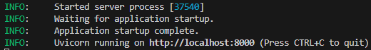
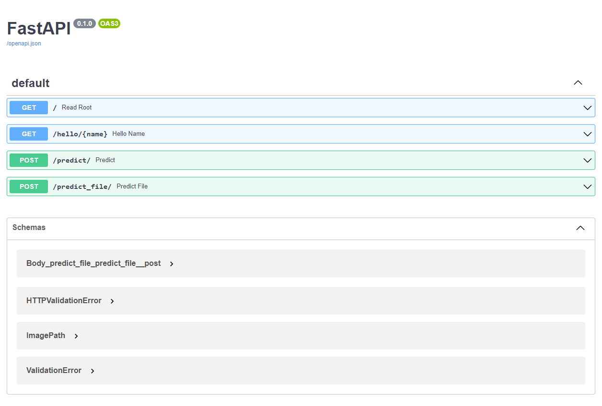
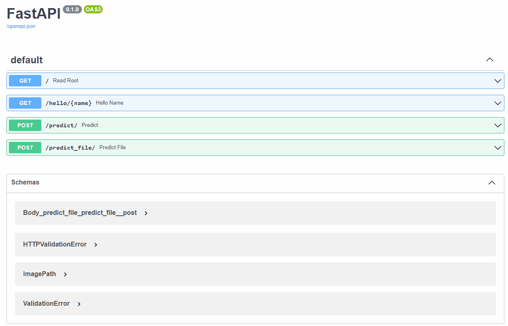

# Application Programming Interfaces (APIs) 

In the dynamic world of software development, it's crucial to understand and efficiently use Application Programming Interfaces (APIs). APIs serve as the connective tissue in modern applications, enabling different software programs to interact with each other seamlessly. This section of the course is dedicated to imparting a comprehensive understanding of APIs, focusing on the design and implementation using the FastAPI library.

After completing this section, you will be able to:

- [ ] **Understand** the fundamental concepts and importance of APIs in software development.🧠
- [ ] **Recognize** the key features of FastAPI and how it stands out from other API frameworks.💡
- [ ] **Design** and implement APIs with `FastAPI`, exploiting its features like type annotations, speed, and automatic documentation.🛠️
- [ ] **Build** a complete API with `FastAPI` and deploy it locally and in a docker container.🚀

---

## 1. What is an API? 🤔

An API (Application Programming Interface) is a set of rules and protocols for building and interacting with software applications. It defines the methods and data formats that a program can use to communicate with other programs or components. An API (Application Programming Interface) can be seen as a contract between different software components on how to interact with each other. APIs are central to modern software development and have several key benefits:

1. **Abstraction**: APIs allow developers to abstract away the complexities of a system and provide a simple interface to interact with it.

2. **Interoperability**: APIs enable different software systems to communicate and share data with each other, regardless of the programming languages or technologies used to build them.

3. **Modularity and Scalability**: APIs provide a modular approach to software development, where different components of a system can be developed, tested, and scaled independently.

4. **Automation**: APIs allow software components to interact programmatically, enabling automation and reducing manual work.

---

## 2. Understanding REST APIs 🌐

You may have heard the term "REST API" before, but what does it mean? REST (Representational State Transfer) is an architectural style for designing networked applications. A REST API (Application Programming Interface) is a set of rules and conventions for building and interacting with web services. Most modern web services and APIs are RESTful, meaning they conform to the REST architectural style. 

REST APIs are based on HTTP (Hypertext Transfer Protocol) and use HTTP methods to read, create, update, and delete data:

1. **GET**: Retrieve a specific resource (by id) or a collection of resources.
2. **POST**: Create a new resource.
3. **PUT**: Update a specific resource (by id).
4. **DELETE**: Remove a specific resource by id.

REST APIs also use status codes to indicate the success or failure of a request. Some common HTTP status codes include:

- **200 OK**: The request was successful.
- **201 Created**: The request was successful, and a new resource was created as a result.
- **400 Bad Request**: The request could not be understood or was missing required parameters.
- **401 Unauthorized**: Authentication failed or user doesn't have permissions for the requested operation.
- **404 Not Found**: Resource was not found.
- **500 Internal Server Error**: An error occurred on the server.

We will see these HTTP methods and status codes in action in the examples in later sections.

## Using REST APIs ⚙️

Interacting with a REST API involves making HTTP requests to its endpoints, which are URLs that correspond to resources. Here's a basic example of what interacting with a REST API might look like in Python, using the `requests` library:

⚠️ This is just an example to illustrate the basic idea of interacting with a REST API in python using the `requests` library. The code is not meant to be run as-is. ⚠️

```python
import requests
import json

# The base URL of the API
base_url = "https://api.example.com/"

# The endpoint of the resource we want to interact with
endpoint = "items"

# Use the `get` method of the requests library to fetch the resource
response = requests.get(base_url + endpoint)

# If the request was successful (status code 200), print the data
if response.status_code == 200:
    items = json.loads(response.text)
    print(items)
```

In this example, we're making a GET request to the "items" endpoint of the API. If the request is successful, we load the JSON data from the response and print it out.

In real-world usage, you'll typically be doing more than just fetching and printing data. You might be creating, updating, or deleting resources, and you'll likely need to handle various kinds of errors and edge cases. But this example should give you a basic idea of how to interact with a REST API.

In the context of building a REST API, something like FastAPI can help you manage these endpoints and methods, define your data models, handle serialization and validation, and much more, making the process of building a REST API much simpler and more streamlined.

---

## 3. API Libraries and Frameworks 📚

When building APIs in Python, it's essential to select a framework that aligns with your project's needs, your team's skill set, and the long-term goals of your application. With numerous options available, the choice can sometimes seem overwhelming. In this section, we will explore three popular Python frameworks for building APIs: Flask, Django REST Framework, and FastAPI. Each of these has its own strengths and trade-offs, and the choice between them often depends on the specific requirements of the project at hand. We'll consider several key aspects of these frameworks, such as performance, ease of use, automatic documentation generation, data validation and serialization, asynchronous support, and the size and activity of their developer communities. By the end of this section, you'll have a clear understanding of these different frameworks, enabling you to make an informed decision when starting your next API project. Let's dive in and learn more about these powerful tools. 🌟

### Flask 🍶

Flask is a lightweight and flexible framework for building web applications in Python. It's been around since 2010 and is very popular for its simplicity and ease of use. 

Flask doesn't come with a lot of built-in features for building APIs, but it's highly extensible and there are many great extensions available, like Flask-RESTful for building RESTful APIs and Flask-SQLAlchemy for interacting with databases. 

However, Flask doesn't support Python's async and await keywords, which can make it less efficient when handling many simultaneous connections.

### Django REST Framework 🏗️

Django REST Framework (DRF) is a powerful toolkit for building APIs in Django. It comes with a lot of built-in features, like serialization, query parameter parsing, and authentication. 

Django and DRF are known for their "batteries-included" philosophy, which means they come with a lot of functionality out of the box. This can be a great advantage if you need many of these features, but it can also make Django and DRF feel heavy and complex if you're building a simpler API.

DRF, like Flask, doesn't support async and await, and it can be overkill for simpler APIs.

### FastAPI 🚀

FastAPI is a newer framework designed specifically for building APIs. It takes advantage of modern Python features like async and await, and type hints. Here are some of the key reasons you might want to choose FastAPI:

1. **Speed**: FastAPI is one of the fastest Python frameworks available, comparable to NodeJS and Go in performance. The support for async and await means it can handle many simultaneous connections efficiently.

2. **Ease of use**: FastAPI is designed to be intuitive and easy to use, while providing powerful features. The routing system is simple and flexible, and dependency injection makes it easy to manage and reuse code.

3. **Automatic interactive API documentation**: FastAPI automatically generates interactive API documentation from your code, which can be a huge time-saver and makes it easier for developers to understand and use your API.

4. **Data validation and serialization**: FastAPI uses Pydantic for data validation and serialization, which leverages Python's type hints to provide automatic validation, serialization, and documentation.

5. **Support for modern Python features**: FastAPI supports modern Python features like async and await for asynchronous programming, and type hints for improved editor support and type checking.

6. **Starlette for web parts and Pydantic for the data parts**: FastAPI is built on top of Starlette for the web parts and Pydantic for the data parts. This combination allows it to be a high-performance framework and have data validation off the shelf.

Here is a comparison of the features of FastAPI, Flask, and Django REST Framework:

| Feature                        | Flask | Django REST Framework | FastAPI |
| ------------------------------ | ----- | --------------------- | ------- |
| Performance                    | ★★★   | ★★★                   | ★★★★★  |
| Ease of Use                    | ★★★★★ | ★★★★                  | ★★★★★  |
| Automatic Documentation        | ★★    | ★★★★                  | ★★★★★  |
| Data Validation & Serialization| ★★★   | ★★★★★                 | ★★★★★  |
| Async Support                  | ★     | ★                     | ★★★★★  |
| Community & Ecosystem          | ★★★★★ | ★★★★★                 | ★★★★   |

**Performance** ⚡: FastAPI is built on Starlette for web parts which makes it one of the fastest Python frameworks available. Flask and Django REST Framework don't support async out of the box, which can limit their performance with many simultaneous connections.

**Ease of Use** 🚀: Flask is known for its simplicity, while FastAPI is designed to be easy to use but also provides powerful features. Django REST Framework has a steeper learning curve because it includes a lot of built-in features.

**Automatic Documentation** 📚: FastAPI automatically generates interactive API documentation from your code, a feature not fully supported in Flask without extensions. Django REST Framework provides a built-in browsable API, but it's not as interactive as FastAPI's.

**Data Validation & Serialization** 🛠️: FastAPI uses Pydantic for automatic data validation and serialization, a feature not fully supported in Flask without extensions. Django REST Framework also provides strong support for data validation and serialization with serializers.

**Async Support** ⏩: FastAPI has full support for Python's async and await keywords, which can make it more efficient when handling many simultaneous connections. Flask and Django REST Framework don't have built-in support for these features.

**Community & Ecosystem** 🌐: Flask and Django REST Framework have been around for longer and have large communities and ecosystems of plugins and extensions. FastAPI's community is growing quickly, but it's not as established as Flask's or Django's.

FastAPI is a highly suitable choice for data science applications due to its high performance, robust data validation using Pydantic, asynchronous capabilities, and automatic documentation. Its easy learning curve and native Python integration also make it an attractive option for data science teams. The choice of FastAPI should consider project needs, team familiarity, and application complexity.

---

## 4. FastAPI Deep Dive 🚀

We will now take a deep dive into FastAPI and explore its key features in more detail. We'll start by looking at how to install FastAPI and then build a simple API. We'll then explore some of FastAPI's key features, including data validation, serialization, and automatic documentation. By the end of this section, you'll have a solid understanding of FastAPI's capabilities and be ready to start building your own APIs. Let's get started! 🌟

- :books: [FastAPI Documentation](https://fastapi.tiangolo.com/) 📖

- :books: [FastAPI Setup](https://fastapi.tiangolo.com/tutorial/) :hammer_and_wrench:

- :books: [FastAPI Tutorial](https://fastapi.tiangolo.com/tutorial/first-steps/) 📝


### Setting up the Environment 💻

Before we start, you will need to have Python 3.6 or later installed. You can check your Python version by running the following command in your terminal:

```bash
python --version
```
Next, let's install FastAPI and an ASGI server, such as Uvicorn. You can install both using pip:

```bash
pip install fastapi uvicorn
```
Uvicorn 🦄 is a lightning-fast ASGI server that supports HTTP/1 and HTTP/2. It's recommended by the FastAPI documentation, but you can use any ASGI server you like. An ASGI server is a server that supports the ASGI protocol, which is the standard for Python asynchronous web servers and frameworks. Don't worry if you're not familiar with ASGI servers or protocols just know that Uvicorn is a good choice for FastAPI.

If you're using a virtual environment, make sure to activate it before installing FastAPI and Uvicorn. If you are using poetry, you can create a new virtual environment and install FastAPI and Uvicorn using the following commands:

```bash
poetry new fastapi-demo
cd fastapi-demo
poetry add fastapi uvicorn
```

### Creating a Basic API with FastAPI 🏗️

Now that we have our environment set up, let's create a basic API.

1. **Create a new file** 📁

   Create a new Python file in your project directory. You can name it `main.py`.

2. **Import FastAPI** 📚

   Open your new `main.py` file in your text editor and import the `FastAPI` class from the `fastapi` module:

   ```python
   from fastapi import FastAPI
   ```

3. **Instantiate FastAPI** 🏃

   Create an instance of the `FastAPI` class. This instance will be our application.

   ```python
   app = FastAPI()
   ```

4. **Define a Route** 🗺️

   Now let's create a route. A route is a URL pattern that is used to find the appropriate resource. You define a route by using the `@app.route()` decorator, followed by a function that returns the response for that route:

   ```python
   @app.get("/")
   def read_root():
       return {"Hello": "World"}
   ```

   Here, we are creating a route for the URL "/", and defining a GET operation with the `@app.get("/")` decorator. The function `read_root()` will be executed when a GET request is made to the "/" URL. It returns a JSON response with the message "Hello, World".

   The `@app.get()` decorator is provided by FastAPI and is used to define a route. The `@app.get()` decorator takes a single argument, which is the URL pattern for the route. In this case, we are using the root URL, "/", but you can use any URL pattern you like.

    The function `read_root()` is executed when a GET request is made to the "/" URL. It returns a JSON response with the message "Hello, World".

    The complete code for our API looks like this:

    ```python
    from fastapi import FastAPI

    app = FastAPI()

    @app.get("/")
    def read_root():
        return {"Hello": "World"}
    ```

5. **Run the API** 🚀

   Now, you can run your API with Uvicorn. Use the command below in your terminal:

   ```bash
   uvicorn main:app --reload
   ```

   The `main:app` argument means: "run the application (app) located in the main.py file". The `--reload` flag enables hot reloading, which means the server will automatically update whenever you make changes to your code.

That's it! You've just created a basic API with FastAPI. 🎉 But how do we interact with it? Let's find out. 👇

#### Interacting in the Browser 🌐

One of the simplest ways to interact with our API is directly in the browser. Since our API is running on our local machine, we can use the localhost URL to access it.

1. Start your API by running the command `uvicorn main:app --reload` in your terminal.

2. Open your web browser and navigate to `http://localhost:8000/`.

3. You should see the response from our "Hello, World!" API, which is a JSON object: `{"message": "Hello, World!"}`

4. FastAPI also automatically generates interactive API documentation. You can see this by navigating to `http://localhost:8000/docs` in your browser. This page lets you explore your API and make test requests directly from your browser.

#### Interacting with Python 🐍

You can also interact with your API using Python, specifically with the `requests` library which allows you to send HTTP requests in Python. Here's how you might do it:

```python
import requests

response = requests.get("http://localhost:8000/")

# The .json() method returns the JSON response as a Python dictionary
data = response.json()

print(data)
```

When you run this script, it will print out the response from our "Hello, World!" API: `{'message': 'Hello, World!'}`

Note: Ensure the FastAPI server is running before executing the script. The server and the script should be run in separate terminal windows or separate instances of your IDE.

In both cases, you're making a GET request to the `/` endpoint of your API, and the API is responding with a message: "Hello, World!". This is a basic example, but as your API becomes more complex, you can use these same methods to interact with other endpoints, pass query parameters, send request bodies, and more.


## 5. Creating a more complex API 🌐 

This example will walk you through creating a FastAPI application that uses a machine learning model to make predictions. The application will accept an image of a handwritten digit, and return the predicted digit. The GitHub repository for this example can be found [here](https://github.com/Deanis/Example-App.git). This repo all the code for this example, including the model, the data, the API, and all supporting files.

Previously we completed the CLI portion of this project. Now we will create a FastAPI application that uses the model we created in the previous section to make predictions. We will start by creating the `app.py` file, which will contain the code for our API.

### Step 1: Import the Required Libraries 📚
We will be using the `fastapi` library for building our API. `FastAPI` is a modern, fast (high-performance), web framework for building APIs with Python 3.6+ based on standard Python type hints.

The `File` and `UploadFile` classes are used to handle file uploads. `UploadFile` is a class of `fastapi` that gives you access to the file's metadata. We need to be able to upload image files to our API, so we import these classes from `fastapi`.

```python
from fastapi import FastAPI, File, UploadFile
```

`pydantic` is a data validation library that provides a way to validate that the data (in this case, the image path) we receive matches the structure we expect. Here, we import `BaseModel`, which is a base class for Pydantic models. More on this later.

```python
from pydantic import BaseModel
```

Then we import the required functions from our own scripts for loading the model, loading and preprocessing the image, and predicting the digit from the image. Check out the [GitHub repository](https://github.com/Deanis/Example-App.git) for this example to see the code for these functions. For the inference API we need to load the model, load and preprocess the image, and make a prediction. We have defined these functions in separate scripts, and need to import them into our main application script - `app.py`.

```python
from model import load_model 
from load_data import load_and_preprocess_image, load_and_preprocess_image_file
from predict import predict_digit
```

### Step 2: Define Pydantic Models for Custom Inputs🛠️
Next, we define a Pydantic model called `ImagePath`. This model has a single attribute, `path_to_img`, which is a string representing the path to an image file.

```python
class ImagePath(BaseModel):
    path_to_img: str
```
Pydantic is a powerful Python library that FastAPI utilizes for data validation, serialization, and API documentation. By defining Pydantic models, you instruct FastAPI on what data your API is expected to receive and send.

1. **Data validation**: Pydantic ensures that incoming data matches the structure and type you anticipate, reducing the need for manual error checking. ✅

2. **Serialization/Deserialization**: Pydantic automatically converts complex Python data types to JSON-friendly formats and vice versa, saving you the task of handling these processes manually. 📦

3. **API Documentation**: Pydantic models contribute to the automatic generation of interactive API documentation in FastAPI, informing users about the structure of the request and response data. 📖

4. **Error Handling**: Pydantic models provide helpful error messages when data doesn't conform to the expected format. 🚫

Although it is possible to construct an API without Pydantic models, it would involve manual data validation, serialization, error handling, and documentation, making your code more error-prone and verbose. So whenever your API is expecting custom user input in a FastAPI application, it's generally a good idea to define a Pydantic model for that input. 

By defining a Pydantic model, you're not only ensuring that the incoming data has the correct type and structure, but you're also creating documentation for that endpoint. Users of your API can see the structure of the data they need to send in the body of the request, including the names and types of the fields.

Even for simple data like query parameters or path parameters (e.g., the `name: str` in the `/hello/{name}` endpoint), FastAPI uses Pydantic models in the background to validate the data and generate documentation.

So, while Pydantic might seem like an extra step, it actually saves you a lot of time and potential headaches by catching errors early, documenting your API, and making your code more readable and maintainable. It's a cornerstone of FastAPI's "Pythonic" approach to building APIs, which emphasizes code clarity, simplicity, and taking advantage of powerful Python features like type hints. 🐍

### Step 3: Initialize the FastAPI Application 🔧
The core of your FastAPI application will be an instance of the `FastAPI` class. In this instance, you will include all the configurations, route declarations, middleware, and exception handlers.

You initialize this instance by calling `FastAPI()`. This is typically done at the beginning of your script and assigned to the variable `app`, which is the conventional name for this instance.

```python
app = FastAPI()
```

The `app` object is the main entry point to your application. When you run your server, it serves this application to the web. That's why you see the `app` object being used in the decorators for the API routes, like so:

```python
@app.get("/")
def read_root():
    return {"Hello": "World"}
```

More on the routes for our API later. 🕥

In the above example, `@app.get("/")` is a decorator that tells FastAPI that the function below (`read_root()`) should be used to handle GET requests at the route "/". This pattern is used for all of your API's endpoints.

### Step 4: Load the Pretrained Model 📂

We load our trained MNIST model using the function `load_model` which has already been defined in our package. The model is stored as a global variable, so we can access it in our endpoint functions.

```python
model = load_model('models/mnist_model')
```

This step is performed at the beginning of the script, outside of any request handling functions. The reasons for this include:

1. **Efficiency:** Loading a model can be computationally expensive and time-consuming, especially for large models. By loading the model once, when the script starts, we avoid the overhead of loading the model every time we need to make a prediction.

2. **Concurrency:** FastAPI is an asynchronous framework that can handle multiple requests concurrently. By loading the model globally, we ensure that the same model can be used across different requests at the same time.

By loading the model in advance, we're ensuring our API can start serving requests as quickly as possible, while also enabling efficient concurrent handling of multiple requests.

### Step 5: Create the API Endpoints 📡

Now we're ready to create the endpoints for our API. These endpoints will define the routes for our API and the functions that will be called when a request is made to each route. We are defining the ways in which users can interact with our API.

Our API has four endpoints:

1. The root endpoint (`"/"`), which just returns a greeting message. This is a GET request.

    ```python
    @app.get("/")
    def read_root():
        return {"Hello": "World"}
    ```	
    The `@app.get("/")` decorator tells FastAPI that the function below (`read_root()`) should be used to handle GET requests at the route "/". This pattern is used for all of your API's endpoints.

    The root endpoint is typically used to check that your API is running and to provide basic information about your API. It's also useful for debugging purposes. It would make sense to include a more detailed description of your API here, including the available endpoints and their input and output formats. `Hello World` is just a placeholder for now.

2. The `"/hello/{name}"` endpoint, which takes a name as a parameter and returns a personalized greeting message. This is also a GET request.
    ```python
    @app.get("/hello/{name}")
    def hello_name(name: str):
        return {"Hello": name}
    ```

    This is a route that responds to HTTP GET requests at the "/hello/{name}" URL. Here "{name}" is a path parameter and can be replaced by any string by the user. When a request is sent to this URL, the function `hello_name(name: str)` is called with the actual string provided by the user.

    Now, let's break this down further:

    1. `@app.get("/hello/{name}")`: This is a decorator that FastAPI provides to bind a function to a specific HTTP route and method. In this case, the HTTP method is GET (specified by `.get`), and the route is "/hello/{name}". The "{name}" portion in the route is a placeholder for any string that will be provided by the user.

    2. `def hello_name(name: str)`: This is a regular Python function that will be called when a GET request is made to the "/hello/{name}" URL. The function has one parameter, `name`, which should be a string (`str`). The value of `name` will be whatever string the user provided in the URL.

    3. `return {"Hello": name}`: This function returns a dictionary with one key-value pair. The key is the string "Hello", and the value is whatever string the user provided in the URL.

    Why is it used? This kind of dynamic URL route is very common in web APIs, as it allows the API to respond differently based on the specific URL that the request was made to. In this case, it provides a simple way to create a personalized greeting for any name that's provided in the URL.

    For example, if you were to make a GET request to the URL "http://localhost:8000/hello/Alice" (if it is hosted locally), the API would respond with `{"Hello": "Alice"}`. If you made a request to "/hello/Bob", it would respond with `{"Hello": "Bob"}`, and so on. It's a way to create a dynamic, user-specific response based on the input provided in the URL.

    💡The first two endpoints are just for demonstration purposes. They don't actually do anything with our model. The last two endpoints are the ones that actually make predictions using our model. They are:

3. The `"/predict/"`  endpoint, which takes a JSON object containing an image file path (a string) and returns a prediction of the digit in the image and the confidence of the prediction. This is a POST request. This endpoint relies on the server where the application is hosted having direct access to the directory path you provide. This is useful for local testing.

    ```python
    @app.post("/predict/")
    def predict(image_path: ImagePath):
        # Load and preprocess the input image
        image = load_and_preprocess_image(image_path.path_to_img)
        # Predict the digit
        predicted_digit, confidence = predict_digit(model, image)
        return {'prediction': int(predicted_digit), 'confidence': int(confidence*100)}
    ```

4. The `"/predict_file/"` endpoint, which takes an image file and returns a prediction of the digit in the image and the confidence of the prediction. This is also a POST request.

    ```python
    @app.post("/predict_file/")
    def predict_file(image_file: UploadFile = File(...)):
        # Load and preprocess the input image
        image = load_and_preprocess_image_file(image_file.file)
        # Predict the digit
        predicted_digit, confidence = predict_digit(model, image)
        return {'prediction': int(predicted_digit), 'confidence': int(confidence*100)}
    ```
    This endpoint is similar to the previous one, but instead of taking a JSON object containing a file path, it takes an image file directly as input. This is useful for testing the API using the auto-generated API documentation (more on that later) and for making predictions when the API is hosted on a remote server.

### Step 6: Running the API 🏃‍♂️

Now that we've defined the endpoints for our API, we're ready to run it. To do this, we'll use the `uvicorn` server that we installed earlier.

To run the API, navigate to the directory containing the `app.py` file and run the following command in your terminal:

```bash
uvicorn app:app --reload
```

This will start the server and reload it whenever you make changes to the code. You should see the following output in your terminal:

<div style="text-align:center">

</div>

You can also run the API directly from the `app.py` file by adding the following code to the bottom of the file:

```python
if __name__ == '__main__':
    """
    Run the API server.
    """
    import uvicorn
    uvicorn.run(app, host="localhost", port=8000)
```

### Step 7: Auto Doc and Testing the API 🧪

One of the many powerful features of FastAPI is its ability to automatically generate interactive API documentation for your application. This is facilitated by FastAPI's usage of Python type hints and the OpenAPI standard.

FastAPI uses the OpenAPI standard for defining APIs. OpenAPI (formerly Swagger) is a specification for building APIs which allows for easy understanding, exploration, and visualization of the API's endpoints. This is an extremely useful feature during development, as it allows developers and users to interactively test the API's endpoints without needing to write a client or script.

To access the auto-generated API documentation for your FastAPI application, you simply need to navigate to the `/docs` route of your application, which is `http://localhost:8000/docs` if you are running the application locally. Otherwise, it will be `http://<hostname>/docs`, where `<hostname>` is the hostname (IP address) of the server where your application is hosted.

When you navigate to this page, you will see an interface that shows all available endpoints in your API, along with their required parameters and expected responses. It looks like this:



You can click on any endpoint to expand it and see more details about it. If the endpoint accepts parameters, you will see fields where you can input values for these parameters. There will also be a `Try it out`  button that you can click to send a request to the endpoint with your specified parameters.

Here is a short demo using the docs to make test requests to our API:



The auto-generated API documentation is a powerful tool for both development and usage of the API. It allows developers to easily understand and test the API's functionality, and it provides users with a clear and interactive interface for interacting with the API.

This API is currently hosted on Azure. You can try it out by clicking on the following [link](https://digit-predict-api.greenwave-60ab4ae3.westeurope.azurecontainerapps.io/docs)!

### Step 8: Interacting with the API using Python 🐍

You can also interact with the API using Python, specifically with the `requests` library which allows you to send HTTP requests in Python. 

Here's how you might do it to make a prediction using an image path from your local machine:

```python
import requests

# The URL of the API
api_url = 'http://localhost:8000/'
endpoint = 'predict/'
url = api_url + endpoint

# Create the payload
payload = {'path_to_img': 'test_images/0.png'}

# Send the POST request
response = requests.post(url, json=payload)

# Print the response
print(response.json())
```

When you run this script, it will print out the response from our API that will look something like this: `{'prediction': 0, 'confidence': 100}`

Here's how you might do it to upload an image file from your local machine:

```python
import requests

# The URL of the API
api_url = 'http://localhost:8000/'
endpoint = 'predict_file/'
url = api_url + endpoint

# Load the image file
image_file = open('test_images/0.png', 'rb')

# Create the payload
payload = {'image_file': image_file}

# Send the POST request
response = requests.post(url, files=payload)

# Print the response
print(response.json())
```

When you run this script, it will print out the response from our API that will look something like this: `{'prediction': 0, 'confidence': 100}`

There are more examples in the `api_test.ipynb` notebook in the GitHub repository for this project.

## 6. Deploying your API in a Docker container 🐳

Now that we have a working API, we can deploy it in a Docker container. This will allow us to easily deploy the API on any machine that has Docker installed. This is useful for deploying the API on a remote server, such as an Azure VM using Azure Container Instances (ACI), or Azure Web Apps for Containers.

### Step 1: Create a Dockerfile 📄

The first step in deploying our API in a Docker container is to create a `Dockerfile`. We covered the basics of Dockerfiles in the previous section.

Here is the `Dockerfile` for our API:

```dockerfile
# Use an official Python runtime as a parent image
FROM python:3.9

# Set the working directory in the container
WORKDIR /app/src/number_predictor

# Add metadata to the image
LABEL maintainer="this should be your name and email address"
LABEL version="1.0"
LABEL description="Python CLI MNIST app"

# Copy the current directory contents into the container at /app
COPY . /app

# Install poetry
RUN pip install poetry

# Install only runtime dependencies using poetry
RUN poetry config virtualenvs.create false && poetry install --only main

# Expose port 80
EXPOSE 80

# Install additional dependencies
# This is needed for the FastAPI app to accept file uploads
RUN pip install python-multipart

# Set the startup command to run your API
ENTRYPOINT ["uvicorn", "app:app", "--host", "0.0.0.0", "--port", "80"]
```
In this Dockerfile:

1. We're using Python 3.9 as our base image.
2. We're copying our application code into the `/app` directory in the Docker image.
3. We install Poetry, and then use Poetry to install our Python dependencies.
4. We expose port 80, which is the port that our application will be listening on.
5. The ENTRYPOINT command starts our FastAPI application using Uvicorn, binds it to 0.0.0.0 so it's accessible from outside the container, and specifies the port number as 80.

Let's break down the `ENTRYPOINT` command:

- `ENTRYPOINT`: The `ENTRYPOINT` instruction allows you to configure a container that will run as an executable. This means that when you run a container, this command is the first one that gets executed.

- `["uvicorn", "src.number_predictor.app:app", "--host", "0.0.0.0", "--port", "80"]`: This is a JSON array, which gets executed as a command. 

Now, let's analyze the elements of the JSON array:

1. `uvicorn`: Uvicorn is a lightning-fast ASGI (Asynchronous Server Gateway Interface) server implementation, using `uvloop` and `httptools`. In this case, it's being used to serve your FastAPI application.

2. `app:app`: This is the location of your FastAPI application. The format is `module:variable`. In this case, the module is `app` (we want to run the ` app.py` file) and the variable the FastAPI class is assigned to is `app`.

3. `--host`, `0.0.0.0`: This tells Uvicorn to accept requests from all IP addresses. If you only wanted to accept requests from the same machine, you could use `--host 127.0.0.1` instead.

4. `--port`, `80`: This tells Uvicorn to bind to port 80.

The `ENTRYPOINT` command in this Dockerfile tells Docker to run your FastAPI application using Uvicorn when a container is started, and to accept all incoming requests on port 80.

Before building the Docker image, make sure that the file structure in your Docker context matches the paths specified in the Dockerfile.

### Step 2: Build the Docker image 🐳

Now that we have a Dockerfile, we can build a Docker image. To do this, we use the `docker build` command.

The `docker build` command takes in a path to the Dockerfile, and a path to the Docker context. The Docker context is the directory that contains the files that will be copied into the Docker image. In this case, the Docker context is the `app` directory.

To build the Docker image, run the following command in the root directory of the project:

```bash
docker build -t number-predictor .
```

The `-t` flag allows you to specify a tag for the Docker image. In this case, we're tagging the image as `number-predictor`.

### Step 3: Run the Docker container 🐳

Now that we have a Docker image, we can run a Docker container using the `docker run` command.

To run the Docker container, run the following command:

```bash
docker run -p 8000:80 number-predictor
```

The `-p` flag allows you to specify a port mapping. In this case, we're mapping port 80 in the Docker container to port 8000 on the host machine.

Now, you can access the API at `http://localhost:8000/docs/`.

You can also interact with the API using Python code as in the previous example.

## 9. Additional Resources 📚

- [FastAPI documentation](https://fastapi.tiangolo.com/)
- [Documentation for the `requests` library](https://docs.python-requests.org/en/master/)


