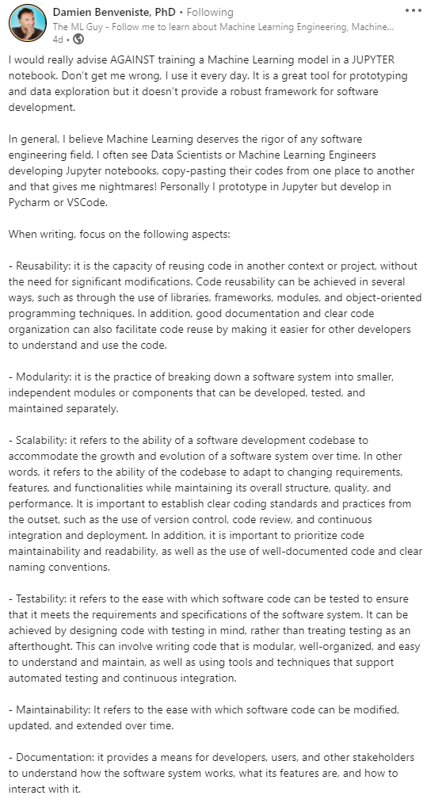
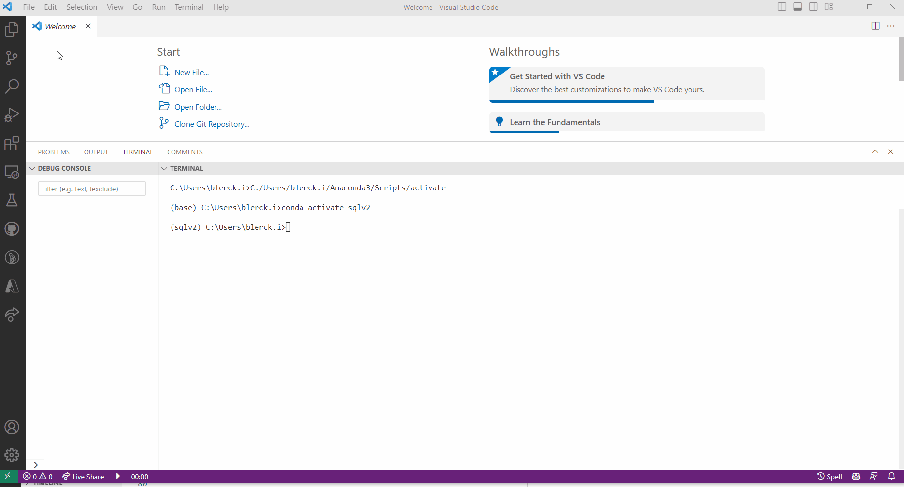
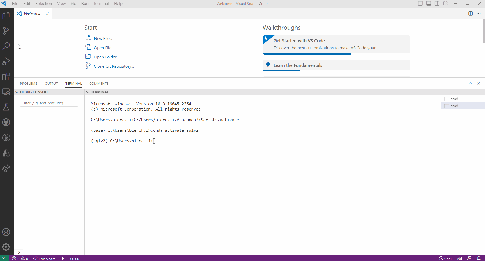
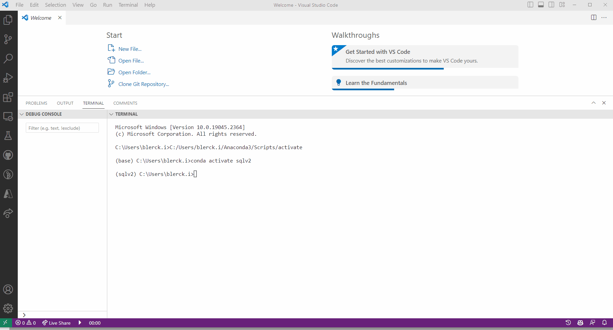

## MLOps: Production-Level code with Python

### Chapter overview

I. Virtual environments & Package management with Python <br>
II. __Production-Level code with Python__ <br>
III. Documentation for Python <br>
IV Testing with Python <br>
V. Continuous Integration with Python <br> 
VI. Deployment with Python <br>

### 1. Introduction

In this chapter, you will learn to write production-level code with Python. Until now, you have mostly written your Python code in a Jupyter notebook in either Anaconda or Google Colaboratory. From this block onwards, we will increasingly start incorporating Python scripts (i.e., files with .py extension) and an [Integrated Development Environment (IDE)](https://www.codecademy.com/article/what-is-an-ide) into our workflow. So, why would you want to switch from Jupyter notebooks to scripts? Notebooks are helpful when you perform an EDA or another small coding experiment, but when it comes to developing production-ready ML products, they present a couple of serious drawbacks compared to simple Python scripts. 


*Figure 1. Production code meme.*

:bell: 'Production-level' refers to code /that is designed to be implemented in practical, real-world scenarios such as applications, systems, or products. It involves optimizing the code for factors such as performance, reliability, scalability, and maintainability to ensure its suitability for deployment.

__After this chapter, you will be able to:__

- [ ] Describe the process of code formatting/linting with Python
- [ ] Understand the purpose, benefits and best practices of modular code
- [ ] Apply code formatting/linting techniques to a Python script using commonly used tools, such as Isort, Black and Flake8

:warning: When you work with Python scripts, installing an IDE is highly recommended. There are numerous (free) suitable IDEs available. For example:

- [PyCharm](https://www.jetbrains.com/pycharm/) 
- [VSCode](https://code.visualstudio.com/) (Recommended)
- [DataSpell](https://www.jetbrains.com/dataspell/) 
- [Spyder](https://www.spyder-ide.org/) 

***

Before we get started consider this LinkedIn [post](https://www.linkedin.com/posts/damienbenveniste_machinelearning-datascience-artificialintelligence-activity-7053751718106259456-VHuX?utm_source=share&utm_medium=member_android) from Damien Benveniste an expert in building large scale end to end Machine Learning capabilities and deploying them in production.



We will explore some of these concepts in the coming sections and modules.

### 2. Functions and Modular Code

Writing modular code has numerous benefits, such as improved readability, maintainability, and reusability. Let's dive into some examples using the MNIST dataset to showcase the differences between bad and good practices.

👎 **Bad Practice:**

Here's an example of non-modular code that trains a simple neural network on the MNIST dataset:

```python
import tensorflow as tf
from tensorflow.keras import layers, models

# Load and preprocess the data
mnist = tf.keras.datasets.mnist
(x_train, y_train), (x_test, y_test) = mnist.load_data()
x_train, x_test = x_train / 255.0, x_test / 255.0

# Build the model
model = models.Sequential()
model.add(layers.Flatten(input_shape=(28, 28)))
model.add(layers.Dense(128, activation='relu'))
model.add(layers.Dropout(0.2))
model.add(layers.Dense(10, activation='softmax'))

# Compile the model
model.compile(optimizer='adam', loss='sparse_categorical_crossentropy', metrics=['accuracy'])

# Train the model
model.fit(x_train, y_train, epochs=5, validation_split=0.2)

# Evaluate the model
test_loss, test_acc = model.evaluate(x_test, y_test)
print(f'Test accuracy: {test_acc}')
```

This code is not modular, as it combines data loading, preprocessing, model building, and training all into a single script without any separation. It iss easier and faster to write code like this when doing quick proof of concepts, but it quickly becomes unmanageable in larger projects that need to be deployed to production and maintained by more than one person.

👍 **Good Practice:**

Now, let's refactor the code into a more modular form (what it means to refactor and how to do it is covered in the next section):

```python
# utils.py
def load_mnist_data():
    mnist = tf.keras.datasets.mnist
    (x_train, y_train), (x_test, y_test) = mnist.load_data()
    return (x_train, y_train), (x_test, y_test)

def preprocess_data(x_train, x_test):
    x_train, x_test = x_train / 255.0, x_test / 255.0
    return x_train, x_test

# models.py
def build_mnist_model():
    model = models.Sequential()
    model.add(layers.Flatten(input_shape=(28, 28)))
    model.add(layers.Dense(128, activation='relu'))
    model.add(layers.Dropout(0.2))
    model.add(layers.Dense(10, activation='softmax'))
    return model

def compile_model(model):
    model.compile(optimizer='adam', loss='sparse_categorical_crossentropy', metrics=['accuracy'])
    return model

def train_model(model, x_train, y_train, epochs=5, validation_split=0.2):
    model.fit(x_train, y_train, epochs=epochs, validation_split=validation_split)
    return model

def evaluate_model(model, x_test, y_test):
    test_loss, test_acc = model.evaluate(x_test, y_test)
    return test_loss, test_acc

# main.py
from utils import load_mnist_data, preprocess_data
from models import build_mnist_model, compile_model, train_model, evaluate_model

def main():
    (x_train, y_train), (x_test, y_test) = load_mnist_data()
    x_train, x_test = preprocess_data(x_train, x_test)

    model = build_mnist_model()
    model = compile_model(model)
    model = train_model(model, x_train, y_train)

    test_loss, test_acc = evaluate_model(model, x_test, y_test)
    print(f'Test accuracy: {test_acc}')

if __name__ == "__main__":
    main()
```

Here, we've separated the code into different functions and modules, making it more modular. The single python script or notebook in the first example has been split into three modules (```utils.py```, ```models.py```, ```main.py```), each containing their own functions.

🌟 **Benefits of Modular Code:**

1. **Readability**: By breaking the code into smaller functions and modules, it becomes easier to read and understand. Each function has a specific purpose, making it clear what each part of the code does.

2. **Maintainability**: Modular code is easier to maintain, as changes in one function or module are less likely to impact others. When you need to modify a part of the code, it's much easier to locate the relevant function or module.

3. **Reusability**: Functions and modules can be reused in other parts of the code or even in other projects. For example, the `load_mnist_data()` and `preprocess_data()` functions can be reused in another project that also works with the MNIST dataset.

4. **Testing**: Writing modular code makes it simpler to test individual functions or modules. In our good practice example, we can now easily test functions like `load_mnist_data()`, `preprocess_data()`, or `build_mnist_model()` without having to run the entire script.

5. **Collaboration**: Modular code is more collaborative-friendly, as multiple developers can work on different functions or modules without causing conflicts or confusion.

Writing modular code using functions and modules enhances readability, maintainability, and reusability. It also simplifies testing and collaboration, making your code more robust and efficient in the long run. By refactoring the MNIST example into a more modular form, we've demonstrated how to apply good practices to improve the overall quality of the code.

When writing modular code we make extensive use of functions, here are some best practices to think about when writing functions:

1. **Give your functions a clear purpose**: Write functions that do one thing and do it well. This makes them easier to understand, test, and reuse. This is the golden rule when writing functions.

2. **Use descriptive function names**: Choose function names that describe what the function does, making it easier for others (and your future self) to understand your code.

3. **Keep functions short and focused**: Shorter functions are easier to understand and maintain. If a function becomes too long or complex, consider breaking it into smaller functions.

4. **Use function arguments and return values**: Instead of relying on global variables, pass input data as arguments and return the results. This makes your functions more flexible and easier to test.

6. **Follow the DRY principle**: Don't repeat yourself. If you find yourself writing similar code in multiple places, refactor it into a separate function.

5. **Write docstrings**: Add docstrings to your functions to explain what they do, the parameters they take, and the values they return. This makes your code more maintainable and easier for others to understand. (docstrings will be covered in a later learning module.)

7. **Use type hints**: Add type hints to your functions for better readability and to catch potential bugs early. (Type hints will be covered in a later learning module.)

8. **Adhere to a consistent coding style**: Following a consistent coding style, such as PEP 8, makes your code more readable and maintainable.

9. **Handle exceptions gracefully**: Use try-except blocks to catch and handle exceptions, making your functions more robust and less prone to crashes. (Exception handling will be covered in a later learning module.)

10. **Write unit tests**: Write tests for your functions to ensure they work as expected and to catch bugs before they become critical issues. (Unit tests will be covered in a later learning module.)

### 3. Refactoring 

Code refactoring refers to the process of restructuring existing computer code *without changing its external behavior* to ensure that the code is clean before you ship it to production. Please watch this video to learn more about code refactoring:

<!-- blank line -->
<figure class="video_container">
<iframe width="560" height="315" src="https://www.youtube.com/embed/D4auWwMsEnY" title="YouTube video player" frameborder="0" allow="accelerometer; autoplay; clipboard-write; encrypted-media; gyroscope; picture-in-picture; web-share" allowfullscreen></iframe>
</figure>
<!-- blank line -->

You learned about the concept of technical debt, refactoring is intended to reduce this debt by improving the design, structure, and/or implementation of the existing code to make it more readable and easier to understand. Refactoring is a key part of the software development process, and it is often done in conjunction with code review.

:bell: Code review is a process in which one or more people check a piece of code for errors before it is integrated into the codebase. It is a critical step in the software development process, as it helps to ensure that the code is of high quality and meets the requirements of the project.

__Why refactor code?__

- __Improve code readability:__ Refactoring code can make it easier to understand and maintain. This is especially important when you work on a project with multiple people.
- __Improve code quality:__ Refactoring code can help you to identify and fix bugs, and improve the overall quality of your code.
- __Improve code performance:__ Refactoring code can help you to improve the performance of your code. For example, you can refactor code to reduce the number of lines of code, which can improve the performance of your code.

__When to refactor code?__

- __When you add a new feature:__ When you add a new feature to your code, you should refactor your code to make it easier to understand and maintain.
- __When you fix a bug:__ When you fix a bug in your code, you should refactor your code to make it easier to understand and maintain.
- __When you want to improve the performance of your code:__ When you want to improve the performance of your code, you should refactor your code to make it easier to understand and maintain.

__How to refactor code?__

- __Refactor code manually:__ You can refactor code manually by changing the code yourself. This is the most common way to refactor code.
- __Use an automated refactoring tool:__ You can also use an automated refactoring tool to refactor code. For example, you can use an automated refactoring tool is VS Code [clicky](https://code.visualstudio.com/docs/editor/refactoring).

:warning: Refactoring existing code is a time-consuming process. Therefore, it is important to make sure that you have a good understanding of the code before you start refactoring it.

Here's an example of a piece of code that needs to be refactored:

```python

path = 'https://raw.githubusercontent.com/dataprofessor/data/master/delaney_solubility_with_descriptors.csv'
data = pd.read_csv(path)
data = data.drop(['Name'], axis=1)
data.head()

```

The code above is not very readable. It is difficult to understand what the code does. Therefore, we should refactor the code to make it easier to understand. Here's the refactored code:

```python

def get_data(path, cols_to_drop):
    # Get data from the web
    data = pd.read_csv(path)
    # Drop columns
    data = data.drop(cols_to_drop, axis=1)
    # Return data
    return data

PATH = 'https://raw.githubusercontent.com/dataprofessor/data/master/delaney_solubility_with_descriptors.csv'
cols_to_drop = ['Name']
df = get_data(PATH, cols_to_drop)

```

The refactored code is much easier to understand. It is also easier to maintain and debug. For example, if we need to change the URL of the data, we only need to change the URL in the global variable `PATH` function. We do not need to change the URL in multiple places in the code. Further, if we need to drop more columns, we only need to add the column names to the list `cols_to_drop` in the function `get_data()`. We do not need to change the code in multiple places in the code.

:bell: Global variables are variables that are defined outside of a function. They can be accessed by any function in the program. In the example above, the global variable `PATH` is defined outside of the function `get_data()`. Therefore, the function `get_data()` can access the global variable `PATH`.

:bell: On the other hand, a local variable is a variable that is defined inside a function. It can only be accessed by the function in which it is defined. In the example above, the local variable `path` is defined inside the function `get_data()`. Therefore, the function `get_data()` can access the local variable `path`, but other functions cannot access the local variable `path`.

:book: By convention, global variables are written in all capital letters. For example, the global variable `PATH` is written in all capital letters. Whereas, local variables are written in lowercase letters. For example, the local variable `path` is written in lowercase letters.

To learn more about code refactoring, check out the following resources:


- [Free Code Camp](https://www.freecodecamp.org/news/best-practices-for-refactoring-code/)
- [Video Tutorials](https://www.youtube.com/watch?v=q9Hp0Mo7dEA&list=PLTgRMOcmRb3NARHkkwYePP4ROXPyBJMhj)

> Focussing on writing clean code is a good habit to get into. It will make your code easier to understand and maintain. It will also make your code easier to debug. However, it takes a minimal of 2-3 years of experience to become a good programmer. Therefore, do not be too hard on yourself if you are not a good programmer yet. Just keep practicing and you will get there :muscle:.

:pencil: __3a__ Refactor the ```numbers.py``` script you created last time into modules and a ```main.py``` script. Make use use the best practices for functions that you have learned.


### 4. Linters & Code formatters 

Who does not have one or more 'Untitled' Jupyter Notebook on your computer? I think most of us are guilty of this offense :sweat_smile:. These notebooks are often the result of a quick experiment or a small coding exercise. However, when you want to write production-level code, you want to make sure that your code is readable, consistent, and well-documented. For most of us this is difficult to achieve without the help of tools. Luckily, there are tools that can help you to write better code, called linters and code formatters.


*Figure 2. 'Untitled' notebook meme.*

In this section, we will cover three commonly used tools: [Isort](https://pycqa.github.io/isort/), [Black](https://black.readthedocs.io/en/stable/), and [Flake8](https://flake8.pycqa.org/en/latest/). Isort automatically sorts and organizes Python imports, Black automatically formats code based on a style guide called [PEP8](https://peps.python.org/pep-0008/) (Sounds familiar, right? ...), and Flake8, a linter, checks for issues with code style, syntax, and logic. The latter, works together with Black to ensure that your code looks and works as it should.

:pencil: __4a__ Use Poetry to install the packages Isort, Black and Flake8 in the ```numbers-env``` environment that you created last time. Use the following command:

```bash
poetry add <package_name>
```

:pencil: __4b__ Use Isort to sort the imports in your ```numbers.py``` script.

For example, if you want to run a package with Poetry on your ```numbers.py``` script, you can use the following command:

```bash
poetry run <package_name> numbers.py
```

:pencil: __4c__ Use Flake8 to check the formatting of your ```numbers.py``` script. If there are any formatting errors, use Black to automatically fix them.

:pencil: __4d__ What errors did Flake8 find in your ```numbers.py``` script? How did Black fix them? Write your answer down. 

:pencil: __4e__ Repeat the steps above for all the modules and scripts in your package.  

***

:warning: To enable Isort, Black and Flake8 in your IDE, you have to change some settings. For example, in VSCode, you have to go to 'File', then 'Preferences', and 'Settings':

- __Isort:__



- __Black:__



- __Flake8:__



### 5. Blended learning

There are many online resources available on the topic of production-level code with Python. Please, check the following resources:

__Courses:__

- [Software Engineering for Data Scientists in Python](https://app.datacamp.com/learn/courses/software-engineering-for-data-scientists-in-python)
- [Developing Python Packages](https://app.datacamp.com/learn/courses/developing-python-packages)

__Videos:__

- [Code Reviewing in Python](https://www.youtube.com/watch?v=1CKNMgG7D64&list=PLnK6m_JBRVNqskWiXLxx1QRDDng9O8Fsf)

__Books/articles/webpages etc.:__

- [5 Reasons why you should Switch from Jupyter Notebook to Scripts](https://towardsdatascience.com/5-reasons-why-you-should-switch-from-jupyter-notebook-to-scripts-cb3535ba9c95by)
- [Data scientists, the only useful code is production code](https://thuijskens.github.io/2018/11/13/useful-code-is-production-code/) 

***
