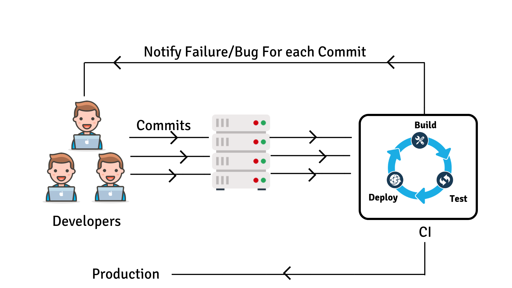

## MLOps: Continuous Integration with Python 

### 1. Introduction

This module will help you acquire knowledge of Continuous Integration with Python by guiding you towards online resources. In addition, it will give you tips on how you can apply your newly gained knowledge to the creative brief.

__After this module, you will be able to:__

- [ ] Acquire knowledge of Continuous Integration with Python by completing the exercises and consulting online resources
- [ ] Apply knowledge of Continuous Integration with Python to the creative brief

*Figure 1. Testing with Python.*

***

### 2. Pre-commit

### Add material by Irene 

***

### 3. Blended learning

There are many online resources available on the topic of Continuous Integration with Python. Please, check the following resources:

***
