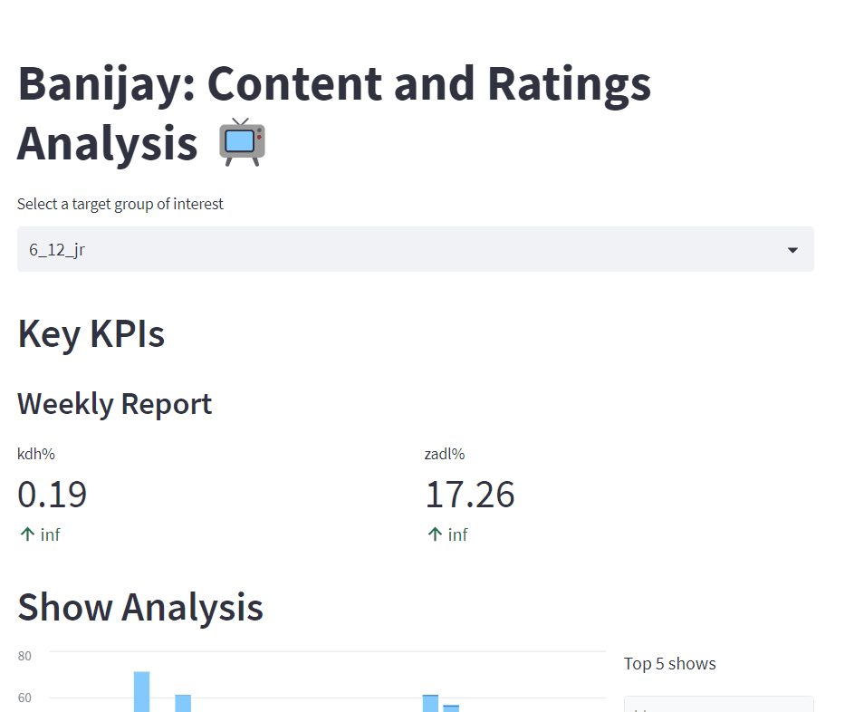

## MLOps: Deployment with Python

### 1. Introduction

This module will help you acquire knowledge of deployment with Python by guiding you towards online resources. In addition, it will give you tips on how you can apply your newly gained knowledge to the creative brief.

__After this module, you will be able to:__

- [ ] Acquire knowledge of deployment with Python by completing the exercises and consulting online resources
- [ ] Apply knowledge of deployment with Python to the creative brief

***

### 2. Command line interface

### Add material by Irene 

***

### 3. Streamlit

```Streamlit``` is an open-source Python library that makes it easy to create and share beautiful, custom web apps for machine learning and data science. It is a great tool for data scientists and machine learning engineers to create web applications for their models. Please watch this video to learn more about ```Streamlit```:

<!-- blank line -->
<figure class="video_container">
<iframe width="560" height="315" src="https://www.youtube.com/embed/7yFh9dBtSko" title="YouTube video player" frameborder="0" allow="accelerometer; autoplay; clipboard-write; encrypted-media; gyroscope; picture-in-picture; web-share" allowfullscreen></iframe>
</figure>
<!-- blank line -->

I personally find it to be an excellent tool to create data apps to deploy jupyter notebooks, especially to convince and engage stakeholders. In Block B for example, I developed a prototype app to demonstrate to Banijay the value gained by combining multiple sources of data. Thinking along these lines, we would like to see you use such tools to engage the client and demonstrate the value of your work.



Using ```Streamlit``` to develop data apps is very easy and requires no knowledge of HTML or CSS. You can create a web app in a few lines of code and can use ```Streamlit``` to create a variety of data apps ranging from dashboards to ML apps. To see some example of how you can use ```Streamlit``` to create data apps, check out the gallery here: https://streamlit.io/gallery

To learn more about ```Streamlit``` and how to use it, I recommend you to check out the following resources:

- [Streamlit official documentation](https://docs.streamlit.io/en/stable/)
- [Streamlit official knowledge base](https://docs.streamlit.io/knowledge-base)
- [Streamlit official blog](https://blog.streamlit.io/)
- [Streamlit official YouTube channel](https://www.youtube.com/@streamlitofficial)
- [Datacamp Streamlit tutorial](https://www.datacamp.com/tutorial/streamlit)

### 4. REST API

### Add material by Dean (only if you have time!). Could be a medal challenge.

***

### 5. Blended learning

There are many online resources available on the topic of deployment with Python. Please, check the following resources:

***
