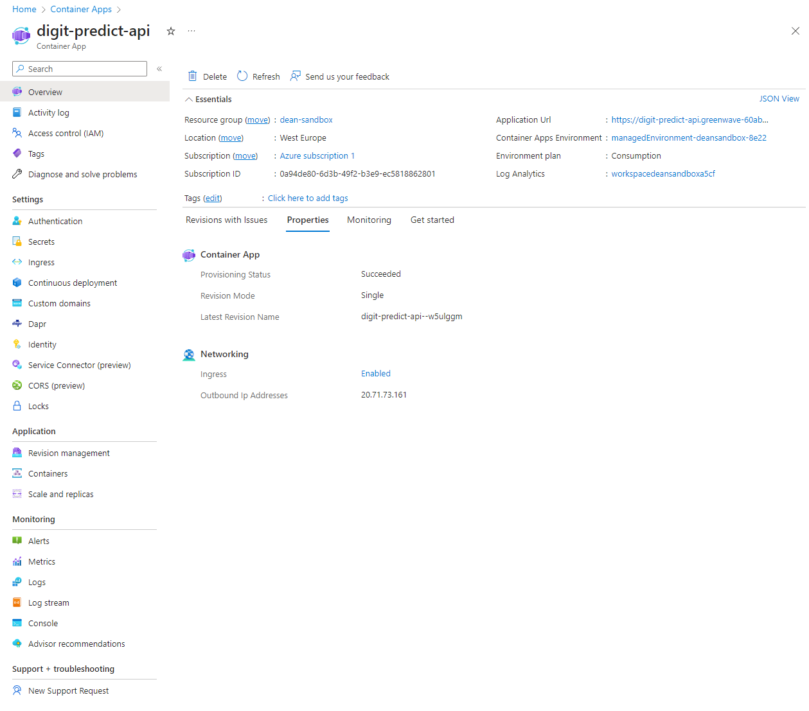

# A Beginner's Guide to Azure Container Apps

In this example, we'll deploy a model inside a container using Azure Container Apps. We'll use the same model that we trained and registered in the previous examples as well as the API that we created in the previous example on FastAPI.

We will assume that the container containing the API has already been built and tested and is hosted on docker hub. From there, we will follow these steps:

- Use the Azure GUI to create a new Azure Container App. 📦
  - Define basic settings, such as the name, resource group, and region.
  - Define the container image and port.
  - Define the ingress settings (Where the traffic will come from).
  - Create and deploy the Azure Container App.
- Test the Azure Container App. 🏗️

## Step 0: Locate the Container Image on Docker Hub 🐋

Navigate to the [Docker Hub](https://hub.docker.com/) and search for the container image that you want to use. Find the image in your docker hub repository and copy the image name and tag. It should be of the form `username/image_name:tag`. We will need this information in the next steps.

## Step 1: Create the Azure Container App 📦

Navigate to the Azure Portal and create a new Azure Container App. You can find this by searching for "Container Apps" in the search bar. You should see a screen like this:

Click on the "Create" button to create a new Azure Container App. 

### Step 1.1: Basic Settings

This is where you will define the basic settings for your Azure Container App, like the name, resource group, and region.

You should see a screen like this:

Use the buas-y2 resource group and the West Europe region. For the name, use something that makes sense to you. Click on the "Next: Container Settings" button to continue.

### Step 1.2: Container Settings

This is where you will define the container image and port that your API is running on.

You should see a screen like this:

Select the Docker Hub for image source. For the image and tag, use the information that you copied from Docker Hub in Step 0. Set the resource allocation to 1 CPU and 2 GB of memory. You may need to adjust this depending on the size of your model. 

Click on the "Next: Ingress" button to continue.

### Step 1.3: Ingress Settings

This is where you will define where the traffic will come from. We want to allow traffic from the internet, so we will use the "Public" option.

You should see a screen like this:

Enable Ingress and select the "Accept traffic from anywhere" option. For the port, use 80 or the port that you used in your API (if it is not 80).

Click on the "Review + create" button to continue.

### Step 1.4: Review + Create

This is where you will review the settings that you have chosen and create the Azure Container App.

You should see a screen like this:

You should see a green checkmark at the top of the screen with a message that says "Passed". If you do not see this, go back and make sure that you have filled out all of the required fields.

Check all your settings and then click on the "Create" button to create the Azure Container App.

### Step 1.5: Wait for the Azure Container App to be Created

You will be taken to a screen that says "Your deployment is underway" or something similar. Wait for the deployment to finish. This may take a few minutes.

## Step 2: Test the Azure Container App 🏗️

Once the deployment is finished, you should see a screen like this:

Here you can find the Application URL. If you click on the URL it should take you to the root of your API, if you have defined one. You can also add `/docs` to the end of the URL to see the FastAPI Swagger UI for your API.

Finally, you can test your API by sending a POST request to the `/predict` endpoint exactly as has been done in the ACI example just using this URL. Use the same code that you used in the ACI example to send the request, just change the URL.

