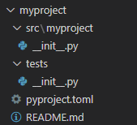
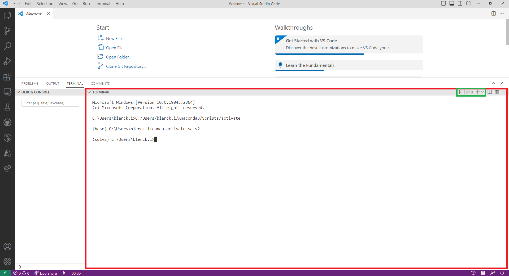

# MLOps: Virtual environments & Package management with Python

## Chapter overview

I. __Virtual environments & Package management with Python__ <br>
II. Production-Level code with Python <br>
III. Documentation for Python <br>
IV Testing with Python <br>
V. Continuous Integration with Python <br> 
VI. Deployment with Python <br>

## 1. Introduction

Hi there :sparkles: :books: :smiley:. Welcome to the first chapter of the __*MLOps with Python*__ knowledge module. In this module, you will learn about virtual environments and package management in Python. Throughout this module, you will be guided towards online resources that will help you acquire knowledge of various MLOps topics. In addition, we created some Python exercises, using the MNIST dataset, for you to practice your newly gained knowledge; you will build your first Python package! After completing the chapter, you should be able to apply your knowledge to the Creative Brief. Let us get started :rocket:!

__After this chapter, you will be able to:__

- [ ] Define the terms 'virtual environment', 'package management' and 'technical debt' in machine learning
- [ ] Describe the relative importance of ML code in a real-world ML system
- [ ] Explain the benefits of using virtual environments and package management in Python
- [ ] Create a virtual environment in Python 
- [ ] Install Python packages in a virtual environment using a package manager


*Figure 1. Python setup for production ready ML code.*

Using a virtual environment along with a package manager enables efficient management of dependencies and packages required for a machine learning project in a well-organized manner. For example, it will combat what we call 'technical debt' (More on this in the next section!) by making your code reproducible, which in turn will simplify the collaboration with other data professionals (Yes, you will be working in a team this block...).

***

## 2. What is technical debt?

Technical debt is a term used in software development that describes the expense of maintaining a codebase that was not created with maintainability and scalability as priorities. In machine learning, technical debt can be the result of poorly designed models, data pipelines, or infrastructure that are challenging to maintain, scale, or improve over time.


*Figure 1. Technical debt and the machine learning life-cycle.*

:bell: ML code is makes up only a small fraction of the total codebase in a real-world ML system. This means that the majority of the codebase is not ML code, but rather code that is used to manage the ML system :open_mouth: (See Figure 1.).

Technical debt can accumulate in machine learning projects that rely on outdated or poorly documented code, inefficient data pipelines, or unoptimized systems. To prevent technical debt, it is essential to adhere to software development best practices such as documenting the code, testing and validating the models, optimizing code performance, and designing the system with scalability and maintainability in mind. Refactoring and reviewing the code frequently is also necessary to identify and address technical debt before it becomes a significant problem. Virtual environments and package management in Python can be beneficial in reducing technical debt in machine learning projects by keeping track of dependencies and organizing them properly.

Want to learn more about technical debt in machine learning? Check out the following video and article:

<div style="text-align: center">
<iframe width="560" height="315" src="https://www.youtube-nocookie.com/embed/V18AsBIHlWs" title="YouTube video player" frameborder="0" allow="accelerometer; autoplay; clipboard-write; encrypted-media; gyroscope; picture-in-picture; web-share" allowfullscreen></iframe>


*Video 1. Machine Learning, Technical Debt, and You - D. Sculley (Google).*
</div>

Original scientific paper by D. Sculley et al. regarding technical debt in machine learning systems:

- [Hidden Technical Debt in Machine Learning Systems](https://proceedings.neurips.cc/paper/2015/file/86df7dcfd896fcaf2674f757a2463eba-Paper.pdf)

:pencil: __1a__ Find a GitHub ML project that you like and check out the codebase. How many lines of code are ML code? How many lines of code are not ML code? What is the ratio of ML code to non-ML code? Write your answer down.

:pencil: __1b__ Would you say that the project has a lot of technical debt? Why or why not? Write your answer down.

***

## 3. Virtual environment


> I have over two decades of professional experience as a developer, I know a wide variety of frameworks and programming languages, and one of my favorites is Python. I've been teaching it for quite some time now, and according to my experience, establishing Python environments is a challenging topic - [Gergely Szerovay](https://www.freecodecamp.org/news/why-you-need-python-environments-and-how-to-manage-them-with-conda-85f155f4353c/), Freecodecamp contributer. 

<br clear="left"/>

Creating a virtual environment in Python for your machine learning projects is essential to ensure that the dependencies and packages required for the project are isolated from the global environment. This helps avoid conflicts with other installed packages or versions of Python. By creating a virtual environment, you can ensure that your project has access to the required dependencies and packages without affecting the global Python installation. Additionally, virtual environments can be easily shared with others, making it easier to collaborate on projects. Overall, using a virtual environment in Python for your machine learning projects is a best practice that helps maintain a clean and organized development environment.

<div style="text-align: center">


*Figure 1. Python virtual environments. Image from [Data Quest](https://www.dataquest.io/blog/a-complete-guide-to-python-virtual-environments/) *
</div>


Let us take a look at how to create a virtual environment in Python using [Conda](https://docs.conda.io/projects/conda/en/latest/user-guide/tasks/manage-environments.html).

__Step 1: Install Conda__

If you have not installed Conda yet, you can download it from the official [Anaconda](https://www.anaconda.com/products/individual) website.

__Step 2: Create a virtual environment__

Open up your terminal or command prompt and type the following command to create a new virtual environment:

```bash
conda create --name myenv
```
This command creates a new virtual environment called 'myenv'. You can replace 'myenv' with any name you like.

__Step 3: Activate the virtual environment__

To start using the virtual environment, you need to activate it. Type the following command to activate the 'myenv' environment:

```bash
conda activate myenv
```
__Step 4: Install packages in the virtual environment__

With the virtual environment activated, you can install any packages you need. For example, to install the popular data science package pandas, you can use the following command:

```bash
conda install pandas
```
This will install Pandas and any dependencies it needs in the 'myenv' environment.

__Step 5: Deactivate the virtual environment__

To exit the virtual environment and return to your regular environment, type the following command:

```bash
conda deactivate
```

That is it! You have successfully set up a virtual environment for Python using Conda.

<div style="padding: 15px; border: 1px solid transparent; border-color: transparent; margin-bottom: 20px; border-radius: 4px; color: #8a6d3b;; background-color: #fcf8e3; border-color: #faebcc;">
Note: The manual installation of CUDA and CuDNN, which are essential for accelerating compute-intensive applications like deep learning (e.g., GPU-enabled Tensorflow), can be a difficult and error-prone task to perform at the system-wide level. However, Conda's 'cudatoolkit' can make this process much simpler as it manages the installation and administration of these dependencies on your device.
</div>

In addition to Conda, there are several other tools available for managing Python environments. Below you can find some of the most widely used ones:

- [Virtualenv](https://pypi.org/project/virtualenv/): This is a tool for creating isolated Python environments. It can be used to manage different versions of Python and Python packages. It is lightweight and simple to use.
- [Pyenv](https://pypi.org/project/pyenv/): This is a tool for managing multiple versions of Python on a single machine. It can be used to install and switch between different versions of Python, and to create virtual environments. Pyenv is often used in combination with with Poetry, where Poetry is used to manage dependencies and Pyenv is used to manage Python versions. Poetry will be covered in the next section.
- [Venv](https://pypi.org/project/venv/): This is a module included in Python's standard library that can be used to create virtual environments. It is similar to Virtualenv, but with some added functionality.
- [Pipenv](https://pypi.org/project/pipenv/): This is a tool that combines virtual environment creation with package management. It creates a virtual environment for each project and manages package dependencies using a Pipfile.
- [Docker](https://hub.docker.com/): This is a tool for creating lightweight, portable containers that can be used to package applications and their dependencies. It can be used to create isolated environments for Python applications. We will learn more about Docker later in this course.

Each of these alternatives has its own strengths and weaknesses, so it is important to evaluate each one based on your specific needs and requirements.

:pencil: __3__ Use a virtual environment manager such as Pyenv, Venv, Conda, or Pipenv to create a new virtual environment called ```numbers-env```. Make sure it is using Python 3.9. In the next exercise, we will install the required packages in this environment using Poetry as our package manager.

***

## 4. Package management

[Poetry](https://python-poetry.org/) is a Python package manager that aims to provide a simple and efficient way to manage dependencies in your Python projects. It allows you to define your project's dependencies in a [```pyproject.toml```](https://betterprogramming.pub/a-pyproject-toml-developers-cheat-sheet-5782801fb3ed) file, which is more user-friendly and more configurable than the traditional [```requirements.txt```](https://learnpython.com/blog/python-requirements-file/) file. With Poetry, you can easily install, update, and remove dependencies, as well as create virtual environments for your projects. You can also specify both runtime and development dependencies, which makes it easy to separate dependencies that are needed for running your code from those that are only needed for development. 

Some of the key features of Poetry include:

- __Dependency management:__ Poetry allows you to define dependencies and their versions in a single file. It also resolves dependencies and ensures that they are compatible with each other.
- Virtual environments: Poetry automatically creates and manages virtual environments for your projects, which helps to keep your dependencies isolated from each other.
- __Packaging:__ Poetry can package your project as a Python wheel or source distribution, which makes it easy to distribute and install your project on other systems. It also allows you to publish your project to PyPI.
- Plugin system: Poetry has a plugin system that allows you to extend its functionality. For example, there are plugins for integrating Poetry with other tools like Pytest or Black.
- Cross-platform: Poetry is available for Windows, macOS, and Linux.

Overall, Poetry simplifies the process of managing dependencies in your Python projects, making it easier to share and distribute your code.

Watch the following video to learn more about Poetry:

<div style="text-align:center">
<iframe width="560" height="315" src="https://www.youtube.com/embed/0f3moPe_bhk" title="YouTube video player" frameborder="0" allow="accelerometer; autoplay; clipboard-write; encrypted-media; gyroscope; picture-in-picture; web-share" allowfullscreen></iframe>
</div>

### Using Poetry

You can find a list of all the available commands in the [Poetry documentation](https://python-poetry.org/docs/basic-usage/). Here are some of the most commonly used commands:

```tip
Before you start:
It is recommended to create a virtual environment inside your project directory. This way, you can easily delete the project and all of its dependencies later on. To do this, use the following command:


- poetry config virtualenvs.in-project true


This command sets the virtualenvs.in-project configuration to true, telling Poetry to create the virtual environment as a .venv directory within the project root for all your projects. Now, when you create a new project using poetry new, the virtual environment will be placed in the project root by default when you run poetry install.
```

- #### Creating a new Project:

To create a new project with a src folder and a pyproject.toml file, use the following command:

```bash
poetry new <project_name> --src
```
Replace <project_name> with your desired project name. This command will generate a new directory with the given name, containing a basic project structure with the necessary files and directories.

e.g. ```poetry new myproject --src``` will create a new directory named ```myproject``` with the following structure:

<div style="text-align:center">

</div>

- #### Initializing a Project:

To initialize an existing project with a pyproject.toml file, use the following command:

```bash
poetry init
```

This command is used to initialize an existing project with a pyproject.toml file. It will ask you a series of questions about your project, such as the name, version, description, author, and license. You can also specify the dependencies for your project in this file. It is an easy way to update and existing project with a pyproject.toml file, so that you can use Poetry to manage your dependencies.


- #### Adding Packages:

To add a package to your project and automatically update the pyproject.toml file, use the following command:

```bash
poetry add <package_name>
```

e.g. ```poetry add pandas``` or ```poetry add pandas==1.2.3``` (to install a specific version)

To add a package as a development dependency, use the following command:

```bash
poetry add <package_name> --dev
```

e.g. ```poetry add pytest --dev```

Development dependencies are not installed by default when you install your project. They are only installed when you run the ```poetry install``` command with the ```--dev``` flag. The reason for splitting dependencies into runtime and development dependencies is that you may not need all of them when you are running your code in production. For example, you may need a package like pytest to run your tests, but you do not need it when you are running your code in production.  

- #### Removing Packages:

```bash
poetry remove <package_name>
```
e.g. ```poetry remove pandas```

- ### Installing Dependencies:

To install the dependencies specified in your project's pyproject.toml file, use the following command:

```bash
poetry install
```
This command reads the pyproject.toml file and installs the specified dependencies in the project's virtual environment. If a poetry.lock file is present, Poetry will use the locked versions of the packages.

To install both runtime and development dependencies, use the following command:

```bash
poetry install --dev
```

- #### Updating Dependencies:

To update your project's dependencies to their latest compatible versions, use the following command:

```bash
poetry update
```

This command checks for newer versions of the packages listed in your pyproject.toml file and updates them accordingly. It will also update your ```poetry.lock``` file to maintain dependency consistency.

- Creating a Virtual Environment:

Create a new virtual environment for your project to isolate dependencies using the following command:

```bash
poetry shell
```

This command creates and activates a new virtual environment for your project. Any packages installed while the virtual environment is active will be installed within this environment.

To deactivate the virtual environment, use the ```exit``` command.

- #### Running a Script:

To run a script within your project's virtual environment, use the following command:

```bash
poetry run <script_name>
```
Replace <script_name> with the name of the script you want to run. This command will execute the specified script in the context of your project's virtual environment, ensuring that the correct dependencies are available.


:pencil: __4a__ Activate the ```numbers-env``` virtual environment and install the package Poetry. 

Here is a quick guide on how to install Poetry on a Windows machine:

__Step 1: Open the command prompt on your Windows machine__

You can do this by pressing the Windows key and typing 'cmd' into the search bar, then selecting 'Command Prompt' from the search results. You can also use the terminal in your IDE:



*Figure 2. Terminal in VSCode.*

__Step 2: Install Poetry using the following command:__

```bash
curl -sSL https://raw.githubusercontent.com/python-poetry/poetry/master/get-poetry.py | python -
```
If you do not have curl installed, you can download the script manually from this link: https://raw.githubusercontent.com/python-poetry/poetry/master/get-poetry.py and save it to your local machine.

Once the installation is complete, close the Command Prompt and open it again. This will refresh your environment variables.

__Step 3: Verify that Poetry is installed correctly by typing the following command:__

```bash
poetry --version
```

If the installation was successful, this should display the version number of Poetry.

That is it! You now have Poetry installed on your Windows machine.

:pencil: __4b__ Then, use Poetry to install the following packages:

- [ ] ```pandas```
- [ ] ```numpy```
- [ ] ```matplotlib```
- [ ] ```seaborn```
- [ ] ```sklearn```
- [ ] ```tensorflow==2.10.1```


:pencil: __4c__ Import the necessary packages in your ```numbers.py``` script and conduct a basic exploratory data analysis on the MNIST dataset. 

:pencil: __4d__ Train a CNN classification model on the dataset, and evaluate its performance.

***

## 5. Blended learning

There are many online resources available on the topic of virtual environments and package management in Python. Please, check the following resources:

__Videos:__

- [How to Create and Use Virtual Environments in Python With Poetry](https://www.youtube.com/watch?v=0f3moPe_bhk)
- [Visual Studio Code (Windows) - Setting up a Python Development Environment and Complete Overview](https://www.youtube.com/watch?v=-nh9rCzPJ20)

__Books/articles/webpages etc.:__

- [Python Virtual Environments: A Primer](https://realpython.com/python-virtual-environments-a-primer/)

***
