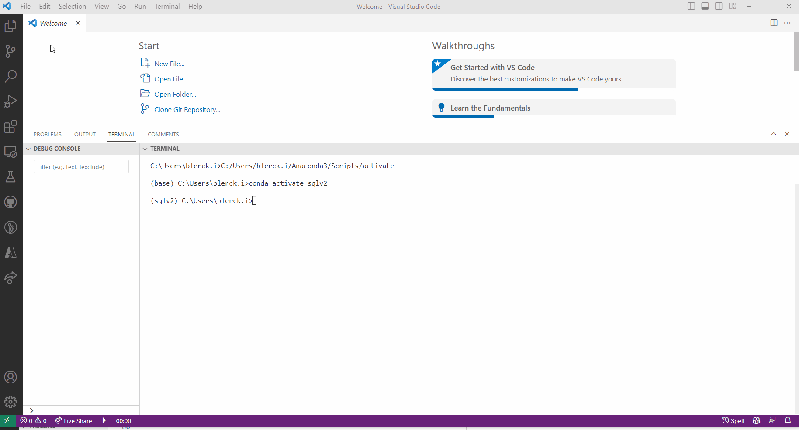
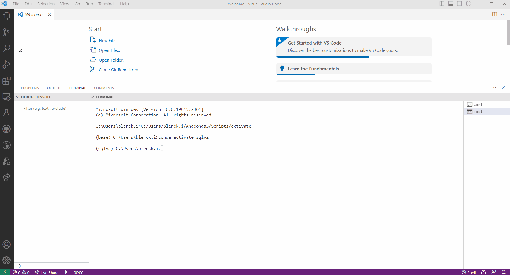
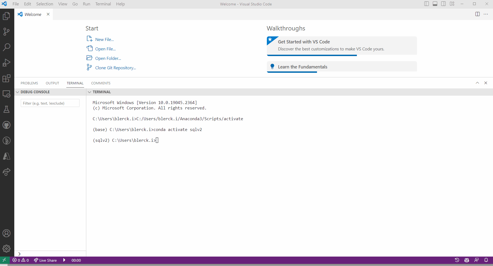

## MLOps: Production-Level code with Python

### Chapter overview

I. Virtual environments & Package management with Python <br>
II. __Production-Level code with Python__ <br>
III. Documentation for Python <br>
IV Testing with Python <br>
V. Continuous Integration with Python <br> 
VI. Deployment with Python <br>

### 1. Introduction

In this chapter, you will learn to write production-level code with Python. Until now, you have mostly written your Python code in a Jupyter notebook in either Anaconda or Google Colaboratory. From this block onwards, we will increasingly start incorporating Python scripts (i.e., files with .py extension) and an [Integrated Development Environment (IDE)](https://www.codecademy.com/article/what-is-an-ide) into our workflow. So, why would you want to switch from Jupyter notebooks to scripts? Notebooks are helpful when you perform an EDA or another small coding experiment, but when it comes to developing production-ready ML products, they present a couple of serious drawbacks compared to simple Python scripts. 


*Figure 1. Production code meme.*

:bell: 'Production-level' refers to code that is designed to be implemented in practical, real-world scenarios such as applications, systems, or products. It involves optimizing the code for factors such as performance, reliability, scalability, and maintainability to ensure its suitability for deployment.

__After this chapter, you will be able to:__

- [ ] Describe the process of code formatting/linting with Python
- [ ] Apply code formatting/linting techniques to a Python script using commonly used tools, such as Isort, Black and Flake8

:warning: When you work with Python scripts, installing an IDE is highly recommended. There are numerous (free) suitable IDEs available. For example:

- [PyCharm](https://www.jetbrains.com/pycharm/) 
- [VSCode](https://code.visualstudio.com/) (Recommended)
- [DataSpell](https://www.jetbrains.com/dataspell/) 
- [Spyder](https://www.spyder-ide.org/) 

***

### 2. Refactoring 

Code refactoring refers to the process of restructuring existing computer code *without changing its external behavior* to ensure that the code is clean before you ship it to production. Please watch this video to learn more about code refactoring:

<!-- blank line -->
<figure class="video_container">
<iframe width="560" height="315" src="https://www.youtube.com/embed/D4auWwMsEnY" title="YouTube video player" frameborder="0" allow="accelerometer; autoplay; clipboard-write; encrypted-media; gyroscope; picture-in-picture; web-share" allowfullscreen></iframe>
</figure>
<!-- blank line -->

You learned about the concept of technical debt, refactoring is intended to reduce this debt by improving the design, structure, and/or implementation of the existing code to make it more readable and easier to understand. Refactoring is a key part of the software development process, and it is often done in conjunction with code review.

:bell: Code review is a process in which one or more people check a piece of code for errors before it is integrated into the codebase. It is a critical step in the software development process, as it helps to ensure that the code is of high quality and meets the requirements of the project.

__Why refactor code?__

- __Improve code readability:__ Refactoring code can make it easier to understand and maintain. This is especially important when you work on a project with multiple people.
- __Improve code quality:__ Refactoring code can help you to identify and fix bugs, and improve the overall quality of your code.
- __Improve code performance:__ Refactoring code can help you to improve the performance of your code. For example, you can refactor code to reduce the number of lines of code, which can improve the performance of your code.

__When to refactor code?__

- __When you add a new feature:__ When you add a new feature to your code, you should refactor your code to make it easier to understand and maintain.
- __When you fix a bug:__ When you fix a bug in your code, you should refactor your code to make it easier to understand and maintain.
- __When you want to improve the performance of your code:__ When you want to improve the performance of your code, you should refactor your code to make it easier to understand and maintain.

__How to refactor code?__

- __Refactor code manually:__ You can refactor code manually by changing the code yourself. This is the most common way to refactor code.
- __Use an automated refactoring tool:__ You can also use an automated refactoring tool to refactor code. For example, you can use an automated refactoring tool is VS Code [clicky](https://code.visualstudio.com/docs/editor/refactoring).

:warning: Refactoring existing code is a time-consuming process. Therefore, it is important to make sure that you have a good understanding of the code before you start refactoring it.

Here's an example of a piece of code that needs to be refactored:

```python

path = 'https://raw.githubusercontent.com/dataprofessor/data/master/delaney_solubility_with_descriptors.csv'
data = pd.read_csv(path)
data = data.drop(['Name'], axis=1)
data.head()

```

The code above is not very readable. It is difficult to understand what the code does. Therefore, we should refactor the code to make it easier to understand. Here's the refactored code:

```python

def get_data(path, cols_to_drop):
    # Get data from the web
    data = pd.read_csv(path)
    # Drop columns
    data = data.drop(cols_to_drop, axis=1)
    # Return data
    return data

PATH = 'https://raw.githubusercontent.com/dataprofessor/data/master/delaney_solubility_with_descriptors.csv'
cols_to_drop = ['Name']
df = get_data(PATH, cols_to_drop)

```

The refactored code is much easier to understand. It is also easier to maintain and debug. For example, if we need to change the URL of the data, we only need to change the URL in the global variable `PATH` function. We do not need to change the URL in multiple places in the code. Further, if we need to drop more columns, we only need to add the column names to the list `cols_to_drop` in the function `get_data()`. We do not need to change the code in multiple places in the code.

:bell: Global variables are variables that are defined outside of a function. They can be accessed by any function in the program. In the example above, the global variable `PATH` is defined outside of the function `get_data()`. Therefore, the function `get_data()` can access the global variable `PATH`.

:bell: On the other hand, a local variable is a variable that is defined inside a function. It can only be accessed by the function in which it is defined. In the example above, the local variable `path` is defined inside the function `get_data()`. Therefore, the function `get_data()` can access the local variable `path`, but other functions cannot access the local variable `path`.

:book: By convention, global variables are written in all capital letters. For example, the global variable `PATH` is written in all capital letters. Whereas, local variables are written in lowercase letters. For example, the local variable `path` is written in lowercase letters.

To learn more about code refactoring, check out the following resources:


- [Free Code Camp](https://www.freecodecamp.org/news/best-practices-for-refactoring-code/)
- [Video Tutorials](https://www.youtube.com/watch?v=q9Hp0Mo7dEA&list=PLTgRMOcmRb3NARHkkwYePP4ROXPyBJMhj)

> Focussing on writing clean code is a good habit to get into. It will make your code easier to understand and maintain. It will also make your code easier to debug. However, it takes a minimal of 2-3 years of experience to become a good programmer. Therefore, do not be too hard on yourself if you are not a good programmer yet. Just keep practicing and you will get there :muscle:.

:pencil: __2a__ Refactor the code in your ```titanic.py``` script'to make it modular. You can use the example above as a guide.

:bell: A modular script is a script that is divided into multiple functions. Each function performs a specific task. For example, the function `get_data()` in the example above gets the data from the web. The function `clean_data()` in the example above cleans the data. The function `split_data()` in the example above splits the data into training and test sets. The function `train_model()` in the example above trains the model. The function `evaluate_model()` in the example above evaluates the model. The function `save_model()` in the example above saves the model.

### 3. Linters & Code formatters 

Who does not have one or more 'Untitled' Jupyter Notebook on your computer? I think most of us are guilty of this offense :sweat_smile:. These notebooks are often the result of a quick experiment or a small coding exercise. However, when you want to write production-level code, you want to make sure that your code is readable, consistent, and well-documented. For most of us this is difficult to achieve without the help of tools. Luckily, there are tools that can help you to write better code, called linters and code formatters.


*Figure 2. 'Untitled' notebook meme.*

In this section, we will cover three commonly used tools: [Isort](https://pycqa.github.io/isort/), [Black](https://black.readthedocs.io/en/stable/), and [Flake8](https://flake8.pycqa.org/en/latest/). Isort automatically sorts and organizes Python imports, Black automatically formats code based on a style guide called [PEP8](https://peps.python.org/pep-0008/) (Sounds familiar, right? ...), and Flake8, a linter, checks for issues with code style, syntax, and logic. The latter, works together with Black to ensure that your code looks and works as it should.

:pencil: __3a__ Use Poetry to install the packages Isort, Black and Flake8 in the ```titanic-env``` environment. Use the following command:

```bash
poetry add [package name]
```

:warning: To enable Isort, Black and Flake8 in your IDE, you have to change some settings. For example, in VSCode, you have to go to 'File', then 'Preferences', and 'Settings':

- __Isort:__



- __Black:__



- __Flake8:__



:pencil: __3b__ Use Isort to sort the imports in your ```titanic.py``` script.

For example, if you want to run a package with Poetry on your ```titanic.py``` script, you can use the following command:

```bash
poetry run [package name] titanic.py
```

:pencil: __3c__ Use Flake8 to check the formatting of your ```titanic.py``` script. If there are any formatting errors, use Black to automatically fix them.

:pencil: __3d__ What errors did Flake8 find in your ```titanic.py``` script? How did Black fix them? Write your answer down. 

***

### 4. Blended learning

There are many online resources available on the topic of production-level code with Python. Please, check the following resources:

__Courses:__

- [Software Engineering for Data Scientists in Python](https://app.datacamp.com/learn/courses/software-engineering-for-data-scientists-in-python)
- [Developing Python Packages](https://app.datacamp.com/learn/courses/developing-python-packages)

__Videos:__

- [Code Reviewing in Python](https://www.youtube.com/watch?v=1CKNMgG7D64&list=PLnK6m_JBRVNqskWiXLxx1QRDDng9O8Fsf)

__Books/articles/webpages etc.:__

- [5 Reasons why you should Switch from Jupyter Notebook to Scripts](https://towardsdatascience.com/5-reasons-why-you-should-switch-from-jupyter-notebook-to-scripts-cb3535ba9c95by)
- [Data scientists, the only useful code is production code](https://thuijskens.github.io/2018/11/13/useful-code-is-production-code/) 

***
