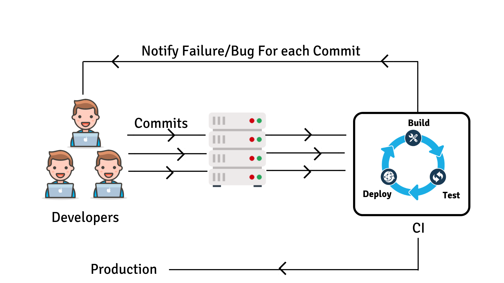

## MLOps: Continuous Integration with Python 

### Chapter overview

I. Virtual environments & Package management with Python <br>
II. Production-Level code with Python <br>
III. Documentation for Python <br>
IV Testing with Python <br>
V. __Continuous Integration with Python__ <br> 
VI. Deployment with Python <br>

### 1. Introduction

In this chapter, you will how to implement Continuous Integration (CI) in your Python project, by utilizing Pre-commit hooks. CI is a development methodology in which code changes are frequently merged into a central repository (e.g., a GitHub repository), with automated tests and builds to ensure the codebase remains functional. Pre-commit hooks are a type of [Git hook](https://www.atlassian.com/git/tutorials/git-hooks), which are scripts that automatically run based on specific events in a Git repository.

__After this chapter, you will be able to:__

- [ ] Define the concept of Continuous Integration (CI).
- [ ] Define the term 'pre-commit hook'. 
- [ ] Explain some of the benefits of Continuous Integration (CI).
- [ ] Apply Continuous Integration (CI) in your Python project by using Pre-commit hooks.


*Figure 1. Continuous Integration (CI) workflow.*

Please, watch the following video to learn more about Continuous Integration (CI):

<iframe width="560" height="315" src="https://www.youtube-nocookie.com/embed/1er2cjUq1UI" title="YouTube video player" frameborder="0" allow="accelerometer; autoplay; clipboard-write; encrypted-media; gyroscope; picture-in-picture; web-share" allowfullscreen></iframe>

*Video 1. What is Continuous Integration?.*

:pencil: __1a__ Describe the concept of Continuous Integration (CI) in your own words.

***

### 2. Pre-commit

Git hooks are scripts that are executed automatically by Git when certain events occur, such as before or after a commit, push, or merge. These scripts allow you to customize and automate your Git workflow to suit your needs. Git comes with a set of default hooks that can be found in the .git/hooks directory of your Git repository.

One type of Git hook is the pre-commit hook. A pre-commit hook is a script that runs before a commit is made to ensure that the commit meets certain criteria or standards. Pre-commit hooks can be used to perform various checks, such as running code formatting tools, linting code, checking for security vulnerabilities, or running tests.


*Figure 2. Git merge meme.*

To create pre-commit hooks for our Titanic project we will use the [pre-commit](https://pre-commit.com/) package. Let us start with setting up the pre-commit package, which among other things, allows us to check for trailing white spaces in our code before committing it to our repository.

:pencil: __2a__ Install the pre-commit package. To do so, you can use the following command:

```bash
poetry add pre-commit
```

:pencil: __2b__ Create a pre-commit configuration file in the 'titanic' folder: 

```bash
poetry run pre-commit sample-config | out-file .pre-commit-config.yaml -encoding utf8
```

:pencil: __2c__ Ensure that the checks (i.e., hooks) are run before committing your code to the repository. To do so, run the following command:

```bash
poetry run pre-commit install
```

:pencil: __2d__ Check that the pre-commit hooks are working as expected. To do so, add the Python function ```trailingspace```, which contains a trailing white space, to your ```titanic.py``` file and try to commit the changes to the repository. Some hooks fail; why? Fix the issue and try to commit the changes again. 

```python
def trailingspace():
    print("Hello World! ")
```

Manually checking code with flake8 and Black before sharing it with colleagues or pushing it to a git repository can be cumbersome. To simplify this process, we can add some additional pre-commit hooks to our configuration file :sunglasses:. 

:pencil: __2e__ Add the following code to the .pre-commit-config.yaml file:

```yaml
repos:
-   repo: https://github.com/pre-commit/pre-commit-hooks
    rev: v3.2.0
    hooks:
    -   id: trailing-whitespace
    -   id: end-of-file-fixer
    -   id: check-yaml
    -   id: check-added-large-files
-   repo: https://github.com/pre-commit/pre-commit-hooks
    rev: v3.2.0
    hooks:
    -   id: trailing-whitespace
    -   id: end-of-file-fixer
-   repo: https://github.com/pycqa/flake8
    rev: 8f9b4931b9a28896fb43edccb23016a7540f5b82
    hooks:
    -   id: flake8
```

Commit the changes to the repository and check that the pre-commit hooks are working as expected.

***

### 3. Blended learning

There are many online resources available on the topic of Continuous Integration with Python. Please, check the following resources:

__Courses:__

- [Developing Python Packages](https://app.datacamp.com/learn/courses/developing-python-packages)

__Books/articles/webpages etc.:__

- [Pre-commit hooks](https://python-poetry.org/docs/master/pre-commit-hooks/)
- [Supported hooks](https://pre-commit.com/hooks.html)

***
