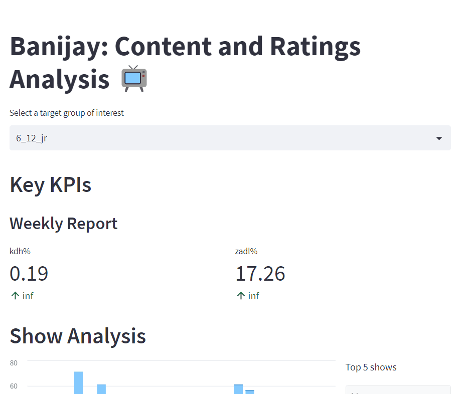

## MLOps: Deployment with Python

### 1. Introduction

In this chapter, you will learn to use the command-line interface (CLI) to interact with a Python program by typing commands into a terminal. You will also learn how to use ```Streamlit``` to create and share user-friendly, custom web apps for your project. 

__After this chapter you will be able to:__

- [ ] Acquire knowledge of deployment with Python by completing the exercises and consulting online resources
- [ ] Apply knowledge of deployment with Python to the creative brief

***

### 2. Command line interface (CLI)

A command line interface (CLI) provides a text-based interface that enables users to interact with a computer program by typing in commands instead of using a graphical user interface (GUI). With a CLI, you can perform various tasks such as data preprocessing, model training, and model evaluation efficiently. Additionally, you can use command line arguments to pass parameters to your scripts, making it easy to modify and customize your pipeline to meet specific requirements.

Python packages Argparse and Typer are two popular libraries used for building command line interfaces in Python:

- Argparse is a standard Python library for building command line interfaces. It provides a lot of functionality, including handling of command-line arguments, sub-commands, default values, and more.
- Typer is a modern CLI framework for Python that makes it easy to build complex command line interfaces. It's built on top of the Python type annotations and provides a lot of features, including support for tab completion, automatic help generation, and more.

:pencil: __2a__  Read the tutorial [Argparse for CLI Intermediate Python Tutorial part 3](https://pythonprogramming.net/argparse-cli-intermediate-python-tutorial/), and use the code snippets as a 'starter' for the exercises in this section. 

:pencil: __2b__ Open your ```titanic.py``` script, and add three command-line arguments, using the package ```argparse```:

--path: the path to the Titanic dataset file, which is required
--columns: a list of column names to select from the dataset, which defaults to a pre-defined set of columns
--filter: a filter expression to apply to the dataset, which defaults to selecting passengers over 18 years old

:pencil: __2c__ Run the script from the command line with:

```bash
python titanic.py --path titanic.csv --columns Name Sex Age --filter "Sex == 'female' and Age > 18"
```

<details><summary>Answer</summary>
<p>

```python

import argparse
import pandas as pd

parser = argparse.ArgumentParser(description='Process Titanic dataset')
parser.add_argument('--path', type=str, required=True, help='Path to Titanic dataset file')
parser.add_argument('--columns', nargs='+', default=['Survived', 'Pclass', 'Sex', 'Age', 'Fare'], help='List of column names to select')
parser.add_argument('--filter', type=str, default='Age > 18', help='Filter expression to apply to the dataset')

args = parser.parse_args()

# Load the dataset
df = pd.read_csv(args.path)

# Select the columns specified by the user
df = df[args.columns]

# Apply the filter expression specified by the user
df = df.query(args.filter)

# Print the resulting dataframe
print(df.head())

```

This would select the Name, Sex, and Age columns from the Titanic dataset, and then apply a filter to only select female passengers over 18 years old. The resulting dataframe would be printed to the console.

</p>
</details>

***

### 3. Streamlit

```Streamlit``` is an open-source Python library that makes it easy to create and share beautiful, custom web apps for machine learning and data science. It is a great tool for data scientists and machine learning engineers to create web applications for their models. Please watch this video to learn more about ```Streamlit```:

<!-- blank line -->
<figure class="video_container">
<iframe width="560" height="315" src="https://www.youtube.com/embed/7yFh9dBtSko" title="YouTube video player" frameborder="0" allow="accelerometer; autoplay; clipboard-write; encrypted-media; gyroscope; picture-in-picture; web-share" allowfullscreen></iframe>
</figure>
<!-- blank line -->

I personally find it to be an excellent tool to create data apps to deploy jupyter notebooks, especially to convince and engage stakeholders. In Block B for example, I developed a prototype app to demonstrate to Banijay the value gained by combining multiple sources of data. Thinking along these lines, we would like to see you use such tools to engage the client and demonstrate the value of your work.



Using ```Streamlit``` to develop data apps is very easy and requires no knowledge of HTML or CSS. You can create a web app in a few lines of code and can use ```Streamlit``` to create a variety of data apps ranging from dashboards to ML apps. To see some example of how you can use ```Streamlit``` to create data apps, check out the gallery here: https://streamlit.io/gallery

### 4. REST API (Optional)

REST APIs provide a way for different systems to communicate with each other and exchange data. In a machine learning context, REST APIs can be used to build applications that make predictions or provide recommendations based on trained models. For example, a REST API could be built to take in data from a user, such as an image, and then use a machine learning model to classify the image and return the results to the user. 

For more information, click [here](LINK).

<div style="padding: 15px; border: 1px solid transparent; border-color: transparent; margin-bottom: 20px; border-radius: 4px; color: #8a6d3b;; background-color: #fcf8e3; border-color: #faebcc;">
Note: You are not required to learn about REST APIs for this project! 
</div>

***

### 5. Blended learning

There are many online resources available on the topic of deployment with Python. Please, check the following resources:

__Courses:__

- [Datacamp Streamlit tutorial](https://www.datacamp.com/tutorial/streamlit)

__Videos:__

- [Streamlit official YouTube channel](https://www.youtube.com/@streamlitofficial)

__Books/articles/webpages etc.:__

- [Streamlit official documentation](https://docs.streamlit.io/en/stable/)
- [Streamlit official knowledge base](https://docs.streamlit.io/knowledge-base)
- [Streamlit official blog](https://blog.streamlit.io/)
- [Build Command-Line Interfaces With Python's argparse](https://realpython.com/command-line-interfaces-python-argparse/)
- [FastAPI Tutorial: An Introduction to Using FastAPI](https://www.datacamp.com/tutorial/introduction-fastapi-tutorial)


***
