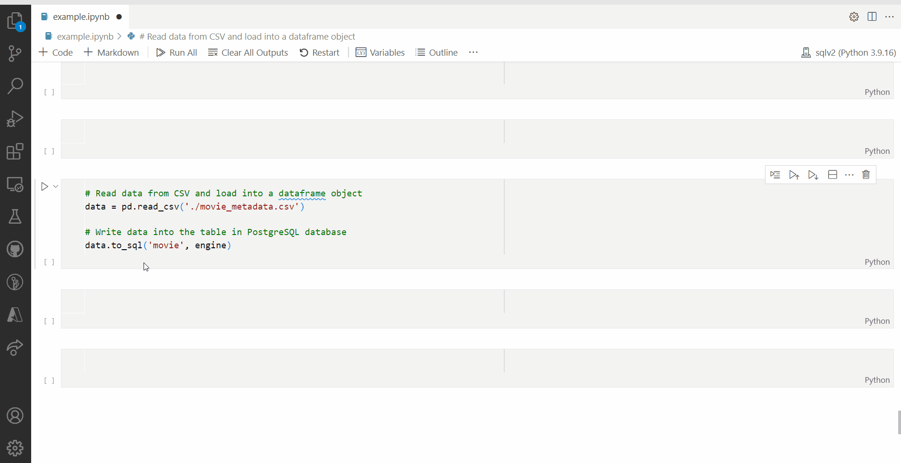

## MLOps: Documenting for Python

### 1. Introduction

This module will help you acquire knowledge regarding documenting for Python by guiding you towards online resources. In addition, it will give you tips on how you can apply your newly gained knowledge to the creative brief.

__After this module, you will be able to:__

- [ ] Acquire knowledge of documenting for Python by completing the exercises and consulting online resources
- [ ] Apply knowledge of documenting for Python to the creative brief


*Figure 1. Documenting Python code.*

Documenting Python code means adding comments and explanations to the code to make it easier to understand for other data professionals. It is important because it helps other people understand your code, collaborate with you, maintain the code over time, and reuse your code in their own projects.

***

### 2. Docstrings

Docstrings in Python are used to provide documentation or information about a specific function, module, or class. They are a string of text that comes directly after a function or module definition and is enclosed in triple quotes ('''...'''). The purpose of a docstring is to provide information about what a particular piece of code does and how to use it. They can describe the purpose of the function, the parameters it expects, the return value, and any exceptions that may be raised. In addition to being helpful for other developers who may be working on the code, docstrings are also used by automated tools like IDEs and documentation generators to provide documentation for your code. 



*Figure 2. Docstrings in VSCode.*

For example, a simple docstring for a function that calculates the sum of two numbers might look like this:

```Python
def add_numbers(x, y):
    """
    This function takes two numbers as input and returns their sum.
    Parameters:
    - x: the first number to add
    - y: the second number to add
    Returns:
    - The sum of x and y
    """
    return x + y
```

When you write a docstring for a function in your code, the first sentence should give a quick explanation of what the function does. After that, you should list all the information about the things that the function needs to work properly, which are called parameters. For each parameter, you should explain what it is. Finally, you should explain what the function will give back to you after it finishes running.

There are many different docstring formatting styles available in Python, below you will find some commonly used ones:

- Google: This style of docstring is used by many popular Python projects such as TensorFlow, Pandas, and NumPy. It consists of a one-line summary, followed by a blank line, followed by a more detailed description of the function. Each parameter and return value is documented using a separate section with the format: Args:, Returns:
- NumPy: This style is similar to the Google Style, but it is more concise. It includes a one-line summary, followed by a blank line, followed by a detailed description of the function. Each parameter and return value is documented using a separate section with the format: Parameters:, Returns:
- reStructuredText: This style is similar to the NumPy Style, but it uses reStructuredText markup. It includes a one-line summary, followed by a blank line, followed by a detailed description of the function. Each parameter and return value is documented using a separate section with the format: :param name:, :return:

The choice of which style to use is largely a matter of personal preference, but it is important to be consistent in your documentation style throughout your codebase.

:pencil: __2a__ Write a docstring for one of the functions you created in your ```titanic.py``` script that follows the Google Style format.

:pencil: __2b__ Install the extension [autoDocstring](https://marketplace.visualstudio.com/items?itemName=njpwerner.autodocstring) in VSCode and use it to generate docstrings for the other functions you created in your ```titanic.py``` script.

The video below shows how to install and use autoDocstring in VSCode:

<iframe width="560" height="315" src="https://www.youtube-nocookie.com/embed/2xa9_A8HH3U" title="YouTube video player" frameborder="0" allow="accelerometer; autoplay; clipboard-write; encrypted-media; gyroscope; picture-in-picture; web-share" allowfullscreen></iframe>

*Video 2. Autodocstring in VSCode.*

***

### 3. Sfinx 

## Add material by Nitin

***

### 4. Blended learning

There are many online resources available on the topic of documenting for Python. Please, check the following resources:

__Videos:__

- [Code Reviewing in Python](https://www.youtube.com/watch?v=1CKNMgG7D64&list=PLnK6m_JBRVNqskWiXLxx1QRDDng9O8Fsf)
- [Docstrings - Python Tips and Tricks #10](https://www.youtube.com/watch?v=QZhANCk5OXc)

***