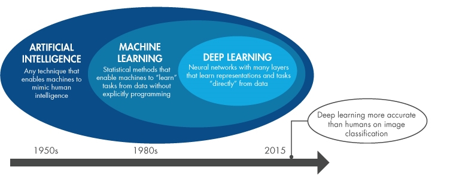
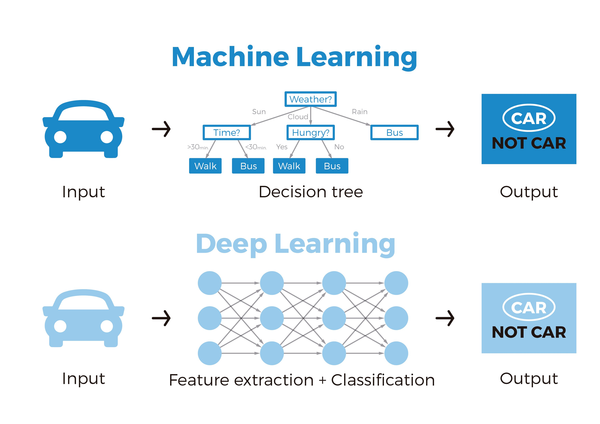

# Introduction to Deep Learning Project

Welcome to Block C !! 
In this module of 4 weeks, you will be continuing your Machine Learning module from Block B. You will start with the building block Perceptrons, to eventually make your own image classifier using deep neural networks.  

_Note: Deep learning is a subset of Machine Learning_



When is it considered Deep learning?

_In Machine learning feature extraction is an important data processing step, which requires complex mathematical algorithms (mostly designed by experts). In case of deep learning the program is able to find patterns in data to build solutions without the complex feature extraction steps. For example, in 4 weeks from now, you will be be able to create a program which can conclude whether a patient has Pnemonia or not !_ 



So, let's get started in this exciting project...
Before we go to the next steps, keep in mind some terms that you may across during your research 
"More layers of Neural Networks" is same as saying "Deep Neural Networks" a.k.a "DEEP LEARNING". 

## Morning's Objectives:

1.  To get an overview of problem scenarios that Neural networks can solve.
2.  To understand the basic terminology in neurons and neural netowrks

```tip
 **Pro Tip !! **
 Take notes of what new concepts are being discussed. You can take notes in the **DL_notes.docx file in your Block C Microsoft Teams assignment.** This notes document is automatically part of your evidence for assessment.
```

## 2) What is a Neural Network ?

watch this video from [Andrew Ng](https://en.wikipedia.org/wiki/Andrew_Ng) to get an intuition of Neural networks:

<!-- blank line -->
<figure class="video_container">
<iframe width="560" height="315" src="https://www.youtube.com/watch?v=n1l-9lIMW7E?controls=0" title="YouTube video player" frameborder="0" allow="accelerometer; autoplay; clipboard-write; encrypted-media; gyroscope; picture-in-picture" allowfullscreen></iframe>
</figure>
<!-- blank line -->

After watching the video, think about these points, _and try to keep notes of your findings_

__2a__ can we predict the house price based on house size by using Linear regression technique? _In case you are not sure, a revisit to linear regression will be a good idea._

__2b__ Does it make sense to call neural networks a subset of machine learning ?

__2c__ Did you take notes of all the new terms you heard in this video? 

## 3) Supervised Learning with Neural Network
watch this video to get an overview of Application of Neural Netoworks, Structured and unstructured data.

<!-- blank line -->
<figure class="video_container">
<iframe width="560" height="315" src="https://www.youtube.com/watch?v=BYGpKPY9pO0?controls=0" title="YouTube video player" frameborder="0" allow="accelerometer; autoplay; clipboard-write; encrypted-media; gyroscope; picture-in-picture" allowfullscreen></iframe>
</figure>
<!-- blank line -->

After watching the video, think about these points, _and try to keep notes of your findings_

__3a__ What all forms of input data exsists ? What sort of application they can be used for? _(any form from the video above that you can relate to, or if you can find some more yourself, it will be awesome)_

__3b__ Try to think of any application for Neural Networks and correspondingly what sort of input data will you need for the application. 

__3c__ [_optional_] What is temporal factor in input data and how is it important for Speech recognition application?

__3d__ Did you take notes of all the new terms you heard in this video? 

## 4) Why Deep learning is rising recently ? [Optional]
watch this video to get an overview of the main drivers behing the rise of deep learning.

<!-- blank line -->
<figure class="video_container">
<iframe width="560" height="315" src="https://www.youtube.com/watch?v=xflCLdJh0n0?controls=0" title="YouTube video player" frameborder="0" allow="accelerometer; autoplay; clipboard-write; encrypted-media; gyroscope; picture-in-picture" allowfullscreen></iframe>
</figure>
<!-- blank line -->

## 5) Reading time...
Now, the next steps in getting better overview of deep learning and fundamentals of neurons, lets dive into our favourite Codecademy page. Open the [Build Deep Learning Models with TensorFlow Path](https://www.codecademy.com/learn/machine-learning) on Codecademy and complete the module: 

1) **Welcome to the Build Deep Learning Models with TensorFlow Skill Path**
   -All

2) **Foundations of Deep Learning and Perceptrons**: specifically:
- Article: What is Deep Learning 
- Article: What is Neural Networks 
- Article: Dangers of Black Box 

{:.bg-yellow-dark.text-white.p-5.box-shadow-large.anim-pulse}
LUNCH !!


## Next up!
After Lunch you will revisit some of the data structures and get introduced to tensor for the maths requirement of Neural networks. Don't worry, its easy as TensorFlow does most of the heavylifting for you, you just need to know how to use and apply the interfaces for your projects. 

***