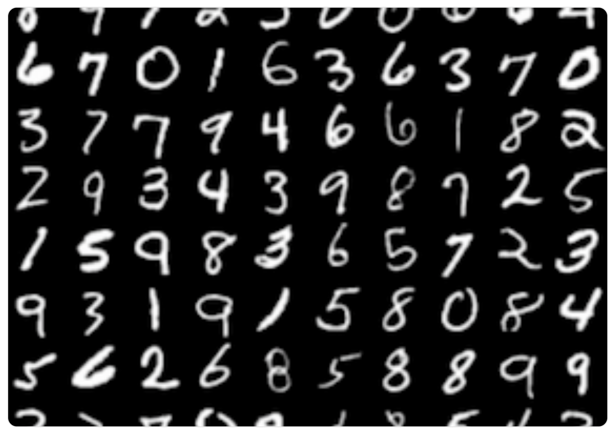

# Data Lab 6: Classification using TensorFlow (MNIST datasets)

Today you will be designing and implementing a Fully-Connected multi-class-classifier (firstly digit classifier and then Fashion Item Classifier) built with neural network in TensorFlow and Keras.

## Assignment 1: Digit Classifier

Design and build a Fully-Connected neural network in TensorFlow and Keras. 

 <!-- blank line -->
<figure class="video_container">
<iframe width="560" height="315" src="https://www.youtube.com/embed/aircAruvnKk"  frameborder="1"></iframe>
</figure>
<!-- blank line -->

```tip
 **Pro Tip !!**
  Take notes of what new concepts are being discussed. You can take notes in the **_DL-notes.docx_** file in your **_Block C Microsoft Teams assignment_**. This notes document is automatically part of your evidence for assessment.
```

### Deliverable : 
For this assignment submit your google colab notebook as _**Digit-Classifier.ipynb**_ in Block C Github repository.

### Data set to use: 
[THE MNIST DATABASE](http://yann.lecun.com/exdb/mnist/)



you can download the data set with labels using keras library.

```python
# Load the MNIST dataset.
mnist = tf.keras.datasets.mnist
train_data, test_data = mnist.load_data()
```
 To design and build the neural network, feel free to refer to the tutorials (specifically the codecademy tutorial on classification) from previous study material. Try to make it from scratch, using your own code. Refer to external sources only if required. Make sure you understand the reference code, or please ask your teachers'to make the most of this assignment's learning goal.

```tip
 **Try this [demo](https://www.cs.ryerson.ca/~aharley/vis/fc/) to see fully connected network in action for handwritten digits.**  _Feel free to hover your mouse over the neuron block to see all the connections._
```

 As a startup helper, here are the steps you can follow :

```python

# Import libraries (numpy, matplotlib, tensorflow)

# Load the mnist data from keras and divide the data into features and labels

# Reshape and normalize the images

# Reshape the labels and encode them categorically

# Show the shapes of the data and verify your data structures

# Show a sample MNIST digit to verify the content of data

## BUILD THE NETWORK*******
# Define the sequential model

# Add fully-connected layers to the network

# Show the model summary

# Compile the model

## TRAIN THE MODEL
# Define the hyperparameters

# Train the model

# evaluate and display the model's accuracy and loss based on the test set

# save the metric values for each epoch to plot the loss and accuracy curves for the model

# Save the loss values

# Plot the training and test loss

# Plot the training and test accuracy

##MAKE PREDICTION
# Make predictions with the trained model

# Choose any random index and show an image from the test set

# see the predicted value

``` 

## Assignment 2: Fashion material Classifier

Design and build a Fully-Connected neural network in TensorFlow and Keras. 

```tip
 **Pro Tip !!**
  Take notes of what new concepts are being discussed. You can take notes in the **_DL-notes.docx_** file in your **_Block C Microsoft Teams assignment_**. This notes document is automatically part of your evidence for assessment.
```

### Deliverable : 
For this assignment submit your google colab notebook as _**Fashion-Classifier.ipynb**_ in Block C Github repository.

### Data set to use: 
[THE FASHION MNIST DATABASE](https://keras.io/api/datasets/fashion_mnist/)


you can download the data set with labels using keras library.

```python
# Load the FASHION-MNIST dataset.
fashion_mnist = tf.keras.datasets.fashion_mnist
train_data, test_data = fashion_mnist.load_data()
```

Once you have the model, compare the various differences you had to make from the Digit classifier, and add your findings to **_DL-notes.docx_** file in your **_Block C Microsoft Teams assignment_**.


## Additional Resources [Optional]
- http://neuralnetworksanddeeplearning.com/chap1.html
