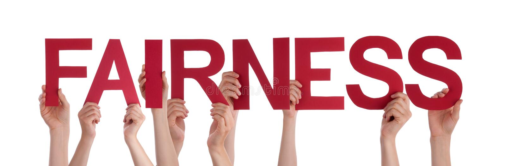
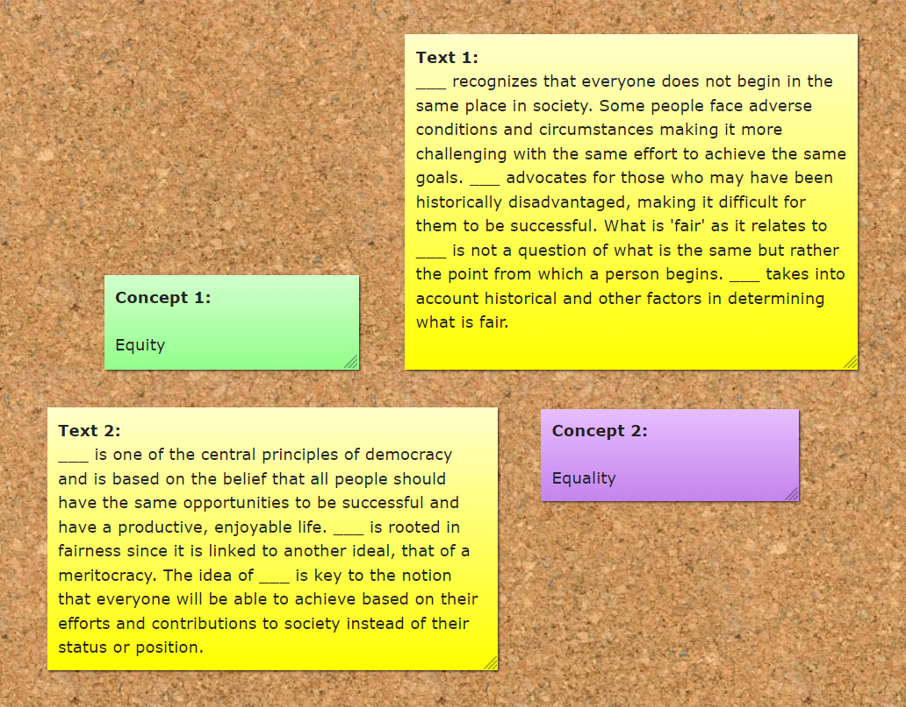
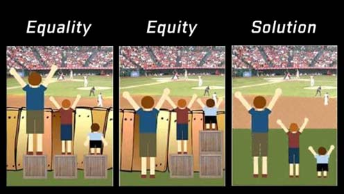

# Automated decision making (ADS) & Bias
### Fairness & Bias: Definitions

Today, you will be introduced to the concepts of 'fairness' and 'bias'. How are they defined? Are there different types of 'fairness' and/or 'bias' Lastly, you will be made familiar with two principles that can be applied to achieve fairness, equality or equity.

## 1) Learning Objectives:

1. Define the terms 'fairness', 'bias', 'equity', and 'equality'.
2. Explain the difference between terms 'equity' and 'equality'.
3. Develop broader understanding of what fairness and justice entails by providing concrete examples.

__Table of contents:__
1. Introduction: 2 hours
2. Workshop: 3 hours
3. Additional material (optional): 2 hours
   3.1 Justice as fairness by John Rawls

## Questions or issues?
If you have any questions or issues regarding the course material, please first ask your peers or ask us in the Q&A in Datalab!

Tip: Note down any important questions you might have!
 

Good luck!

***

## 2) Introduction:

__2a__ Watch the video Why monkeys (and humans) are wired for fairness by Sarah Brosnan.

<iframe width="560" height="315" src="https://www.youtube.com/embed/dKob6b8QzkU" title="YouTube video player" frameborder="0" allow="accelerometer; autoplay; clipboard-write; encrypted-media; gyroscope; picture-in-picture" allowfullscreen></iframe>

*Video 1. Why monkeys (and humans) are wired for fairness.*

__2b__ Explain how the terms 'fairness' and 'cooperation' relate to each other by giving a real-life example. Write your answer down.

__2c__ Read the comic book Fairness & Friends by Khan et., al., which you can find [here]( https://dataresponsibly.github.io/comics/vol2/fairness_en.pdf).

__2d__ List, and describe the three types of bias presented in the comic book.

__2e__ Give example for each type of bias presented in the comic book. Write your answer down, and limit your word count to a maximum of 200 words.

***

## 3) Workshop: The Difference Between Equality and Equity:

Now, we're introduced to the terms 'fairness' and 'bias' it's time to ground down these fundamentals. In the workshop, you will learn about how two principles, equality and equity, can help to achieve fairness.

> Though often used interchangeably, equality and equity are quite different. If fairness is the goal, equality and equity are two processes through which we can achieve it. Equality simply means everyone is treated the same exact way, regardless of need or any other individual difference. Equity, on the other hand, means everyone is provided with what they need to succeed. In an equality model, a coach gives all of his players the exact same shoes. In an equity model, the coach gives all of his players shoes that are their size.
 

### 3.1 Individual exercises

__3.1a__ Read the Post-Its in Figure 1.

*Figure 1. Post-Its on a bulletin board.*

__3.1a__ Fill the gaps in the 'text' Post-Its by connecting it to the correct 'concept' Post-It. Write your answer down.

__3.1b__ Provide answers to the following answers. Provide clear, and concise answers.  

*Figure 2. Equality vs equity.*

1. Looking at the images in Figure 2, why does the difference between equity and equality matter?
2. How does the baseball game metaphor relate to the guiding quote about shoes?
3. What are some other real-world examples of equity and equality?
3. How are equality and equity related to fairness? In school, sports, society, etc.?
4. Are there other ways to achieve fairness besides equity and equality? (For example, the removal of the wooden fence eliminates the structural barrier to access.)

### 3.2 Group exercises

__3.2a__ Team up with at least one fellow student, and discuss your answers to the individual exercises. Write down the name(s) of your team mate(s), and the differences/commonalities in your provided answers.

***

## 4) Additional material (optional):

This part of the independent study material is optional. You are not required to complete the following questions. However, they will help you to deepen your understanding of the concepts presented in the independent study material.

### 4.1 Justice as fairness by John Rawls

Stanford Encyclopedia of Philosophy is a trustworthy online source that provides extensive information on philosophy, and related fields. You can access their entry on the philosopher John Rawls, [here](https://plato.stanford.edu/entries/rawls/).

In addition, The School of Life, also has provides high quality videos on various philosophical topics. See YouTube video on Rawl's political theory:

<iframe width="560" height="315" src="https://www.youtube.com/embed/5-JQ17X6VNg" title="YouTube video player" frameborder="0" allow="accelerometer; autoplay; clipboard-write; encrypted-media; gyroscope; picture-in-picture" allowfullscreen></iframe>

*Video 2. Political Theory, John Rawls.*

***

## Next up!
Coming Datalab we will reflect upon today's independent study material, and give you an opportunity to ask any questions you might have.

***

## Resources
