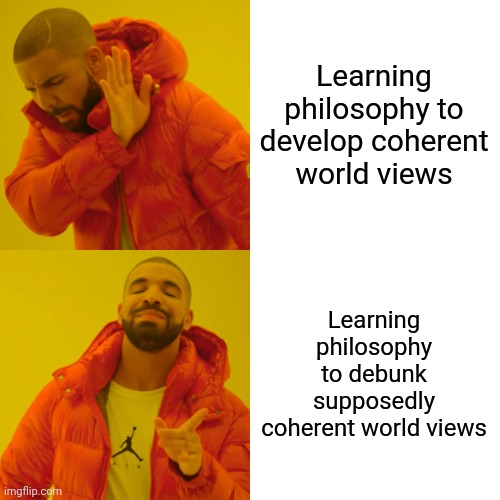
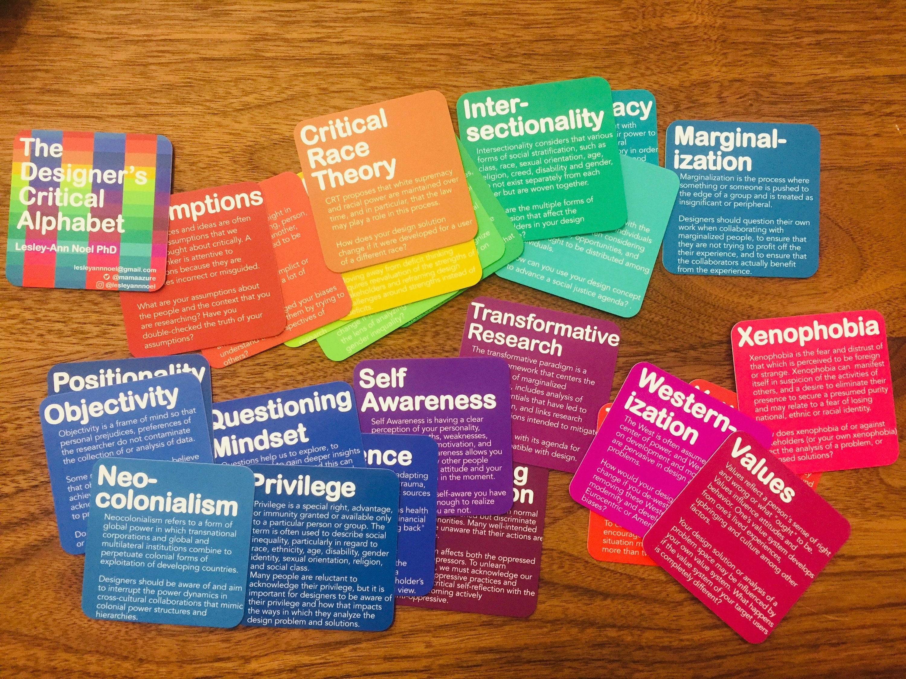

# EDA & What-If Tool
### DataLab 1: (Implicit) Bias & Decolonizing

Today, you will be introduced to the concept of decoloniality. Additionally, we will perform some 'unlearning' and apply the concepts from A Designer's Critical Alphabet to a data project.

*Figure 1. Applications of philosophy.*

## 1) Learning Objectives:

1. Define the terms '(implicit) bias', 'decoloniality', 'positionality', and 'unlearning'.
2. Perform the implicit bias test.
3. Reflect upon the result of the implicit bias test.
4. Apply concepts from A Designer's Critical Alphabet to a data project.

__Table of contents:__
1. Q&A and standup: 1 hour
2. Introduction: 2 hours
3. Workshop: 3 hours
4. Reflection & Work/learning log: 1 hour

## Questions or issues?
If you have any questions or issues regarding the course material, please first ask your peers or ask us in the Q&A in Datalab!

Tip: Note down any important questions you might have!
 

Good luck!

***

## 2) Q&A and Standup:

__2a__ Ask questions regarding the independent study material.

__2b__ Answer the following questions:

- What did you do yesterday?
- What will you do today?
- Are there any impediments in your way?

***

## 3) Introduction:

### 3.1 (Implicit) Bias & unlearning

__3.1a__ Take the Implicit Bias test by Harvard University, which you can find [here](https://implicit.harvard.edu/implicit/takeatest.html).

*Figure 2. Implicit bias.*

__3.1b__ Reflect upon your result of the Implicit Bias test. Use a maximum of 150 words for your answer.

__3.1c__ Watch the video The Art of Unlearning by Ken Spring. See video below:

<iframe width="560" height="315" src="https://www.youtube.com/embed/lAJ9QHOWjNA?controls=0" title="YouTube video player" frameborder="0" allow="accelerometer; autoplay; clipboard-write; encrypted-media; gyroscope; picture-in-picture" allowfullscreen></iframe>

__3.1d__ Create an infographic that covers the main topics in Spring's video. You can use Google's [Jamboard](https://jamboard.google.com/) or a simple piece of paper for your infographic. Export/import your drawing to PNG, and upload it to your GitHub repository.

### 3.2 Decoloniality

__3.2a__ Watch the following video: Decolonising Knowledge: What is Decolonisation? by Rolando Vázquez Melken.

<iframe width="560" height="315" src="https://www.youtube.com/embed/1CUKW2h4Dtg?controls=0" title="YouTube video player" frameborder="0" allow="accelerometer; autoplay; clipboard-write; encrypted-media; gyroscope; picture-in-picture" allowfullscreen></iframe>

__3.2b__ Define the term 'positionality', and provide a concrete example of the concept. Write your answer down.

__3.2c__ What does Vázquez Melken mean by 'truthful knowledge'? Explain your answer.

__3.2d__ In the video Vázquez Melken puts a lot of emphasis on the importance of listening. Why does he do this?

### 3.3 Case study: Public trust in ‘Western’ organizations & Ebola

__3.3a__ Read the following piece of text:

The public distrust in ‘Western’ institutions and organizations as experienced by many Africans is deeply-rooted in society. Its origins can be traced back to the ‘Scramble for Africa’, which refers to the partitioning of Africa into spheres of influence, colonies, and protectorates during the years 1860-1905 (Michalopoulos and Papaioannou, 2015, December 24). As a result of colonization, the world was divided into two zones: one half represented the core (zone of being), while the other half represented the periphery (zone of non-being) (Fanon, et. al., p. 2). By dividing the world along these radical lines, a global hierarchy of superiority and inferiority was established. European colonizers were seen as superior to the native population, which were often referred to as the ‘other’.

>As a result of this divide everything south of the equator vanished, became non-existent:
On the other side of the line, there is no real knowledge; there are beliefs, opinions, institutions, and subjective understanding, which at most, may become object or raw material for scientific inquiry. Thus, the visible line that separates science from its modern others is grounded on the abyssal invisible line that separates science philosophy, and theology, on one side, knowledges rendered incommensurable and incomprehensible for meeting neither the scientific methods of truth not their acknowledged contenders in the realm of philosophy and theology (Santos, 2014, p. 120)

*Figure 3. Fanon’s Conception of Racism.*

This systematic destruction, or ‘war’ on indigenous knowledges is called epistemicide. Furthermore, the colonizers secured their superior position through violent means: ‘Beyond the equator are no sins’ (Santos, 2014, p. 121), because copresence of the two sides was deemed impossible (Santos, 2014, p. 118).
Many scholars argue that Fanon’s conception of racism is still very relevant today. In the case of the Ebola epidemic of 2014-2016, Bastide (2018) argues that the legacy of public health in colonial times plays a major in the people’s mistrust towards the international aid organizations: ‘… colonial public health was not predicated upon the will to better colonized populations’ welfare, or only in minor ways. It rather aimed at ensuring the biological well-being of European settlers’ (p. 101)
 As regards the production of statistics, one may ask why it is that statistics are only perceived reliable when they adhere to ‘Western’ norms? Is it even feasible to create a universal measurement for concepts such as income, when we know that they can be perceived very differently across cultures? In other words, you may maximize the outcome of the game, but you cannot maximize the game itself. (See Section 3.2). Furthermore, why would you not want to include other forms of knowledge, or other concepts to measure development. Learning new and less familiar knowledges does not mean that you have to discard the old ones (Santos, 2014, p. 188). Additionally, when one knowledge fails or does not provide the desired information, you can always resort to other knowledges (e.g. additional forms of inquiry). Lastly, embracing the ecologies of knowledges will reduce cognitive injustice, which in turn will decrease social injustice (Santos, 2014, p. 189). When the social justice in these Sub-Saharan countries rises, public trust in ‘Western’ institutions are also expected to rise. For example, by acknowledging the importance of alternative knowledges, traditional ‘Western’ statistics are less likely to be seen as technologies of governmentality (Blerck, van, 2019).

***

## 4) Workshop:

Now, we're introduced to, amongst others, the concepts of '(implicit) bias', 'decoloniality', and 'unlearning' it is time to ground down these fundamentals. In the workshop, you will learn to apply some these principles through the use of A Designer's Critical Alphabet by Lesley-Ann Noel.

### 4.1 A Designer's Critical Alphabet by Lesley-Ann Noel

*Figure 3. A Designer's Critical Alphabet.*

[Online card deck](https://criticalalphabet.com/).

__In-class exercises, instructions by lecturer.__

***

## 5) Reflection & Work/learning log (16:00-17:00):

__5a__ Fill in your work/learning log.

__5b__ Choose, and provide an answer to at least of the following questions:

1. What surprised you today, and why?
2. What is the most important thing you learned today? Why do you think so?
3. What do you want to learn more about, and why?
4. When were you the most creative, and why do you think that is?
5. What made you curious today? How does learning feel different when you are curious?
6. When were you at your best today, and why?
7. (Assuming we were studying the same thing and you could decide and have access to anything), where would you start tomorrow? Why?
8. What can/should you do with what you know?

***

## Resources
