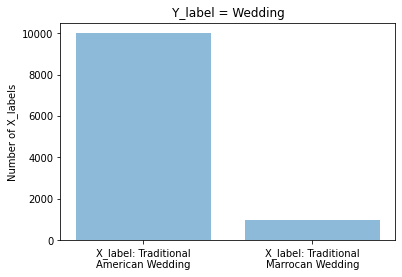
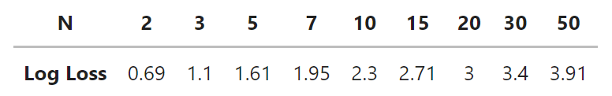
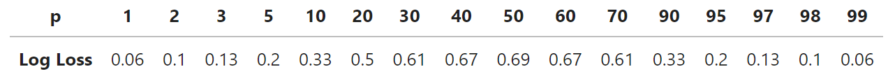
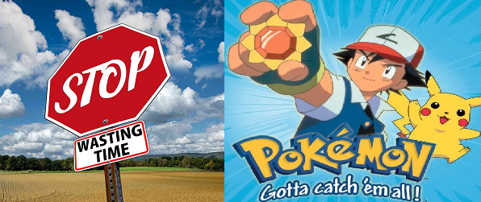

# Fairness & Bias: Individual fairness vs. Group fairness

Today's independent study material focuses on how you as a data professional can identify, and mitigate bias in a dataset by deploying individual fairness methods; 'Fairness Through Awareness' and 'Fairness Through Unawareness'. In addition, you will will be introduced to the concept of group fairness, and its corresponding metrics, which include, but are not limited to: equalized odds, equal selection parity, and demographic parity.

## Learning objectives

- [ ] Define the terms 'individual fairness', 'group fairness', 'social construct', 'sample', and 'population'.
- [ ] Explain the difference between 'Fairness Through Awareness, and 'Fairness Through Unawareness'.
- [ ] Compare, and contrast two philosophical 'worldviews': WAE, and WYSIWIG.
- [ ] Compare, and contrast three notions of group fairness in AI: 'interdependence', 'sufficiency', and 'separation'.
- [ ] Explain how individual fairness and group fairness can conflict with each other.

__Table of contents__
1. Introduction: 2 hours
2. Workshop(s): 6 hours

## Homework exercises

For the DataLab preparation (Week 1, Friday), you are expected fill in a Microsoft Teams Form called ```DataLab Preparation 2```:

<iframe width="640px" height="480px" src="https://forms.office.com/e/GxMAUWJRVR?embed=true" frameborder="0" marginwidth="0" marginheight="0" style="border: none; max-width:100%; max-height:100vh" allowfullscreen webkitallowfullscreen mozallowfullscreen msallowfullscreen> </iframe>

To avoid multiple submissions, answer the questions that pop up (:pencil:) as you navigate the content below in a text editor of your choice (e.g., Notepad ++, Word, etc.) before entering them into the Microsoft Form. 

Furthermore, the knowledge module Responsible AI introduces quite a bit of new terminology. Please make sure to take notes and reflect on the new terms/concepts/debates that you encounter (:bell:).

## Questions or issues?

If you have any questions or issues regarding the independent study material, please use the Q&A forum on Microsoft Teams. The mentors, and module instructor(s) will be available to answer your questions in DataLab.

Good luck!

***

## 1) Introduction

Until now, we have primarily focused on general notions of 'fairness' and 'bias'. Today, we will investigate how these concepts affect data science/AI projects. Furthermore, we will take a closer look at two types of fairness: individual fairness, and group fairness.

## 2) Bias & Machine learning

For this section, you will need to read a famous investigative article by ProPublica, which defines its work, and mission as follows:

> ProPublica is an independent, nonprofit newsroom that produces investigative journalism with moral force. We dig deep into important issues, shining a light on abuses of power and betrayals of public trust — and we stick with those issues as long as it takes to hold power to account ([Source](https://www.propublica.org/about/)).


*Figure 1. ProPublica's headquarters.*

:pencil: __2a__ Read the article [Machine Bias](https://www.propublica.org/article/machine-bias-risk-assessments-in-criminal-sentencing) by Angwin et al. (ProPublica), which describes how the risk assessment tool COMPAS is biased against black defendants.

:pencil: __2b__ Explore the interactive article [The Myth of the Impartial Machine](https://parametric.press/issue-01/the-myth-of-the-impartial-machine/) to see how ML models reproduce historical/societal inequalities.

:pencil: __2c__ What are the key takeaways of the article 'Machines Bias?', and the tutorial 'The Myth of the Impartial Machine'. Write them down with a maximum of 150 words.

## 3) Workshop: Individual fairness, and debiasing techniques

Fairness metrics can be seen as a quantification of unwanted bias in data or algorithms. These metrics can be divided into two distinct groups:

- Individual fairness: 'The goal of similar individuals receiving similar treatments or outcomes ([Source](https://aif360.mybluemix.net/resources#glossary)).'
- Group fairness: 'The goal of groups defined by protected attributes receiving similar treatments or outcomes ([Source](https://aif360.mybluemix.net/resources#glossary)).'

Let us get a sense of how individual fairness works by looking at a concrete example:

Suppose an algorithm $$\begin{aligned}&M\end{aligned}$$ is being used for college admissions decisions. $$\begin{aligned}&M\end{aligned}$$ offers a prediction in the form of a probability that an applicant should be admitted (range: 0.0-1.0). Suppose two applicants, $$\begin{aligned}&x\end{aligned}$$  and $$\begin{aligned}&y\end{aligned}$$ are very similar: they have similar GPAs
and SAT scores and come from the same high school. $$\begin{aligned}&y\end{aligned}$$ is from a less wealthy family. But this fact is not considered relevant to determining who should be admitted, so the similarity metric ignores it. Thus, the actual distance between the applicants is very small, $$\begin{aligned}&d(x,y)≈ 0.01\end{aligned}$$ . However, $$\begin{aligned}&M\end{aligned}$$ assigns applicant $$\begin{aligned}&x\end{aligned}$$ a score of 0.9, and applicant $$\begin{aligned}&y\end{aligned}$$ a score of 0.7. According to the statistical distance metric suggested by Dwork et al., $$\begin{aligned}&d(Mx, My) = 0.2\end{aligned}$$ in this case. Thus, $$\begin{aligned}&M\end{aligned}$$ would be considered (individually) unfair: applicant $$\begin{aligned}&x\end{aligned}$$ and $$\begin{aligned}&y\end{aligned}$$ are treated dissimilarly, despite being similar ([Source](http://philsci-archive.pitt.edu/18889/1/Fleisher%20-%20Individual%20Fairness.pdf)).

To make our college admissions classifier more fair, we need to minimize the distance between the applicants $$\begin{aligned}&x\end{aligned}$$ , and $$\begin{aligned}&y\end{aligned}$$ . We can either add additional data instances to the dataset or remove existing data instances from the dataset to achieve this goal.

If we think that the unfairness is caused by statistical bias, we should add additional data instances to make our dataset (i.e., sample) more representative. When there is no additional data available, we can also augment our current data; increase the sample by adding slightly modified copies of already existing data or newly created synthetic data from existing data. This approach is called 'Fairness Through Awareness'.

>Generally speaking, statistical bias occurs whenever the data used for model training are not representative of the true population. This can be due to a form of selection bias, i.e. when the individuals appearing in the data come from a non random selection of the full population. This happens, for example, in the context of credit lending, where the information of the repayment is known only for people that were granted the loan. Another way in which statistical bias can enter the data is via systematic measurement errors. This happens when the record of past errors and performance is systematically distorted, especially in the case of different amount of distortion for different groups of people. Similarly, it may happen that data are systematically missing or poorly recorded for entire strata of the population ([Source](https://arxiv.org/abs/2106.00467)).

To get a better understanding of the statistical concepts 'sample', and 'population', see the video below:

<iframe width="896" height="504" src="https://www.youtube.com/embed/jPPF2xSEyKU?controls=0" title="YouTube video player" frameborder="0" allow="accelerometer; autoplay; clipboard-write; encrypted-media; gyroscope; picture-in-picture" allowfullscreen></iframe>

*Video 1. The differences between sample and population.*

:pencil: __3a__ Identify the population and sample in the following example:

Suppose you want to build a binary classification model that predicts if a person, -i.e. the agent, is performing a specific action or not, say coaching. To obtain data for your classifier, you scrape Google and collect 1000 images of people coaching, and 1000 images of people performing other acts besides coaching. 

- __a)__ The population encompasses all images of people coaching and performing other acts than coaching on the internet; the sample encompasses all images of people coaching and performing other acts than coaching on Google.
- __b)__ The population encompasses all images of on Google; the sample encompasses all images of people coaching and performing other acts than coaching on Google.
- __c)__ The population encompasses all images of people coaching and performing other acts than coaching on Google; the sample encompasses the 1000 images of people coaching, and 1000 images of people performing other acts besides coaching that you scraped from Google.

Select the correct answer, and elaborate on your choice.

If we think that the unfairness is caused by historical or societal bias, we should remove data instances from our dataset.

>Even when the data are free from statistical bias, i.e. they truly represent the population, take into account minorities and there is no systematic error in recording, still it may be that bias exists simply because data reflect biased decisions. In most cases, this is due to a form of labelling bias, i.e. a systematic favour/disfavour towards groups of people at the moment of creating the target variable from which the model is going to learn. If the recorded outcomes are somehow due to human decisions (e.g. a model for granting loans may be trained on loan officers’ past decisions), then we cannot in general trust their objectiveness and “fairness”. Other forms of historical bias may be even more radical: gender bias has a rather long history, and is embedded in all sorts of characteristics and features in such a way that it is difficult or even impossible to evaluate its impact and disentangle its dependence on other variables. Think for example of income or profession disparities, just to name a few out of many. Thus, this is a situation in which long-lasting biases cause systematic differences in features pertaining different groups of people. Again, this is not a form of un representativeness of the sample, it is a bias present in the full population ([Source](https://arxiv.org/abs/2106.00467)).

The classifier is likely sensitive to family wealth since it was trained on historical admissions data. Thus, it might be beneficial to remove one or more wealth-related features from the dataset (e.g., income, neighborhood, etc.). This approach is called 'Fairness Through Unawareness'.

:pencil: __3b__ Propose an appropriate individual fairness method, - i.e., ‘Fairness Through Awareness’ or ‘Fairness Through Unawareness’, and explain how it addresses COMPAS' limitations in terms of bias and fairness.

Lastly, when the target variable is unevenly distributed (i.e., imbalanced classes), we can create a custom bias initializer. Adjusting the last layer bias parameter in your neural network has a similar effect as changing the threshold of a binary ML algorithm, such as in logistic regression. This technique will help you to mitigate algorithmic/technical bias.

Say we want to train a binary classifier that can predict if an image depicts a wedding or not. As with the Imsitu dataset, our 'imaginary' dataset mostly contains images of traditional American (i.e. Western) weddings. Images depicting traditional Moroccan weddings are underrepresented in the data. See data distribution below:

```python
import numpy as np
import matplotlib.pyplot as plt
from textwrap import wrap

classes = ['X_label: Traditional American Wedding', 'X_label: Traditional Marrocan Wedding']
classes = [ '\n'.join(wrap(c, 20)) for c in classes ]
y_pos = np.arange(len(classes))
count = [10000,1000]

plt.bar(y_pos, count, align='center', alpha=0.5)
plt.xticks(y_pos, classes)
plt.ylabel('Number of X_labels')
plt.title('Y_label = Wedding')

plt.show()

```
     


*Figure 2. Distribution of wedding images.*

With correct bias initialization during training you can mitigate (some of the) bias introduced by the unbalanced dataset: By putting emphasis on the minority class the model does not spend the first few epochs just learning that the minority examples are unlikely (i.e. learning the bias). In Keras initialize the bias with the function ```bias_initializer```.

In the case of the log loss metric, the baseline of dumb, by-chance prediction is 0.693 for a balanced dataset. This number is obtained by predicting the prevalance or p, and value it at p = 0.5 for any class of the binary problem:

Log Loss = -log(p)
p = (1 / N)



*Figure 3. log loss value of 0.5.*

```python

import math

prev_class_1 = 0.5
prev_class_2 = 0.5
dumb_baseline = 0.5

log_loss = - prev_class_1 * (math.log(dumb_baseline)) - prev_class_2 * (math.log(dumb_baseline))

#OR

#N = 2

#log_loss = -(math.log(1 / N))

print(log_loss)

```

*log_loss: 0.6931471805599453*

The baseline of dumb, by-chance prediction value gets increasingly smaller when the data becomes more and more unbalanced. For example, a log loss value of 0.5 with p = 0.1 (i.e. prevalance of traditional Moroccan wedding labels) indicates that the model is performing poorly.



*Figure 4. log loss value of 0.5 with p = 0.1.*

A correct dumb baseline for this particular dataset would be around:

```python  

import math

prev_minority_class = 0.1
prev_majority_class = 0.9

log_loss = - prev_minority_class * (math.log(prev_minority_class)) - prev_majority_class * (math.log(prev_majority_class))

print(log_loss)

```

*log_loss: 0.3250829733914482*

If you set the initial bias properly (in the last dense layer of your network), the model is likely to provide more reasonable initial guesses. Code example:

```python

correct_bias = np.log([prev_minority_class/prev_majority_class]) #Count of X_labels: Traditional American wedding, and traditional Moroccan wedding.

model = Sequential()
model.add(Flatten(input_shape=train_data.shape[1:]))
model.add(Dense(256, activation='relu'))
model.add(Dropout(0.5))
model.add(Dense(1, activation='sigmoid', bias_initializer=correct_bias))

```

In addition, try to complement your analysis with metrics that focus on the minority classes, such as recall.

For more information on bias initialization in Keras: [Classification on imbalanced data](https://www.tensorflow.org/tutorials/structured_data/imbalanced_data).

## 4) Workshop: Group fairness metrics

Most (post-processing) group fairness metrics are calculated based on a confusion matrix produced by a classification model. The confusion matrix is comprised of four outcomes:

- True positive (TP): the true class is positive and the prediction is positive (correct prediction)
- False positive (FP): the true class is negative and the prediction is positive (incorrect prediction)
- True negative (TN): the true class is negative and the prediction is negative (correct prediction)
- False negative (FN): the true class is positive and the prediction is negative (incorrect prediction)


*Figure 4. Confusion matrix.*

Group fairness metrics are calculated by comparing one or more of these measures across sensitive/protected attribute groups. For example, gender/sex or marital status could be considered such an attribute, with groups 'Female' and 'Male' for gender/sex, and 'Married', 'Not-married' for marital status.

:pencil: __4a__ Read the blog [No Substitute for Sex](https://www.psychologytoday.com/us/blog/how-we-do-it/201908/no-substitute-sex) by Martin. 

:pencil: __4b__ Watch the video Feminine Beauty: A social construct?, which will introduce you to the term 'social construct'.

<iframe width="896" height="504" src="https://www.youtube-nocookie.com/embed/xT6wjgssVK4" title="YouTube video player" frameborder="0" allow="accelerometer; autoplay; clipboard-write; encrypted-media; gyroscope; picture-in-picture; web-share" allowfullscreen></iframe>

*Video 2. Feminine Beauty: A social construct?*

:pencil: __4c__ Combine the the following terms (e.g. A = 1, I):

A. Gender 
B. (Biological) Sex

1. 'Female' and 'male'  
2. 'Feminine' and 'masculine' 

I. Social construct
II. Biological fact

Write your answer down.

:pencil: __4d__ Give at least one additional example of a feature that could be seen as a sensitive/protected attribute?

:pencil: __4e__ Read AXA's [Towards the right kind of fairness in AI](https://axa-rev-research.github.io/static/AXA_FairnessCompass-English.pdf) guide (p. 1-55). This text will introduce you to a number of popular group fairness metrics used in the field of AI.

:pencil: __4f__ Read the blog post [Starting to think about AI Fairness](https://blogs.rstudio.com/ai/posts/2021-07-15-ai-fairness/) by RStudio. This article will summarize and connect many of the essential concepts covered in the independent study material.   

:pencil: __4g__ Define the term 'group fairness', and explain how it differs from 'individual fairness'. Write your answer down.

:pencil: __4h__ Explain the differences between 'independence', 'sufficiency', and 'separation' concerning fair AI.   

:pencil: __4i__ Explore the interactive tutorial [Attacking discrimination with smarter machine learning](http://research.google.com/bigpicture/attacking-discrimination-in-ml/) to see how a binary classifier works, ways it can potentially be unfair, and how you might turn such an unfair classifier into a fairer one.

To select an appropriate group fairness metric for our (binary) classification task, we will use AxA's [Fairness Compass](https://axa-rev-research.github.io/fairness-compass.html).

Example: You are building a binary classifier to predict whether a picture depicts a wedding or not. To collect the data you use the search engine SearchYourWeb, which has a database containing 1500 wedding images; depicting 500 homosexual and 1000 heterosexual couples. When searching for wedding images, the engine returns a sample of 150 pictures labelled 'wedding'. For the 'no wedding' class you randomly select 150 images from SearchYourWeb. 

Sensitive/protected attribute: sexual orientation (e.g., groups: homosexual and heterosexual).

### __Step 1: Policy__

To start of our analysis, we need to answer the question below:

> Does the environment where you intend to deploy the application impose anti-discrimination policies? Those may stem from law, regulation or internal organisational guidelines ([Source](https://axa-rev-research.github.io/fairness-compass.html)).

If the answer is 'Yes', then we can proceed to __Step 3.__ section __Independence <span style="color:purple">(WAE)</span>__ to select Fairness metric I (<span style="color:red">Equal selection parity</span>). 

If the answer is 'No', then we can proceed to __Step 2.__

### __Step 2: Worldview__

- <span style="color:purple">'We're all equal' (WAE)</span> OR <span style="color:orange">'What you see is what you get' (WYSIWYG)</span>

>The worldview what you see is what you get (WYSIWYG) assumes
the absence of structural bias in the data. Accordingly, this view
supposes that any statistical variation in different groups actually represents deviating base rates which should get explored. On the other hand, the worldview we’re all equal (WAE) presupposes equal base rates for all groups. Possible deviations are considered as unwanted structural bias that needs to get corrected ([Source](https://axa-rev-research.github.io/static/AXA_FairnessCompass-English.pdf)).

__Types of bias:__

- Statistical bias <span style="color:orange">(WYSIWYG)</span>:


*Figure 3. Population vs. sample.*

>Generally speaking, statistical bias occurs whenever the data used for model training are not representative of the true population. This can be due to a form of selection bias, i.e. when the individuals appearing in the data come from a non random selection of the full population. This happens, for example, in the context of credit lending, where the information of the repayment is known only for people that were granted the loan. Another way in which statistical bias can enter the data is via systematic measurement errors. This happens when the record of past errors and performance is systematically distorted, especially in the case of different amount of distortion for different groups of people. Similarly, it may happen that data are systematically missing or poorly recorded for entire strata of the population ([Source](https://arxiv.org/abs/2106.00467)).

- Historical or societal bias <span style="color:purple">(WAE)</span>:

>Even when the data are free from statistical bias, i.e. they truly represent the population, take into account minorities and there is no systematic error in recording, still it may be that bias exists simply because data reflect biased decisions. In most cases, this is due to a form of labelling bias, i.e. a systematic favour/disfavour towards groups of people at the moment of creating the target variable from which the model is going to learn. If the recorded outcomes are somehow due to human decisions (e.g. a model for granting loans may be trained on loan officers’ past decisions), then we cannot in general trust their objectiveness and “fairness”. Other forms of historical bias may be even more radical: gender bias has a rather long history, and is embedded in all sorts of characteristics and features in such a way that it is difficult or even impossible to evaluate its impact and disentangle its dependence on other variables. Think for example of income or profession disparities, just to name a few out of many. Thus, this is a situation in which long-lasting biases cause systematic differences in features pertaining different groups of people. Again, this is not a form of un representativeness of the sample, it is a bias present in the full population ([Source](https://arxiv.org/abs/2106.00467)).

### __Step 3: Fairness metrics__

__Independence <span style="color:purple">(WAE)</span>:__

1. 'The proportion of actual positives (i.e., base rate) must be equal across sensitive/protective groups'.

Independence ensures that individuals, who have different sensitive/protected attribute values $$\begin{aligned} & A\end{aligned}$$ , have an equal chance to obtain correct predictions.

In mathematical terms, independence requires the sensitive/protected attribute $$\begin{aligned} & A\end{aligned}$$ to be unconditionally independent of $$\begin{aligned} & \hat{Y}\end{aligned}$$ :

$$P(\hat{Y}=1 \mid A=a)=P(\hat{Y}=1 \mid A=b), \quad \forall a, b \in \mathcal{A}$$

Fairness metric I (<span style="color:red">Equal selection parity</span>): 'The number of predicted positives should be equal across sensitive/protective groups'.

<span style="color:red">Equal selection parity is satisfied when the search engine returns the same number of images for each sensitive/protected attribute group; 75 wedding images depict homosexual couples, and 75 heterosexual couples.</span>

OR

Fairness metric II (<span style="color:green">Demographic parity</span>): 'The proportion of predicted positives should be equal across sensitive/protective groups'.

<span style="color:green">Demographic parity is satisfied when their base rates are the same; 50 images depict homosexual couples, and 100 images depict heterosexual couples (i.e., the favorable outcome should be assigned to each group of a sensitive/protective attribute at equal rates).</span>

The <span style="color:purple">WAE</span> worldview does not automatically assume that the $$\begin{aligned} & Y\end{aligned}$$ values represent the 'ground truth'; they are constructed through historical or societal bias. The fairness notions related to <span style="color:purple">WAE</span>, independence, thus solely relies on the distribution of features and decisions, namely on ($$\begin{aligned} & A\end{aligned}$$, $$\begin{aligned} & X\end{aligned}$$, $$\begin{aligned} & \hat{Y}\end{aligned}$$) (See Codebook).

__Separation & Sufficiency <span style="color:orange">(WYSIWYG)</span>:__

1. 'The proportion of actual positives (i.e, base rate) do not have to be equal across sensitive/protective groups'.

Justification varying base rate: Research by Statistics Netherlands/Centraal Bureau has shown that heterosexual couples are far more likely to get married than homosexual couples; 80% of Dutch heterosexual couples are married, while only 20% of Dutch homosexual couples are married ([Source](https://www.nu.nl/lifestyle/2477849/homos-trouwen-minder-dan-heteros-.html)). A fair ML model should take this discrepancy, as a condition, into account.

__A. Separation:__

Separation ensures that individuals who actually belong to the same class ($$\begin{aligned} & Y\end{aligned}$$), but who have  different sensitive/protected attribute values ($$\begin{aligned} & A\end{aligned}$$), have an equal chance to obtain correct predictions --> TPR (i.e. recall) and/or TNR (i.e. specificity).

In mathematical terms, separation requires the $$\begin{aligned} & \hat{Y}\end{aligned}$$ to be conditionally independent of the sensitive/protected attribute $$\begin{aligned} & A\end{aligned}$$ given $$\begin{aligned} & Y\end{aligned}$$ :

$$\begin{aligned} P(\hat{Y}=1 \mid A=a , Y=y) = P(\hat{Y}=1 \mid A=b , Y=y), \\ & \forall a, b \in \mathcal{A}, y \in\{0,1\}. \end{aligned}$$

Fairness metric I (<span style="color:brown">Equalized opportunities</span>): The true positive rates (TPR) should be equal across sensitive/protective groups'.

<span style="color:brown">Equalized opportunities is satisfied when the return rates for the images labelled 'wedding' are equal across sensitive/protected groups.

Fairness metric II (<span style="color:teal">Equalized odds</span>): The true positive rates (TPR) and true negative rates (TNR) should be equal across sensitive/protective groups'.

<span style="color:teal">Equalized odds is satisfied when the return rates for the images labelled 'wedding' and 'no wedding' are equal across sensitive/protected groups.

Fairness metric III (<span style="color:hotpink">Predictive equality</span>): The true negative rates (TNR) should be equal across sensitive/protective groups'.

<span style="color:hotpink">Predictive equality is satisfied when the return rates for the images labelled 'no wedding' are equal across sensitive/protected groups.

__B. Sufficiency:__

Sufficiency ensures that individuals with identical predictions ($$\begin{aligned} & \hat{Y}\end{aligned}$$), but with different sensitive/protected attribute values ($$\begin{aligned} & A\end{aligned}$$), have an equal chance to obtain correct predictions --> PPV (i.e., precision) and/or NPV.

In mathematical terms, sufficiency requires the $$\begin{aligned} & Y\end{aligned}$$ to be conditionally independent of the sensitive/protected attribute $$\begin{aligned} & A\end{aligned}$$ given $$\begin{aligned} & \hat{Y}\end{aligned}$$:

$$\begin{aligned}
P(Y=1 \mid A=a, \hat{Y}=1) = P(Y=1 \mid A=b, \hat{Y}=1), \\
& \forall a, b \in \mathcal{A},
\end{aligned}$$

Fairness metric I (<span style="color:mediumspringgreen">Conditional use accuracy equality</span>): 'The positive predictive value (PPV) and the negative predictive value (NPV) should be equal across sensitive/protective groups'.

<span style="color:mediumspringgreen">Conditional use accuracy equality is satisfied when the proportion of correctly returned images labeled 'wedding' and 'no wedding' are equal across sensitive/protected groups. </span>

Fairness metric II (<span style="color:blue">Predictive parity/Precision/PPV </span>): 'The positive predictive value (PPV) should be equal across sensitive/protective groups'.

<span style="color:blue">Predictive parity/Precision/PPV is satisfied when the proportion of correctly returned images labeled 'wedding' is equal across sensitive/protected groups. </span>

:pencil: __4g__ Watch the video [Fairness Criteria](https://ocw.mit.edu/courses/res-ec-001-exploring-fairness-in-machine-learning-for-international-development-spring-2020/pages/module-three-framework/fairness-criteria/), and explain how a decision that is considered fair for a group can be considered unfair for an individual, and vice versa, by providing an concrete example.

### __Codebook__

| Mathematical notation | Description |
|---|---|
| $$\begin{aligned} &Y\end{aligned}$$ | True/Actual label (i.e. 'negative'/'unfavorable' = 0, and 'positive'/'favorable' = 1)|
| $$\begin{aligned} &\hat{Y}\end{aligned}$$ | Predicted label (by ML model) (i.e. 'decisions')|
| $$\begin{aligned} &A\end{aligned}$$ | Sensitive/protected attribute (binary) group/class label (i. e. 'negative'/'underprivileged' = 0, and 'positive'/'privileged' = 1)|
| $$\begin{aligned} &X\end{aligned}$$ | Features (i.e. independent variables or predictors) |

## 5) Additional resources (Optional)

Need a refresher on precision and recall? Watch the video MFML 044 - Precision vs recall by Google's Cassie Kozyrkov.

<iframe width="896" height="504" src="https://www.youtube.com/embed/BYQQlCVt4aE?controls=0" title="YouTube video player" frameborder="0" allow="accelerometer; autoplay; clipboard-write; encrypted-media; gyroscope; picture-in-picture" allowfullscreen></iframe>

*Video 3. Precision vs recall by Cassie Kozyrkov.*

 __Mnemonic:__

- Precision: 'Don't waste my time'.
- Recall: 'Collect 'em all'.  



*Figure 5. Precision vs. recall.*

## 6) Preparation for DataLab 1

- [ ] Completed the homework assignments by filling in the forms ```DataLab Preparation 1```, and ```DataLab Preparation 2```. 

***

## Resources

Castelnovo, A., Crupi, R., Greco, G., & Regoli, D. (2021). The zoo of Fairness metrics in Machine Learning. arXiv preprint arXiv:2106.00467.

Ruf, B., & Detyniecki, M. (2021). Towards the Right Kind of Fairness in AI. arXiv preprint arXiv:2102.08453.

***


