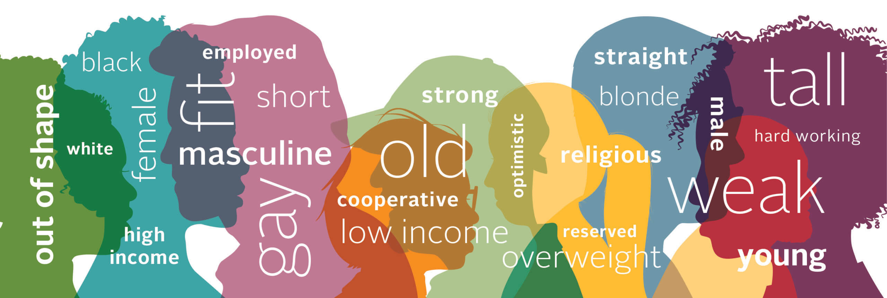
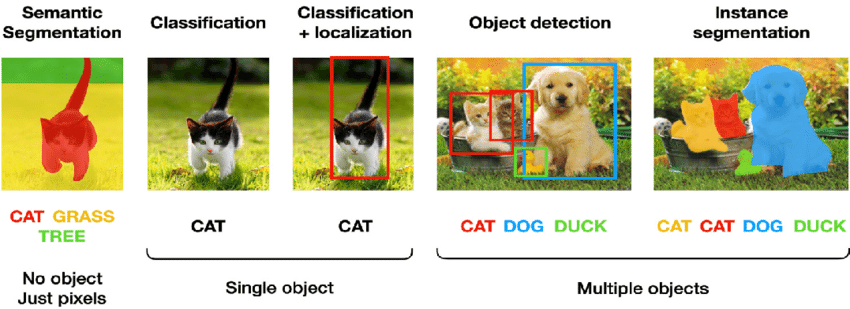

# __DataLab 1: Implicit bias & A Designer's Critical Alphabet__

Today, you will be introduced to the concept of implicit bias, and made familiar with the Open Images dataset. First, we are going to conduct an experiment (i.e. Harvard's Implicit Bias Test). Next, we will perform an EDA on the images, and corresponding meta-data. Later, we will critically assess the dataset in terms of bias, and fairness by applying concepts from A Designer's Critical Alphabet.

## Learning objectives

1. Define the term 'worldview'.
2. Explain how a worldview can be considered unique/personal, as well as shared.
3. Explain the difference between the terms 'implicit', and 'explicit' bias.
4. Assess the Open Images dataset in terms of bias, and fairness by applying concepts from A Designer's Critical Alphabet.

__Table of contents__

1. Q&A and standup: 1 hour
2. Introduction: 1 hours
3. Workshop: 4 hours
4. Additional material (optional): 1 hour
5. Reflection & Work/learning log: 1 hour

## Questions or issues?

If you have any questions or issues regarding the course material, please first ask your peers or ask us in the Q&A in Datalab!

Tip: Note down any important questions you might have!
 

Good luck!

***

## 1) Q&A and Standup

__2a__ Ask questions regarding the independent study material.

__2b__ Answer the following questions:

- What did you do yesterday?
- What will you do today?
- Are there any impediments in your way?

***

## 2) Introduction

In (social) psychology, bias is classified as either conscious ('explicit') or unconscious ('implicit'). Explicit bias occurs when people consciously devalue or hold negative views of a particular group. Implicit bias, on the other hands, refers to the brain’s automatic, instantaneous association of stereotypes and attitudes with particular groups of people (Dovidio, Kawakami, and Gaertner, 2002). These implicit biases are often contrary to our personal values and are formed by the social environments around us (van Nunspeet et al., 2015).

Implicit biases are an example of what Kahneman and Tversky (1974) call 'System 1' thinking.

*Figure 1. Systems of thinking (Kahneman, and Tversky, 1974).*

This mode of thinking is fast, emotional, and unconscious. It requires little effort, but is prone to error.

Let's focus on a more concrete example of implicit bias: Ethnic profiling. A Dutch police officer may be committed to 'protect and serve' its community, and perceive itself as impartial, yet at the same time they can lead a stop and frisk police action that targets a specific ethnic group (e.g. Dutch citizens of Turkish descent). Consciously the police officer is deeply loyal to the idea of protecting the community; however their behavior is inconsistent with those beliefs because they are showing prejudice against certain members of the community.

*Figure 2. Implicit bias.*

The ability to hold these two truths (e.g. 'serve and protect the community', and 'unequal treatment of community members based on ethnicity') and not see them is what makes implicit biases so dangerous.

### 2.1 Implicit bias test

First, we need to uncover our implicit biases. To do so, we are going to conduct a little experiment:

__2.1a__ Take the Implicit Bias test by Harvard University, which you can find [here](https://implicit.harvard.edu/implicit/takeatest.html).

__2.1b__ Reflect upon your result of the Implicit Bias test:

- Are we all bigots?
- What is more dangerous implicit or explicit bias?
- etc.

In-class group exercise.

Unfortunately, we cannot cure ourselves from our implicit biases, but with self awareness we can address them, and hopefully make them less prominent.

### 2.2 Worldview

Now we have identified our implicit biases, we can take a closer look at the possible causes. Some scholars argue that many of the common biases of people brought up in 'The West' (partially) originate from having an Eurocentric worldview.

__2.2a__ Watch the video 'What's your worldview?' by Impact 360 institute:

<iframe width="560" height="315" src="https://www.youtube.com/embed/VXnSE0uvwzM?controls=0" title="YouTube video player" frameborder="0" allow="accelerometer; autoplay; clipboard-write; encrypted-media; gyroscope; picture-in-picture" allowfullscreen></iframe>

*Video 1. What's your worldview?*

__Worldview (definition):__
>We can understand worldview as a mental model of reality. It contains a comprehensive framework of ideas and attitudes about the world, ourselves. Our worldview is shaped by our inherited characteristics (identity), lived experience, values, attitudes, habits and more. These elements of ourselves vary from one person to another. Therefore, even though some parts of a worldview are shared by many people in a community, other parts differ for individuals, so worldviews are both shared and unique ([Source](https://exchange.actua.ca/traininglist/training_en/antiracism/positionality_and_worldview)).

__2.2b__ Read the article [Eurocentrism](https://unm-historiography.github.io/metahistory/essays/postmodern/eurocentrism.html) by Keena Hays to find out how this particular worldview reinforces western beliefs of superiority.

__2.2c__ How does the Mercator map fit within the Eurocentric worldview? In your answer refer to the concept of 'bias', and/or 'fairness'. Write your answer down.

*Figure 3. Mercator world map projection.*

__2.2d__ Give at least three examples of how a worldview such as Eurocentrism can lead to bias in a dataset? Write your answer down.

## 3) Workshop: Open Images & A Designer's Critical Alphabet

In the workshop we are going to investigate how the Eurocentric worldview (i.e. the driving force behind many of our implicit biases) affects famous benchmark image datasets such as Open Images.

To do so, we will use A Designer's Critical Alphabet, which is a tool that helps you to reflect on the design process (of a data science/AI project) by applying concepts of critical theory; a philosophy that, amongst others, involves challenging the prevailing view of society.

By critiquing the status quo, in this case the Eurocentric worldview, we allow for a space where group differences, and multi-cultural viewpoints can be acknowledged, and appreciated; a shared worldview that encompasses for many personal/unique worldviews.

To make it a bit more concrete, let's explore the Open Images dataset, and see how it is influenced by this prevailing worldview:

If you look at images with the class label 'Wedding,' you will see that they often depict a traditional western wedding (e.g., heterosexual couple, white/ivory wedding dress, etc.). A classifier trained on the Open Images dataset will reflect this particular bias; images that deviate from the norm are more likely to be misclassified than images that adhere to the norm.

To mitigate this bias we need to make the data more varied, thus 'inclusive'. There are multiple ways to achieve this goal. For example, we could add additional images of weddings that do not adhere to traditional western norms to the dataset (e.g. LGBTQ+ couples).

First, we need to familiarise ourselves with the Open Images dataset:

__3a__ What is the Open Images dataset? Who created it? For what kind of computer vision tasks can it be used? Write your answer down.

*Figure 4. Types of computer vision tasks.*

__3b__ Start exploring the Open Images dataset by performing an EDA on the images, and corresponding meta-data (e.g. images, and image-level labels).

To make your lives a bit easier, we created a Jupyter Notebook template for the Responsible AI Datalabs :grin:. You can find the template, [here]().

When performing the EDA, try to answer the following questions:

- Which class label might be prone to bias?
- What types of bias can you identify in the dataset?
- At what stage of the CRISP-DM cycle is this particular type bias introduced?
- Whom or which group might be disproportionally affected by this particular form of bias.
- How can we mitigate this particular type of bias?

When you are finished with the EDA, form groups of three, and proceed with the next question:

__3b__ Pick at least three cards from A Designer's Critical Alphabet that will help you, and your team mates to make the Open Images dataset more 'inclusive'. Elaborate on your choice. Notify the lecturer, when finished.

- [A Designer's Critical Alphabet](https://criticalalphabet.com/)

In-class group exercise.

Note: Need further information or have questions? The lecturers will be available throughout the DataLab session.
 

***

## 4) Additional material (optional): Decoloniality

Decoloniality is a school of thought, which

> ... offers an option for thinking and doing beyond the dominant paradigms. it provides a critical analysis of modernity understood broadly as the western project of civilization, while it seeks to overcome the dominion of western epistemology and aesthetics and their embedded eurocentrism and anthropocentrism (Rolando Vázquez, 2021, xvii).

__4a__ Watch the following video: Decolonising Knowledge: What is Decolonisation? by Rolando Vázquez.

<iframe width="560" height="315" src="https://www.youtube.com/embed/1CUKW2h4Dtg?controls=0" title="YouTube video player" frameborder="0" allow="accelerometer; autoplay; clipboard-write; encrypted-media; gyroscope; picture-in-picture" allowfullscreen></iframe>

*Video 2. Decolonising Knowledge: What is Decolonisation?*

__4b__ Define the term 'positionality', and provide a concrete example of the concept. Write your answer down.

__4c__ What does Vázquez mean by 'truthful knowledge'? Explain your answer.

__4d__ In the video Vázquez puts a lot of emphasis on the importance of listening. Why does he do this?

__Decolonial theory: Zone of being/non-being__

As a result of colonization, the world was divided into two zones: one half represented the core (zone of being), while the other half represented the periphery (zone of non-being) (Fanon, et. al., p. 2). By dividing the world along these radical lines, a global hierarchy of superiority and inferiority was established:

*Figure 5. Fanon’s Conception of Racism.*

>As a result of this divide everything south of the equator vanished, became non-existent:
On the other side of the line, there is no real knowledge; there are beliefs, opinions, institutions, and subjective understanding, which at most, may become object or raw material for scientific inquiry. Thus, the visible line that separates science from its modern others is grounded on the abyssal invisible line that separates science philosophy, and theology, on one side, knowledges rendered incommensurable and incomprehensible for meeting neither the scientific methods of truth not their acknowledged contenders in the realm of philosophy and theology (Santos, 2014, p. 120)

European colonizers were seen as superior to the native population, which were often referred to as the ‘other’:

>We went from the sixteenth century characterization of 'people without writing' to the eighteenth and nineteenth century characterization of 'people without history', to the twentieth century characterization of 'people without development' and more recently, to the early twenty first century of 'people without democracy' ([Source](https://www.google.com/url?sa=t&rct=j&q=&esrc=s&source=web&cd=&ved=2ahUKEwiIhcKVl-b1AhUYP-wKHQ86Bn8QFnoECBwQAQ&url=https%3A%2F%2Fujcontent.uj.ac.za%2Fvital%2Faccess%2Fservices%2FDownload%2Fuj%3A42333%2FSOURCE1&usg=AOvVaw0FULOtwDe4i7HmTZPhaNpg)).

This systematic destruction, or 'war' on indigenous knowledges is called epistemicide. Furthermore, the colonizers secured their superior position through violent means: 'Beyond the equator are no sins' (Santos, 2014, p. 121), because copresence of the two sides was deemed impossible (Santos, 2014, p. 118).

***

## 5) Reflection & Work/learning log (16:00-17:00):

__5a__ Fill in your work/learning log.

__5b__ Choose, and provide an answer to at least of the following questions:

1. What surprised you today, and why?
2. What is the most important thing you learned today? Why do you think so?
3. What do you want to learn more about, and why?
4. When were you the most creative, and why do you think that is?
5. What made you curious today? How does learning feel different when you are curious?
6. When were you at your best today, and why?
7. (Assuming we were studying the same thing and you could decide and have access to anything), where would you start tomorrow? Why?
8. What can/should you do with what you know?

***

## Resources

Santos, B. S. (2017). Epistemologies of the South: Justice against epistemicide. London: Routledge/Taylor&Francis.

Vazquez, R. (2021). Vistas of modernity: Decolonial aesthesis and the end of the contemporary. Amsterdam: Mondriaan Fund.
