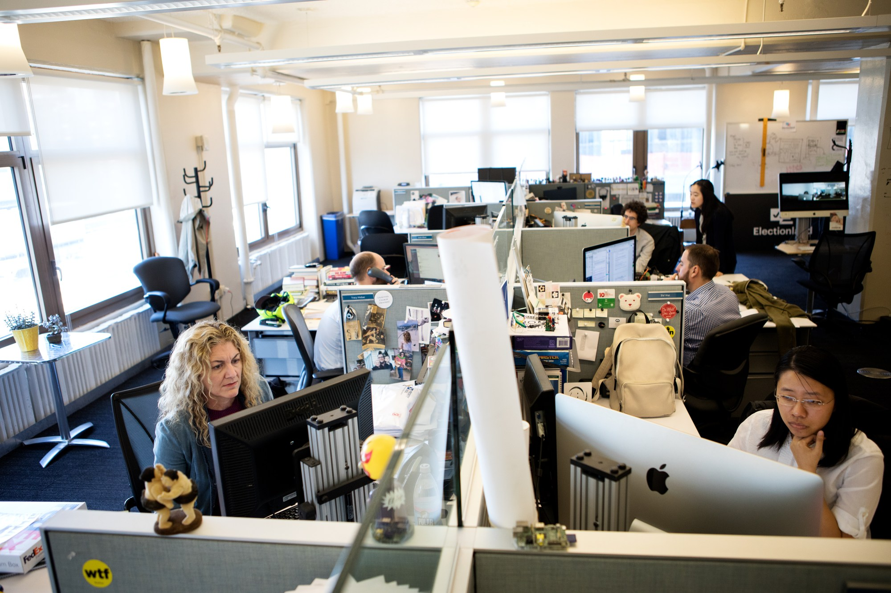
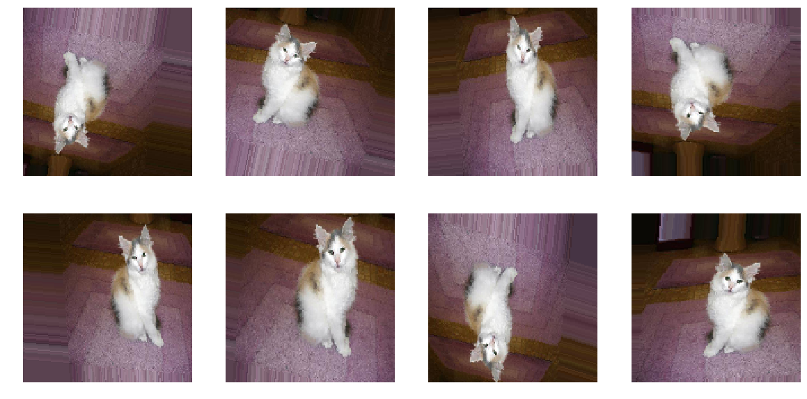

# Fairness & Bias: Individual fairness, debiasing techniques & toolkits

Today's independent study material focuses on 'algorithmic bias', and how you as a data professional can identify, and mitigate this type of bias by deploying 'fairness through awareness' or 'fairness through unawareness' techniques.

## 1) Learning objectives

1. Define the terms' algorithmic bias', and 'individual fairness'.
2. Explain the difference between 'fairness through awareness, and 'fairness through unawareness'.
4. Propose appropriate individual fairness and debiasing techniques for a tabular toy dataset.

__Table of contents__
1. Introduction: 3 hours
2. Workshop: 2 hours
3. Additional material (optional): ... hours

## Questions or issues?
If you have any questions or issues regarding the course material, please first ask your peers or ask us in the Q&A in Datalab!

Tip: Note down any important questions you might have!
 

Good luck!

***

## 1) Introduction

Until now, we have primarily focused on general notions of 'fairness' and 'bias'. Today, we will investigate how these concepts affect data science/AI projects.

### 1.1 What is algorithmic bias?

__1a__ Define the term 'algorithmic bias'. Search the internet for a definition or see the comic book Fairness & Friends by Khan et al. Write your answer down.

For this section, you will need to read a famous investigative article by ProPublica, which defines its work, and mission as follows:

> ProPublica is an independent, nonprofit newsroom that produces investigative journalism with moral force. We dig deep into important issues, shining a light on abuses of power and betrayals of public trust — and we stick with those issues as long as it takes to hold power to account ([Source](https://www.propublica.org/about/)).

*Figure 1. ProPublica's headquarters.*

__1b__ Read the article [Machine Bias](https://www.propublica.org/article/machine-bias-risk-assessments-in-criminal-sentencing) by Angwin et al. (ProPublica), which describes how the risk assessment tool COMPAS is biased against black defendants.

__1c__ Explore the interactive article [The Myth of the Impartial Machine](https://parametric.press/issue-01/the-myth-of-the-impartial-machine/) to see how ML models reproduce historical/societal inequalities.

__1d__ What are the key takeaways of the article 'Machines Bias?', and the tutorial 'The Myth of the Impartial Machine'. Write them down with a maximum of 150 words.

### 1.2 Individual fairness, and debiasing techniques

Fairness metrics can be seen as a quantification of unwanted bias in data or algorithms. These metrics can be divided into two distinct groups:

- Individual fairness: 'The goal of similar individuals receiving similar treatments or outcomes ([Source](https://aif360.mybluemix.net/resources#glossary)).'
- Group fairness: 'The goal of groups defined by protected attributes receiving similar treatments or outcomes ([Source](https://aif360.mybluemix.net/resources#glossary)).'

Note: You will be introduced to the group fairness metrics on Thursday!
 

Let's get a sense of how individual fairness works by looking at a concrete example:

Suppose an algorithm $$\begin{aligned}&M\end{aligned}$$ is being used for college admissions decisions. $$\begin{aligned}&M\end{aligned}$$ offers a prediction in the form of a probability that an applicant should be admitted (range: 0.0-1.0). Suppose two applicants, $$\begin{aligned}&x\end{aligned}$$  and $$\begin{aligned}&y\end{aligned}$$ are very similar: they have similar GPAs
and SAT scores and come from the same high school. $$\begin{aligned}&y\end{aligned}$$ is from a less wealthy family. But this fact is not considered relevant to determining who should be admitted, so the similarity metric ignores it. Thus, the actual distance between the applicants is very small, $$\begin{aligned}&d(x,y)≈ 0.01\end{aligned}$$ . However, $$\begin{aligned}&M\end{aligned}$$ assigns applicant $$\begin{aligned}&x\end{aligned}$$ a score of 0.9, and applicant $$\begin{aligned}&y\end{aligned}$$ a score of 0.7. According to the statistical distance metric suggested by Dwork et al., $$\begin{aligned}&d(Mx, My) = 0.2\end{aligned}$$ in this case. Thus, $$\begin{aligned}&M\end{aligned}$$ would be considered (individually) unfair: applicant $$\begin{aligned}&x\end{aligned}$$ and $$\begin{aligned}&y\end{aligned}$$ are treated dissimilarly, despite being similar ([Source](http://philsci-archive.pitt.edu/18889/1/Fleisher%20-%20Individual%20Fairness.pdf)).

To make our college admissions classifier more fair, we need to minimize the distance between the applicants $$\begin{aligned}&x\end{aligned}$$ , and $$\begin{aligned}&y\end{aligned}$$ . We can either add additional data instances to the dataset or remove existing data instances from the dataset to achieve this goal.

If we think that the unfairness is caused by statistical bias, we should add additional data instances to make our dataset (i.e., sample) more representative. When there is no additional data available, we can also augment our current data; increase the sample by adding slightly modified copies of already existing data or newly created synthetic data from existing data. This approach is called 'fairness through awareness'.

>Generally speaking, statistical bias occurs whenever the data used for model training are not representative of the true population. This can be due to a form of selection bias, i.e. when the individuals appearing in the data come from a non random selection of the full population. This happens, for example, in the context of credit lending, where the information of the repayment is known only for people that were granted the loan. Another way in which statistical bias can enter the data is via systematic measurement errors. This happens when the record of past errors and performance is systematically distorted, especially in the case of different amount of distortion for different groups of people. Similarly, it may happen that data are systematically missing or poorly recorded for entire strata of the population ([Source](https://arxiv.org/abs/2106.00467)).

To get a better understanding of the statistical concepts 'sample', and 'population', see the video below:

<iframe width="560" height="315" src="https://www.youtube.com/embed/jPPF2xSEyKU?controls=0" title="YouTube video player" frameborder="0" allow="accelerometer; autoplay; clipboard-write; encrypted-media; gyroscope; picture-in-picture" allowfullscreen></iframe>

*Video 1. The differences between sample and population.*

If we think that the unfairness is caused by historical or societal bias, we should remove data instances from our dataset.

>Even when the data are free from statistical bias, i.e. they truly represent the population, take into account minorities and there is no systematic error in recording, still it may be that bias exists simply because data reflect biased decisions. In most cases, this is due to a form of labelling bias, i.e. a systematic favour/disfavour towards groups of people at the moment of creating the target variable from which the model is going to learn. If the recorded outcomes are somehow due to human decisions (e.g. a model for granting loans may be trained on loan officers’ past decisions), then we cannot in general trust their objectiveness and “fairness”. Other forms of historical bias may be even more radical: gender bias has a rather long history, and is embedded in all sorts of characteristics and features in such a way that it is difficult or even impossible to evaluate its impact and disentangle its dependence on other variables. Think for example of income or profession disparities, just to name a few out of many. Thus, this is a situation in which long-lasting biases cause systematic differences in features pertaining different groups of people. Again, this is not a form of un representativeness of the sample, it is a bias present in the full population ([Source](https://arxiv.org/abs/2106.00467)).

The classifier is likely sensitive to family wealth since it was trained on historical admissions data. Thus, it might be beneficial to remove one or more wealth-related features from the dataset (e.g., income, neighborhood, etc.). This approach is called 'fairness through unawareness.

Lastly, when the target variable is unevenly distributed (i.e., imbalanced classes), we can create a custom bias initializer. Adjusting the last layer bias parameter in your neural network has a similar effect as changing the threshold of a binary ML algorithm, such as in logistic regression.

For example, in the Oosterhout Youth Care project, some of you had imbalanced classes (e.g., the reason to end care). While the accuracy of these models proved to be high, they performed badly; the model basically learned the bias, i.e., it is improbable that a data instance belongs to the minority class. By changing the threshold, you can account for this kind of bias.

For more information on correctly initializing the bias, see the Responsible AI Datalab Jupyter Notebook template.

__1.2a__ Watch the video on image augmentation and overfitting of Google's Machine Learning Foundations course to see how you can reduce overfitting through applying image augmentation techniques. Overfitting occurs when a model fits too closely to the training set. As a result, the model cannot generalize well to new, unseen data. A common cause of overfitting is statistical bias.

<iframe width="560" height="315" src="https://www.youtube.com/embed/QWdYWwW6OAE" title="YouTube video player" frameborder="0" allow="accelerometer; autoplay; clipboard-write; encrypted-media; gyroscope; picture-in-picture" allowfullscreen></iframe>

*Video 2. Machine Learning Foundations: Ep7 - Image augmentation and overfitting.*

__Tutorial:__

- [Image augmentation in Keras](https://www.analyticsvidhya.com/blog/2020/08/image-augmentation-on-the-fly-using-keras-imagedatagenerator)

*Figure 3. Examples of different augmentation techniques applied to an image depicting a cat.*

__1.2b__ Complete the CodeAcademy module [Learn Web Scraping with Beautiful Soup](https://www.codecademy.com/learn/learn-web-scraping), which teaches you, amongst others, how to scrape the web for images.

***

## 2) Workshop: Fairness metrics in Python (Part 1) & TensorFlow's Responsible AI Toolkit

The workshop related to today's independent study material can be split into two parts:

- Fairness metrics in Python (Part 1)
- TensorFlow's Responsible AI Toolkit

During the first part of the workshop, you will learn how to apply individual fairness, and corresponding debiasing techniques to a binary classification task. For the second part of the workshop, you will explore TensorFlow's Responsible AI Toolkit, which you can find [here](https://www.tensorflow.org/responsible_ai).

### 2.1 Fairness metrics in Python (Part 1)

__2.1a__ Complete the [Responsible AI: Individual fairness metrics](../../Study%20Content/Responsible%20and%20Explainable%20AI/notebooks/individual_fairness_metrics_student.ipynb) notebook.

__Datasets:__

- [German Credit Risk](https://www.kaggle.com/uciml/german-credit)
- [COMPAS](https://www.kaggle.com/danofer/compass)
- [UCI Adult Income](https://www.kaggle.com/wenruliu/adult-income-dataset)

### 2.2 TensorFlow's Responsible AI Toolkit

__2.2a__ List, and describe TensorFlow's five ML workflow steps.

__2.2b__ At each step, explore one of the presented tools (e.g., Know You Data (Beta)).

__2.2c__ What is your opinion on TensorFlow's Responsible AI Toolkit? Was it useful? Did you enjoy working with it? Elaborate on your answer.

__2.2d__ Find, and explore at least one additional Responsible AI tool or Python package. Does this tool or Python package support image data?

***

## 3) Additional material (optional):

This part of the independent study material is optional. You are not required to complete the following questions. However, they will help you to deepen your understanding of the concepts presented in the independent study material.

### 3.1 Cloud Ethics by Louise Amoore

Want to know why algorithms can be seen as 'ethicopolitical' entities? Check out the book Cloud Ethics by Louise Amoore:

> In Cloud Ethics Louise Amoore examines how machine learning algorithms are transforming the ethics and politics of contemporary society. Conceptualizing algorithms as ethicopolitical entities that are entangled with the data attributes of people, Amoore outlines how algorithms give incomplete accounts of themselves, learn through relationships with human practices, and exist in the world in ways that exceed their source code. In these ways, algorithms and their relations to people cannot be understood by simply examining their code, nor can ethics be encoded into algorithms. Instead, Amoore locates the ethical responsibility of algorithms in the conditions of partiality and opacity that haunt both human and algorithmic decisions. To this end, she proposes what she calls cloud ethics—an approach to holding algorithms accountable by engaging with the social and technical conditions under which they emerge and operate.

You can probably order it at [De Vrije Boekhandel](https://www.devrijeboekhandel.nl/) in Breda. #SupportYourLocalBookstore

***

## Next up!
Coming Datalab we will reflect upon today's independent study material, and give you an opportunity to ask any questions you might have.

***

## Resources
