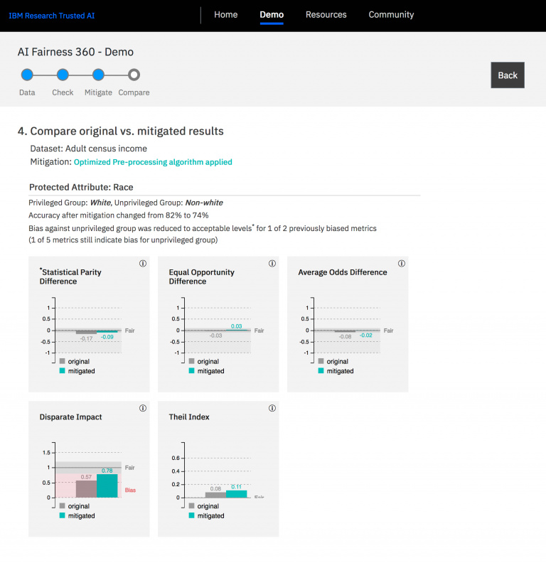
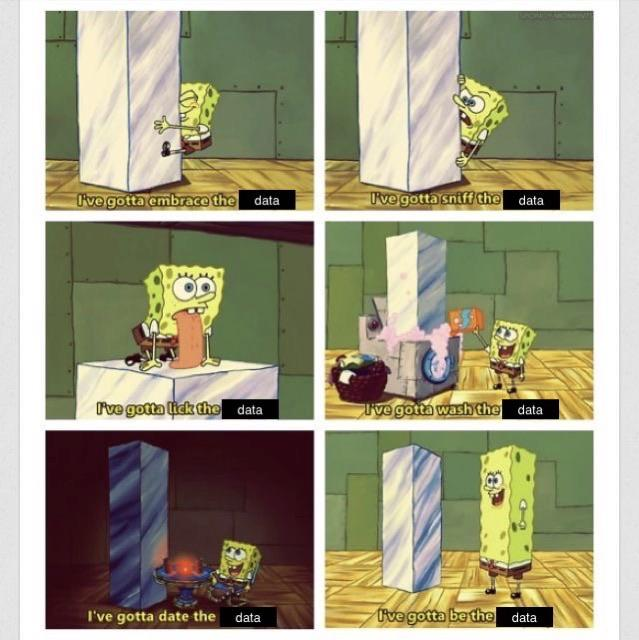

# Decolonizing AI 
### Fairness & Bias: Tools

Today, you will be introduced to various fairness enhancing tools. Special attention will be paid to IBM's AI Fairness 360 Toolkit, which will be used in the responsible AI assignment.

*Figure 1. IBM's AI Fairness 360 Toolkit GUI.*

## 1) Learning Objectives:

1. Select an appropriate fairness enhancing tool (both GUI, and Python code based) for a specific data project.
2. Apply an appropriate fairness enhancing tool (both GUI, and Python code based) for a specific data project.

__Table of contents:__
1. Introduction: 1 hours
2. Workshop: 6 hours
3. Additional material (optional): 10 hours
   3.1 CodeAcademy: Exploratory Data Analysis in Python

## Questions or issues?
If you have any questions or issues regarding the course material, please first ask your peers or ask us in the Q&A in Datalab!

Tip: Note down any important questions you might have!
 

Good luck!

***

## 2) Introduction:

__2a__ Watch the YouTube video Getting Started with the [What-if Tool](https://pair-code.github.io/what-if-tool/) by Google Cloud Tech, and visit the tools' webpage.

<iframe width="560" height="315" src="https://www.youtube.com/embed/qTUUwfG1vSs" title="YouTube video player" frameborder="0" allow="accelerometer; autoplay; clipboard-write; encrypted-media; gyroscope; picture-in-picture" allowfullscreen></iframe>

*Video 1. Getting Started with the What-if Tool by Google Cloud Tech.*

__2b__ Visit Google's Know Your Data webpage, which you can find [here](https://knowyourdata.withgoogle.com/).

__2c__  Visit IBM's AI Fairness 360 Toolkit, which you can find [here](https://aif360.mybluemix.net/).

__2d__ Create an table where you compare the three fairness enhancing tools. Include relevant topics such as supported data types, UX design, accessibility, documentation (e.g. tutorials) etc.

***

## 2) Workshop: Applied responsible AI

Now, we are introduced to the tools, it is time to explore them a bit further. In today's workshop, you will learn to apply the fairness enhancing techniques to a dataset.

### 2.1 Exploration:

__2.1a__ Find at least one dataset online. Not sure where to start? Visit [Kaggle](https://www.kaggle.com/):

>Inside Kaggle you’ll find all the code & data you need to do your data science work. Use over 50,000 public datasets and 400,000 public notebooks to conquer any analysis in no time.

__2.1b__ Use the fairness enhancing tools on your dataset(s). Upload a Jupyter notebook with the results of you analyses to GitHub.

***

## 3) Additional material (optional):

This part of the independent study material is optional. You are not required to complete the following questions. However, they will help you to deepen your understanding of the concepts presented in the independent study material.

### 3.1 CodeAcademy: Exploratory Data Analysis in Python

If you need a bit more practice with performing EDAs, see the learning path [Exploratory Data Analysis in Python](https://www.codecademy.com/learn/eda-exploratory-data-analysis-python)  on CodeAcademy.

*Figure 2. Exploratory data analysis for dummies...*

***

## Next up!
Coming Datalab we will reflect upon today's independent study material, and give you an opportunity to ask any questions you might have.

***

## Resources
