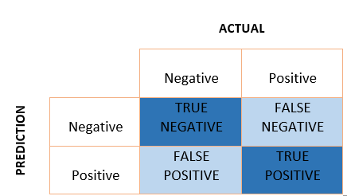
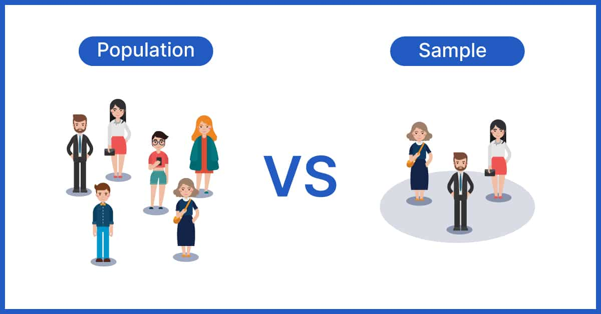

# Fairness & Bias: Group fairness metrics

Today's independent study material will introduce you to the theories behind group fairness metrics, which include, but are not limited to: equalized odds, equal selection parity, and demographic parity. During the workshop, you will learn to apply these metrics to a tabular toy dataset.  

## Learning objectives

1. Compare, and contrast two philosophical 'worldviews': WAE, and WYSIWIG.
2. Compare, and contrast three notions of fairness in AI: 'interdependence', 'sufficiency', and 'separation'.
3. Propose, and apply appropriate group fairness metrics to a tabular toy dataset.

__Table of contents:__
1. Introduction: 3 hours
2. Workshop: 3 hours
3. Additional material (optional): 1 hour
   3.1 Justice as fairness by John Rawls

## Questions or issues?

If you have any questions or issues regarding the course material, please first ask your peers or ask us in the Q&A in Datalab!

Tip: Note down any important questions you might have!
 

Good luck!

***

## 1) Introduction

Most post-processing group fairness metrics are calculated based on a confusion matrix produced by a classification model. The confusion matrix is comprised of four outcomes:

- True positive (TP): the true class is positive and the prediction is positive (correct prediction)
- False positive (FP): the true class is negative and the prediction is positive (incorrect prediction)
- True negative (TN): the true class is negative and the prediction is negative (correct prediction)
- False negative (FN): the true class is positive and the prediction is negative (incorrect prediction)

*Figure 1. Confusion matrix.*

Group fairness metrics are calculated by comparing one or more of these measures across sensitive/protected attribute groups. For example, gender or marital status could be considered such an attribute, with groups 'Female' and 'Male' for gender, and 'Married', 'Not-married' for marital status.

__1a__ Read AXA's [Towards the right kind of fairness in AI](https://axa-rev-research.github.io/static/AXA_FairnessCompass-English.pdf) (p. 1-55).

__1b__ Read the blog post [Starting to think about AI Fairness](https://blogs.rstudio.com/ai/posts/2021-07-15-ai-fairness/) by RStudio.

__1c__ Define the term 'group fairness', and explain how it differs from 'individual fairness'. Write your answer down.

__1d__ Give at least one additional example of a feature that could be seen as a sensitive/protected attribute?

__1e__ Explain the differences between 'independence', 'sufficiency', and 'separation' concerning fair AI.   

###__1.1 Fairness Compass__

To select an appropriate group fairness metric for our (binary) classification task, we will use AxA's [Fairness Compass](https://axa-rev-research.github.io/fairness-compass.html):

####__Step 1: Policy/'worldview'__

- 'We're all equal' (WAE) OR 'What you see is what you get' (WYSIWIG)

>The worldview what you see is what you get (WYSIWYG) assumes
the absence of structural bias in the data. Accordingly, this view
supposes that any statistical variation in different groups actually represents deviating base rates which should get explored. On
the other hand, the worldview we’re all equal (WAE) presupposes equal base rates for all groups. Possible deviations are considered as unwanted structural bias that needs to get corrected ([Source](https://axa-rev-research.github.io/static/AXA_FairnessCompass-English.pdf)).

__Types of bias:__

- Statistical bias (WYSIWIG):

*Figure 1. Population vs. sample.*

>Generally speaking, statistical bias occurs whenever the data used for model training are not representative of the true population. This can be due to a form of selection bias, i.e. when the individuals appearing in the data come from a non random selection of the full population. This happens, for example, in the context of credit lending, where the information of the repayment is known only for people that were granted the loan. Another way in which statistical bias can enter the data is via systematic measurement errors. This happens when the record of past errors and performance is systematically distorted, especially in the case of different amount of distortion for different groups of people. Similarly, it may happen that data are systematically missing or poorly recorded for entire strata of the population ([Source](https://arxiv.org/abs/2106.00467)).

- Historical or societal bias (WAE):

>Even when the data are free from statistical bias, i.e. they truly represent the population, take into account minorities and there is no systematic error in recording, still it may be that bias exists simply because data reflect biased decisions. In most cases, this is due to a form of labelling bias, i.e. a systematic favour/disfavour towards groups of people at the moment of creating the target variable from which the model is going to learn. If the recorded outcomes are somehow due to human decisions (e.g. a model for granting loans may be trained on loan officers’ past decisions), then we cannot in general trust their objectiveness and “fairness”. Other forms of historical bias may be even more radical: gender bias has a rather long history, and is embedded in all sorts of characteristics and features in such a way that it is difficult or even impossible to evaluate its impact and disentangle its dependence on other variables. Think for example of income or profession disparities, just to name a few out of many. Thus, this is a situation in which long-lasting biases cause systematic differences in features pertaining different groups of people. Again, this is not a form of un representativeness of the sample, it is a bias present in the full population ([Source](https://arxiv.org/abs/2106.00467)).

####__Step 2: Fairness metrics__

__Independence (WAE):__

1. 'The proportion of actual positives (i.e. base rate) have to be equal across sensitive/protective subgroups'.

Independence ensures that individuals, who have different sensitive/protected attribute values (A=a \text { or } A=b) , have an equal chance to obtain correct predictions.

In mathematical terms, independence requires the sensitive/protected attribute $A$ to be unconditionally independent of $\hat{Y}$:

$P(\hat{Y}=1 \mid A=a)=P(\hat{Y}=1 \mid A=b), \quad \forall a, b \in \mathcal{A}$

Fairness metric I: 'The number of predicted positives should be equal across sensitive/protective subgroups'

Equal selection parity: (TP privileged subgroup + FP privileged subgroup) = (TP unprivileged subgroup + FP unprivileged subgroup)

OR

Fairness metric II: 'The proportion of predicted positives should be equal across sensitive/protective subgroups'.

Demographic parity: (TP privileged subgroup + FP privileged subgroup)/(TP privileged subgroup + FP privileged subgroup + TN privileged subgroup + FN privileged subgroup) = (TP unprivileged subgroup + FP unprivileged subgroup)/(TP unprivileged subgroup + FP unprivileged subgroup + TN unprivileged subgroup + FN unprivileged subgroup)

Example 1: In total 15 prospective students apply for an undergraduate program; 10 are female, and 5 are male. Equal selection parity is satisfied when the same number of female, and male students are given a favorable outcome (i.e. being invited for an admission interview); e.g. 5 females, and 5 males. Demographic parity is satisfied when their base rates are the same; e.g. 2 females, and 1 male (i.e. the favorable outcome should be assigned to each subgroup of a sensitive/protective attribute at equal rates).

The WAE worldview does not automatically assume that the $Y$ values represent the 'ground truth'; they are constructed through historical or societal bias. The fairness notions related to WAE, independence, thus solely relies on the distribution of features and decisions, namely on ($A$, $X$, $\hat{Y}$) (See Codebook).

__Separation & Sufficiency (WYSIWIG):__

1. 'The proportion of actual positives (i.e base rate) do not have to be equal across sensitive/protective subgroups'.

Example: Research has shown that females are far more likely to suffer from breast cancer than males; 99% of breast cancer patients are female. A fair ML model should take this discrepancy, as a condition, into account.

A. Separation:

Separation ensures that individuals who actually belong to the same class ($Y$), but who have  different sensitive/protected attribute values ($A$), have an equal chance to obtain correct predictions --> TPR (i.e. recall) and/or TNR (i.e. specificity).

In mathematical terms, separation requires the $\hat{Y}$ to be conditionally independent of the sensitive/protected attribute $A$ given $Y$ :

$\begin{aligned}
P(\hat{Y}=1 \mid A=a , Y=y) = P(\hat{Y}=1 \mid A=b , Y=y), \\
& \forall a, b \in \mathcal{A}, y \in\{0,1\} .
\end{aligned}$

Fairness metric I: The true positive rates (TPR) and true negative rates (TNR) should be equal across sensitive/protective subgroups'.

Equalized odds:

(TP privileged subgroup/(TP privileged subgroup + FN privileged subgroup) = (TP unprivileged subgroup/(TP unprivileged subgroup + FN unprivileged subgroup)

AND

(TN privileged subgroup/(TN privileged subgroup + FP privileged subgroup) = (TN unprivileged subgroup/(TN unprivileged subgroup + FP unprivileged subgroup)

Example 2: See Case Study: Breast Cancer in Logistic Regression notebook. Sensitive/protected attribute ($A$) values: 'Male' ($a$) or 'Female' ($b$).

B. Sufficiency:

Suffiency ensures that individuals with identical predictions ($\hat{Y}$), but with different sensitive/protected attribute values ($A$), have an equal chance to obtain correct predictions --> PPV (i.e precision) and/or NPV.

In mathematical terms, sufficiency requires the $Y$ to be conditionally independent of the sensitive/protected attribute $A$ given $\hat{Y}$:

$\begin{aligned}
P(Y=1 \mid A=a, \hat{Y}=1) = P(Y=1 \mid A=b, \hat{Y}=1), \\
& \forall a, b \in \mathcal{A},
\end{aligned}$

Fairness metric II: 'The positive predictive value (PPV) should be equal across sensitive/protective subgroups'.

Predictive parity/Precision/PPV : TP privileged subgroup/(TP privileged subgroup + FP privileged) = TP unprivileged subgroup/(TP unprivileged subgroup + FP unprivileged)

Example 3: See Case Study: Spam Email in Logistic Regression notebook. Sensitive/protected attribute ($A$) values: 'Email written in Dutch' ($a$) or 'Email written in English' ($b$).

####__Codebook__

| Mathematical notation | Description |
|---|---|
| $Y$ | 'True'/'Actual' label (i.e. 'negative'/'unfavourable' = 0, and 'positive'/'favourable' = 1)|
| $\hat{Y}$ | Predicted label (by ML model) (i.e. 'decisions')|
| $A$ | Sensitive/protected attribute (binary) class/subgroup label (i. e. 'negative'/'underprivileged' = 0, and 'positive'/'privileged' = 1)|
| $X$ | Features (a.k.a independent variables or predictors) |

***

## 2) Workshop: Fairness metrics in Python

Now, we are introduced to various group fairness metrics, it is time to deepen our knowledge. In the workshop, you will learn how to apply these metrics in an binary classification task.

__2a__ Complete the [Responsible AI: Group fairness metrics]() notebook.

***

## 3) Additional material (optional)

This part of the independent study material is optional. You are not required to complete the following questions. However, they will help you to deepen your understanding of the concepts presented in the independent study material.

### 3.1 Justice as fairness by John Rawls

Stanford Encyclopedia of Philosophy is a trustworthy online source that provides extensive information on philosophy, and related fields. You can access their entry on the philosopher John Rawls, [here](https://plato.stanford.edu/entries/rawls/).

In addition, The School of Life, also has provides high quality videos on various philosophical topics. See YouTube video on Rawl's political theory:

<iframe width="560" height="315" src="https://www.youtube.com/embed/5-JQ17X6VNg" title="YouTube video player" frameborder="0" allow="accelerometer; autoplay; clipboard-write; encrypted-media; gyroscope; picture-in-picture" allowfullscreen></iframe>

*Video 2. Political Theory, John Rawls.*

***

## Next up!

Coming Datalab we will reflect upon today's independent study material, and give you an opportunity to ask any questions you might have.

***

## Resources

Castelnovo, A., Crupi, R., Greco, G., & Regoli, D. (2021). The zoo of Fairness metrics in Machine Learning. arXiv preprint arXiv:2106.00467.

Ruf, B., & Detyniecki, M. (2021). Towards the Right Kind of Fairness in AI. arXiv preprint arXiv:2102.08453.
