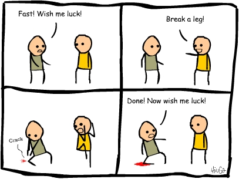

# DataLab 2: Responsible AI Assignment

In today's DataLab session, you are going to display your responsible AI, and scikit-learn skills by completing an assignment.

## 1) Learning Objectives:

- Import Python packages/libraries.
- Load an aif360 dataset.
- Apply appropriate (fairness enhancing) processing techniques to the dataset.
- Select appropriate ML model to fit on the dataset.
- Apply appropriate fairness enhancing techniques to the output of the ML model.
- Evaluate the performance of the ML in terms of fairness.

__Table of contents:__
1. Q&A and standup: 1 hour
2. Assignment: 6 hours
3. Reflection & Work/learning log: 1 hour

## Questions or issues?
If you have any questions or issues regarding the course material, please first ask your peers or ask us in the Q&A in Datalab!

Tip: Note down any important questions you might have!
 

Good luck!

***

## 2) Q&A and Standup:

__2a__ Ask questions regarding the independent study material.

__2b__ Answer the following questions:

- What did you do yesterday?
- What will you do today?
- Are there any impediments in your way?

***

## 3) Assignment:

You can find the assignment, as a Jupyter Notebook template [here](./data/Responsible_AI_Assignment.ipynb).

*Figure 1. Now is your time to shine...*

Note: This assignment evaluates your responsible AI, and scikit-learn skills. Therefore, it should be completed individually!

Need further information or have questions? The lecturers will be available throughout the DataLab session.

Good Luck :shamrock:!

The teaching team

***

## 4) Reflection & Work/learning log (16:00-17:00):

__4a__ Fill in your work/learning log.

__4b__ Choose, and provide an answer to at least of the following questions:

1. What surprised you today, and why?
2. What is the most important thing you learned today? Why do you think so?
3. What do you want to learn more about, and why?
4. When were you the most creative, and why do you think that is?
5. What made you curious today? How does learning feel different when you are curious?
6. When were you at your best today, and why?
7. (Assuming we were studying the same thing and you could decide and have access to anything), where would you start tomorrow? Why?
8. What can/should you do with what you know?

***

## Resources
