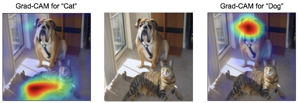

# __Responsible AI__

For the module Responsible AI of the Creative Brief, you need to identify, and describe the limitations of a deep learning based AI algorithm in terms of bias, fairness, transparency, and interpretability, and subsequently apply methods that address these limitations.

The module is comprised of two parts:

- Fairness and Bias (Week 1)
- Transparency and Interpretability (Week 7)



*Figure 1. Example of feature attribution with Grad-CAM.*

For more information on the module, please refer to the Assessment Rubric (ILO 3.1), and the use-cases for Responsible AI, which you can find [here](https://adsai.buas.nl/Study%20Content/Responsible%20and%20Explainable%20AI/UseCases.html). 

## __Requirements__

In order to solve the Creative Brief, you are expected to adhere to the following requirements:

- [ ] Perform an EDA on the dataset with the goal to identify, and describe an instance of bias in the Imsitu dataset. 

- [ ] Discuss a possible ramification (e.g., harm) in terms of fairness of the identified bias instance in the Imsitu dataset.

- [ ] Mitigate bias in the Imsitu dataset by proposing a 'Fairness Through Unawareness' or 'Fairness Through Awareness' method.

- [ ] Create a subset of images from the Imsitu dataset, taking the project's business element into account (ILO 1.1).

- [ ]  Write Python functions that calculate and return the outcomes of a pre-defined set of group fairness metrics. 

- [ ] Build, train, and evaluate a binary classification model on its group level fairness by writing a Python function that returns an appropriate fairness metric, and corresponding calculation.

- [ ] Apply one/multiple explainable AI method(s) to the image classifier. 


## __Deliverable(s):__

- A Jupyter notebook, named ```[student number]_responsible_ai.ipynb```, containing relevant Python code snippets and written explanations. You can find the file in your personal BUAs GitHub repository. 
- A completed ```calculate_metrics.py``` file, which is provided in your personal BUAs GitHub repository. 

__The Jupyter notebook, and the aforementioned Python script are to be uploaded to Github no later than 5pm on last DataLab day.__

***