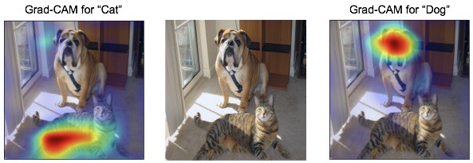

# __Responsible & Explainable AI__

## __Assignment__

For this part of the Project Brief, you are going to identify, and describe the limitations of an AI algorithm in terms of fairness, transparency, and interpretability, and subsequently apply methods that address these limitations.

*Figure 1. Example of feature attribution with Grad-CAM.*

__Deliverable(s):__

- A Jupyter/Colaboratory Notebook that contains relevant code and explanations.

The Jupyter/Colaboratory notebook is to be uploaded to GitHub no later than 5pm on last DataLab day. Confer with a lecturer beforehand if you are handing in something other than a Jupyter/Colaboratory Notebook.

***

## __Literature__

Castelnovo, A., Crupi, R., Greco, G., & Regoli, D. (2021). The zoo of Fairness metrics in Machine Learning. arXiv preprint arXiv:2106.00467.

Khan, F. A., Manis, E., & Stoyanovich, J. (2021, March). Fairness and Friends. In Beyond static papers: Rethinking how we share scientific understanding in ML-ICLR 2021 workshop.

Linardatos, P., Papastefanopoulos, V., & Kotsiantis, S. (2021). Explainable AI: A review of machine learning interpretability methods. Entropy, 23(1), 18.

Mehrabi, N., Morstatter, F., Saxena, N., Lerman, K., & Galstyan, A. (2019). A survey on bias and fairness in machine learning. arXiv preprint arXiv:1908.09635.

Mohamed, S., Png, M. T., & Isaac, W. (2020). Decolonial AI: Decolonial theory as sociotechnical foresight in artificial intelligence. Philosophy & Technology, 33(4), 659-684.

Molnar, C. (2020). Interpretable machine learning. https://christophm.github.io/interpretable-ml-book/.

Responsible AI practices: Interpretability. (n.d.). Retrieved July 09, 2021, from https://ai.google/responsibilities/responsible-ai-practices/?category=interpretability

Suresh, H., & Guttag, J. V. (2019). A framework for understanding unintended consequences of machine learning. arXiv preprint arXiv:1901.10002.

Tsimenidis, S. (2020). Limitations of Deep Neural Networks: a discussion of G. Marcus' critical appraisal of deep learning. arXiv preprint arXiv:2012.15754.
