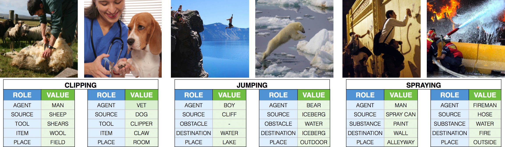
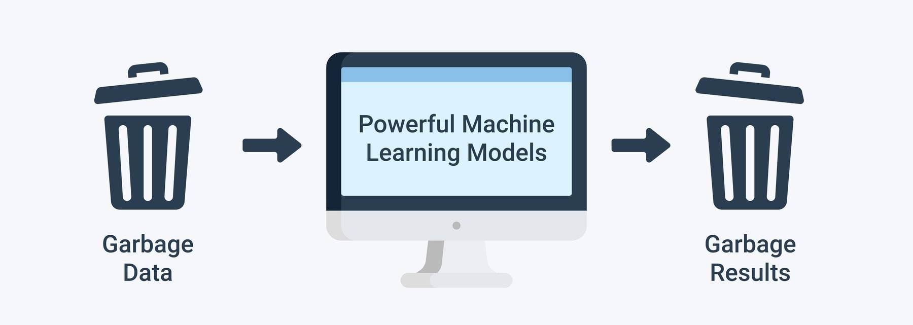
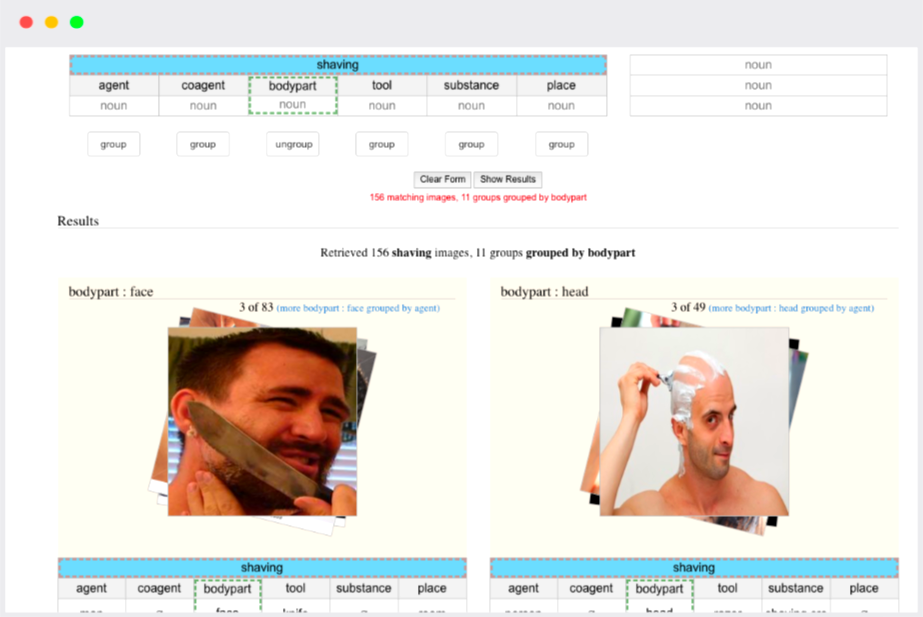

# DataLab: Creative Brief



*Figure 1. Overview data format Imsitu dataset.*

## Responsible AI

The knowledge module Responsible AI consists of two parts: Use-case 1-5 (Topic: Bias and Fairness) are related to the independent study material of Week 1. Use case 6 (Topic: Transparency and Interpretability) is related to the independent study material of Week 7.

In this project, you will develop an image classifier that is unbiased, transparent, interpretable, and thus, if needed, supports fair decision-making. 

Large, publicly available image datasets, such as ImageNet, Imsitu, Open Images and Conceptual Captions are commonly used to develop and rank image classification algorithms. While these datasets are a necessary and critical part of developing useful machine learning (ML) models, some open-source data may be biased. As patterns in such datasets ultimately decide what an artificial intelligence (AI) model learns and predicts, such bias may lead us to develop models that may not necessarily reflect the true reality or reinforce a reality, which from an ethical viewpoint, is considered undesirable.

For example, the images below show the predictions of a standard deep learning-based image classifier trained to predict if a given image represents a wedding or not. While the AI correctly detects a wedding in the first three images, it fails to do so in the last image. This is a consequence of developing an AI algorithm without being sensitive to biases that might exist in the training data.


*Figure 2. Open Images bias.*

## Use-cases

Here is a table of the use-cases and their description.

| Use-Case | Description | Dataset | Data Source/Author | Link
|----------|-------------|-------------|-------------|-------------|
| 1 | Identify, and describe bias | Full dataset | Imsitu | [clicky](https://edubuas-my.sharepoint.com/:u:/g/personal/blerck_i_buas_nl/EcXfm8dsKF5KlC2gkitmN64B7ol4__XeaofN-SN3ZyoHGQ?e=9kOUWl)
| 2 | Propose individual fairness method| Full dataset | Imsitu | [clicky](LINK TO RESPONSIBLE_AI.IPYNB)
| 3 | Create a subset of images from the original dataset | Custom subset | Imsitu | [clicky](https://edubuas-my.sharepoint.com/:u:/g/personal/blerck_i_buas_nl/EcXfm8dsKF5KlC2gkitmN64B7ol4__XeaofN-SN3ZyoHGQ?e=9kOUWl)
| 4 | Write Python functions; group fairness metrics| Assigned subset | Imsitu, ADS&AI Teaching Team | [clicky](LINK TO DUSTING DATASET IN MICROSOFT TEAMS)
| 5 | Write Python function; group fairness taxonomy  | Custom subset | N.A. | N.A.
| 6 | Apply one/multiple explainable AI method(s) to the image classifier | Custom subset | Imsitu, You... | N.A.

:bell: Before we start, please make sure you have read the sections on Deliverables and Plagiarism you can find in the bottom of this page.

**Let's get started: Keep the coffee flowing and the music playing!**

:thumbsup: :headphones: :coffee:

## Use-case 1: Identifying, and describing bias

This block places emphasis on data modeling, a key element of the CRISP-DM data science lifecycle. However, before we can build, train, and evaluate a ML model, we need to get an understanding of the task and data at hand. Additionally, we may need to apply some data cleaning and processing techniques to prepare the data for analysis. One common saying in the field of Data Science and AI is 'Garbage in, garbage out'. In other words, if the data is not cleaned and processed sufficiently, the results of the analysis will be worthless. 



*Figure 3. 'Garbage in garbage out'.* 

In this use-case, which is related to the 'Poor' criteria of ILO 3.1, you will be asked to perform an EDA on the dataset with the goal to identify, and describe an instance of bias. In addition, you will be asked to discuss a possible ramification (e.g., harm) in terms of fairness of the identified bias instance.

:bell: You may use the Imsitu dataset [GUI interface](http://imsitu.org/browse/) to search for bias instances:



*Figure 4. Imsitu GUI interface.*

__To solve this use-case, you will need to:__

- [ ] Define the concept of bias in relation to the Imsitu dataset, and a computer vision task.
- [ ] List, and describe the type of bias that you identified in the Imsitu dataset.
- [ ] Discuss the possible ramification (e.g., harm) in terms of fairness of the identified bias instance:
    - [ ] Why, and when, is this particular instance of bias undesirable? In other words, who might be disproportionally affected by this particular instance of bias, and when does this negative effect come into play?

To get started, you can use the [Critical Alphabet](https://criticalalphabet.com/), which is a tool that helps you to reflect on the design process (of a data science/AI project) by applying concepts of critical theory; a philosophy that, amongst others, involves challenging the prevailing view of society. In turn, this will help you to identify instances of bias in the dataset. 

## Use-case 2: Propose individual fairness method

Unfortunately, most of the current fairness enhancing techniques only apply to tabular data. Our project is focused on image data. Thus, to solve this use-case, which is related to ILO 3.1's 'Insufficient', you have to be creative. One way to mitigate bias is by applying the 'Fairness Through Unawareness' pre-processing method, which basically means that you remove as much 'sensitive' data as possible. Sometimes, you do not want to remove any data instances. For example, when you already have a relatively small dataset. 

:bell: Remember, Artificial Neural Networks (ANNs) generally require a vast amount of training examples! 

Another method to mitigate bias, which does not reduce the size of your dataset, is 'Fairness Through Awareness'. This pre-processing method aims to make the dataset more inclusive (and thus representative) by adding an additional, purposely specified, set of data instances to the dataset. 

__To solve this use-case, you will need to:__

- [ ] Identify a sensitive/protected attribute in the Imsitu dataset.
- [ ] Mitigate bias in the Imsitu dataset by applying the 'Fairness Through Unawareness' or 'Fairness Through Awareness' method to this sensitive/protected attribute.
- [ ] Elaborate on the individual fairness method that you applied, and why you think it is a good method to mitigate bias in the Imsitu dataset.

## Use-case 3: Create a subset of images from the original dataset

In this use-case, which is related to ILO 3.1's 'Insufficient', you will be asked to create a subset of images from the Imsitu dataset, taking the project's business element into account (ILO 1.1). The subset should contain three disjoint splits: a training set, a validation set, and a test set. 

:pencil: By 'disjoint' we mean that the images in the training set, the validation set, and the test set should not overlap! Overlapping images will result in data leakage, which will lead to biased results :see_no_evil:.

__To solve this use-case, you will need to:__

- [ ] Select one or more classes from the Imsitu dataset (e.g., a noun, agent, etc, or a combination of them), which preferentially encompass more than 100 images.
- [ ] Create a training set that contains images from the selected classes. 
- [ ] Create a validation set that contains images from the selected classes.
- [ ] Create a test set that contains images from the selected classes.

For more information on how to create a subset of images from the original dataset, click [here](https://adsai.buas.nl/Study%20Content/Responsible%20and%20Explainable%20AI/UseCasesDetailed.html). 

:bell: Low on (training) images? You are allowed to add more images to your custom image dataset. For example, you can use the ohyicong's [Google-Image-Scraper](https://github.com/ohyicong/Google-Image-Scraper) project on GitHub to scrape images from Google Images.

:pencil: A training set commonly contains approximately 80% of the images, the validation set contains 10% of the images, and the test set contains 10% of the images.

:pencil: For a binary classification task you can either have one class as the positive class, and all the other classes as the negative class (e.g., dog vs. no dog), or you can have one class as the positive class, and another class as the negative class (e.g., dog vs. cats). 

## Use-case 4: Write Python functions; group fairness metrics

In this use-case, which is related to the 'Sufficient' criteria of ILO 3.1, you will be asked to apply a post-processing bias mitigating method to the output of a binary classification model. To do so, you will need to write Python functions to calculate a set of group fairness metrics. 

The teaching teams has trained a binary classification model on a subset of the Imsitu dataset; depicting a man or woman (i.e., nouns: agents), who is either dusting or performing another activity (i.e., verb). The protected/sensitive attribute is gender, and for the sake of the exercise, we used the categories 'Female' for the privileged group (i.e., overrepresented in the dataset), and 'Male' for the unprivileged group (i.e., underrepresented in the dataset. In addition, the unfavorable/negative prediction is 'dusting_no', and the favorable/positive prediction is 'dusting_yes'.   

In addition, we created two test sets:

1. 50 images of men dusting, and 50 images of men performing another activity.
2. 50 images of women dusting, and 50 images of women performing another activity. 

You can find the dusting dataset, [here](ADD MICROSOFT TEAMS LINK]. 

To evaluate the fairness of the binary classification model, we created a confusion matrix for each test set; one for the male agent and another for the female agent.

If our binary classification model contains bias, then the outcomes of the group fairness metrics will be different for the two test sets. In practice, this means that the model will make biased predictions, which in turn may harm individuals by instigating or facilitating an unfair decision-making process. For example, when we use our biased classifier to select images for an advertisement campaign, it may only select images of females dusting, thereby reinforcing the (harmful) stereotype that females are homemakers, and males are breadwinners.

__To solve this use-case, you will need to:__

- [ ] Set up the equations for following group fairness metrics:
    - [ ] Demographic Parity
    - [ ] Predictive Parity 
    - [ ] Equal Selection Parity
    - [ ] Conditional Use Accuracy Equality
    - [ ] Equalized Odds
    - [ ] Equalized Opportunities
    - [ ] Predictive Equality
- [ ] Write a separate Python function for each of the group fairness metrics that you defined above. Use the ```load_confusion_matrices():``` function to load the confusion matrices for the protected/sensitive attribute test sets into the group fairness metrics. See ```calculate_metrics.py``` file, which is provided in your personal BUAs GitHub repository.
- [ ] Pass the unit tests listed in the ```test_calculate_metrics.py``` file, which is provided in your personal BUAs GitHub repository.
- [ ] Propose a suitable group fairness metric for the dusting classification task. Explain your choice. Use the ```[student number]_responsible_ai.ipynb``` file, which is provided in your personal BUAs GitHub repository, to write down your answer.

:bell: You may use AXA's [The Fairness Compass](https://www-axa-com.cdn.axa-contento-118412.eu/www-axa-com/d6324958-367e-4375-81c3-cfeb8e7ccc66_AXA_FairnessCompass-English.pdf).

For more information on how to set up the group fairness metric, click [here](https://adsai.buas.nl/Study%20Content/Responsible%20and%20Explainable%20AI/UseCasesDetailed.html). 

## Use-case 5: Write Python function; group fairness taxonomy 

In this use-case, which is related to the 'Excellent' criteria of ILO 3.1, you will be asked to build, train, and evaluate a binary classification model on its group level fairness by writing a Python function that returns an appropriate fairness metric, and corresponding calculation. To successfully solve this use-case, you will need to use AXA's [Towards the Right Kind of Fairness in AI](https://www-axa-com.cdn.axa-contento-118412.eu/www-axa-com/d6324958-367e-4375-81c3-cfeb8e7ccc66_AXA_FairnessCompass-English.pdf), and the Python functions that you wrote for use-case 3.

__To solve this use-case, you will need to:__

- [ ] Define a binary classification task using a dataset of your choice. It does not have to be a image dataset, you can also use a tabular one, such as COMPAS. However, make sure that the dataset has least one feature that can be used as a sensitive/protected attribute.
- [ ] Specify a sensitive/protected attribute in the dataset.
- [ ] Train a binary classification model on the dataset. 
- [ ] Evaluate the binary classification model's fairness on a group level by writing a Python function for the group fairness taxonomy, based on AXA's Fairness Compass.
- [ ] Elaborate on your approach, the choices you made, and results of the fairness evaluation (e.g., determination of suitable group fairness metric, outcome of group fairness metric calculation, etc.). Use the ```[student number]_responsible_ai.ipynb``` file, which is provided in your personal BUAs GitHub repository.
- [ ] Test your group fairness function by writing a unit test with the Python package ```pytest```.

For more information on to create the group fairness taxonomy function, click [here](https://adsai.buas.nl/Study%20Content/Responsible%20and%20Explainable%20AI/UseCasesDetailed.html). 

## Use-case 6: Apply one/multiple explainable AI method(s) to the image classifier

:yellow_heart::raised_hands::dancer::snake::computer:

If you have come this far, you have now completed the creative brief section for the knowledge module Responsible AI. Congratulations! :tada: :tada: :tada:

:trophy: If you still have time remaining, please have a look at the Medal Challenges!

## Deliverables

If you are done with the use-cases, you can move on to documentation, ensure that you have saved and committed all your work to Github. Documentation is a very important part of the project, and you will need to ensure that you have a project proposal presentation, a Python script called ```calculate_metrics.py``` and a Jupyter Notebook called ```[student number]_responsible_ai.ipynb```, which clearly communicate your your findings. 

:bell: Please, rename the notebook by adding your student number, - e.g., ```12345678_responsible_ai.ipynb```. 

Start to work on the Responsible AI use-cases as soon as possible. Do not wait until Week 8 to start with your project proposal presentation or Jupyter Notebook. You will need to work on the project proposal presentation and Jupyter Notebook in stages.

## Plagiarism

Please note that plagiarism is a serious offense. You are encouraged to use the internet to help you with your analyses, but you must ensure that you cite your sources. However, if your code, and/or accompanied explanation(s) (e.g.,inline-comments, texts in markdown block, etc.), exactly resembles the code, and/or explanation(s) of another student, you will be reported to the Board of Examiners. You are encouraged to discuss the use-case with your peers, but you must ensure that you write your own code, and provide your own explanation(s). If you are unsure about whether your code, and/or explanation(s) are similar to another student's code, and or explanation(s), please ask your mentor to review your code, and/or other writings.

***

