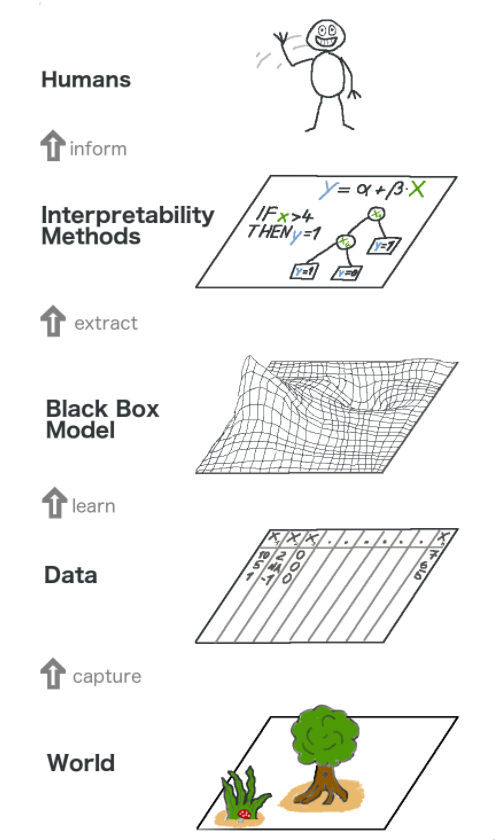
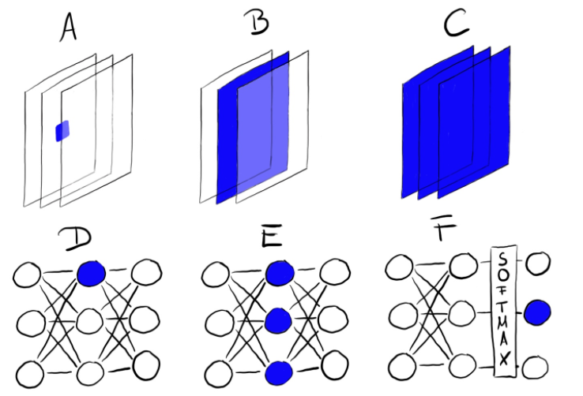

# XAI: The need for explanations!

<figure>
    
</figure>
<br>


As you go deeper in your AI journey, you may have noticed that deep Learning, while being really accurate in making a prediction, is pretty lousy in helping us understand how does it get there. From childhood, we are conditioned to think of the world in the context of explanations. Kids, and adults alike
always seek **answers to the *why* questions**. So should we not expect AI to
also provide us such answers?

> This course is based on the **Interpretable Machine learning** textbook by Christoph Molnar, which you can access for free [here](https://christophm.github.io/interpretable-ml-book/). 

*This 1 week module is designed to raise awareness of explainable AI and introduce you to some commonly available tools. You are not expected to gain a deep understanding of how these methods work and will have time (and resources) to do so in years 3 and 4 of your study.*

## Today's learning objectives
- [ ] Understand the motivation for explainable machine learning & AI (XAI).
- [ ] Become familiar with the taxonomy of XAI methods.


## Interpretable machine learning and AI

<figure>
    
</figure>
<br>


Interpretability (or explainability) implies that in the context of predictive modelling, the model is not only able to predict outcomes accurately, but
also explain how the model arrives at it's outcomes.

One of the easiest ways to make AI more transparent is to use a model that is easy to interpret. You have earlier comes across examples of such models. Traditional machine learning models such as a simple linear regression, logistic regression, k-nearest neighbours, k-meabs, and decision trees all have the inherent property of explainability. 

However, sometimes the most interpretable model is not the most accurate. Think about deep neural networks for example, or a XGBoost model with a lot of features. They are more accurate than a linear model (in some cases), but are harder to explain. In such cases, it becomes desirable to have XAI methods that can help us understand the model, but having the desirable feature that these methods can generalise across model. Such methods are termed **model-agnostic XAI methods** and we will discover more about these methods in this week. 

For the rest of this week, we are going to investigate few popularly used model-agnostic XAI methods to make AI more explainable. We start with methods commonly applied to tabular data, and end the week with an examples of neural-network specific XAI methods. It is beyond the scope of this course to explore all XAI methods in detail. However, the methods presented here form the basis for other methods; and I recommend you to explore all methods during weeks 9 and 10.

## Taxonomy of XAI methods

Model-agnostic XAI can further be categorized into **global** and **local** methods. Global methods aim to expain how the model arrives at it's predictions on average (i.e., global behavour). Local methods, on the other hand are more interested in explaining a single prediction .

:bell: A Global method is one that aims to explain the model as a whole. Such methods are often used to identify the most important features in the model. For example, if we are building a machine learning model to predict TV viewership ratings, a global XAI method will help us understand the key features which influence TV viewerships, but will not help explain why a given rating is predicted for a specific set of input features. 

:bell: A Local method is one that aims to explain a single prediction (e.g., why does my model assign the label cat to this image; or why is this specific person denied a credit limit raise).  

Today, we are going to explore two introduce global XAI methods: Partial Dependence Plots (PDP) and Local Interpretable Model-agnostic Explanations (LIME). We will end today by briefly talking about how to explain the predictions of neural networks. You will learn more about local XAI methods (e.g., SHAP values) as you progress through the study programme in Y2 and Y3.


## Partial Dependence Plots (PDP)

We start one of the most commonly used global model-agnostic XAI methods to explain the results of a machine learning algorithm applied to tabular data- *Partial Dependence Plots (PDP)*. A PDP is used to understand the impact of a feature variable on the predicted outcome, taking into account all possible values of other features. In simpler terms, irrespective of the model used, a PDP helps us undestand the importance of a given feature towards predicting the outcome while averaging out the effect of all other features used in the model. To see PDPs in action, please read through:

1. The Bike rentals datasets [clicky](https://christophm.github.io/interpretable-ml-book/bike-data.html)
2. Example of PDP applied to the Bike rental dataset. [clicky](https://christophm.github.io/interpretable-ml-book/pdp.html#examples)

> Please keep in mind that PDPs are applicable only to tabular data. The goal of this workshop is to provide you with an intuitive understanding of how PDPs work, and how to interpret them. If you are curious to learn more about their technical underpinnings, please click [here](https://christophm.github.io/interpretable-ml-book/pdp.html).


## Local interpretable model-agnostic explanations (LIME)

LIME is the based on the concept that sometimes, it's simpler to use a white-box model to explain the predictions of a black-box model i.e., a **surrogate model**. LIME uses the predictions obtained by a black-box model (e.g., a neural network) as training data to a white-box model (e.g., a  linear regression model) to explain individual predictions of the black box model. A key advantage of LIME is that it is applicable to tabular, text, as well as image data. However, unlike PDPs, LIME is an example of a local method (duh, it's in the name). It's important to remember that rather than try to explain the whole model, LIME instead aims to explain how the black-box models arrive at a certain prediction, given a specific input. Please watch this brief video to learn more about LIME.

<!-- blank line -->
<figure class="video_container">
<iframe width="560" height="315" src="https://www.youtube.com/embed/hUnRCxnydCc" title="YouTube video player" frameborder="0" allow="accelerometer; autoplay; clipboard-write; encrypted-media; gyroscope; picture-in-picture" allowfullscreen></iframe>
</figure>
<!-- blank line -->


## Explaining neural networks

Before we go deeper in explaining the predictions of neural networks (for machine vision), Lets take a step back and reflect on our own amazing ability to process, represent and reason about images. Starting with our eyes, whis is (in a very simple way) a lens which is highly sensitive to photons. However, the brain is where the magic happens. The brain takes in all these signals arising from individual photos and turns it into something that we can reason about.

Just as neural networks transform data from the original raw representations into nice representations, the brain transforms our senses from complicated high-dimensional data into nice representations, from the incomprehensible to the comprehensible. My eye detects photons, but before I even become consciously aware of what my eye sees, the data goes through incredibly sophisticated transformations, turning it into something I can reason about. The brain does such a good job that vision seems easy! **It’s only when you try to understand visual data a stream of photons hitting a sensor) without using your visual system ( that you realize how incredibly complicated and difficult it can be.**

<!-- blank line -->
<figure class="video_container">
<iframe width="560" height="315" src="https://www.youtube-nocookie.com/embed/MgMNUne9j9c?controls=0" title="YouTube video player" frameborder="0" allow="accelerometer; autoplay; clipboard-write; encrypted-media; gyroscope; picture-in-picture" allowfullscreen></iframe>
</figure>
<!-- blank line -->

This morning, you saw the tip of the vast iceberg that is explainable AI. Now,
let's sink a bit deeper and explore why XAI methods are becoming more important,
the answer to this question like the answer to a lot of other questions is  -
*Deep Learning*. 

> The exponential use of neural networks and deep learning in
various domains of application has led to a growing sense of dread -
**How do we trust these machines?!**. The general concensus is that neural
networks need to be interpretable to humans, especially in high-stakes decision making scenarios. 

In general, there are two
approaches to make neural networks more interpretable:
- [ ] Feature visualization.
- [ ] Feature attribution.


## Feature visualization

Similar to the vision processing layers in our brain, Deep neural networks
attribute their performance to their capability of
learning high-level features in the hidden layers. This is one of their
greatest strengths and reduces the need for feature engineering. For image
classification, with traditional ML, we would start by creating hand-crafted
features based on color, frequency domain, edge detectors and so on. While easy to explain how one arrives at such features, they are not necessarily the best features for prediction.

<figure>
    
    <figcaption>[Source: Interpretable ML Textbook)</figcaption>
</figure>
<br>


With convolutional neural networks and deep learning, the image is fed into the
network in its raw form (pixels). The network transforms the image many times.
First, the image goes through many convolutional layers. In those convolutional
layers, the network learns new and increasingly complex features in its layers.
Then the transformed image information goes through the fully connected layers
and turns into a classification or prediction. While this results in an improved 
prediction performance, it often comes at a cost of interpretability. 
The approach of making the learned features explicit is called Feature Visualization. 

Please watch the
following video to learn more about feature visualization
(*and how Spotify discover weekly algorithms work!*).

<!-- blank line -->
<figure class="video_container">
<iframe width="560" height="315" src="https://www.youtube.com/embed/McgxRxi2Jqo" title="YouTube video player" frameborder="0" allow="accelerometer; autoplay; clipboard-write; encrypted-media; gyroscope; picture-in-picture" allowfullscreen></iframe>
</figure>
<!-- blank line -->


## Feature attribution

While feature visualization methods focus on what a specific unit of a neural network place emphasis on, feature attribution methods aim to understand what parts (pixels) of an image are responsible for trigerring (or activating) a particular unit in a neural network.

:bell: In simpler terms, ```feature visualization``` methods help us answer **what** a network sees, while ```feature attribution``` methods help us understand **how** a particular neural network architecture makes it's prediction.

The most common feature attribution method is called a saliency map — a simple heatmap that highlights pixels of the input image that most likely caused the output.


## [Optional] The Building blocks of interpretability
I highly recommend going through the The Building Blocks of Interpretability blog you can find [here](https://distill.pub/2018/building-blocks/). The concepts you read about will become more clear once we apply them in the DataLab. 


# Group Assignment

To solve this assignment, you will need to work in **groups of 2-3 students** and **prepare a presentation of 10 minutes**. Please self-organize yourselfs into groups and inform your mentor (using the teams channel). 

```You will be presenting your findings to your mentor group in the DataLab this Friday.```

Please ensure that your presentation is able to answer the following questions. You are free to include additional topics related to XAI that might be of interest to your peers.

- [ ] What is a black box model, and would you consider a deep neural networks to be a black box model? Why and Why not?
- [ ] What is the difference between model-specific and model-agnostic XAI tools, and further what are local and global methods in the context of model-agnostic XAI methods.
- [ ] Explain with an example, what does it mean for an explanation to be human-friendly (focus on one aspect of a human-friendly explanation).
- [ ] Explain with an example, what does it mean for a model to express it's (un)certainity in a prediction.
- [ ] List 3 areas of application where ```explainability >> prediction performance```, and explain your motivations for doing so. 
- [ ] List 3 areas of application where ```explainability << prediction performance```, and explain your motivations for doing so. 
- [ ] For your creative brief application: discuss the trade-off between explainability and prediction performance.
- [ ] Provide a short summary of either adversarial attacks or counterfactual explanations with examples.
- [ ] **Optional**: Apply an XAI method (e.g., GradCAM) to a creative brief use-case and discuss the results.
- [ ] **Optional**: What is your interpretation of Article 22 of the GDPR? (Hint: you can find the article [here](https://gdpr-info.eu/art-22-gdpr/)). 

To help answer most of the questions, please read upto (and including) chapter 3 of the **Interpretable Machine learning** textbook by Christoph Molnar, which you can access for free [here](https://christophm.github.io/interpretable-ml-book/). 


:warning: If you use any ```external resources``` (you all know what I'm referring to here) to answer the questions, please cite them. However, keep in mind that some of these questions require some critical thinking on your part. That being said, I highly encourage you to use it as a tool to generate discussion within your group about the questions.
