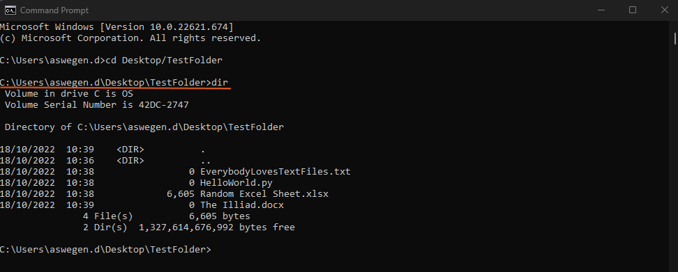

# Working with the Terminal
This section will be a quick refresher on working with the terminal.

You can aslo watch the YouTube video below:

>>>> #############################

>>>> ############################

>>>> #############################

>>>> ############################

>>>> #############################

## Launching a Windows Terminal
Windows has 2 built in terminal options:
- Powershell
- Command Prompt

To launch either of these just press the Windows key and type the program name into the search bar, then click on the program to launch.

 

## Useful Commands
Here some useful commands that are commonly used are listed aand explained. The commannds below are all for windows terminals but most of them will work in Linux terminals as well.

### List Directory Entries
To list the files and folders that are present in the current directory use the following command:

    dir

I have created a folder on my desktop called _TestFolder_ and populated it with a few files. When the dir command is run, a list of the files and folders in the current directory (in this case _TestFolder_ on the Desktop)

 

### Change Directory
The _cd_ command can be used to change the current directory by typing _cd_ followed by the desired directory or folder you want to change to. The directory needs to be contained in the current directory. To move from the Desktop (current directory) to _TestFolder_ the following command would be used: 

    cd TestFolder

 

If you follow up the _cd_ command with 2 fullstops you can move up (back) one directory:

    cd .. 

 

 

You can also navigate to a directory that is not within your current directory using its full path. To navigate from the current folder to a folder called _Python Scripts_ in Documents the following command would be used:

    cd C:\Users\aswegen.d\Documents\Python Scripts

 

 

The full path starts with the drive that the folder is located on followed by the list of each folder that needs to be navigated through to get to the desired directory separated by forward slashes - / (Windows will accept either forward or back slashes, Linux uses forward slashes)
    
### Create Folder/Directory

To create a new folder use the _mkdir_ commannd followed by the name of the folder you want to create. You can use the _dir_ command to check if the folder has been created.

    mkdir folder_name

Try to create a folder called _New Folder_. What happens?

You can create multiple folders with one command by providing multiple filenames separated by spaces. If you want to create a folder with a name containing a space you need too put ithe name in inverted commas or quotations - "New Folder"

### Remove Folder/Directory
To delete or remove a directory simply use the  commands below:

    rmdir folder_name
    rmdir /s folder_name 

The _/s_ tag deletes a directory tree (the specified directory and all its subdirectories, including all files).

_NB: Files and folders deleted in this way cannot be restored._

### Create/Remove File
There a several ways to create files using the terminal. To create an empty file you can use the following command:

    type nul > filename.txt

To delete a file use the following command:

    del filename
    del /f filename

The _/f_ flag is add to force the file to be deleted even if it is read-only.

You can use basic text editing to create a file containing text in the terminal using the _copy con_ command. This will creat a file and then allow you to type in text. When you are done typing press [ctrl] + [z] and then [enter] to save the file and exit the text editor. (In Linux you can use the _nano_ command in the same way) 

    copy con testfile.txt

 

 

You can also use the _echo_ command to add a string of text to a file.

    echo enter your text here > filename.txt

## Running Programs
To run a program you simply need to type its name into the command prompt, however with a program name will be recognised depends if it is on the system path or not.

### Programs on path: 
If programs are on the path then you can simply type the name of the program into the terminal and the press enter to run the program.

Try run the following commands:

    code

    calc

    calc.exe

The path is an environment variable that specifies where the OS should look for programs to run when a command is executed.

Some programs accept arguments when running them. For example we can use notepad to open the text file created above by adding the name of the file as an argument after the note pad command.

    notepad testfile.txt

### Programs not on path:

If a program is not on the path then the OS will not recognise the name of the program as a valid command.
By default the current working directory is added to the path of the current terminal session. The names of programs that are in the current directory will be recognised as commands.

First navigate to folder where the executable file (.exe) file is located. Then run the command. For example the old version of notepad is not on the path in Windows 11, but you can still run it if you first change the directory to: _C:\Windows.old\Windows_ (this is where the notepad.exe file is located)

 

 

Or run the command from any directory including the full path.

 

 

You can also add the program to the path by modifying the path environment variable: [How to add to path](https://learn.microsoft.com/en-us/previous-versions/office/developer/sharepoint-2010/ee537574(v=office.14))

## Python in the Terminal
### Check Python Version
To make sure you have python installed you can check the python version with the following command. If you are using virtual environments or a package manage make sure you are in the correct environment first.

    python --version

This will print out the current version of Python that is installed.

### Running Python Scripts
You can run python scripts directly from the terminal in the same way as opening a file using notepad. You just need to use the _python_ command followed by the name of the python file (ends in .py) you wish to run.

    python MyScript.py

 

 

### Installing Python Packages - PIP

    pip install package_name
    pip install package_name == version

Installing Python packages directly using _pip_ is not advised. It is preferred to use virtual environments with a environment manager like Anaconda. Once the virtual environment is active you can install using _pip_ or the managers native package installer (_conda_ in the case of Anaconda)

## Test Your Skills 

Do the following all using the terminal:
- Create a folder on the Desktop called: _I can use the terminal!_
- Create these files in the folder:
>> - A Microsoft Word document 
>> - A text file called _click me!.txt_
>> - A csv file
>> - A Python file called _HelloWorld.py_
>>>> - The python file should contain the following line of code:
    
>>>>>     print("Hello World!")

- Run the python file
