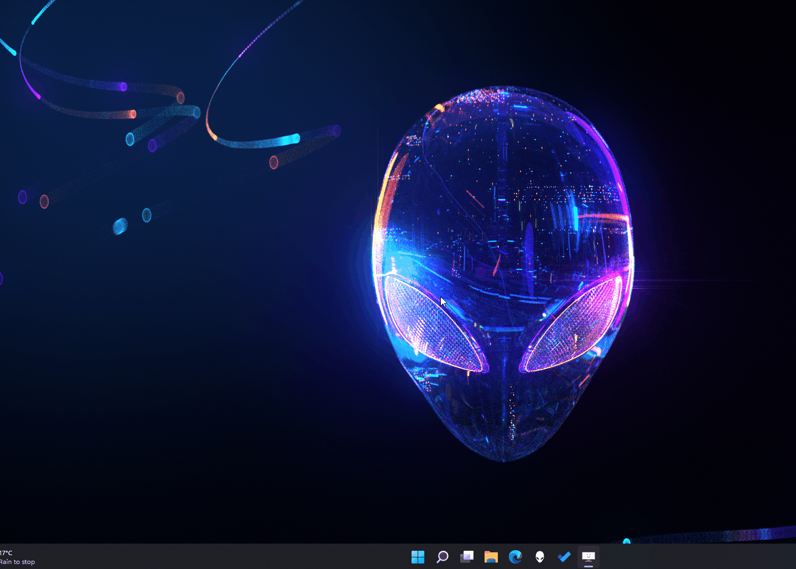

# Working with the Terminal

You can aslo watch the YouTube video below:

>>>> #############################

>>>> ############################

>>>> #############################

>>>> ############################

>>>> #############################

## Launching a Windows Terminal
Windows has 2 built in terminal options:
- Powershell
- Command Prompt

To launch either of these just press the Windows key and type the program name into the search bar, then click on the program to launch.

 

## Useful Commands

### List Directory Entries
    dir
### Change Directory
    cd dir \
    cd .. \
    
### Create/Remove Folder/Directory

### Create/Remove File

## Running Programs

### Programs on path: 

    code
    calc
    calc.exe

### Programs not on path:

First navigate to folder where the exe file is located
Then run the command
Or run the command including the full path
## Python in the Terminal
### Check Python Version

### Running Python Scripts
    python --version

### Installing Python Packages - PIP
