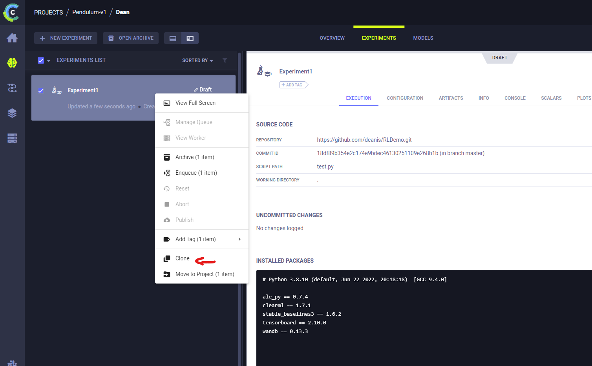
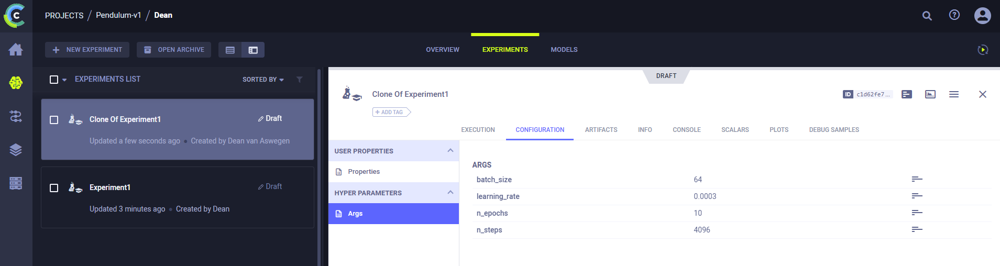

# Remote Training Jobs: Pendulum Control with RL
Use the Stable Baselines 3 library to train a reinforcement learning agent to control the pendulum environment.

Use the following code to train the agent:

```python
from stable_baselines3 import PPO
import gym
import time

env = gym.make('Pendulum-v1',g=9.81)

model = PPO('MlpPolicy', env, verbose=1)

model.learn(total_timesteps=10000, progress_bar=True)

#Test the trained model
obs = env.reset()
for i in range(1000):
    action, _ = model.predict(obs,deterministic=True)
    obs, reward, done, info = env.step(action)
    env.render()
    time.sleep(0.025)
    if done:
        env.reset()
```

## Add Weights and Biases for Experiment Tracking

Set your API key using os environment variables:

```python
import os

os.environ['WANDB_API_KEY'] = 'INSERT_API_KEY_HERE'
```
Initialize the wandb project and add the wandb callback to the model:
```python
# initialize wandb project
run = wandb.init(project="sb3_pendulum_demo",sync_tensorboard=True)

# add tensorboard logging to the model
model = PPO('MlpPolicy', env, verbose=1, tensorboard_log=f"runs/{run.id}")

# create wandb callback
wandb_callback = WandbCallback(model_save_freq=1000,
                                model_save_path=f"models/{run.id}",
                                verbose=2,
                                )

# add wandb callback to the model training
model.learn(total_timesteps=timesteps, callback=wandb_callback, progress_bar=True, tb_log_name=f"runs/{run.id}")
```

## Save the model incrementally
Since these models can take a long time to train, it is a good idea to save the model periodically so that you can resume training later if needed.

Simply include the learn function in a for loop and save the model after each iteration:

```python
# variable for how often to save the model
time_steps = 100000
for i in range(10):
    # add the reset_num_timesteps=False argument to the learn function to prevent the model from resetting the timestep counter
    # add the tb_log_name argument to the learn function to log the tensorboard data to the correct folder
    model.learn(total_timesteps=timesteps, callback=wandb_callback, progress_bar=True, reset_num_timesteps=False,tb_log_name=f"runs/{run.id}")
    # save the model to the models folder with the run id and the current timestep
    model.save(f"models/{run.id}/{timesteps*(i+1)}")
``` 

## Add command line arguments to the training script for the hyperparameters

This will allow you to easily change the hyperparameters without having to edit the training script. It will also allow you to run multiple training jobs with different hyperparameters in parallel, by simply cloning job in the ClearML dashboard and changing the hyperparameters through the UI.

Define the arguments:
```python
import argparse

parser = argparse.ArgumentParser()
parser.add_argument("--learning_rate", type=float, default=0.0003)
parser.add_argument("--batch_size", type=int, default=64)
parser.add_argument("--n_steps", type=int, default=2048)
parser.add_argument("--n_epochs", type=int, default=10)

args = parser.parse_args()
```
Add the arguments to the model:

```python
model = PPO('MlpPolicy', env, verbose=1, 
            learning_rate=args.learning_rate, 
            batch_size=args.batch_size, 
            n_steps=args.n_steps, 
            n_epochs=args.n_epochs, 
            tensorboard_log=f"runs/{run.id}",)
```

# Remote Training with ClearML

## Installation and Setup
If you haven't already, install the ClearML package and initialize the configuration file If you are using remote JupyterLab, you will have already done this and can skip to running the training job. Run the following commands in the terminal:

```bash
pip install clearml

clearml-init
```
Copy these credentials when prompted:

```bash
api { 
    web_server: http://31.204.128.128:8080
    api_server: http://31.204.128.128:8008
    files_server: http://31.204.128.128:8081
    # Students
    credentials {
        "access_key" = "NWC2N63JWUKZKPYZS3ZK"
        "secret_key"  = "YAlwjdwVbJ8papzDgZQdtrC6yNG04pKMghrWFxwf6qhBR12kj9"
    }
}
```
Leave all other settings as default.

## Github 

ClearML uses git to clone your training script and any other files you need to run the job. Make sure you have the latest version of your training script committed to your github repository.

## Running Remote Training Jobs

Add the following code to the top of your training script after the imports:

```python
from clearml import Task

# Replace Pendulum-v1/YourName with your own project name (Folder/YourName, e.g. 2022-Y2B-RoboSuite/Michael)
task = Task.init(project_name='Pendulum-v1/YourName', task_name='Experiment1')
#copy these lines exactly as they are
#setting the base docker image
task.set_base_docker('deanis/robosuite:py3.8-2')
#setting the task to run remotely on the default queue
task.execute_remotely(queue_name="default")
```

## Cloning Jobs and Changing Hyperparameters

You can clone jobs in the ClearML dashboard to run multiple training jobs with different hyperparameters in parallel. Simply click the clone button on the job you want to clone and change the hyperparameters in the UI. You can also just rerun the job with different hyperparameters in your terminal.

- Clone job:
<div style="text-align: center">

</div>

- Select cloned job and change hyperparameters on the configuration tab: 
<div style="text-align: center">

</div>

To start running the jobs right click on the cloned job and select `enqueue`.
