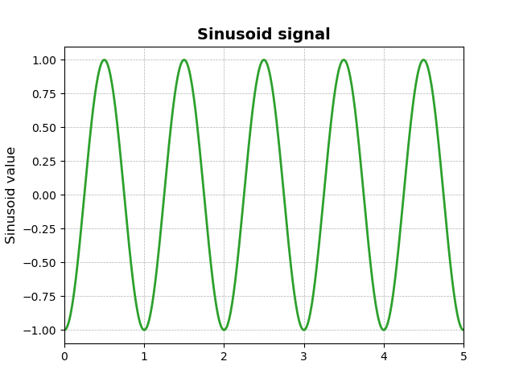

# Robotics IV: Controller Performance and Tuning

## Controller Performance

In order to evaluate the performance of a controller, we need to define a performance metric. In other words some number that will tell use how well the controller is performing, and how well it is performing compared to other controllers. We generally want our controllers to quickly reach the desired setpoint (with minimal overshoot or oscillation), and then stay there with minimal steady state error. We also want the controller to be robust to disturbances, and to have a low control effort. We will discuss these performance metrics in more detail below.

In comparing different controllers or the same controller with different parameters we need to be careful to compare apples to apples. For this reason several standard input signals are used to evaluate controllers. These input signals are discussed in more detail below. 

### Standard Input Signals

The 3 most common input signals are the step input, the ramp input, and the sinusoidal input. These input signals are shown below. Generally we want to use the standard input signals that most closely match the type signal that would be seen in practice. For example, when controlling the position of the robots griper with the a PID controller we are just changing the setpoints of the controller by a fixed amount each time we want to move the gripper to a new position. This is similar to a step input, so we would predominantly use a step input to evaluate the performance of the controller.

#### Step Input

A step input is a signal that changes from 0 to a constant value at a certain time. The step input is shown below.

#### Ramp Input (Optional)

A ramp input is a signal that changes from 0 to a constant value at a certain time, but the change is linear instead of instantaneous. The ramp input is shown below.

#### Sinusoidal Input (Optional)

A sinusoidal input is a signal that changes according to the sinusoidal function. It is useful in cases where the input signal is periodic. The sinusoidal input is shown below.

#### Other Input Signals (Optional)
There are many other input signals that can be used to evaluate controllers. These include:

- Sawtooth Input
- Square Wave Input
- Random Input
- Chirp Input
- Impulse Input

Remember that the input signal should be chosen to match the type of input signal that would be seen in practice. For our case we only really need to use the step input, but you can use any of the other input signals if you want to. There are other applications that would require the use of other input signals.

### Controller Performance Metrics

#### Time to complete the task 

The amount of time the controller takes to complete the full pick and place task or the amount of time it takes on average to place a single item. This measure is very specific to your task. You would need to run the simulation several times (10 or more) and take the average time to complete the task. In a fast moving consumer good environment where a robot like this may be deployed you would want to minimize the time to complete the task.

#### Accuracy in Completing the task

The accuracy in completing the task is a measure of how well the robot is able to place the object in the correct location. This can be broken down into accuracy in subtasks like:

- Object Detection
- Locating the object
- Navigation to the object location
- Grasping the object
- Navigation to the drop off location
- Placing the object in the drop off location

This measure is very specific to your task. You would need to run the simulation several times (10 or more) and take the average accuracy in completing the task. You would calculate a percentage based on the number of trials where the robot was successful out of the total number of trials. You can compute an accuracy for each subtask as well as the overall task.

In a fast moving consumer good environment where a robot like this may be deployed you would want to maximize the accuracy in completing the task. In an ideal world we would strive for 100% accuracy, but some applications may be more forgiving than others.

#### Speed of Response

The speed of response is a measure of how quickly the controller reaches the setpoint. There are several metrics that can be used to measure the speed of response. These include:

- Rise Time: The time it takes for the output to first reach 90% of the final value (setpoint value).

- Settling Time: The time it takes for the oscillations to die down to within 2% of the final value (setpoint value). 

- Overshoot: The maximum percentage amount the output exceeds the setpoint value before settling down.

Ideally we want a controller that has a fast rise time, a short settling time, and minimal overshoot, but this is not always possible. Usually we need to trade off between these metrics. For example, a controller with a fast rise time will have a large overshoot, and a controller with a short settling time will have a slow rise time. 

For the robot arm we will need to determine the rise time, settling time, and overshoot in the `x`, `y`, and `z` directions and any angles that you have controlled. We can do this by plotting the output of the controller over time during which the setpoint is changed and then measuring the rise time, settling time, and overshoot.

EXAMPLE

#### Steady State Error

The steady state error is a measure of how far the steady output is from the setpoint value. Ideally we want a controller that has a small steady state error. To determine the steady state error we need to wait until the output has settled down to a roughly constant value and we can then calculate the difference between the output and the setpoint. 

For the robot arm we will need to determine the steady state error in the `x`, `y`, and `z` directions and any angles that you have controlled. We can do this by calculating the difference between the desired position and the actual position of the gripper.

#### Stability

It is very important that the controller is stable. A stable controller is one that does not exhibit oscillations around the setpoint value the increase in amplitude over time, or diverge. If the controller is unstable it will oscillate around the setpoint value and eventually the output will exceed the limits of the system, or diverge immediately with the same result. This can cause damage to the system.

To determine if the controller is stable we can plot the output of the controller over time during which the setpoint is changed. If the output oscillates around the setpoint value with increasing magnitude, or diverges, then the controller is unstable. If it converges to the setpoint value then the controller is stable (even if there is some error).

EXAMPLE

#### Robustness and Disturbance Rejection (Optional)

Robustness is a measure of how well the controller performs when there is a disturbance. A disturbance is a change in the input signal that is not caused by the controller. For example, if we are controlling the position of a robot gripper, and we want to move the gripper to a new position, the input signal is the desired position of the gripper. If the robot is moving and the gripper is not at the desired position, the controller will try to move the gripper to the desired position. If the robot is bumped while the gripper is moving, the gripper will not reach the desired position. This is a disturbance. The controller should be able to handle disturbances, and still reach the desired position.

#### Control Effort (Optional)

Control effort is a measure of how much energy is used in reaching the setpoint. I many applications we want to minimize the control effort, while maintaining the speed of the response and other performance metrics. This can be thought of as a measure of the efficiency of the controller.

## PID Controller Tuning

In order to improve the performance of a PID controller, we need to tune the controller. This involves adjusting the gains of the controller to improve the performance of the controller, like improving the speed of the response or decreasing the steady state error. There are several methods that can be used to tune PID controllers. We will discuss the general tuning procedure, and some of the more advanced tuning methods.

### General Tuning Procedure

The general procedure for tuning a PID controller is as follows:

Observe the response of the controller to a step input signal. If the response is acceptable, then you are done. If the response is not acceptable, then you need to tune the controller.

1. Start with a small value for the proportional gain, and increase it until the output begins to oscillate significantly.
2. Reduce the proportional gain to roughly 80% of the value that caused the oscillations.
3. Increase the integral gain until the steady state error is eliminated. (You may not need to increase the integral gain at all.)
4. Increase the derivative gain until the oscillations are damped, but not completely eliminated. Eliminating all oscillations will cause the response to be too slow.

_Note: The amounts by which you increase the gains and the magnitudes of the gain values will depend on the application. You will need to experiment with different values to find the best values for your application._

Homework Exercise: Try tuning your PID controller, start with just the x component. 

- Plot the response of the controller to a step input before and after tuning. (Hint: save the x-setpoint and x-position data arrays in each iteration of the main loop, and then plot the data after the main loop is finished.)
- How did the response change? Did the response improve? Did the response worsen? Why do you think this happened?

### Advanced Tuning Methods (Optional)

There are several advanced tuning methods that can be used to tune PID controllers. These involve using equations to calculate the gains, or using a computer to tune the controller. These methods are beyond the scope of this course, but here is a brief list of some of the more common methods.

- Ziegler-Nichols Method
- Cohen-Coon Tuning
- Kappa-Tau Method
- Lambda Tuning
- Heuristic Tuning

You can read more about some of these techniques [here](https://www.incatools.com/pid-tuning/pid-tuning-methods/).

