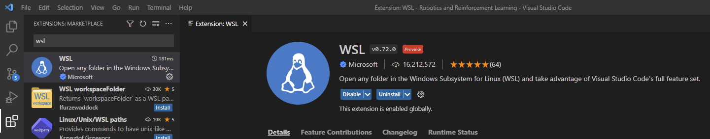
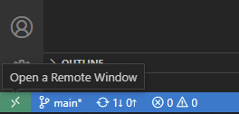
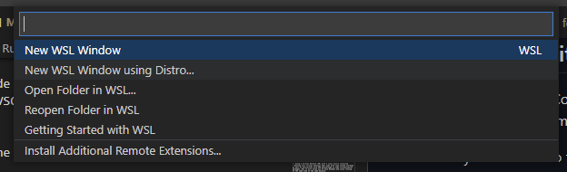
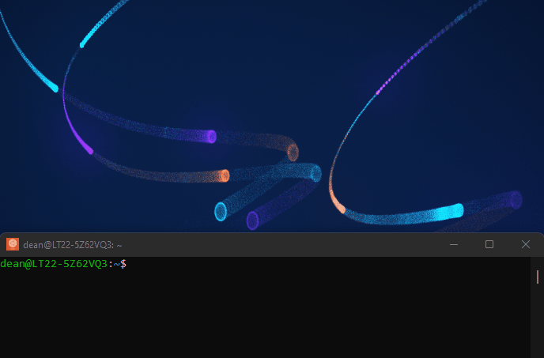

# Windows Subsystem for Linux (WSL2): Running Linux on Windows with GPU Acceleration

The focus of this knowledge module is the basic setup and use of Linux for data science and artificial intelligence development.

After this module, you will be able to:
- [ ] Develop and understanding of what Linux is an how to use it at a basic level.
- [ ] Setup a Linux development environment running in Windows
- [ ] Setup GPU acceleration for a Linux development environment running in Windows

## What is Linux? 

Linux is an operating system like Windows and Mac OS. The main difference being that it is both free and open source. Linux is distributed under an open source license which means that anyone is able to access the source code of the operating system and make changes and customisations. Linux has a large community that works on maintaining and updating the linux kernel and distributions (distros). Linux is an operating system that is “by the people, for the people”.

### Linux Distros

Linux comes in many different 'flavours' known as distros. Each distribution is a customisation of the base Linux operating system with a slightly different focus, look and feel. There are distros that cater to beginners who prefer a graphical user interface for most tasks as well as experts that are comfortable working a a terminal only. A few commonly used ditsros are listed below:

- [Ubuntu](https://ubuntu.com/) \
&nbsp;&nbsp;&nbsp;&nbsp;&nbsp;&nbsp;&nbsp;&nbsp;&nbsp;&nbsp;

- [Linux Mint](https://linuxmint.com/) \
&nbsp;&nbsp;&nbsp;&nbsp;&nbsp;&nbsp;&nbsp;&nbsp;&nbsp;&nbsp;&nbsp;
- [Debian](https://www.debian.org/) \
&nbsp;&nbsp;&nbsp;&nbsp;&nbsp;&nbsp;&nbsp;&nbsp;&nbsp;

We will be working with Ubuntu, but feel free to give any other distro a try. (They are free after all) 
To find out more check out the linux web page:

- [More about Linux here](https://www.linux.com/what-is-linux/)

### Why is linux needed for ADS-AI?

The main arguments for using Linux are that its free, stable, and arguably less susceptible to malware. In general Linux has less compatibility with general applications than Windows or MacOS but when it comes to machine learning libraries this is not the case. Many libraries are released for linux first and MacOS and windows either a lot later or never.  

As a result it is often necessary to have access to both Windows and and Linux this can be done in three ways:

1. Dual booting Windows and Linux 
> This involves having Windows installed on one hard drive or hard drive partition and a Linux distro installed on another drive or drive partition. You can the choose which OS to boot into when you turn your computer on.  

2. Using a Virtual Machine (VM) with a Linux distro installed
> Running full virtual machines does come with some system overhead as well as dificulties with GPU passthrough on some virtualisation packages. But it will allow you to have Windows and Linux running at the same time on the same machine.

3. Using the Windows Subsystem for Linux (WSL) 
> This is the suggested approach, as it allows you to have Linux running within Windows without the overhead and complication of running a ful VM.

## What is WSL2?

WSL allows you to run a Linux environment within Windows. Which allows you to access a Linux command line and run applications and libraries that were built for Linux. You can install any Linux distro and have multiple versions of the same distro for development and testing. WSL2 is the latest impplementation of WSL. WSL2 also allows for the use of GPU acceleration which is particularly useful for machine learning applications. 

## Installing and Configuring WSL2

You can follow the step-by-step instructions from Microsoft in the links below to get your WSL2 environment up and running:

- [Install WSL](https://learn.microsoft.com/en-us/windows/wsl/install)

- [Best Practices for Setup](https://learn.microsoft.com/en-us/windows/wsl/setup/environment)

You can aslo watch the YouTube video below:

>>>> #############################

>>>> ############################

>>>> #############################

>>>> ############################

>>>> #############################

## What is GPU Acceleration? 

A GPU or Graphics Processing Unit is well suited to highly parallelizable compute tasks like graphics rendering and training of neural networks. GPU acceleration allows you to run programs or code on a GPU instead of using the CPU for processing. This is especially benificial for ML workloads. It is possible to train models on a CPU but depending on the workload it can be orders of magnitude slower. 

- For more information check out this article: [CPU vs GPU](https://thinkml.ai/cpu-vs-gpu-in-machine-learning-algorithms-which-is-better/)

- Or this article from Nvidia: [Whats the difference between a CPU and a GPU](https://blogs.nvidia.com/blog/2009/12/16/whats-the-difference-between-a-cpu-and-a-gpu/)

## Configuring GPU Acceleration in WSL2
You can follow the step-by-step instructions from Microsoft in the links below to set up GPU acceleration within WSL2 and run GUI apps:

- [GPU Compute](https://learn.microsoft.com/en-us/windows/wsl/tutorials/gpu-compute)

- [GUI Apps](https://learn.microsoft.com/en-us/windows/wsl/tutorials/gui-apps)

You can aslo watch the YouTube video below:

>>>> #############################

>>>> ############################

>>>> #############################

>>>> ############################

>>>> #############################

## Using VSCode with WSL2
You can either install VSCode inside your Ubuntu instance or you can configure your Windows VSCode install to run using the Ubuntu terminal.

To do this you need to do the following:

1. Install the WSL Extension:

 

2. Open a Remote Window:

 

3. Choose New WSL Window or New WSL Window Using Distro (if you have multiple Distros installed):

 

## Tips and Tricks
To check that gpu acceleration is running correctly you can run to following command in your ubuntu terminal:

    glxgears

If everything is setup correctly you should see something like in the GIF below:

   

 
If you get a message that display:0 is unavailable it may be that another Linux instance is using the GPU or there is something wrong with the setup, or a number of other issues, but this can most often be solved by a reboot.

