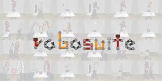
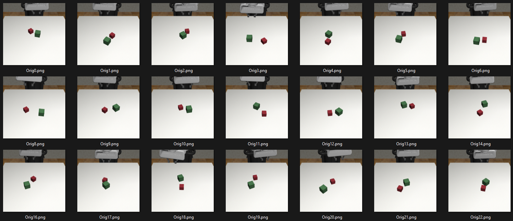
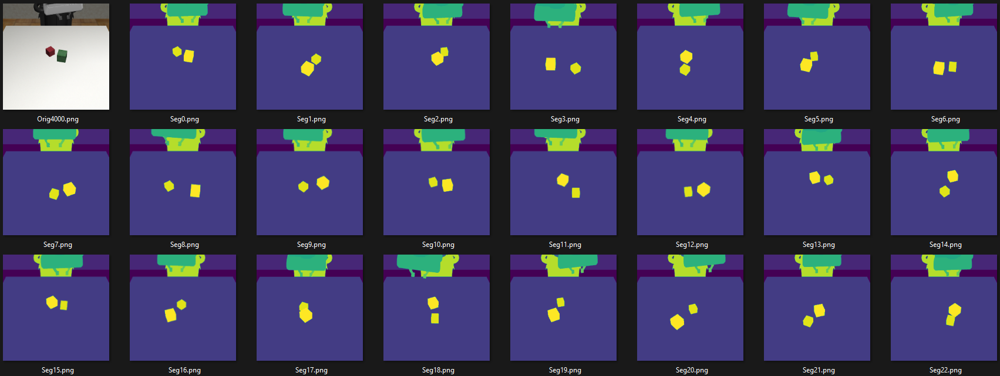
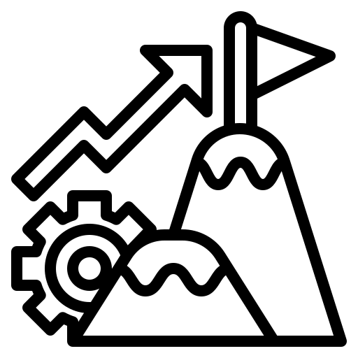

# Robotic Simulation Primer

The focus of this knowledge module is on robotic simulation. You will learn what it is and why it is necessary as well as how to setup a simulation environment and how to use that environment to collect data to train and object detection model.

After this module, you will be able to:
- [ ] Develop and understanding of what robotic simulation is and what it is used for.
- [ ] Setup a Robosuite for the purposes of robotic simulation
- [ ] Automate the collection a dataset of images for object detection using the robotic simulation environment.

## Why Simulation?
Robotic manipulation tasks are complex and often involve expensive equipment that can be both fragile (high precision sensors) and dangerous to work with (extremely powerful actuators). It is important to be sure that a new control algorithm will work as expected before deploying it on real hardware. Deploying a controller in simulation first is a much safer (and cheaper) way of designing and developing new control algorithms. Simulation allows us to test controllers without risk of damaging the equipment or environmnet in which it operates, like in the gifs below:

<div style="text-align: center"> 


</div>

[Source1](https://www.youtube.com/watch?v=7FwdMjYUyKM) 
[Source2](https://www.youtube.com/watch?v=LzZmPRm4rII) 

There many robot simulators each with a different focus, strengths, and weaknesses. The list below shows some common robot simulation environments, with links to their websites:

- [Gazebo](https://gazebosim.org/home)
- [Webots](https://cyberbotics.com/)
- [RoboSuite](https://robosuite.ai/docs/overview.html)
- [Robot Studio](https://new.abb.com/products/robotics/robotstudio)
- [RoboDK](https://robodk.com/index)

Lightweight physics engines that can be setup for robotic simulation:
- [MuJoCo](https://mujoco.org/)
- [PyBullet](https://pybullet.org/wordpress/)

We will be working with Robosuite as it is open source and the most suited to our application, but feel free to check out some of the other options.


## What is RoboSuite? 

Robosuite is a robotic simulation environment built on top of the MuJoCo physics engine and compatible with then Open AI Gym format for reinforcement learning and other reinforcement learning libraries like Stable Baselines. The physics engine models realistic motion and contents while still being lightweight enough to run multiple instances in parallel. Robosuite focuses on simulation of robotic arm manipulation environments and tasks. 3D rendering is included for integration of computer vision workflows into these tasks. Some key features are highlighted in the video below.

<div style="text-align: center"> 
<iframe height="315" width="550"
src="Videos/robosuite-video-faster.mp4" 
frameborder="0" 
allow="accelerometer; autoplay; encrypted-media; gyroscope; picture-in-picture" 
allowfullscreen></iframe>
</div>


## Installing RoboSuite

Robosuite and the packages it relies on (MuJoCo) were designed to run in a Linux environment. We will be installing Robosuite on Ubuntu using WSL2. 

1. Open an Ubuntu Terminal
2. Check that the Ubuntu packages are up to date

        sudo apt update

3. Install Pre-requisites

        sudo apt install curl git libgl1-mesa-dev libgl1-mesa-glx libglew-dev \
         libosmesa6-dev software-properties-common net-tools unzip vim \
         virtualenv wget xpra xserver-xorg-dev libglfw3-dev patchelf

4. Install Robosuite

        pip install robosuite

5. Test the installation

        python robosuite/demos/demo_random_action.py

You may need to navigate to the directory where robosuite was installed.

<div style="text-align: center"> 

</div>

Source: [Robosuite Website](https://robosuite.ai/docs/installation.html)

## Collecting Image Data for an Object Detection Model
The task set out in the creative brief requires the development of an algorithm that will enable a robotic arm to pick up and place objects. The first hurdle to overcome is identifiying the objects that need to be picked up. We will be using computer vision models for object detection and localisation, and as with all deep learning models we will need a lot of data (hundreds, if not thousands of images). 

Fortunately automating the data collection process within a simulation envrionment is relatively staright forward. We simply need to save many images of different objects in different positions (other domain randomisations can also be used, but lets keep it simple for now). 

<div style="text-align: center"> 

</div>

Robosuite also allows for the collection of segmented images which can prove usefull for automating the labelling process, or for the object detection task in general.

<div style="text-align: center"> 

</div>

### Follow these steps to create your own dataset of images:

1. Import Libraries: *You will need to import the following libraries in order to create the simulation environment, plot the images and save them to disk* 
```python	
import numpy as np
import robosuite as suite
import matplotlib.pyplot as plt
```

2. Create the Environment: *You will need to instatiate a Robosuite simulation environment that contains appropriate objects, and camera (image) observations* 

```python
# creating a robosuite environment instance
env = suite.make(env_name="Stack", # try with other tasks like "Stack","Door", "PickPlace"
                robots="Panda",   # try with other robots like "Sawyer" and "Jaco"
                has_renderer=False,
                has_offscreen_renderer=True,
                use_camera_obs=True,                  
                camera_segmentations = 'element' # if you want segmented images as well
                )
```

>> For more details on the available environments and tasks click [here](https://robosuite.ai/docs/modules/environments.html#task-descriptions).

3. Retrieve and Interrogate a single Observation

```python
obs = env.reset() 
print(obs)
```

>> Calling the reset method resets the environment and spawns new cubes in random locations. The return observation is an ordered dictionary containg the following:


| Key | Description |  Size | Data Type | 
|:----------|:-------------|:------|:------|
| robot0_joint_pos_cos | Cosine of the angle of each joint | 1x7 array | float |
| robot0_joint_pos_sin | Sine of the angle of each joint | 1x7 array | float |
| robot0_joint_vel | Rotational velocity of each joint  | 1x7 array | float |
| robot0_eef_pos | Position of the end effector (XYZ) | 1x3 array | float |
| robot0_eef_quat | Quarternion describing the pose of the end effector | 1x4 array | float |
| robot0_gripper_qpos | Postion of the gripper 'fingers' | 1x2 array | float |
| robot0_gripper_qvel | Velocity of the gripper 'fingers' | 1x2 array | float |
| agentview_image | Colour image as seen by the agents default camera | 256x256x3 array | uint8 |
| agentview_segmentation_element | Grayscale image segmented on the lement level | 256x256x1 array | int32 |
| cubeA_pos | Position of Cube A (XYZ) | 1x3 array | float |
| cubeA_quat | Quarternion describing the pose of Cube A | 1x4 array | float |
| cubeB_pos | Position of Cube B (XYZ) | 1x3 array | float |
| cubeB_quat | Quarternion describing the pose of Cube B | 1x4 array | float |
| gripper_to_cubeA | Distance from the gripper to Cube A (XYZ) | 1x3 array | float |
| gripper_to_cubeB | Distance from the gripper to Cube B (XYZ) | 1x3 array | float |
| cubeA_to_cubeB | Distance from Cube A to Cube B (XYZ) | 1x3 array | float |
| robot0_proprio-state | Summary of rows 1-7 of this table describing the complete state of the robot | 1x32 array | float |
| object-state | Summary of rows 10-16 of this table describing the complete state of the objects (Cube A and B) | 1x23 array | float |

>> Try to plot the *agentview_image* using matplotlibs imshow function. 
>> - What is wrong with the image?

4. Initialize Data Storage Variables: *When creating numpy arrays that will contain a large amount of data it is good practise to first initialise an empty array of the correct size.
Decide how many images you want to collect and initialise an empty numpy array of the correct size.*

```python
images = np.empty((no_of_images,width,height,channels),dtype='uint8')
```

>> we use the *uint8* data type to avoid using up too much disk space. You can read more about numpy data types [here](https://numpy.org/doc/stable/user/basics.types.html).

>> Try to determine the difference in disk space used for 1000 *uint8* images vs 1000 *float32* images. 

5. Data Collection Loop
Now all you need to do is call the reset method in a loop and extract the relevant image array from the observation ordered dictionary and put it into the storage array from step 4.

```python
obs = env.reset() 
```

6. Save to disk:
*Use numpys *savez* method to save a zipped archive (.npz) with the array conatining all the images.*

```python
np.savez('ImageDataset.npz', images)
```

>> [How to load data from an *npz* file](https://numpy.org/doc/stable/reference/generated/numpy.savez.html#:~:text=Notes-,The%20.,npy%20format.)


### Alternate method: *Save images to disk directly*
- Skip step 4
- Use the *imsave* function from matplotlib to save images extracted in the data collection loop directly to the disk.
- Skip step 6

Depending on what tools are being used for annotation and training having a folder of image files may be easier to work with.


