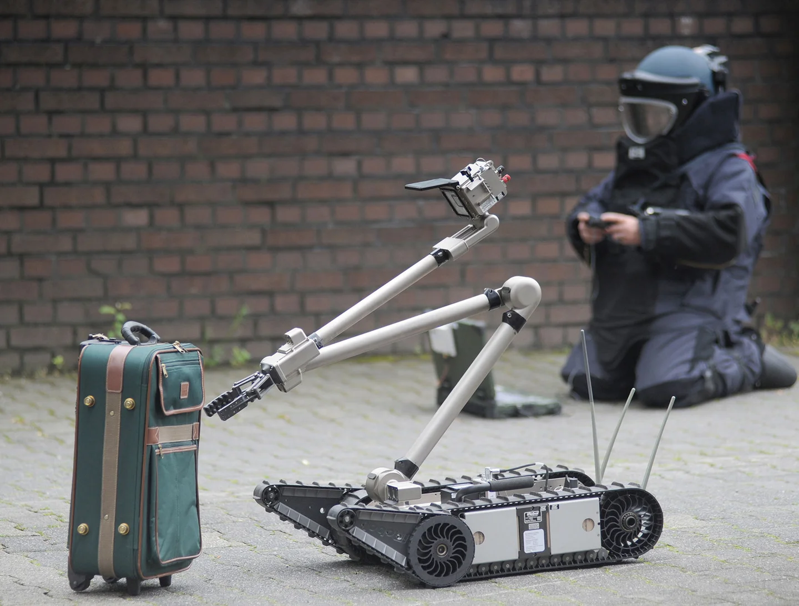

# Introduction to Robotics
Automation of manual, repetitive, and dangerous tasks is carried out across many industries in order to reduce labour costs, increase efficiency, and improve working conditions. The addition of data driven techniques like computer vision and reinforcement learning allow for more complex tasks to be automated using robots.   

The focus of this knowledge module is on understanding the basic principles of robotics.

After this module, you will be able to:
- [ ] Develop an understanding of what robotics is and its current and future applications.
- [ ] Describe the different components of robotic systems and their purpose.
- [ ] Use mathematical frameworks to describe the location and orientation of objects in a 3D space.

## 1. What is Robotics?
Robotics is the study of robotic systems, including their design, manufacture and control (operation, and use). A few definitions of robots, or robotic systems are presented below:

- Robotic systems are defined as systems that provide intelligent services and information by interacting with their environment, including human beings, via the use of various sensors, actuators and human interfaces. [( Object Management Group, 2005)](https://www.igi-global.com/dictionary/robotic-systems/46626#:~:text=1.,Object%20Management%20Group%2C%202005%20)
- Robots are machines that can substitute for humans and replicate human actions. [(Wikipedia)](https://en.wikipedia.org/wiki/Robotics)
- A robot is a machine, especially one programmable by a computer, capable of carrying out a complex series of actions automatically. (Oxford Dictionary)
- A robot is an autonomous machine capable of sensing its environment, carrying out computations to make decisions, and performing actions in the real world. [(IEEE)](https://robots.ieee.org/learn/what-is-a-robot/)

The last definition is very general, but it best captures the broadness of the field. Especially when considering that machines as complex as Boston Dynamics [Atlas](https://www.bostondynamics.com/atlas) and a [Tesla on Autopilot](https://www.tesla.com/autopilot) all the way down to something as seemingly simple as a [Roomba](https://www.youtube.com/watch?v=_RvnlDNTo0E) can be considered to be robots.

 
<iframe width="560" height="315" src="https://www.youtube.com/embed/uNfUAJBuZ0s" title="YouTube video player" frameborder="0" allow="accelerometer; autoplay; clipboard-write; encrypted-media; gyroscope; picture-in-picture" allowfullscreen></iframe>

We will be focusing on developing control algorithms for robots, but it is important to have an understanding of what they are and what components they are comprised of in order to develop functional and efficient control systems. 

 
<iframe width="560" height="315" src="https://www.youtube.com/embed/_U21fT8VLp0" title="YouTube video player" frameborder="0" allow="accelerometer; autoplay; clipboard-write; encrypted-media; gyroscope; picture-in-picture" allowfullscreen></iframe>

## Applications of Robotics
Robots are used in a wide variety of applications, including manufacturing, construction, agriculture, and healthcare. Robots are most useful for tasks that are repetitive, dangerous, or require precision.

The following are some examples of the applications of robotics to these kinds of tasks (This is not an exhaustive list):

- <b>Industrial Robots in Manufacturing:</b> Manufacturing and heavy industry were some of the first industries to adopt robots. Robots are used in production lines across many industries, including automotive, electronics, and food processing. They are programmed to perform a variety of tasks, including welding, painting, and assembly. The video below shows the use of robots on the BMW production line:

<iframe width="560" height="315" src="https://www.youtube.com/embed/P7fi4hP_y80" title="YouTube video player" frameborder="0" allow="accelerometer; autoplay; clipboard-write; encrypted-media; gyroscope; picture-in-picture" allowfullscreen></iframe>

- <b>Surgery:</b> Robots are used in surgery to perform minimally invasive procedures. They are used to perform tasks that are difficult for humans to do because they require extremely high levels of precision and stability, such as removing tumours from the brain. The robot is not autonomous, but it is controlled by a surgeon. The surgeon is able to control the robot using a custom interface, and the robot is able to provide feedback to the surgeon about the position of the surgical tools. This means that the surgeon does not even have to be in the same room as the patient, and can perform the surgery remotely. The video below shows the use of a robot in a minimally invasive surgery:

<iframe width="712" height="315" src="https://www.youtube.com/embed/kYmtvLNNqHI" title="Robotic Surgery: When Less is More" frameborder="0" allow="accelerometer; autoplay; clipboard-write; encrypted-media; gyroscope; picture-in-picture" allowfullscreen></iframe>

- <b>Bomb Disposal:</b> Tasks that are dangerous for humans to perform are also good candidates for robots. Robots are used to safely retrieve and dispose of or disarm bombs. These robots are operated remotely as in the image below showing the use of a robot to safely dispose of a bomb:

<a href="https://www.google.com/url?sa=i&url=https%3A%2F%2Fwww.popsci.com%2Fgerman-researchers-want-bomb-squad-robots-to-see-inside-suitcases%2F&psig=AOvVaw2LEKLUNmFn3z0DtIwLbyQv&ust=1669112398763000&source=images&cd=vfe&ved=0CBAQjRxqFwoTCMjHqK-Gv_sCFQAAAAAdAAAAABAP">Source</a>

- <b>Warehousing:</b> Relatively simple tasks that are repetitive and require precision are also good candidates for robots. Robots are used in warehouses to pick and place items, and to move items around the warehouse. Robots are not restricted to ground operations, some robots can fly (these are often referred to as drones, or unmanned aerial vehicles (UAVs)). Systems that make use of small multirotor drones that fly around the warehouse and scan barcodes on items are used to track the location of items in the warehouse are in active development. The gif below shows the use of robots in an Amazon warehouse, and the video below shows the use of a drone in a warehouse:

<a href="https://www.google.com/url?sa=i&url=https%3A%2F%2Fwww.homemadetools.net%2Fforum%2Famazon-warehouse-robot-gif-54074&psig=AOvVaw3YcmisRZsKn0hbXo5voDVf&ust=1669112767078000&source=images&cd=vfe&ved=0CBAQjRxqFwoTCOj53N6Hv_sCFQAAAAAdAAAAABAV">Source</a>

<iframe width="560" height="315" src="https://www.youtube.com/embed/PETeQDif2OU" title="YouTube video player" frameborder="0" allow="accelerometer; autoplay; clipboard-write; encrypted-media; gyroscope; picture-in-picture" allowfullscreen></iframe>

   

- <b>Delivery:</b> Robots are also being tested for delivery of packages. Both aerial and ground robots are being tested for this purpose. The videos below show the use of a ground robot and an aerial robot for delivery:

<iframe width="560" height="315" src="https://www.youtube.com/embed/t5yI7HrzUUk" title="YouTube video player" frameborder="0" allow="accelerometer; autoplay; clipboard-write; encrypted-media; gyroscope; picture-in-picture" allowfullscreen></iframe>

<iframe width="610" height="343" src="https://www.youtube.com/embed/3bDyeUiWL3M" title="Watch how Amazon is preparing for safe drone delivery" frameborder="0" allow="accelerometer; autoplay; clipboard-write; encrypted-media; gyroscope; picture-in-picture" allowfullscreen></iframe>

- <b>Household:</b> This is an example that you all should have seen in action on campus. BUas has been using autonomous cleaning robots to keep the floors clean in the buildings. The robots are able to navigate around the buildings and clean the floors, they are able to avoid obstacles and navigate around people. The same technology is used in robots equipped with blades instead of brushes to cut the grass in parks and lawns. 

[source](https://thumbs.gfycat.com/DeficientLiquidDromaeosaur-size_restricted.gif)

- <b>Autonomous Vehicles:</b> Some of the most complex robotic systems in use today are autonomous/semi-autonomous vehicles these robots are required to perform several complex tasks in a complex dynamic environment. It may be hard to think of these 'cars' as robots but they have sensors to perceive the environment, they process the sensor data and use it to make decisions on what actions to take next in order to accomplish a given task. At this point these systems are only semi-autonomous, except for in very control conditions.   [Tesla](https://www.tesla.com/autopilot) and [Waymo](https://waymo.com/) are leading the way in the development of autonomous vehicles, albeit with very different approaches.

[source](https://assets.bwbx.io/images/users/iqjWHBFdfxIU/i7FdQDTJdEAo/v0/-999x-999.gif)

- <b>General Purpose:</b> what most people think of when they hear the word robot are general purpose robots. These robots are designed to be able to perform a wide variety of tasks. They are often humanoid in appearance, and are able to move around on two (sometimes four) legs. They are able to perform tasks such as walking, running, jumping, climbing stairs, and lifting objects. They are also able to perform tasks such as speech recognition, facial recognition, and object recognition. These robots are often used in research and development, and are not yet widely available for commercial use. They are particularly difficult to develop and program because they are able to perform a wide variety of tasks, and are able to adapt to new situations. Some examples of general purpose robots are the [Boston Dynamics Spot](https://www.bostondynamics.com/products/spot), [Boston Dynamics Atlas](https://www.bostondynamics.com/atlas), and most recently the [Teslabot](https://spectrum.ieee.org/tesla-optimus-robot) which is a humanoid robot that can be used to perform tasks in the Tesla factory.

<iframe width="560" height="315" src="https://www.youtube.com/embed/wXxrmussq4E" title="YouTube video player" frameborder="0" allow="accelerometer; autoplay; clipboard-write; encrypted-media; gyroscope; picture-in-picture" allowfullscreen></iframe>

<iframe width="560" height="315" src="https://www.youtube.com/embed/ODSJsviD_SU?start=2850" title="YouTube video player" frameborder="0" allow="accelerometer; autoplay; clipboard-write; encrypted-media; gyroscope; picture-in-picture" allowfullscreen></iframe>

As we have seen above robots can be autonomous or teleoperated. Autonomous robots are able to perform tasks without human intervention. Teleoperated robots are controlled remotely by a human operator. In this course, we will be focusing on the control of autonomous robots. We will be developing control algorithms that allow the robot to perform tasks without human intervention. In the next section, we will look at the components of a robot and how they are used to perform tasks.

## 2. Components of a Robotic System

It is important to understand the different components of a robotic system and how they are used to enable the robot to perform tasks. We will use the example of Boston Dynamics Stretch to illustrate the different components of a robotic system.

<iframe width="560" height="315" src="https://www.youtube.com/embed/yYUuWWnfRsk" title="YouTube video player" frameborder="0" allow="accelerometer; autoplay; clipboard-write; encrypted-media; gyroscope; picture-in-picture" allowfullscreen></iframe>

### 2.1 Environment
The environment is the world in which the robot operates. The robot needs to be able to perceive it's surroundings and interact which objects within the environment in order to carry out tasks. If we consider the example of Stretch operating in a warehouse; the environment would be the area in which the robot operates (walls, floor, roof) and all objects (shelves, boxes, people) within that area. The robot needs to be able to perceive the environment in order to navigate and interact with objects within the environment.

### 2.2 Sensors
Sensors are the means by which a robot perceives its environment. The complexity and number of sensors is often directly related to the complexity of the required task. In this example the robot may need to know its location within the environment (warehouse), the distance to nearby objects and possibly what these objects are. A GPS could be used to detect the robot's location, and a scanning LiDAR could be used to provide the distances to all nearby objects in the desired field of view. In order to determine what the objects are, a camera could be used in conjunction with a computer vision algorithm for object detection and classification. 

Table of sensors for common perception tasks:

| Task | Sensor | Sensor output | Description |
| --- | --- | --- | --- |
| Location | GPS | 3D position | A GPS sensor uses satellites to determine the position in 3D space. There are also similar implementations that use local networks of transceivers instead of satellites |
| Distance | LiDAR | 3D point cloud | A LiDAR sensor uses laser pulses to determine the distance to objects in the field of view. The laser pulses are reflected off of objects and the time it takes for the pulse to return is used to determine the distance to the object. A scanning LiDAR can return a 3D point cloud instead of a single distance|
| Distance | Ultrasonic | Single Distance Value | Ultrasonic sensors use sound waves to determine the distance to objects in the field of view. The sound waves are reflected off of objects and the time it takes for the pulse to return is used to determine the distance to the object. |
| Distance | Radar | 3D point cloud | A radar sensor uses radio waves to determine the distance to objects in the field of view. The radio waves are reflected off of objects and the time it takes for the pulse to return is used to determine the distance to the object. |
| Distance | Camera | 2D image | A camera sensor will take a picture of the environment and return a 2D image. The image can be processed to determine the distance to objects in the image, or what types of objects are present in an image | 
| Motion and Orientation | Inertial Measurement Unit | 3D position, orientation, acceleration, angular velocity | An IMU sensor uses accelerometers and gyroscopes to determine the orientation of the robot in 3D space. |
| Orientation | Magnetometer | Heading | A magnetometer is essentially a compass that can be used to determine a robot's heading. |
| Object Detection | Camera | 2D image | A camera sensor will take a picture of the environment and return a 2D image. The image can be processed to determine the distance to objects in the image, or what types of objects are present in an image | 
| Object Detection | LiDAR | 3D point cloud | A LiDAR sensor uses laser pulses to determine the distance to objects in the field of view. The laser pulses are reflected off of objects and the time it takes for the pulse to return is used to determine the distance to the object. A scanning LiDAR can return a 3D point cloud instead of a single distance. The point cloud can be further processed to determine where there are objects in the field of view|
| Motion | Accelerometer | 3D acceleration | An accelerometer uses a force sensor to determine the acceleration of the robot in 3D space. |
| Motion | Gyroscope | 3D angular velocity | A gyroscope uses spinning wheels or a small resonating mass to determine the angular velocity of the robot in 3D space. |
| Rotation | Encoder | Angular position | An encoder uses a spinning wheel to determine the angular position of a wheel or motor. |

This is not an exhaustive list of sensors, but it does provide a good overview of the types of sensors that are commonly used in robotics.

Here are some other resources for learning about sensors:

- [What is a sensor? Different types of sensors and their applications](https://www.electronicshub.org/different-types-sensors/)
- [How to choose a sensor for your robot](https://robocademy.com/2020/04/10/how-to-choose-a-sensor-for-your-robot/)
- [Types of sensors in robotics](https://www.universal-robots.com/in/blog/types-of-sensors-in-robotics-universal-robots/#:~:text=A%20Robot%20Sensor%20is%20used,that%20help%20them%20control%20themselves.)

Brainteaser 2.2a: Is a camera or a scanning LiDAR more appropriate for object avoidance tasks?  
Brainteaser 2.2b: Why? 
 
Brainteaser 2.2c: Are there any other sensors that could be used for object avoidance tasks?

The most important thing to consider is what information the robot needs to perform the task and then select the appropriate sensor(s) to provide that information. For example, if the robot only needs to know the distance to objects in the field of view, a LiDAR would be a good choice. If the robot needs to know the distance to objects in the field of view and what those objects are, a camera would be a good choice. You also need to consider how much post processing is required to extract the information from the sensor output. In order to know how much post processing is required, you need to understand the sensor output and how it may differ from the information you need to perform the task. For example, a camera requires more post processing than an ultrasonic sensor in order to determine the distance to the nearest object.

We need to know what data we can get from different types of sensors so that we can use this data in the control algorithms that we develop to make decisions about how to move the robot, or what the next appropriate action for the robot to take may be.

Homework Exercise: If you were designing a robot vacuum that needed to autonomously clean your house what sensors would be required, and for what purpose? 

### 2.3 Actuators and Effectors

Once the environment has been sensed, the robot needs to be able to act in the environment.  Actuators and effectors are the means by which a robot interacts with its environment. These are generally mechanical, or electro-mechanical devices which allow the robot or part of the robot to move. In the case of the warehouse robot like Stretch the actuators would be the motors that spin its wheels (if it has wheels). If the robot was fitted with a robotic arm to grasp objects, the arm linkages themselves would be moved by actuators. These would be either electric motors or hydraulic cylinders depending on the arm design. The part of the arm that actually grasps objects (the gripper) is known as an effector or end effector, as it physically affects the environment. 

Actuators all provide motion in some form. The motion can be linear, rotational, or a combination of both. The motion can also be continuous or discrete. A continuous motion is one where the actuator can move at any speed between 0 and the maximum speed of the actuator. A discrete motion is one where the actuator can only move at a limited number of speeds. For example, a robot arm may have a joint that can move at 0, 45, 90, 135, and 180 degrees. This is a discrete motion because the joint can only move at those specific angles. A continuous motion would be one where the joint could move at any angle between 0 and 180 degrees.

Table of common actuators:

| Actuator Type | Description | Use | Image |
| --- | --- | --- | --- |
| DC Motor | A DC motor is an electric motor that uses direct current to spin a rotor. The rotor can be a permanent magnet or a coil of wire. The rotor spins in a magnetic field created by a stator. The magnetic field can be created by a permanent magnet or a coil of wire. The speed of the motor can be accurately controlled. | DC motors are commonly used in robotics to provide rotational motion, for example to drive the wheels of a wheeled robot. |  |
| Servo Motor | A servo motor is a DC motor that is controlled by a pulse width modulated (PWM) signal, and usually has a gear box attached to the output shaft. The PWM signal controls the speed and direction of the motor. The rotational position of the  motor can be accurately controlled  | Servo motors are commonly used in robotics to provide rotational motion, where accurate positioning is more important than rotational speed. |  |
| Stepper Motor | A stepper motor is a motor that uses a series of electrical pulses to move the rotor. The pulses are used to control the speed and direction of the motor, and the number of pulses required to move the rotor by a specific angle is known as the step angle. Stepper motors are generally more precise than servo motors. | Stepper motors are commonly used in robotics to provide rotational motion where accurate rotational position is required. |  |
| Hydraulic Cylinder | A hydraulic cylinder is a cylinder that is filled with a hydraulic fluid. The hydraulic fluid is pressurized and the pressure is used to move the piston in the cylinder. | Hydraulic cylinders are commonly used in robotics to provide linear motion, where high power and accuracy is required. | 
| Pneumatic Cylinder | A pneumatic cylinder is a cylinder that is filled with a gas, normally air. The gas is pressurized and the pressure is used to move the piston in the cylinder. Pneumatic cylinders are faster acting but less precise and powerful that hydraulic cylinders | Pneumatic cylinders are commonly used in robotics to provide linear motion, where fast action is required. | 
| Linear Actuator | A linear actuator is a motor that is used to move a piston in a cylinder, either using a wrack and pinion or a worm gear to translate the rotational motion of the motor to linear motion in the cylinder. The piston is attached to a rod which can be used to move a load. | Linear actuators are commonly used in robotics to provide linear motion. Linear actuators are the electrical alternative to hydraulics or pneumatics. |  |

This table is not exhaustive, but it does provide a good overview of the types of actuators that are commonly used in robotics.

Here are some other resources for learning about actuators:

- [How to choose an actuator for you robot](https://robocademy.com/2020/04/13/how-to-choose-an-actuator-for-your-robot/)

Brainteaser 2.3a: What is the difference between a servo motor and a stepper motor?  
Brainteaser 2.3b: What is the difference between a hydraulic cylinder and a pneumatic cylinder?  

It is important to know what kind of motion an actuator can provide and how to control it. The output of the control algorithm will often be a desired position or velocity for the actuator. 

Homework Exercise: If you were designing a robot vacuum that needed to autonomously clean your house what actuators would be required, and for what purpose? 

### 2.4 Control Hardware and Algorithms
Both Sensors and actuators are required for an autonomous or semi-autonomous robotic system to accomplish a task within the environment, however there is still one piece missing. The robot needs to be able to process the signals coming in from the sensors and then use this information to decide on its next action. That decision then needs to be turned into appropriate signals to move the actuators in a useful manner. This process is handled by the control algorithm which is run on the control hardware. The hardware and algorithms required will also vary in complexity depending on the complexity of the task. (Roomba vs tesla?). 

_General Edge Computing:_ 

Edge computing devices are small, low cost, low power devices that are designed to receive data from sensors and then process that data. They also often have the ability to send data to actuators. Edge computing devices are often used in robotics to provide the control hardware for a robot.

- [Arduino](https://www.arduino.cc/en/Guide/Introduction) - Arduino is a micro-controller board that can be used to control actuators and read sensors. It is a very popular platform for hobbyists and is used in many robotics projects. It is a very simple platform and is not suitable for complex control algorithms. 

- [Raspberry Pi](https://www.raspberrypi.org/) - Raspberry Pi is a single board computer that can be used to control actuators and read sensors. It is a very popular platform for hobbyists and is used in many robotics projects. It is a more powerful platform than Arduino and can be used to run more complex control algorithms.

- [Nvidia Jetson](https://www.nvidia.com/en-us/autonomous-machines/embedded-systems/) - Nvidia Jetson is a single board computer that can be used to control actuators and read sensors. It is a very popular platform for hobbyists and is used in many robotics projects. It is a more powerful platform than Arduino and Raspberry Pi. It is specifically designed to run inference on deep neural networks and can be used to run more complex control algorithms. It is a very popular platform for running deep learning algorithms on the robot.

The above platforms are general purpose platforms that can be used for a wide variety of applications. However, there are also purpose built platforms that are designed to be used in specific applications.

_Purpose built:_

These platforms are less flexible but include all the hardware and software required interfaces for common sensors actuators and algorithms for the specific application.

- [Pixhawk](https://ardupilot.org/copter/docs/common-thecube-overview.html) - Pixhawk is a flight controller that is designed to control the motors of a drone. It has built in sensors for measuring the orientation and position of the drone. It is a purpose built platform that features the required hardware and software to provide stable flight and navigation for aerial robotic systems. 

- [Nvidia Drive Thor](https://blogs.nvidia.com/blog/2022/09/20/drive-thor/) - Nvidia have developed a series of platforms for self driving cars. These platforms include the required hardware and software to provide a framework for the development of stable autonomous driving for ground robotic systems. The Nvidia Drive Thor is the latest automotive-grade system-on-a-chip (SoC) and is built on the latest CPU and GPU advances to deliver 2,000 teraflops of performance. The device has the capability to receive multiple high definition video and other sensor streams and process them in real time and has the capability to run deep learning algorithms on the device. It can also be used to control the actuators of the vehicle.

- [Tesla Onboard computer](https://electrek.co/2019/04/22/tesla-full-self-driving-computer-details/) - Tesla moved away from using Nvidia based drive computers and instead designed their own onboard computer. The system was designed from the silicon up to be used in Tesla self driving cars. It features dedicated neural network processing units and is capable of running deep learning algorithms in real time. It is also capable of running the control algorithms for the actuators of the vehicle and handling the ingest and processing of the sensor data including multiple high definition video streams.

_More powerful options:_

The above devices are all designed to be fitted to mobile platforms and as a result are limited in their size and power consumption. However, there are also more powerful options that are designed to be used in fixed installations where size and power consumption are less of a constraint.

- Workstation - A workstation is a general purpose computer that can be used to run complex control algorithms and deep learning models. It will typically have a large amount of memory and a powerful CPU and GPU. Sensor data would be streamed from the robot to the workstation and the control algorithm would be run on the workstation. The control algorithm would then send the appropriate signals to the actuators of the robot.

- Cloud Computing - If even more computing power is required then sensor data can be sent to the cloud for processing. The cloud is a large number of servers that are connected together and can be used to run complex control algorithms and deep learning models. The cloud is a very powerful platform but it is also very expensive and requires a high speed internet connection. You also need to factor in the additional latency that is introduced by sending the data to the cloud and then receiving the control signals back from the cloud.

Control algorithms are the software that runs on the control hardware. They are responsible for processing the sensor data and deciding on the next action to take. The control algorithm is often the most complex part of a robotic system, as it needs to be able to process the sensor data and make decisions based on that data. We will look at control algorithms in more detail in Robotics II and in the Reinforcement learning sections.

Homework Exercise: Find out what the difference is between a micro-controller and a companion computer and give examples of each. Name some factors that would determine what type of control hardware would be appropriate for a given application. 

