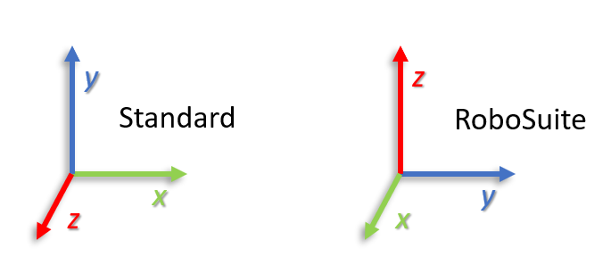

# Robotics Ib
## 1. Co-ordinate Systems
Co-ordinate systems are used to describe an object's position and orientation in space. There are many different co-ordinate systems, but the most common are the Cartesian, Polar and Spherical co-ordinate systems. 

- Cartesian

The Cartesian co-ordinate system is the most common co-ordinate system used in robotics. It is a right handed co-ordinate system with the origin at the centre of the system. The x-axis is horizontal and points to the right, the y-axis is vertical and points up, and the z-axis points out of the page. _i_, _j_, and _k_ are unit vectors in the x,y,z directions respectively.

<div style="text-align: center">

</div>

- Polar

The polar co-ordinate system is a two dimensional co-ordinate system. The origin is the centre of the system and the x-axis is the radius of the circle. The y-axis is the angle of the point from the x-axis.

<div style="text-align: center">

</div>

- Spherical

The spherical co-ordinate system is a three dimensional co-ordinate system. The origin is the centre of the system and the x-axis is the radius of the sphere. The y-axis is the angle of the point from the x-axis and the z-axis is the angle of the point from the xy-plane.

<div style="text-align: center">

</div>

We will use the Cartesian co-ordinate system in this course, but it is important to be aware of the other co-ordinate systems as they can be useful in some situations.

### 1.1 Translation

Translation is the movement of an object from one point to another. In the case of a robot this would be the movement of the robot from one location to another. In the case of a robot arm this would be the movement of the end effector from one location to another. 

Translation in a 3D Cartesian co-ordinate system is described by the x, y and z components of the translation. The x component is the distance moved in the x direction, the y component is the distance moved in the y direction, and the z component is the distance moved in the z direction. 

Consider the following example: 

A robot arms gripper is located at the origin of a Cartesian co-ordinate system. The robot is commanded to move 1m in the x direction, then 2m in the y direction and finally 3m in the z direction. The robot will move to the point (1, 2, 3) in the Cartesian co-ordinate system.

<div style="text-align: center">

</div>

The origin is the point (0, 0, 0) in the Cartesian co-ordinate system. The x-axis is the line x = 0, the y-axis is the line y = 0, and the z-axis is the line z = 0. In the standard cartesian co-ordinate system, the x-axis is horizontal and points to the right, the y-axis is vertical and points up, and the z-axis points out of the screen. The origin is the centre of the Cartesian co-ordinate system and can be positioned anywhere in space. In the case of RoboSuite the origin is located at the grippers initial position. The orientation of the x, y and z axes is also different in RoboSuite to the standard Cartesian co-ordinate system. The x-axis is horizontal and points to out of the screen, the y-axis is horizontal and points to the right, and the z-axis is vertical and points upwards.

<div style="text-align: center">

</div>

You should always be aware of the co-ordinate system you are using and the position of the origin. If you are using a different co-ordinate system to the one you are used to you may need to convert between the two.

### 1.2 Rotation

Rotation is the movement of an object around a point. In the case of a robot arm we can consider the rotation of the robots gripper or end effector around a point. 

Rotation in a 3D Cartesian co-ordinate system is described by the x, y and z components of the rotation. The x component is the angle of rotation around the x axis, the y component is the angle of rotation around the y axis, and the z component is the angle of rotation around the z axis. Consider the following examples:

A robot is located at the origin of a Cartesian co-ordinate system. The robot is commanded to: 
1. rotate 30 degrees around the x axis and return to the origin,
1. rotate 30 degrees around the y axis and return to the origin,
1. rotate 30 degrees around the z axisand return to the origin. 

<div style="text-align: center">
1. 
2. 
3. 
</div>

$$ pose = \begin{bmatrix} 1 \\ 2 \\ 3 \\ 30 \\ 30 \\ 30 \end{bmatrix} $$

### 1.3 Pose

Pose is the position and orientation of an object. In the case of a robot this would be the position and orientation of the robot. In the case of a robot arm this would be the position and orientation of the end effector.

If we combine translation and rotation we can fully describe the movement of an object from one point to another in 6 degrees of freedom. The robot will move to the point (1, 2, 3) in the Cartesian co-ordinate system and rotate to the point (30, 30, 30) in the Cartesian co-ordinate system.

<div style="text-align: center">

</div>

$$ pose = \begin{bmatrix} 1 \\ 2 \\ 3 \\ 30 \\ 30 \\ 30 \end{bmatrix} $$

- Euler Angles - Roll, Pitch, Yaw

Euler angles are a common way to describe the orientation of an object. Roll is the rotation around the x-axis, pitch is the rotation around the y-axis, and yaw is the rotation around the z-axis. The pose of an object in 3D space can be represented by the following vector:

$$ pose = \begin{bmatrix} x \\ y \\ z \\ roll \\ pitch \\ yaw \end{bmatrix} $$

The main draw back of using Euler angles is that they are not unique. For example, the pose (1, 2, 3, 0, 0, 0) and the pose (1, 2, 3, 360, 360, 360) are the same pose. This can cause problems when using Euler angles to describe the pose of an object. Gimbal lock is another problem with Euler angles. Gimbal lock occurs when the pitch angle is 90 degrees or -90 degrees. When the pitch angle is 90 degrees or -90 degrees the roll and yaw angles become undefined. This is just one example of when gimbal lock can occur. There are many other examples of when gimbal lock can occur.

- Quaternions

Quaternions are another way to describe the orientation of an object. Quaternions are a four dimensional vector. Quaternions are a more complex way to describe the orientation of an object, but they do not suffer from the same problems as Euler angles. Quaternions are unique and do not suffer from gimbal lock. The pose of an object in 3D space using quaternions can be represented by the following vector:

$$ pose = \begin{bmatrix} x \\ y \\ z \\ q_x \\ q_y \\ q_z \\ q_w \end{bmatrix} $$

For more details on quaternions and how they work please see the following tutorial: 

- [Tutorial series on Quaternions](https://eater.net/quaternions)

- You only need to watch the first 2 interactive videos but if you find the rest interesting feel free to watch those too.

Quaternions are used in RoboSuite to describe the orientation of objects, robots, and robot components (grippers). Quarternions can be more difficult to work with and visualise than Euler angles. The following function can be used to convert from quaternions to Euler (roll, pitch, yaw) angles:

```python
#convert quaternion to roll, pitch, yaw
def quat_to_rpy(q):
    qw = q[0]
    qx = q[1]
    qy = q[2]
    qz = q[3]

    # roll (x-axis rotation)
    sinr_cosp = 2 * (qw * qx + qy * qz)
    cosr_cosp = 1 - 2 * (qx * qx + qy * qy)
    roll = np.arctan2(sinr_cosp, cosr_cosp)

    # pitch (y-axis rotation)
    sinp = 2 * (qw * qy - qz * qx)
    if np.abs(sinp) >= 1:
        pitch = np.copysign(np.pi / 2, sinp) # use 90 degrees if out of range
    else:
        pitch = np.arcsin(sinp)

    # yaw (z-axis rotation)
    siny_cosp = 2 * (qw * qz + qx * qy)
    cosy_cosp = 1 - 2 * (qy * qy + qz * qz)
    yaw = np.arctan2(siny_cosp, cosy_cosp)

    #convert radians to degrees
    return np.rad2deg(np.array([roll, pitch, yaw]))

```
The above function uses the following equations to convert from quaternions to Euler angles:

$$ roll = \arctan2(2(q_wq_x + q_yq_z), 1 - 2(q_x^2 + q_y^2)) $$
$$ pitch = \arcsin(2(q_wq_y - q_zq_x)) $$
$$ yaw = \arctan2(2(q_wq_z + q_xq_y), 1 - 2(q_y^2 + q_z^2)) $$

By default trigonometric functions in `numpy` use radians. The above function converts the output of the trigonometric functions to degrees using the `numpy` function `rad2deg` . The output of the above function is a `numpy` array with the roll, pitch, and yaw angles in degrees.

If you are not familiar with the term radians please see the following tutorial:

- [Tutorial on Radians](https://www.mathsisfun.com/geometry/radians.html)
- [Video on Radians](https://www.youtube.com/watch?v=CHCWXAkozHM)

<div style="padding: 15px; border: 1px solid transparent; border-color: transparent; margin-bottom: 20px; border-radius: 4px; color: #31708f; background-color: #d9edf7; border-color: #bce8f1;">
Brainteaser 2.2a: In what way are quaternions more useful than Euler angles?
<br>
Brainteaser 2.2b: In what way are Euler angles more useful than quaternions?
<details> 
  <summary>Click for Answers </summary>
   2.2a solution: Quarternions are more useful than Euler angles because they are unique and do not suffer from gimbal lock. <br>
   2.2b solution: Euler angles are more useful than quaternions because they are easier to work with and visualise.
</details>
</div>

<div style="padding: 15px; border: 1px solid transparent; border-color: transparent; margin-bottom: 20px; border-radius: 4px; color: #234f1e; background-color: #74B72E; border-color: #028a0f;">
Homework Exercise: <br>
Convert the following Euler angles to quaternions:<br>

- rpy = (0, 0, 0)<br>
- rpy = (90, 0, 0)<br>
- rpy = (180, 180, 180)<br>
- rpy = (45, 135, 225)<br>

Convert the following quaternions to Euler angles (in degrees):<br>

- q = (1, 0, 0, 0)<br>
- q = (0.707, 0, 0.707, 0)<br>
- q = (0.5, 0.5, 0.5, 0.5)<br>
- q = (0.6, 0.25, 0, 0.76)<br>

<details> 
  <summary>Click for Answers </summary>
    Euler angles to quaternions:<br>
    - rpy = (0, 0, 0) -> q = (1, 0, 0, 0)<br>
    - rpy = (90, 0, 0) -> q = (0.707, 0, 0.707, 0)<br>
    - rpy = (180, 180, 180) -> q = (0.5, 0.5, 0.5, 0.5)<br>
    - rpy = (45, 135, 225) -> q = (0.6, 0.25, 0, 0.76)<br>
    <br>
    Quaternions to Euler angles:<br>
    - q = (1, 0, 0, 0) -> rpy = (0, 0, 0)<br>
    - q = (0.707, 0, 0.707, 0) -> rpy = (0, 90, 0)<br>
    - q = (0.5, 0.5, 0.5, 0.5) -> rpy = (180, 180, 180)<br>
    - q = (0.6, 0.25, 0, 0.76) -> rpy = (18.9, y: 22.3, z: 99.7)<br>
</div>

### 2. Degrees of freedom

Degrees of freedom is a measure of the number of independent variables that can be used to describe the position and orientation of an object. In the case of a robot arm this would be the number of independent variables that can be used to describe the position and orientation of the end effector. With a robot arm the number of degrees of freedom is equal to the number of joints in the arm. We will be working with 7DOF robot arms in RoboSuite. That means that we can use 7 independent variables to describe the position and orientation of the end effector. These are the 7 joint angles of the robot arm as each joint has a single degree of freedom. In order to control the we need to control the angle of each joint. 

The following videos explain the concept of degrees of freedom further:

<div style="text-align: center">
<iframe width="640" height="360" src="https://www.youtube.com/embed/z29hYlagOYM" title="Modern Robotics, Chapter 2.1:  Degrees of Freedom of a Rigid Body" frameborder="0" allow="accelerometer; autoplay; clipboard-write; encrypted-media; gyroscope; picture-in-picture" allowfullscreen></iframe>

<iframe width="640" height="360" src="https://www.youtube.com/embed/zI64DyaRUvQ" title="Modern Robotics, Chapter 2.2:  Degrees of Freedom of a Robot" frameborder="0" allow="accelerometer; autoplay; clipboard-write; encrypted-media; gyroscope; picture-in-picture" allowfullscreen></iframe>
</div>


## 3. Work Envelope

A robots work envelope is the space that the robot can move in. The work envelope of a robot is defined by the maximum and minimum values for each of the degrees of freedom. In the case of a robot arm the work envelope is defined by the maximum and minimum values for each joint as well as physical constraints. It is important to understand the work envelope of a robot before you start programming it. If you do not understand the work envelope of a robot you could damage the robot or the environment.

A few examples of work envelopes are shown below:

<div style="text-align: center">
1. 
2. 
3. 
4. 
</div>

This video explains the concept in more detail:

<div style="text-align: center">
<iframe width="560" height="315" src="https://www.youtube.com/embed/_canCYWZPsc" title="YouTube video player" frameborder="0" allow="accelerometer; autoplay; clipboard-write; encrypted-media; gyroscope; picture-in-picture" allowfullscreen></iframe>
</div>

That's all for Robotics I, here are some other interesting videos to watch if you are bored:

- [Boston Dynamics Spot](https://www.youtube.com/watch?v=11Yv_KhCjjU)

- [How Cleaning Robots Work](https://www.youtube.com/watch?v=hoY2YxLGV98)

- [How Drones Work](https://www.youtube.com/watch?v=N_XneaFmOmU&t=32s)

<div style="padding: 15px; border: 1px solid transparent; border-color: transparent; margin-bottom: 20px; border-radius: 4px; color: #8a6d3b;; background-color: #fcf8e3; border-color: #faebcc;">
Disclaimer: Some of this module was written using AI suggestions by GitHub Copilot.   
</div>